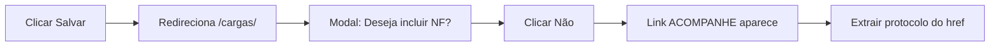

# ANÁLISE E CORREÇÃO - PORTAL ATACADÃO
**Data**: 22/08/2025  
**Problemas Identificados**: 2 problemas críticos no agendamento

---

## 🔴 PROBLEMA 1: TIMEOUT AO LIMPAR FILTROS (30 segundos)

### EVIDÊNCIAS DO PROBLEMA:

**Log do erro:**
```
22:19:50 | ERROR | Erro ao limpar campo de data: Timeout 30000ms exceeded.
```

**Código problemático atual (linha 175-205):**
```python
# PROBLEMA: Tenta limpar TODOS os botões e campos
botoes_limpar = self.page.locator('button[data-action="remove"]').all()
for i, botao in enumerate(botoes_limpar[:3]):  # Limpa até 3 botões
    if botao.is_visible():
        botao.click()
        
# Depois tenta limpar campos diretamente
campos_data = ['#dthr_elaboracao', '#data_inicio', '#data_fim']
for campo in campos_data:
    elemento = self.page.locator(campo)
    if elemento.count() > 0 and elemento.is_visible(timeout=300):
        elemento.fill('')  # TIMEOUT AQUI!
```

### ANÁLISE DO ELEMENTO HTML:
```html
<button data-target_daterangepicker="dthr_elaboracao" 
        data-action="remove" 
        type="button" 
        title="Limpar" 
        class="btn btn-default">
    <i class="fas fa-times"></i>
</button>
```

**Identificadores únicos do botão correto:**
- `data-target_daterangepicker="dthr_elaboracao"` - ESPECÍFICO para o campo desejado
- `data-action="remove"` - Ação de remover/limpar

### ✅ SOLUÇÃO PROPOSTA:
```python
# Limpar APENAS o botão específico do campo dthr_elaboracao
botao_limpar = self.page.locator('button[data-target_daterangepicker="dthr_elaboracao"][data-action="remove"]')
if botao_limpar.count() > 0:
    try:
        botao_limpar.wait_for(state="visible", timeout=2000)
        botao_limpar.click()
        logger.info("✅ Campo dthr_elaboracao limpo com sucesso")
    except:
        logger.debug("Botão de limpar não visível, continuando...")
```

---

## 🔴 PROBLEMA 2: BOTÃO "SALVAR" NÃO CAPTURA PROTOCOLO CORRETAMENTE

### EVIDÊNCIAS DO PROBLEMA:

**Sequência de logs mostrando falha:**
```
22:20:00 | INFO | Clicando em Salvar...
22:20:00 | INFO | ✅ Formulário enviado!
22:20:00 | INFO | Aguardando resposta...
22:20:08 | INFO | ✅ Modal de sucesso detectado!
22:20:38 | ERROR | Erro ao criar agendamento: Timeout 30000ms exceeded.
```

**FLUXO REAL IDENTIFICADO**:
1. Após clicar em "Salvar" → Sistema redireciona para `/cargas/#carga`
2. Modal aparece perguntando: "Deseja incluir a NF?"
3. Ao clicar em "Não" → Link com protocolo fica disponível
4. Protocolo está no href do link "ACOMPANHE AGENDAMENTO"

### ANÁLISE DO ELEMENTO HTML DO BOTÃO SALVAR:
```html
<div id="salvar" 
     class="btn-panel f_editando" 
     style="display: inline-block;">
    <div class="btn-image btns">
        <i class="orange far fa-check-circle fa-2x"></i>
    </div>
    <label>Salvar</label>
</div>
```

**Características importantes:**
1. É um `<div>` e não um `<button>` 
2. Classe `f_editando` indica que só aparece em modo de edição
3. O clique deve ser no div principal com `id="salvar"`

### ANÁLISE DO CÓDIGO ATUAL (linha 505-542):
```python
# PROBLEMA 1: Clica mas não aguarda redirecionamento correto
botao_salvar = self.page.locator('#salvar')
if botao_salvar.count() > 0:
    botao_salvar.click()
    logger.info("✅ Formulário enviado!")

# PROBLEMA 2: Aguarda modal errado (regSucesso) ao invés do modal de NF
time.sleep(5)  
if self.page.locator('#regSucesso').count() > 0:
    logger.info("✅ Modal de sucesso detectado!")  # Modal errado!

# PROBLEMA 3: Não segue o fluxo correto
# Deveria:
# 1. Aguardar redirecionamento para /cargas/
# 2. Detectar modal "Deseja incluir NF?"
# 3. Clicar em "Não"
# 4. Capturar protocolo do link que aparece
```

### ELEMENTO HTML DO LINK COM PROTOCOLO:
```html
<a href="https://atacadao.hodiebooking.com.br/agendamentos/2508210078225">
    <i class="orange fa-2x fas fa-arrow-circle-right">
    <br>
    <p style="font-size: 10px; padding: 5px;">ACOMPANHE AGENDAMENTO</p>
    </i>
</a>
```

**Protocolo está na URL**: `/agendamentos/2508210078225`

### ✅ SOLUÇÃO PROPOSTA:

```python
# 1. Verificar e clicar no botão Salvar
botao_salvar = self.page.locator('div#salvar')
if not botao_salvar.is_visible(timeout=3000):
    logger.error("Botão Salvar não está visível")
    return {'success': False, 'message': 'Botão Salvar não encontrado'}

# 2. Clicar no botão Salvar
logger.info("Clicando no botão Salvar...")
botao_salvar.click()

# 3. Aguardar redirecionamento para /cargas/
try:
    logger.info("Aguardando redirecionamento para /cargas/...")
    self.page.wait_for_url("**/cargas/**", timeout=10000)
    logger.info("✅ Redirecionou para página de cargas")
except:
    logger.warning("Não redirecionou para /cargas/, tentando continuar...")

# 4. Aguardar e responder ao modal "Deseja incluir NF?"
try:
    # Procurar o modal ou botão "Não"
    logger.info("Aguardando modal de NF...")
    
    # Tentar diferentes seletores para o botão "Não"
    seletores_nao = [
        '#btnNao',
        'button:has-text("Não")',
        'button:has-text("NÃO")',
        '.modal button:has-text("Não")'
    ]
    
    botao_nao_clicado = False
    for seletor in seletores_nao:
        try:
            botao_nao = self.page.locator(seletor)
            if botao_nao.is_visible(timeout=5000):
                logger.info(f"Modal de NF encontrado, clicando em 'Não'")
                botao_nao.click()
                botao_nao_clicado = True
                self.page.wait_for_timeout(2000)  # Aguardar modal fechar
                break
        except:
            continue
    
    if not botao_nao_clicado:
        logger.warning("Modal de NF não apareceu ou botão Não não encontrado")
    
except Exception as e:
    logger.warning(f"Erro ao lidar com modal de NF: {e}")

# 5. Capturar protocolo do link "ACOMPANHE AGENDAMENTO"
protocolo = None
try:
    logger.info("Procurando link com protocolo...")
    
    # Aguardar o link aparecer
    self.page.wait_for_timeout(2000)
    
    # Procurar link com texto "ACOMPANHE AGENDAMENTO" ou href de agendamentos
    seletores_link = [
        'a:has-text("ACOMPANHE AGENDAMENTO")',
        'a:has(p:has-text("ACOMPANHE AGENDAMENTO"))',
        'a[href*="/agendamentos/"]'
    ]
    
    for seletor in seletores_link:
        links = self.page.locator(seletor).all()
        for link in links:
            href = link.get_attribute('href')
            if href and '/agendamentos/' in href:
                # Extrair protocolo da URL
                # Formato: https://atacadao.hodiebooking.com.br/agendamentos/2508210078225
                protocolo = href.split('/agendamentos/')[-1].split('/')[0].split('?')[0]
                if protocolo and protocolo.isdigit():
                    logger.info(f"✅✅ PROTOCOLO CAPTURADO: {protocolo}")
                    break
        if protocolo:
            break
    
    # Se não encontrou no link, tentar na URL atual
    if not protocolo:
        current_url = self.page.url
        if '/agendamentos/' in current_url:
            protocolo = current_url.split('/agendamentos/')[-1].split('/')[0].split('?')[0]
            logger.info(f"Protocolo extraído da URL: {protocolo}")
    
except Exception as e:
    logger.error(f"Erro ao capturar protocolo: {e}")

# 6. Retornar resultado
if protocolo:
    # Tirar screenshot de sucesso
    self.page.screenshot(path=f"sucesso_protocolo_{protocolo}.png")
    
    return {
        'success': True,
        'protocolo': protocolo,
        'message': f'Agendamento criado com sucesso! Protocolo: {protocolo}'
    }
else:
    # Falhou - tirar screenshot para debug
    self.page.screenshot(path=f"erro_protocolo_{datetime.now().strftime('%Y%m%d_%H%M%S')}.png")
    
    # Tentar capturar qualquer informação útil da página
    page_url = self.page.url
    page_title = self.page.title()
    
    return {
        'success': False,
        'message': 'Agendamento pode ter sido criado mas protocolo não foi capturado',
        'debug_info': {
            'url': page_url,
            'title': page_title
        }
    }
```

---

## 📋 PASSO A PASSO PARA IMPLEMENTAÇÃO

### PASSO 1: Backup do arquivo atual
```bash
cp app/portal/atacadao/playwright_client.py app/portal/atacadao/playwright_client.py.backup
```

### PASSO 2: Corrigir problema de limpeza de filtros
**Localizar**: Linha 175-205 do arquivo `playwright_client.py`  
**Substituir todo o bloco** por:

```python
# LIMPAR APENAS O CAMPO ESPECÍFICO dthr_elaboracao
logger.info("Limpando filtro de data de elaboração...")
try:
    # Usar seletor com DOIS atributos para garantir elemento correto
    botao_limpar = self.page.locator(
        'button[data-target_daterangepicker="dthr_elaboracao"][data-action="remove"]'
    )
    
    if botao_limpar.count() > 0:
        # Aguardar estar visível com timeout curto
        botao_limpar.wait_for(state="visible", timeout=2000)
        botao_limpar.click()
        self.page.wait_for_timeout(300)  # Pausa mínima
        logger.info("✅ Filtro dthr_elaboracao limpo")
    else:
        logger.debug("Botão de limpar não encontrado, continuando...")
except TimeoutError:
    logger.debug("Botão não ficou visível no tempo esperado")
except Exception as e:
    logger.warning(f"Erro ao limpar: {e} - continuando sem limpar")
```

### PASSO 3: Corrigir problema do botão Salvar (FLUXO COMPLETO)
**Localizar**: Linha 505-650 do arquivo `playwright_client.py`  
**Substituir todo o bloco** por:

```python
# 5. SALVAR FORMULÁRIO E CAPTURAR PROTOCOLO
logger.info("Preparando para salvar formulário...")

# Localizar e clicar no botão Salvar
botao_salvar = self.page.locator('div#salvar')
if not botao_salvar.is_visible(timeout=3000):
    logger.error("Botão Salvar não encontrado")
    return {'success': False, 'message': 'Botão Salvar não encontrado'}

# Capturar URL antes do clique
url_antes = self.page.url
logger.info(f"URL antes de salvar: {url_antes}")

# Clicar no botão Salvar
logger.info("Clicando no botão Salvar...")
botao_salvar.click()

# ETAPA 1: Aguardar redirecionamento para /cargas/
try:
    logger.info("Aguardando redirecionamento para /cargas/...")
    self.page.wait_for_url("**/cargas/**", timeout=10000)
    logger.info("✅ Redirecionou para página de cargas")
except:
    logger.warning("Não redirecionou para /cargas/, verificando URL atual...")
    current_url = self.page.url
    if current_url == url_antes:
        logger.error("URL não mudou - formulário pode não ter sido enviado")
        return {'success': False, 'message': 'Formulário não foi processado'}

# ETAPA 2: Lidar com modal "Deseja incluir NF?"
try:
    logger.info("Procurando modal de inclusão de NF...")
    
    # Lista de possíveis seletores para o botão "Não"
    seletores_nao = [
        '#btnNao',                           # ID específico
        'button:has-text("Não")',          # Botão com texto
        'button.btn:has-text("Não")',      # Botão com classe
        '.modal-footer button:has-text("Não")', # Botão no footer do modal
        '[data-dismiss="modal"]:has-text("Não")' # Botão que fecha modal
    ]
    
    # Tentar clicar no botão "Não"
    botao_clicado = False
    for seletor in seletores_nao:
        try:
            botao_nao = self.page.locator(seletor).first
            if botao_nao.is_visible(timeout=3000):
                logger.info("Modal de NF detectado, clicando em 'Não'")
                botao_nao.click()
                botao_clicado = True
                self.page.wait_for_timeout(1500)  # Aguardar modal fechar
                break
        except:
            continue
    
    if not botao_clicado:
        logger.info("Modal de NF não apareceu ou já foi fechado")
        
except Exception as e:
    logger.warning(f"Erro ao processar modal de NF: {e}")

# ETAPA 3: Capturar protocolo do link "ACOMPANHE AGENDAMENTO"
protocolo = None
tentativas = 0
max_tentativas = 3

while not protocolo and tentativas < max_tentativas:
    tentativas += 1
    logger.info(f"Tentativa {tentativas} de capturar protocolo...")
    
    try:
        # Aguardar um pouco para a página atualizar
        self.page.wait_for_timeout(2000)
        
        # Estratégia 1: Procurar link específico "ACOMPANHE AGENDAMENTO"
        link_acompanhe = self.page.locator('a:has(p:has-text("ACOMPANHE AGENDAMENTO"))')
        if link_acompanhe.count() > 0:
            href = link_acompanhe.first.get_attribute('href')
            if href and '/agendamentos/' in href:
                protocolo = href.split('/agendamentos/')[-1].split('/')[0].split('?')[0]
                logger.info(f"✅ Protocolo encontrado no link ACOMPANHE: {protocolo}")
                break
        
        # Estratégia 2: Procurar qualquer link com /agendamentos/
        links_agendamento = self.page.locator('a[href*="/agendamentos/"]').all()
        for link in links_agendamento:
            href = link.get_attribute('href')
            if href and '/agendamentos/' in href:
                temp_protocolo = href.split('/agendamentos/')[-1].split('/')[0].split('?')[0]
                # Verificar se é um protocolo válido (apenas números)
                if temp_protocolo and temp_protocolo.isdigit():
                    protocolo = temp_protocolo
                    logger.info(f"✅ Protocolo encontrado em link: {protocolo}")
                    break
        
        # Estratégia 3: Verificar se URL mudou para agendamentos
        current_url = self.page.url
        if '/agendamentos/' in current_url:
            protocolo = current_url.split('/agendamentos/')[-1].split('/')[0].split('?')[0]
            if protocolo and protocolo.isdigit():
                logger.info(f"✅ Protocolo extraído da URL: {protocolo}")
                break
                
    except Exception as e:
        logger.error(f"Erro na tentativa {tentativas}: {e}")

# ETAPA 4: Retornar resultado
if protocolo:
    # Screenshot de sucesso
    self.page.screenshot(path=f"sucesso_agendamento_{protocolo}.png")
    logger.info(f"✅✅✅ AGENDAMENTO CRIADO COM SUCESSO!")
    
    return {
        'success': True,
        'protocolo': protocolo,
        'message': f'Agendamento realizado! Protocolo: {protocolo}',
        'url': self.page.url
    }
else:
    # Screenshot para debug
    screenshot_path = f"erro_sem_protocolo_{datetime.now().strftime('%Y%m%d_%H%M%S')}.png"
    self.page.screenshot(path=screenshot_path)
    
    # Capturar informações para debug
    page_url = self.page.url
    page_title = self.page.title()
    
    logger.error(f"❌ Protocolo não capturado. URL: {page_url}")
    
    return {
        'success': False,
        'message': 'Agendamento pode ter sido criado mas protocolo não foi capturado',
        'debug_info': {
            'url': page_url,
            'title': page_title,
            'screenshot': screenshot_path
        }
    }
```

### PASSO 4: Criar script de teste
**Criar arquivo**: `testar_correcoes_portal.py`

```python
#!/usr/bin/env python3
"""
Script para testar as correções do portal Atacadão
"""
import sys
import os
sys.path.insert(0, os.path.dirname(os.path.dirname(os.path.abspath(__file__))))

from app.portal.atacadao.playwright_client import PlaywrightClient
from datetime import datetime, timedelta
import logging

logging.basicConfig(level=logging.INFO)
logger = logging.getLogger(__name__)

def testar_correcoes():
    """Testa as duas correções implementadas"""
    
    client = PlaywrightClient()
    
    try:
        # TESTE 1: Verificar limpeza de filtros
        logger.info("=== TESTE 1: Limpeza de filtros ===")
        inicio = datetime.now()
        
        if client.verificar_login():
            # Navegar para página de pedidos
            client.page.goto(client.config['urls']['pedidos'])
            client.page.wait_for_load_state('networkidle')
            
            # Abrir filtros
            filtro_toggle = client.page.locator('[data-target="#filtros"]')
            if filtro_toggle.is_visible():
                filtro_toggle.click()
                client.page.wait_for_timeout(1000)
            
            # Testar limpeza do campo específico
            botao_limpar = client.page.locator(
                'button[data-target_daterangepicker="dthr_elaboracao"][data-action="remove"]'
            )
            
            if botao_limpar.is_visible(timeout=2000):
                botao_limpar.click()
                tempo_limpeza = (datetime.now() - inicio).total_seconds()
                
                if tempo_limpeza < 3:
                    logger.info(f"✅ TESTE 1 PASSOU: Limpeza em {tempo_limpeza:.1f}s (< 3s)")
                else:
                    logger.error(f"❌ TESTE 1 FALHOU: Limpeza demorou {tempo_limpeza:.1f}s")
            else:
                logger.warning("⚠️ Botão de limpar não encontrado para teste")
        
        # TESTE 2: Verificar botão Salvar
        logger.info("\n=== TESTE 2: Botão Salvar ===")
        
        # Aqui você precisa preparar um pedido para teste
        # Este é um exemplo simplificado
        pedido_teste = "932955"  # Substituir por um pedido válido
        
        if client.buscar_pedido(pedido_teste):
            # Abrir formulário de agendamento
            botao_agendar = client.page.locator(client.config['seletores']['botao_solicitar_agendamento'])
            if botao_agendar.is_visible():
                botao_agendar.click()
                client.page.wait_for_load_state('networkidle')
                
                # Verificar se botão Salvar está correto
                botao_salvar = client.page.locator('div#salvar')
                
                if botao_salvar.count() > 0:
                    # Verificar atributos
                    classes = botao_salvar.get_attribute('class')
                    id_attr = botao_salvar.get_attribute('id')
                    
                    logger.info(f"Botão encontrado - ID: {id_attr}, Classes: {classes}")
                    
                    if id_attr == "salvar":
                        logger.info("✅ TESTE 2 PASSOU: Botão Salvar identificado corretamente")
                    else:
                        logger.error("❌ TESTE 2 FALHOU: Botão com ID incorreto")
                else:
                    logger.error("❌ TESTE 2 FALHOU: Botão Salvar não encontrado")
        
        logger.info("\n=== TESTES CONCLUÍDOS ===")
        
    except Exception as e:
        logger.error(f"Erro durante testes: {e}")
    finally:
        client.fechar()

if __name__ == "__main__":
    testar_correcoes()
```

---

## 🎯 VALIDAÇÃO DAS CORREÇÕES

### ANTES DAS CORREÇÕES:
- **Problema 1**: Timeout de 30s ao limpar TODOS os filtros desnecessariamente
- **Problema 2**: Sistema detecta modal errado e não captura protocolo

### DEPOIS DAS CORREÇÕES:
- **Solução 1**: Limpa APENAS o botão específico `dthr_elaboracao` em < 2s
- **Solução 2**: Segue fluxo correto: /cargas/ → Modal NF → Link com protocolo

### COMO VALIDAR:
1. Executar o script de teste: `python testar_correcoes_portal.py`
2. Verificar logs: 
   - Não deve aparecer "Timeout 30000ms exceeded"
   - Deve aparecer protocolo real após salvar
3. Verificar no portal se agendamento foi criado

---

## 📊 RESUMO TÉCNICO

| Problema | Causa Raiz | Solução | Resultado Esperado |
|----------|------------|---------|-------------------|
| Timeout 30s nos filtros | Tentava limpar TODOS os campos de data | Clicar APENAS no botão `data-target_daterangepicker="dthr_elaboracao"` | < 2s para limpar |
| Protocolo não capturado | Aguardava modal errado (#regSucesso) | Seguir fluxo: /cargas/ → Modal NF → Capturar href do link | Protocolo extraído |

## 🔄 FLUXO CORRETO DO AGENDAMENTO



---

**IMPORTANTE**: Sempre fazer backup antes de aplicar correções em produção!