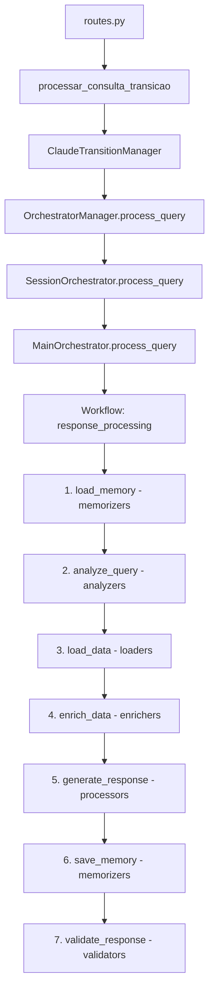

# 🔍 ANÁLISE COMPLETA DO FLUXO - IDENTIFICAÇÃO DE ERROS

**Data**: 14/07/2025  
**Hora**: 10:30

## 📊 FLUXO COMPLETO DO SISTEMA



## ❌ ERROS IDENTIFICADOS POR ETAPA

### 1. **Routes → ClaudeTransitionManager** ⚠️
```python
# PROBLEMA: Não há verificação se o sistema está inicializado
# ERRO: Working outside of application context
```
- **Erro**: Flask context não disponível em workers Gunicorn
- **Impacto**: Falha ao acessar banco de dados
- **Status**: Parcialmente corrigido com fallbacks

### 2. **ClaudeTransitionManager → OrchestratorManager** ❌
```python
# PROBLEMA: Usa async em contexto sync do Flask
async def process_query()  # Mas Flask espera sync!
```
- **Erro**: Loop de eventos não configurado corretamente
- **Impacto**: Incompatibilidade async/sync
- **Status**: Precisa wrapper sync

### 3. **OrchestratorManager → SessionOrchestrator** ⚠️
```python
# PROBLEMA: Delega SEMPRE para SessionOrchestrator
if session_data:  # Sempre True!
    return self.session_orchestrator.process_query()
```
- **Erro**: MainOrchestrator nunca é usado diretamente
- **Impacto**: Perde funcionalidades avançadas
- **Status**: Lógica de roteamento incorreta

### 4. **SessionOrchestrator → MainOrchestrator** ✅
```python
# CORRIGIDO: Agora delega corretamente
def _process_general_inquiry():
    orchestrator = get_main_orchestrator()
    return orchestrator.process_query(query, context)
```
- **Status**: Corrigido e funcionando

### 5. **MainOrchestrator Workflow** ⚠️

#### 5.1 **load_memory (Memorizers)** ❌
```python
# ERRO: session_id não está sendo passado
parameters={"session_id": "{session_id}"}  # Mas session_id é None!
```
- **Erro**: Parâmetro session_id não fornecido
- **Impacto**: Memória não funciona

#### 5.2 **analyze_query (Analyzers)** ✅
```python
# Funciona mas não usa todos os analyzers
# Só usa analyze_intention, ignora semantic, nlp, etc.
```
- **Erro**: Subutilização dos analyzers
- **Impacto**: Análise incompleta

#### 5.3 **load_data (Loaders)** ❌
```python
# ERRO CRÍTICO: Usa domínio errado
parameters={"domain": "{analyze_query_result.dominio}"}
# Mas analyze_query retorna 'domain', não 'dominio'!
```
- **Erro**: Nome do campo incorreto
- **Impacto**: Dados não são carregados!

#### 5.4 **enrich_data (Enrichers)** ⚠️
```python
# Depende de load_data que está falhando
parameters={"data": "{load_data_result}"}  # Será None/vazio
```
- **Erro**: Recebe dados vazios
- **Impacto**: Não enriquece nada

#### 5.5 **generate_response (ResponseProcessor)** ❌
```python
# USA MÉTODO DEPRECATED!
method="gerar_resposta_otimizada"  # Chama _obter_dados_reais [DEPRECATED]
```
- **Erro**: Método deprecated ainda sendo usado
- **Impacto**: Busca dados sem inteligência

#### 5.6 **save_memory (Memorizers)** ❌
```python
# session_id ainda None
# response pode estar mal formatada
```
- **Erro**: Não salva memória corretamente
- **Impacto**: Sistema não aprende

#### 5.7 **validate_response (Validators)** ⚠️
```python
# Valida resposta vazia/genérica como OK
```
- **Erro**: Validação muito permissiva
- **Impacto**: Aceita respostas ruins

## 🔥 PROBLEMAS CRÍTICOS

### 1. **Incompatibilidade Async/Sync**
- Sistema mistura async/await com Flask sync
- Solução: Criar wrappers síncronos

### 2. **Parâmetros Incorretos no Workflow**
- `{analyze_query_result.dominio}` → deve ser `{analyze_query_result.domain}`
- `{session_id}` → não está sendo passado
- Solução: Corrigir mapeamento de campos

### 3. **Método Deprecated no ResponseProcessor**
- `gerar_resposta_otimizada` ainda usa `_obter_dados_reais`
- Solução: Criar novo método que usa orquestração

### 4. **Flask Context em Workers**
- 30+ módulos acessam DB sem contexto
- Solução: Implementar padrão get_db() com fallback

### 5. **Detecção de Domínio Hardcoded**
```python
# SessionOrchestrator tem:
'cliente_especifico': 'Atacadão' if 'atacadão' in query.lower() else None
```
- Solução: Usar detecção inteligente de grupos empresariais

## 📈 IMPACTO DOS ERROS

| Componente | Status | Impacto |
|------------|--------|---------|
| Memorizers | ❌ | Não salva/carrega contexto |
| Analyzers | ⚠️ | Análise incompleta |
| Loaders | ❌ | **CRÍTICO: Não carrega dados!** |
| Enrichers | ❌ | Não enriquece (sem dados) |
| Processors | ❌ | Usa método deprecated |
| Validators | ⚠️ | Valida respostas ruins |
| Coordinators | ✅ | Funcionando após correções |
| Orchestrators | ⚠️ | Fluxo incorreto |

## 🚀 AÇÕES CORRETIVAS NECESSÁRIAS

### 1. **Corrigir Workflow** (URGENTE)
```python
# Em main_orchestrator.py
# Mudar: "{analyze_query_result.dominio}"
# Para: "{analyze_query_result.domain}"
```

### 2. **Passar session_id**
```python
# Em process_query()
data = {
    'session_id': context.get('session_id', self._generate_session_id())
}
```

### 3. **Criar método não-deprecated**
```python
# Em ResponseProcessor
def generate_intelligent_response():
    # Novo método sem _obter_dados_reais
```

### 4. **Wrapper Sync para Async**
```python
def process_query_sync():
    loop = asyncio.new_event_loop()
    return loop.run_until_complete(process_query_async())
```

### 5. **Melhorar Análise**
```python
# Usar todos os analyzers disponíveis
# semantic, nlp, intention, structural, etc.
```

## 📌 CONCLUSÃO

O sistema tem uma arquitetura sofisticada mas está **quebrado em pontos críticos**:

1. **Loaders não carregam dados** (campo dominio vs domain)
2. **Memorizers não funcionam** (session_id não passado)
3. **ResponseProcessor usa método deprecated**
4. **Mistura async/sync causa problemas**
5. **Flask context não disponível em workers**

Com estas correções, o sistema deve funcionar conforme projetado! 