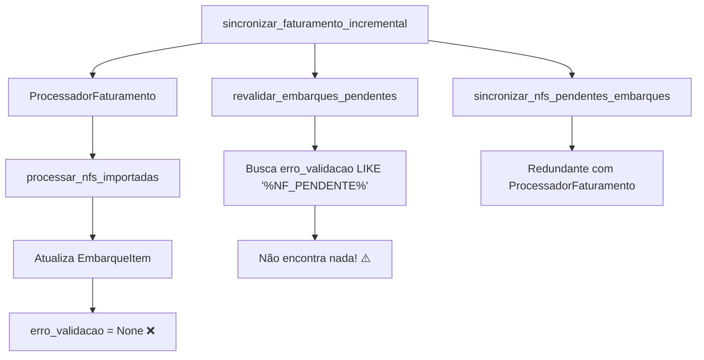
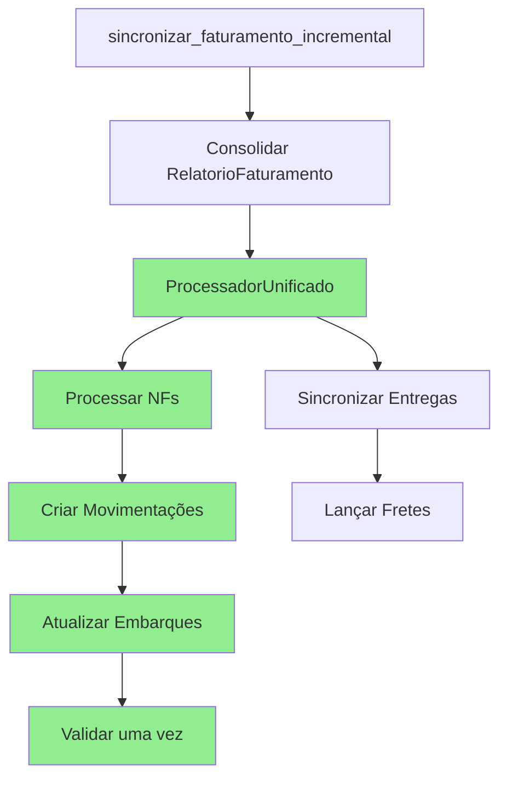

# 📊 ANÁLISE DO FLUXO DE PROCESSAMENTO DE FATURAMENTO

## 🔴 PROBLEMA CRÍTICO IDENTIFICADO

### Conflito de Reset de `erro_validacao`

**Local**: `processar_faturamento.py`, linhas 395-400
```python
if embarque_item:
    if not embarque_item.nota_fiscal:
        embarque_item.nota_fiscal = nf.numero_nf
        embarque_item.erro_validacao = None  # ❌ RESET INCONDICIONAL
```

**Impacto**: A função `revalidar_embarques_pendentes` (routes.py:24-58) **NUNCA funcionará** porque:
1. ProcessadorFaturamento limpa `erro_validacao` ao processar NFs
2. `revalidar_embarques_pendentes` busca itens com erro "NF_PENDENTE_FATURAMENTO"
3. Como erro foi limpo, nenhum item será encontrado

## 📋 FLUXO ATUAL (PROBLEMÁTICO)



## 🎯 SOLUÇÕES PROPOSTAS

### SOLUÇÃO 1: Preservar erro_validacao condicionalmente

```python
# processar_faturamento.py - MODIFICAR linhas 395-400
if embarque_item:
    if not embarque_item.nota_fiscal:
        embarque_item.nota_fiscal = nf.numero_nf
        # Só limpar erro se não for pendente de validação
        if embarque_item.erro_validacao and 'NF_PENDENTE_FATURAMENTO' not in embarque_item.erro_validacao:
            embarque_item.erro_validacao = None
```

### SOLUÇÃO 2: Reordenar o fluxo

```python
# faturamento_service.py - MODIFICAR ordem de execução
def sincronizar_faturamento_incremental(self):
    # ... código anterior ...
    
    # 1️⃣ PRIMEIRO: Re-validar embarques ANTES de processar NFs
    if nfs_novas:
        resultado_revalidacao = revalidar_embarques_pendentes(nfs_novas)
    
    # 2️⃣ DEPOIS: Processar NFs (que vai limpar erro_validacao)
    resultado_processamento = processador.processar_nfs_importadas(...)
```

### SOLUÇÃO 3: Refatorar completamente (RECOMENDADA)

Criar um fluxo único e bem definido:

```python
class ProcessadorFaturamentoUnificado:
    def processar_sincronizacao_completa(self, nfs_novas: List[str]):
        """
        Fluxo unificado sem redundâncias
        """
        resultado = {
            'nfs_processadas': 0,
            'embarques_validados': 0,
            'movimentacoes_criadas': 0,
            'erros': []
        }
        
        # 1. Processar NFs e criar movimentações
        for nf in nfs_novas:
            self._processar_nf(nf)
            resultado['nfs_processadas'] += 1
        
        # 2. Validar embarques relacionados (apenas uma vez)
        embarques_afetados = self._obter_embarques_por_nfs(nfs_novas)
        for embarque_id in embarques_afetados:
            self._validar_embarque(embarque_id)
            resultado['embarques_validados'] += 1
        
        # 3. Sincronizar entregas (apenas uma vez)
        self._sincronizar_entregas(nfs_novas)
        
        return resultado
```

## 📊 REDUNDÂNCIAS IDENTIFICADAS (linhas 724-816)

### 1. **Processamento de Movimentações (2x)**
- Linha 653-673: ProcessadorFaturamento.processar_nfs_importadas()
- Linha 741-752: revalidar_embarques_pendentes() - tenta reprocessar

### 2. **Sincronização de NFs em Embarques (2x)**
- ProcessadorFaturamento já atualiza EmbarqueItems
- Linha 754-763: sincronizar_nfs_pendentes_embarques() - redundante

### 3. **Validação de Embarques (potencialmente 3x)**
- Durante processamento de NFs
- Em revalidar_embarques_pendentes
- Em sincronizar_nfs_pendentes_embarques

## ✅ FLUXO OTIMIZADO PROPOSTO



## 🔧 AÇÕES RECOMENDADAS

### IMEDIATO (Correção do Bug):
1. **Modificar** `processar_faturamento.py:398` para preservar erro_validacao condicionalmente
2. **OU Reordenar** chamadas em `faturamento_service.py:741-752`

### MÉDIO PRAZO (Otimização):
1. **Unificar** processamento em classe única
2. **Remover** redundâncias de sincronização
3. **Criar** testes unitários para validar fluxo

### LONGO PRAZO (Refatoração):
1. **Implementar** padrão Command/Chain of Responsibility
2. **Criar** pipeline de processamento configurável
3. **Adicionar** observabilidade e métricas

## 📈 IMPACTO DA CORREÇÃO

### Antes:
- ❌ Embarques nunca re-validados
- ❌ Processamento redundante
- ❌ Possíveis inconsistências

### Depois:
- ✅ Fluxo correto e eficiente
- ✅ Sem redundâncias
- ✅ Validação confiável

## 🚨 RISCOS

### Se não corrigir:
1. Embarques com NFs pendentes permanecerão com erro
2. Validações nunca serão executadas
3. Possível acúmulo de inconsistências

### Durante correção:
1. Testar em ambiente de desenvolvimento
2. Validar com dados reais
3. Monitorar logs após deploy