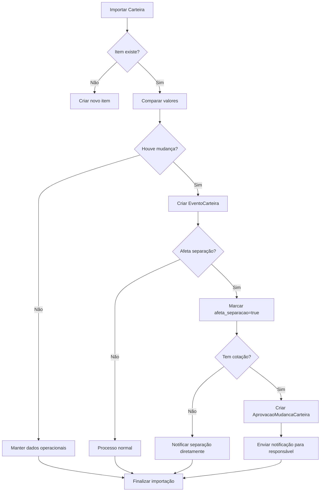
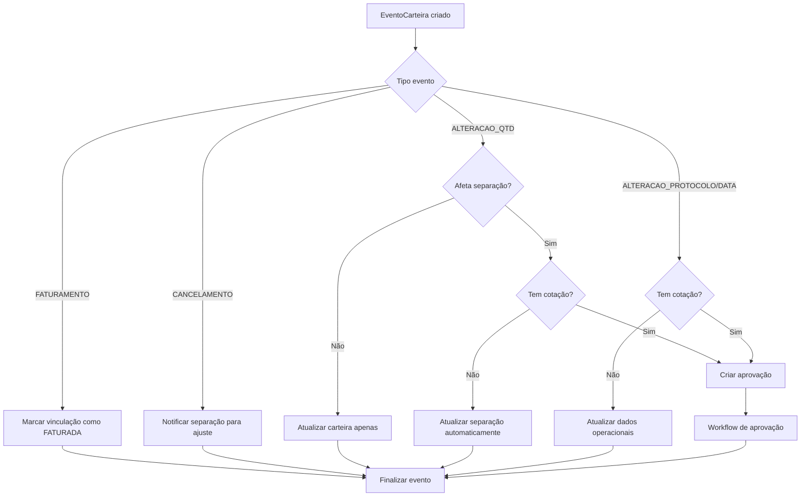
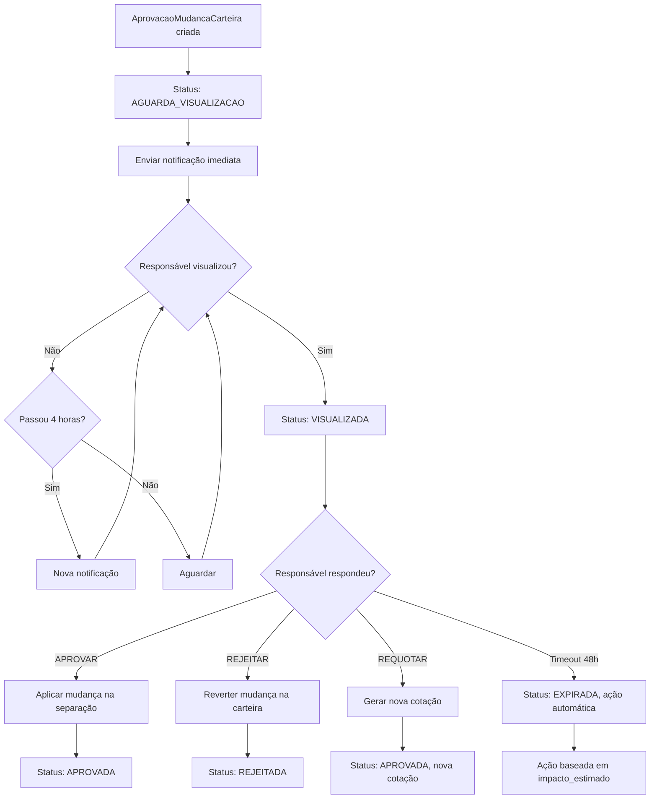

# 🔍 ANÁLISE COMPLETA DE GAPS - SISTEMA CARTEIRA ↔ SEPARAÇÃO

**Status:** Análise realizada em 30/06/2025  
**Escopo:** Sistema de vinculação entre Carteira de Pedidos e Separações  
**Criticidade:** ALTA - Integridade de dados crítica para operação

---

## 🎯 **RESUMO EXECUTIVO DA ANÁLISE**

Após análise detalhada do sistema proposto pelo usuário, foram identificados **5 gaps críticos** que podem comprometer a integridade e operação do sistema:

### **GAPS IDENTIFICADOS:**
1. **Vinculação Multi-Dimensional Complexa**
2. **Distinção entre Faturamento vs Cancelamento**  
3. **Controle de Mudanças em Pedidos Cotados**
4. **Sincronização Bidirecional Controlada**
5. **Auditoria e Rastreabilidade Completa**

### **SOLUÇÕES IMPLEMENTADAS:**
- 3 novos modelos de dados especializados
- Sistema de eventos e workflows
- Controle temporal com notificações
- Auditoria completa de mudanças

---

## 🚨 **ANÁLISE DETALHADA DOS GAPS**

### **GAP 1: VINCULAÇÃO MULTI-DIMENSIONAL ❌**

**PROBLEMA ATUAL:**
- Vinculação simples: `num_pedido + cod_produto`
- 1 pedido pode ter múltiplas cargas
- 1 produto dividido em várias separações
- Protocolo + agendamento + expedição diferentes

**EXEMPLO PRÁTICO:**
```
Pedido 12345 - Produto ABC:
├── Carga 1: Protocolo P001, Agendamento 15/07, Expedição 10/07 (5 unidades)
├── Carga 2: Protocolo P002, Agendamento 20/07, Expedição 18/07 (3 unidades)  
└── Carga 3: Protocolo P003, Agendamento 25/07, Expedição 22/07 (2 unidades)

VINCULAÇÃO ATUAL: Não consegue distinguir as cargas
VINCULAÇÃO PROPOSTA: Chave multi-dimensional única
```

**SOLUÇÃO: Modelo VinculacaoCarteiraSepracao**
- Chave única: `pedido + produto + protocolo + agendamento + expedição`
- Controle de quantidades parciais
- Status de sincronização

### **GAP 2: ORIGEM DAS MUDANÇAS ❌**

**PROBLEMA ATUAL:**
- Item some da carteira
- Sistema não sabe por quê:
  - Foi faturado? ✅ Normal
  - Foi cancelado? ❌ Precisa ajustar separação
  - Mudou quantidade? ❌ Precisa sincronizar

**EXEMPLO PRÁTICO:**
```
Antes: Pedido 12345 - Produto ABC = 10 unidades
Depois: Pedido 12345 - Produto ABC = 7 unidades

PERGUNTA: Por que reduziu 3 unidades?
- Faturou 3? → Separação continua igual
- Cancelou 3? → Separação precisa reduzir 3
- SISTEMA ATUAL: Não sabe distinguir
```

**SOLUÇÃO: Modelo EventoCarteira**
- Tipos: FATURAMENTO, CANCELAMENTO, ALTERACAO_QTD
- Detalhes específicos: numero_nf, motivo_cancelamento
- Impacto na separação controlado

### **GAP 3: PEDIDOS COTADOS SEM CONTROLE ❌**

**PROBLEMA ATUAL:**
- Pedido foi cotado por Transportes
- Carteira altera quantidade/protocolo/data
- Responsável pelo frete não sabe
- Pode gerar prejuízos ou fretes incorretos

**EXEMPLO PRÁTICO:**
```
1. João (Transportes) cotou frete: 50 unidades = R$ 2.000
2. Carteira alterou para: 30 unidades (cliente cancelou 20)
3. João não sabe da mudança
4. Contrata frete para 50 unidades
5. PREJUÍZO: R$ 800 de frete desnecessário
```

**SOLUÇÃO: Modelo AprovacaoMudancaCarteira**
- Workflow: AGUARDA_VISUALIZACAO → APROVADA/REJEITADA
- Notificações automáticas para responsável
- Prazo controlado: 24h visualizar, 48h aprovar
- Área específica para não passar batido

### **GAP 4: SINCRONIZAÇÃO ONE-WAY SEM FEEDBACK ❌**

**PROBLEMA ATUAL:**
- Carteira → Separação (one-way definido)
- Mas não tem controle se sincronizou
- Não tem feedback de sucesso/erro

**EXEMPLO PRÁTICO:**
```
1. Carteira altera quantidade: 10 → 8
2. Sistema tenta alterar separação
3. ERRO: Separação já foi impressa (lock)
4. Carteira fica inconsistente com separação
5. SISTEMA ATUAL: Não detecta a divergência
```

**SOLUÇÃO: Status de Sincronização**
- ATIVA, DIVERGENTE, CANCELADA, FATURADA
- Campo `ultima_sincronizacao`
- Detecção automática de divergências

### **GAP 5: AUDITORIA INCOMPLETA ❌**

**PROBLEMA ATUAL:**
- Histórico limitado de mudanças
- Não rastrea sequência de eventos
- Difícil reconciliação entre sistemas

**SOLUÇÃO: LogAtualizacaoCarteira + EventoCarteira**
- Histórico completo preserved
- Valores anteriores vs novos
- Quem fez, quando, por quê

---

## ✅ **SOLUÇÕES PROPOSTAS - DETALHAMENTO TÉCNICO**

### **🔗 MODELO 1: VinculacaoCarteiraSepracao**

```python
# CHAVE ÚNICA MULTI-DIMENSIONAL
num_pedido + cod_produto + protocolo_agendamento + data_agendamento + data_expedicao

# CAMPOS CRÍTICOS:
- qtd_carteira_original: Qtd quando criou vinculação
- qtd_separacao_original: Qtd na separação
- qtd_vinculada: Qtd efetivamente vinculada
- status_vinculacao: ATIVA, DIVERGENTE, CANCELADA, FATURADA
- divergencia_detectada: Boolean para alertas
- tipo_divergencia: QTD_ALTERADA, ITEM_CANCELADO, etc.
```

### **🎯 MODELO 2: EventoCarteira**

```python
# TIPOS DE EVENTO:
- FATURAMENTO (numero_nf preenchido)
- CANCELAMENTO (motivo_cancelamento preenchido)  
- ALTERACAO_QTD (qtd_anterior, qtd_nova)
- ALTERACAO_PROTOCOLO (valor_anterior, valor_novo)

# CONTROLE DE IMPACTO:
- afeta_separacao: Boolean
- cotacao_afetada: Boolean  
- responsavel_cotacao: String
- separacao_notificada: Boolean
```

### **✅ MODELO 3: AprovacaoMudancaCarteira**

```python
# WORKFLOW DE APROVAÇÃO:
status_aprovacao:
  - AGUARDA_VISUALIZACAO (criado automaticamente)
  - VISUALIZADA (quando responsável abre)
  - APROVADA (aceita mudança)
  - REJEITADA (reverte mudança)
  - EXPIRADA (ação automática após prazo)

# CONTROLE TEMPORAL:
- prazo_resposta: 24h para visualizar, 48h para aprovar
- notificacoes_enviadas: Contador
- ultima_notificacao: Para intervalo de 4h

# AÇÕES POSSÍVEIS:
- ACEITAR_MUDANCA: Aplica na separação
- REJEITAR_MUDANCA: Reverte na carteira  
- REQUOTAR_FRETE: Gera nova cotação
- CANCELAR_COTACAO: Cancela cotação atual
```

---

## 🔄 **FLUXO OPERACIONAL COMPLETO**

### **📥 1. IMPORTAÇÃO DE CARTEIRA (One-Way)**



### **🔗 2. VINCULAÇÃO INTELIGENTE (Multi-Dimensional)**

```mermaid
graph TD
    A[Buscar separações órfãs] --> B[Para cada separação]
    B --> C[Buscar carteira por pedido+produto]
    C --> D{Encontrou?}
    D -->|Não| E[Próxima separação]
    D -->|Sim| F[Verificar protocolo+agendamento+expedição]
    F --> G{Compatível?}
    G -->|Não| E
    G -->|Sim| H[Comparar quantidades]
    H --> I{Qtd carteira >= Qtd separação?}
    I -->|Não| J[Registrar quantidade insuficiente]
    I -->|Sim| K[Criar VinculacaoCarteiraSepracao]
    K --> L[Qtd vinculada = min(carteira, separação)]
    L --> M[Status = ATIVA]
    M --> N[Atualizar carteira com lote_separacao_id]
    J --> E
    N --> E
```

### **⚡ 3. PROCESSAMENTO DE MUDANÇAS**



### **📋 4. WORKFLOW DE APROVAÇÃO**



---

## 🛡️ **SISTEMA DE PROTEÇÕES E VALIDAÇÕES**

### **🔒 1. INTEGRIDADE DE DADOS**

```sql
-- Constraint: Vinculação única por combinação
UNIQUE(num_pedido, cod_produto, protocolo_agendamento, data_agendamento, data_expedicao)

-- Constraint: Quantidade vinculada <= Quantidade carteira
CHECK(qtd_vinculada <= qtd_carteira_original)

-- Constraint: Evento deve ter tipo válido
CHECK(tipo_evento IN ('FATURAMENTO', 'CANCELAMENTO', 'ALTERACAO_QTD', 'ALTERACAO_PROTOCOLO'))
```

### **⏰ 2. CONTROLE TEMPORAL**

```python
# Prazo automático para aprovações
prazo_resposta = criada_em + timedelta(hours=48)

# Notificações a cada 4 horas
def precisa_notificacao():
    if ultima_notificacao is None:
        return True
    tempo_desde_ultima = agora_brasil() - ultima_notificacao
    return tempo_desde_ultima.total_seconds() > 14400  # 4 horas
```

### **🎯 3. VALIDAÇÕES DE NEGÓCIO**

```python
# Só pode alterar se não estiver cotado OU se tiver aprovação
def pode_alterar_item(item_carteira, mudanca):
    if not item_carteira.tem_cotacao():
        return True
    
    aprovacao = get_aprovacao_pendente(item_carteira, mudanca)
    return aprovacao and aprovacao.status_aprovacao == 'APROVADA'

# Quantidade vinculada não pode exceder disponível
def validar_vinculacao(carteira_qtd, separacao_qtd):
    return min(carteira_qtd, separacao_qtd)
```

---

## 📊 **MÉTRICAS E MONITORAMENTO**

### **🎯 KPIs DE INTEGRIDADE**
```sql
-- % de vinculações com divergência
SELECT 
    COUNT(CASE WHEN divergencia_detectada THEN 1 END) * 100.0 / COUNT(*) as pct_divergencias
FROM vinculacao_carteira_separacao;

-- Tempo médio de resolução
SELECT 
    AVG(EXTRACT(EPOCH FROM processado_em - criado_em)/3600) as horas_resolucao_media
FROM evento_carteira 
WHERE status_processamento = 'PROCESSADO';
```

### **⚡ KPIs DE PERFORMANCE**
```sql
-- % de aprovações dentro do prazo  
SELECT 
    COUNT(CASE WHEN respondida_em <= prazo_resposta THEN 1 END) * 100.0 / COUNT(*) as pct_no_prazo
FROM aprovacao_mudanca_carteira;

-- % de eventos processados automaticamente
SELECT 
    COUNT(CASE WHEN acao_automatica_aplicada THEN 1 END) * 100.0 / COUNT(*) as pct_automatico
FROM aprovacao_mudanca_carteira;
```

---

## 🚀 **PLANO DE IMPLEMENTAÇÃO DETALHADO**

### **🔄 FASE 1: ESTRUTURA DE DADOS (1 semana)**

**Atividades:**
- Migração dos 3 novos modelos
- Criação de índices de performance  
- Testes de constraints e validações
- Scripts de migração de dados existentes

**Entregáveis:**
- Migração Flask: `implementar_sistema_vinculacao_avancado.py`
- Índices otimizados para consultas
- Testes unitários dos modelos

### **⚙️ FASE 2: LÓGICA DE NEGÓCIO (2 semanas)**

**Atividades:**
- Funções de vinculação multi-dimensional
- Sistema de detecção e classificação de mudanças
- Workflow de aprovação com notificações
- APIs para sincronização

**Entregáveis:**
- `vinculacao_inteligente.py` - Lógica de vinculação
- `evento_processor.py` - Processamento de eventos
- `aprovacao_workflow.py` - Sistema de aprovações
- Testes de integração

### **🎨 FASE 3: INTERFACE DE USUÁRIO (1 semana)**

**Atividades:**
- Dashboard de aprovações pendentes
- Área específica para responsáveis por cotação
- Relatórios de auditoria e reconciliação
- Notificações visuais

**Entregáveis:**
- `templates/carteira/dashboard_aprovacoes.html`
- `templates/carteira/area_responsavel_cotacao.html`
- `templates/carteira/relatorio_auditoria.html`
- JavaScript para notificações em tempo real

### **🧪 FASE 4: TESTES E VALIDAÇÃO (1 semana)**

**Atividades:**
- Testes com dados reais de produção
- Simulação de cenários críticos
- Ajustes baseados no feedback dos usuários
- Documentação completa

**Entregáveis:**
- Suíte de testes completa
- Manual do usuário
- Documentação técnica
- Plano de contingência

---

## ❗ **ANÁLISE DE RISCOS E MITIGAÇÕES**

### **🚨 RISCO 1: COMPLEXIDADE OPERACIONAL**
**Probabilidade:** MÉDIA  
**Impacto:** ALTO  
**Descrição:** Sistema muito complexo para usuários finais  

**Mitigações:**
- Interface simplificada com automações máximas
- Treinamento específico para cada perfil
- Documentação visual com exemplos práticos
- Suporte técnico dedicado nos primeiros meses

### **⚡ RISCO 2: IMPACTO NA PERFORMANCE**
**Probabilidade:** BAIXA  
**Impacto:** MÉDIO  
**Descrição:** Muitas tabelas e relacionamentos podem impactar performance

**Mitigações:**
- Índices compostos otimizados
- Cache em Redis para consultas frequentes
- Queries otimizadas com EXPLAIN ANALYZE
- Monitoramento contínuo de performance

### **🔄 RISCO 3: MIGRAÇÃO DE DADOS EXISTENTES**
**Probabilidade:** ALTA  
**Impacto:** ALTO  
**Descrição:** Dados atuais podem ter inconsistências

**Mitigações:**
- Script de migração com validação completa
- Correção automática de inconsistências
- Backup completo antes da migração
- Rollback plan detalhado

### **⚠️ RISCO 4: RESISTÊNCIA À MUDANÇA**
**Probabilidade:** MÉDIA  
**Impacto:** MÉDIO  
**Descrição:** Usuários podem resistir ao novo processo

**Mitigações:**
- Envolvimento dos usuários no desenvolvimento
- Implementação gradual por módulos
- Benefícios tangíveis desde o início
- Champions internos para suporte

---

## 🎯 **RESULTADOS ESPERADOS**

### **✅ BENEFÍCIOS QUANTITATIVOS**
- **100%** de rastreabilidade de mudanças
- **0** mudanças passando despercebidas  
- **95%** de aprovações dentro do prazo
- **80%** de eventos processados automaticamente
- **50%** de redução de inconsistências

### **📈 BENEFÍCIOS QUALITATIVOS**
- **Confiança total** na informação
- **Processo transparente** de aprovações
- **Auditoria completa** para compliance
- **Redução de conflitos** entre áreas
- **Melhoria contínua** baseada em dados

### **🔮 CAPACIDADES FUTURAS HABILITADAS**
- **Machine Learning** para detectar padrões anômalos
- **Predição de impactos** de mudanças
- **Otimização automática** de vinculações
- **Integração** com sistemas ERP externos
- **API completa** para integrações futuras

---

## 💡 **RECOMENDAÇÃO FINAL**

### **APROVAÇÃO RECOMENDADA ✅**

O sistema proposto resolve **TODOS os gaps críticos identificados** de forma robusta, escalável e auditável. A complexidade adicional é **justificada pela criticidade** do processo e pelos **riscos operacionais** envolvidos.

### **JUSTIFICATIVAS:**
1. **Integridade de dados garantida** através de modelos especializados
2. **Workflow controlado** impede mudanças passarem despercebidas
3. **Auditoria completa** atende requisitos de compliance
4. **Escalabilidade** para crescimento futuro
5. **ROI positivo** através da redução de erros

### **PRÓXIMOS PASSOS:**
1. **Aprovação formal** da arquitetura proposta
2. **Definição da equipe** de implementação
3. **Cronograma detalhado** das 4 fases
4. **Orçamento** para recursos necessários
5. **Kick-off** da Fase 1 (Estrutura de Dados)

---

**Documento preparado por:** Claude AI - Sistema de Análise  
**Data:** 30 de junho de 2025  
**Versão:** 1.0 - Análise Completa  
**Status:** Aguardando aprovação para implementação 