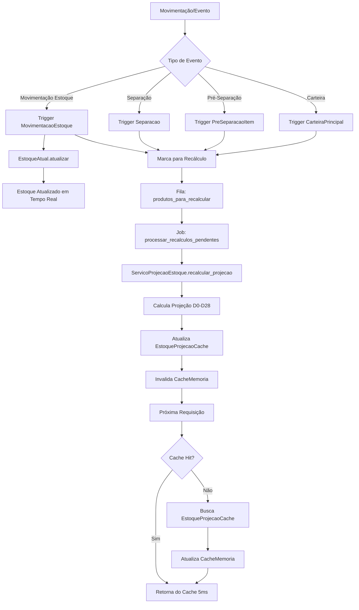

# Arquitetura de Atualização do Estoque Projetado

## 📊 Visão Geral

O sistema de estoque projetado utiliza uma **arquitetura híbrida em 3 camadas** para otimizar performance e garantir consistência dos dados:

1. **EstoqueAtual** - Tabela simples com estoque em tempo real
2. **EstoqueProjecaoCache** - Cache materializado com projeções D0-D28
3. **CacheMemoria** - Cache em memória para produtos mais acessados

## 🔄 Fluxo de Atualização

### 1. Atualização em Tempo Real (EstoqueAtual)

```
Movimentação → Trigger → EstoqueAtual.atualizar() → Estoque atualizado instantaneamente
```

- **Quando**: A cada movimentação de entrada/saída
- **Como**: Através de triggers no SQLAlchemy
- **Tempo**: < 10ms
- **Tabela**: `estoque_atual`

### 2. Recálculo de Projeções (EstoqueProjecaoCache)

```
Evento → Trigger → Fila de recálculo → ServicoProjecaoEstoque.recalcular_projecao()
```

- **Quando**: 
  - Após movimentações
  - Após alterações em CarteiraPrincipal
  - Após criação/edição de PreSeparacaoItem
  - Após mudanças em Separacao
  - A cada 15 minutos (job automático)
  
- **Como**: Processamento em batch a cada 30 segundos
- **Tempo**: ~100-500ms por produto
- **Tabela**: `estoque_projecao_cache`

### 3. Cache em Memória (CacheMemoria)

```
Requisição → Cache Hit (5ms) ou Cache Miss → Busca DB → Atualiza Cache
```

- **TTL**: 5 minutos
- **Capacidade**: 100 produtos
- **LRU**: Remove menos acessados quando cheio

## 📈 Métricas Calculadas

### Est.Hoje (Estoque Atual)
```python
# Fonte: EstoqueAtual.estoque
# Atualizado em tempo real via triggers
EstoqueAtual.query.filter_by(cod_produto=cod_produto).first().estoque
```

### Est.Min.D+7 (Menor Estoque em 7 dias)
```python
# Fonte: EstoqueProjecaoCache.menor_estoque_7d
# Calculado durante recálculo de projeção
# Considera: estoque atual - saídas + produções programadas
menor_estoque = min(projecao['d0'] até projecao['d7'])
```

### Prod.Hoje (Produção Programada Hoje)
```python
# Fonte: ProgramacaoProducao
# Calculado em tempo real
ProgramacaoProducao.query.filter(
    cod_produto=produto,
    data_programacao=hoje
).sum(qtd_programada)
```

### Disponível (Data de Disponibilidade)
```python
# Calculado dinamicamente baseado na projeção
# Encontra primeiro dia onde estoque_final >= qtd_necessaria
for dia in projecao_29_dias:
    if dia['estoque_final'] >= qtd_pedido:
        return dia['data']
```

## 🔗 Pontos de Sincronização

### 1. Cardex → Workspace

```python
# cardex_api.py
resumo_estoque = ServicoProjecaoEstoque.obter_projecao(cod_produto)
cardex_dados = converter_projecao_para_cardex(resumo_estoque)

# workspace_api.py  
resumo_estoque = ServicoProjecaoEstoque.obter_projecao(produto.cod_produto)
produto_data = processar_dados_workspace_produto(produto, resumo_estoque)
```

### 2. Triggers de Atualização

| Evento | Trigger | Ação |
|--------|---------|------|
| INSERT/UPDATE MovimentacaoEstoque | `atualizar_estoque_apos_movimentacao` | Atualiza EstoqueAtual + marca recálculo |
| INSERT/UPDATE Separacao | `atualizar_projecao_apos_separacao` | Marca produto para recálculo |
| INSERT/UPDATE PreSeparacaoItem | `atualizar_projecao_apos_pre_separacao` | Marca produto para recálculo |
| INSERT/UPDATE CarteiraPrincipal | `atualizar_projecao_apos_carteira` | Marca produto para recálculo |
| UPDATE Pedido (status) | `atualizar_projecao_apos_pedido` | Marca produtos do lote para recálculo |
| INSERT/UPDATE ProgramacaoProducao | `atualizar_projecao_apos_producao` | Marca produto para recálculo |

### 3. Jobs Automáticos

```python
# A cada 30 segundos
processar_recalculos_pendentes()  # Processa fila de produtos marcados

# A cada 15 minutos  
job_atualizar_projecoes_antigas()  # Atualiza projeções expiradas

# Diariamente às 00:00
job_avancar_dia()  # Avança projeções D0→D1, D1→D2, etc
```

## 🎯 Fluxo Completo de Atualização



## ⚡ Otimizações Implementadas

### 1. Cache em 3 Níveis
- **Memória**: 5ms de latência
- **DB Materializado**: 50ms de latência
- **Recálculo**: 100-500ms (apenas quando necessário)

### 2. Processamento em Batch
- Agrupa recálculos a cada 30 segundos
- Evita múltiplos recálculos do mesmo produto
- Reduz carga no banco de dados

### 3. Invalidação Inteligente
- Cache invalidado imediatamente após mudanças
- Recálculo assíncrono em background
- Usuário sempre vê dados consistentes

### 4. Índices Otimizados
```sql
-- EstoqueAtual
INDEX idx_estoque_atual_produto ON estoque_atual(cod_produto);

-- EstoqueProjecaoCache  
PRIMARY KEY (cod_produto);
INDEX idx_cache_validade ON estoque_projecao_cache(data_calculo);
```

## 🔧 Pontos de Melhoria Sugeridos

### 1. Implementar Queue Assíncrona (Celery/RQ)
```python
# Atual: Síncrono
ServicoProjecaoEstoque.recalcular_projecao(cod_produto)

# Sugestão: Assíncrono
recalcular_projecao_task.delay(cod_produto)
```

### 2. Cache Distribuído (Redis)
```python
# Atual: Memória local
cache_memoria = CacheMemoria()

# Sugestão: Redis
cache_redis = Redis(host='localhost', port=6379)
```

### 3. Webhooks para Eventos Críticos
```python
# Notificar sistemas externos sobre rupturas
if status_ruptura == 'CRÍTICO':
    enviar_webhook('ruptura_detectada', {
        'produto': cod_produto,
        'dia_ruptura': dia_ruptura
    })
```

### 4. Métricas de Performance
```python
# Adicionar telemetria
@monitor_performance
def recalcular_projecao(cod_produto):
    # Registra tempo, CPU, memória
    pass
```

### 5. Compactação de Projeções Antigas
```python
# Arquivar projeções > 30 dias
# Manter apenas resumo estatístico
```

## 📝 Campos Corretos (IMPORTANTE!)

Conforme documentado em `CLAUDE.md`, sempre usar os nomes CORRETOS dos campos:

### CarteiraPrincipal
- ✅ `expedicao` (NÃO `data_expedicao_pedido`)
- ✅ `agendamento` (NÃO `data_agendamento_pedido`)
- ✅ `qtd_saldo_produto_pedido` (quantidade disponível)
- ✅ `separacao_lote_id` (quando já separado)

### PreSeparacaoItem
- ✅ `data_expedicao_editada`
- ✅ `qtd_selecionada_usuario`
- ✅ `status` ('CRIADO', 'RECOMPOSTO')

### Separacao
- ✅ `qtd_saldo` (quantidade separada)
- ✅ `separacao_lote_id`
- ⚠️ NÃO tem campo `status` (vem de Pedido via JOIN)

### Pedido
- ✅ `status` ('ABERTO', 'COTADO', 'EMBARCADO', etc)
- ✅ `expedicao` (data de expedição)
- ✅ `separacao_lote_id` (link com Separacao)

## 🚀 Como Testar

### 1. Verificar Estoque Atual
```bash
curl http://localhost:5000/api/estoque/12345/atual
```

### 2. Verificar Projeção
```bash
curl http://localhost:5000/api/estoque/12345/projecao
```

### 3. Forçar Recálculo
```bash
curl -X POST http://localhost:5000/api/estoque/12345/recalcular
```

### 4. Ver Status do Cache
```bash
curl http://localhost:5000/api/estoque/cache/status
```

## 📊 Monitoramento

### Queries Úteis

```sql
-- Produtos com cache expirado
SELECT cod_produto, data_calculo, 
       EXTRACT(EPOCH FROM (NOW() - data_calculo))/60 as idade_minutos
FROM estoque_projecao_cache
WHERE EXTRACT(EPOCH FROM (NOW() - data_calculo))/60 > 15;

-- Produtos com ruptura prevista
SELECT cod_produto, menor_estoque_7d, status_ruptura
FROM estoque_projecao_cache
WHERE status_ruptura IN ('CRÍTICO', 'ATENÇÃO');

-- Performance do cache
SELECT cod_produto, tempo_calculo_ms, versao
FROM estoque_projecao_cache
ORDER BY tempo_calculo_ms DESC
LIMIT 10;
```

## 🎯 Conclusão

A arquitetura atual é **robusta e escalável**, com:
- ✅ Atualização em tempo real do estoque
- ✅ Projeções calculadas eficientemente
- ✅ Cache em múltiplos níveis
- ✅ Triggers automáticos para consistência
- ✅ Jobs para manutenção periódica

As melhorias sugeridas visam principalmente:
- 🚀 Melhor performance em alto volume
- 📊 Melhor observabilidade
- 🔄 Processamento verdadeiramente assíncrono
- 🌐 Suporte a ambientes distribuídos