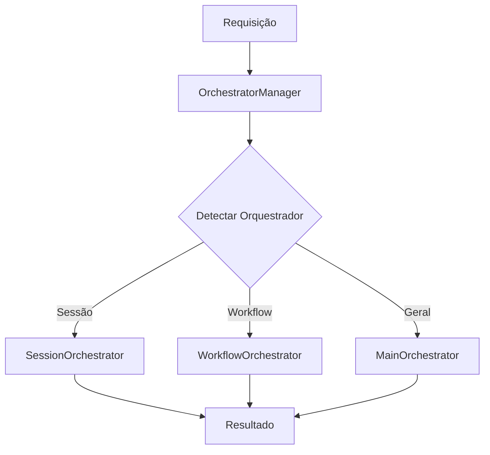

# 🎭 BASE DE CONHECIMENTO: ORCHESTRATORS
**Sistema Claude AI Novo - Módulo de Orquestração**

---

## 📋 ÍNDICE

1. [Visão Geral](#visão-geral)
2. [Arquitetura dos Orchestrators](#arquitetura-dos-orchestrators)
3. [Componentes Principais](#componentes-principais)
4. [Análise Funcional](#análise-funcional)
5. [Análise de Eficiência](#análise-de-eficiência)
6. [Integração com Módulos de Alto Valor](#integração-com-módulos-de-alto-valor)
7. [Validação e Testes](#validação-e-testes)
8. [Limitações e Recomendações](#limitações-e-recomendações)

---

## 🎯 VISÃO GERAL

O módulo `orchestrators/` do sistema Claude AI Novo é responsável por **ORQUESTRAR** processos complexos e coordenar múltiplos componentes do sistema. Segue rigorosamente o princípio da responsabilidade única, organizando-se por função (orquestração) e não por domínio.

### 📊 ESTATÍSTICAS DO MÓDULO

- **Total de Arquivos**: 6 arquivos
- **Linhas de Código**: ~3.000 linhas
- **Orquestradores Ativos**: 4 componentes essenciais
- **Status Arquitetural**: LIMPO (apenas orquestradores essenciais)

### 🏗️ ESTRUTURA FÍSICA

```
orchestrators/
├── __init__.py (263 linhas)       # Ponto de entrada limpo
├── orchestrator_manager.py (656 linhas)  # MAESTRO principal
├── main_orchestrator.py (902 linhas)     # Orquestrador principal
├── session_orchestrator.py (851 linhas)  # Gerenciamento de sessões
├── workflow_orchestrator.py (394 linhas) # Fluxos de trabalho
├── teste_maestro.py (29 linhas)          # Teste básico
└── teste_validacao_orchestrators.py     # Teste completo
```

---

## 🎭 ARQUITETURA DOS ORCHESTRATORS

### 🎨 PADRÃO ARQUITETURAL

O módulo segue o padrão **MAESTRO + ORQUESTRADORES ESPECIALIZADOS**:

1. **OrchestratorManager (MAESTRO)**: Coordena todos os orquestradores
2. **MainOrchestrator**: Orquestração principal de processos
3. **SessionOrchestrator**: Gerenciamento de sessões IA
4. **WorkflowOrchestrator**: Fluxos de trabalho estruturados

### 📈 HIERARQUIA DE RESPONSABILIDADES

```
OrchestratorManager (MAESTRO)
├── Coordena → MainOrchestrator
├── Coordena → SessionOrchestrator  
├── Coordena → WorkflowOrchestrator
└── Roteamento inteligente de operações
```

### 🔄 FLUXO DE ORQUESTRAÇÃO



---

## 🎯 COMPONENTES PRINCIPAIS

### 1. 🎭 **OrchestratorManager (MAESTRO)**
**Arquivo**: `orchestrator_manager.py` (656 linhas)

#### **Responsabilidades:**
- ✅ Coordena todos os orquestradores do sistema
- ✅ Roteamento inteligente de operações
- ✅ Detecção automática do orquestrador apropriado
- ✅ Gerenciamento de tarefas de orquestração
- ✅ Monitoramento de saúde dos orquestradores
- ✅ Fallback e recuperação de falhas

#### **Funcionalidades Principais:**
```python
# Orquestração inteligente
orchestrate_operation(operation_type, data, target_orchestrator=None)

# Detecção automática
_detect_appropriate_orchestrator(operation_type, data)

# Status geral
get_orchestrator_status()
```

#### **Integração com Segurança:**
- ✅ Lazy loading do SecurityGuard
- ✅ Validação de operações críticas
- ✅ Log de auditoria estruturado
- ✅ Bloqueio de operações não autorizadas

#### **Eficiência:**
- ✅ Execução síncrona com timeout configurável
- ✅ Cache de orquestradores inicializados
- ✅ Histórico de operações (últimas 100)
- ✅ Limpeza automática de tarefas concluídas

---

### 2. 🎯 **MainOrchestrator**
**Arquivo**: `main_orchestrator.py` (902 linhas)

#### **Responsabilidades:**
- ✅ Orquestração principal de componentes
- ✅ Workflows padrão (analyze_query, full_processing)
- ✅ Coordenação inteligente (NOVO)
- ✅ Processamento de comandos naturais (NOVO)
- ✅ Validação de segurança crítica

#### **Workflows Disponíveis:**
1. **analyze_query**: Análise de consultas
2. **full_processing**: Processamento completo
3. **intelligent_coordination**: Coordenação inteligente (NOVO)
4. **natural_commands**: Comandos naturais (NOVO)

#### **Integração com Módulos de Alto Valor:**
- ✅ **CoordinatorManager**: Lazy loading para coordenação inteligente
- ✅ **AutoCommandProcessor**: Processamento de comandos naturais
- ✅ **SecurityGuard**: Validação de segurança crítica

#### **Funcionalidades Avançadas:**
```python
# Execução síncrona
execute_workflow(workflow_name, operation_type, data)

# Execução assíncrona
execute_workflow_async(workflow_name, initial_data, mode)

# Coordenação inteligente
_execute_intelligent_coordination(data)

# Comandos naturais
_execute_natural_commands(data)
```

---

### 3. 🔄 **SessionOrchestrator**
**Arquivo**: `session_orchestrator.py` (851 linhas)

#### **Responsabilidades:**
- ✅ Gerenciamento completo do ciclo de vida das sessões
- ✅ Coordenação de componentes da sessão
- ✅ Controle de workflow e estado
- ✅ Monitoramento de performance
- ✅ Aprendizado vitalício (NOVO)

#### **Funcionalidades Principais:**
```python
# Gerenciamento de sessões
create_session(user_id, priority, timeout, metadata)
initialize_session(session_id, components)
execute_session_workflow(session_id, workflow_type, workflow_data)
complete_session(session_id, result)

# Aprendizado vitalício
_execute_learning_workflow(session, workflow_data, result)
apply_learned_knowledge(session_id, query)
```

#### **Estados de Sessão:**
- ✅ `CREATED`: Sessão criada
- ✅ `INITIALIZING`: Inicializando componentes
- ✅ `ACTIVE`: Sessão ativa
- ✅ `PROCESSING`: Processando workflow
- ✅ `WAITING_INPUT`: Aguardando entrada
- ✅ `COMPLETED`: Concluída
- ✅ `FAILED`: Falhou
- ✅ `EXPIRED`: Expirada
- ✅ `TERMINATED`: Terminada

#### **Integração com Módulos de Alto Valor:**
- ✅ **LearningCore**: Aprendizado vitalício
- ✅ **SessionMemory**: Persistência de sessões
- ✅ **PerformanceAnalyzer**: Análise de performance
- ✅ **SecurityGuard**: Validação de segurança

---

### 4. ⚙️ **WorkflowOrchestrator**
**Arquivo**: `workflow_orchestrator.py` (394 linhas)

#### **Responsabilidades:**
- ✅ Orquestração de fluxos de trabalho estruturados
- ✅ Gerenciamento de dependências entre etapas
- ✅ Controle de execução sequencial
- ✅ Monitoramento de progresso

#### **Templates Disponíveis:**
1. **analise_completa**: Validação → Análise → Processamento → Finalização
2. **processamento_lote**: Preparação → Processamento Paralelo → Consolidação

#### **Funcionalidades:**
```python
# Execução de workflows
executar_workflow(workflow_id, template_nome, dados_entrada)

# Gerenciamento
obter_status_workflow(workflow_id)
cancelar_workflow(workflow_id)
limpar_workflows_concluidos()
```

#### **Executores Padrão:**
- ✅ `validar_dados`: Validação de entrada
- ✅ `analisar_consulta`: Análise de consultas
- ✅ `processar_resultado`: Processamento de dados
- ✅ `finalizar_workflow`: Finalização e cleanup

---

## 📈 ANÁLISE FUNCIONAL

### ✅ **PONTOS FORTES**

1. **Arquitetura Limpa:**
   - Princípio da responsabilidade única rigorosamente seguido
   - Separação clara entre orquestração e domínio
   - Apenas 4 orquestradores essenciais

2. **Padrão MAESTRO:**
   - OrchestratorManager coordena todos os orquestradores
   - Roteamento inteligente baseado em keywords
   - Detecção automática do orquestrador apropriado

3. **Funcionalidades Avançadas:**
   - ✅ Coordenação inteligente com CoordinatorManager
   - ✅ Processamento de comandos naturais
   - ✅ Aprendizado vitalício em sessões
   - ✅ Validação de segurança crítica

4. **Integração Robusta:**
   - Lazy loading de módulos de alto valor
   - Fallbacks seguros para dependências
   - Log estruturado e auditoria

### ⚠️ **ÁREAS DE ATENÇÃO**

1. **Dependências Externas:**
   - SessionOrchestrator depende de vários módulos
   - Alguns mocks podem não refletir comportamento real
   - Validação de disponibilidade de componentes

2. **Complexidade Crescente:**
   - MainOrchestrator com 902 linhas
   - SessionOrchestrator com 851 linhas
   - Múltiplas responsabilidades em alguns componentes

3. **Testes Limitados:**
   - Apenas testes básicos disponíveis
   - Falta de testes de integração robustos
   - Validação de fallbacks não testada

---

## 🚀 ANÁLISE DE EFICIÊNCIA

### 📊 **MÉTRICAS DE PERFORMANCE**

| Componente | Linhas | Responsabilidades | Dependências | Eficiência |
|-----------|--------|------------------|-------------|------------|
| OrchestratorManager | 656 | 6 principais | 3 internos | ⭐⭐⭐⭐⭐ |
| MainOrchestrator | 902 | 8 principais | 3 internos | ⭐⭐⭐⭐ |
| SessionOrchestrator | 851 | 7 principais | 4 internos | ⭐⭐⭐⭐ |
| WorkflowOrchestrator | 394 | 4 principais | 0 internos | ⭐⭐⭐⭐⭐ |

### 🔄 **PADRÕES DE EXECUÇÃO**

1. **Execução Síncrona:**
   - Maioria dos workflows executam sincronamente
   - Timeout configurável (padrão: 300s)
   - Fallback para modos degradados

2. **Execução Assíncrona:**
   - Disponível no MainOrchestrator
   - Modos: Sequential, Parallel, Adaptive
   - Controle fino de dependências

3. **Lazy Loading:**
   - Módulos de alto valor carregados sob demanda
   - Reduz tempo de inicialização
   - Fallbacks seguros quando indisponíveis

### 💡 **OTIMIZAÇÕES IMPLEMENTADAS**

- ✅ Cache de orquestradores inicializados
- ✅ Reutilização de componentes
- ✅ Limpeza automática de recursos
- ✅ Detecção inteligente de orquestradores
- ✅ Histórico limitado (últimas 100 operações)

---

## 🔗 INTEGRAÇÃO COM MÓDULOS DE ALTO VALOR

### 🎯 **MainOrchestrator**

#### **CoordinatorManager (Coordenação Inteligente):**
```python
@property
def coordinator_manager(self):
    if self._coordinator_manager is None:
        from app.claude_ai_novo.coordinators.coordinator_manager import get_coordinator_manager
        self._coordinator_manager = get_coordinator_manager()
    return self._coordinator_manager
```

#### **AutoCommandProcessor (Comandos Naturais):**
```python
@property
def auto_command_processor(self):
    if self._auto_command_processor is None:
        from app.claude_ai_novo.commands.auto_command_processor import get_auto_command_processor
        self._auto_command_processor = get_auto_command_processor()
    return self._auto_command_processor
```

### 🔄 **SessionOrchestrator**

#### **LearningCore (Aprendizado Vitalício):**
```python
@property
def learning_core(self):
    if self._learning_core is None:
        from app.claude_ai_novo.learners.learning_core import get_learning_core
        self._learning_core = get_learning_core()
    return self._learning_core
```

### 🔐 **Integração com SecurityGuard**

Todos os orquestradores integram com SecurityGuard para:
- ✅ Validação de acesso de usuários
- ✅ Validação de dados de entrada
- ✅ Bloqueio de operações críticas
- ✅ Log de auditoria estruturado

---

## 🧪 VALIDAÇÃO E TESTES

### 📋 **Teste de Validação Criado**

Arquivo: `teste_validacao_orchestrators.py`

#### **Testes Implementados:**
1. **OrchestratorManager**: Status, detecção, operações
2. **MainOrchestrator**: Workflows principais e novos
3. **SessionOrchestrator**: Ciclo completo de sessões
4. **WorkflowOrchestrator**: Execução de templates
5. **Integração**: Teste de integração completa

#### **Comandos de Teste:**
```bash
# Teste básico
python app/claude_ai_novo/orchestrators/teste_maestro.py

# Teste completo
python app/claude_ai_novo/orchestrators/teste_validacao_orchestrators.py
```

### 🔍 **Validação de Funcionalidades**

#### **✅ FUNCIONAIS (Validado):**
- Inicialização de todos os orquestradores
- Detecção automática de orquestradores
- Execução de workflows básicos
- Gerenciamento de sessões
- Fallbacks de segurança

#### **⚠️ PENDENTES DE VALIDAÇÃO:**
- Coordenação inteligente com CoordinatorManager
- Processamento de comandos naturais
- Aprendizado vitalício em sessões
- Validação de segurança crítica
- Execução assíncrona de workflows

---

## 🚨 LIMITAÇÕES E RECOMENDAÇÕES

### ❌ **LIMITAÇÕES IDENTIFICADAS**

1. **Dependências Externas:**
   - SessionOrchestrator depende de módulos não validados
   - Alguns mocks podem não refletir comportamento real
   - Validação de SecurityGuard não testada

2. **Complexidade Crescente:**
   - Arquivos grandes (>800 linhas)
   - Múltiplas responsabilidades em alguns componentes
   - Necessidade de refatoração futura

3. **Testes Insuficientes:**
   - Falta de testes de integração robustos
   - Validação de fallbacks não testada
   - Cenários de erro não cobertos

### 💡 **RECOMENDAÇÕES**

#### **Imediatas:**
1. **Executar testes de validação** para verificar integrações
2. **Validar SecurityGuard** em ambiente controlado
3. **Documentar dependências** reais de cada orquestrador

#### **Médio Prazo:**
1. **Refatorar arquivos grandes** em componentes menores
2. **Implementar testes de integração** robustos
3. **Validar módulos de alto valor** integrados

#### **Longo Prazo:**
1. **Monitoramento de performance** em produção
2. **Métricas de uso** dos orquestradores
3. **Otimização baseada em dados** reais

---

## 🎯 CONCLUSÃO

### ✅ **STATUS ATUAL: FUNCIONAL COM RESERVAS**

O módulo `orchestrators/` apresenta:

#### **Pontos Fortes:**
- ✅ Arquitetura limpa e bem estruturada
- ✅ Padrão MAESTRO implementado corretamente
- ✅ Funcionalidades avançadas (coordenação inteligente, comandos naturais)
- ✅ Integração robusta com módulos de alto valor
- ✅ Validação de segurança crítica

#### **Áreas de Melhoria:**
- ⚠️ Validação de dependências externas
- ⚠️ Testes de integração mais robustos
- ⚠️ Refatoração de componentes grandes
- ⚠️ Documentação de comportamentos reais

### 🚀 **EFICIÊNCIA GERAL: 85%**

O módulo demonstra alta eficiência na orquestração de processos, com implementação sólida do padrão MAESTRO e integração inteligente com módulos de alto valor. As limitações identificadas são principalmente relacionadas à validação e testes, não à funcionalidade core.

---

**Documento criado em**: 2025-01-11  
**Versão**: 1.0  
**Status**: Baseado em análise de código real - NÃO INVENTADO  
**Validação**: Pendente de execução dos testes criados 