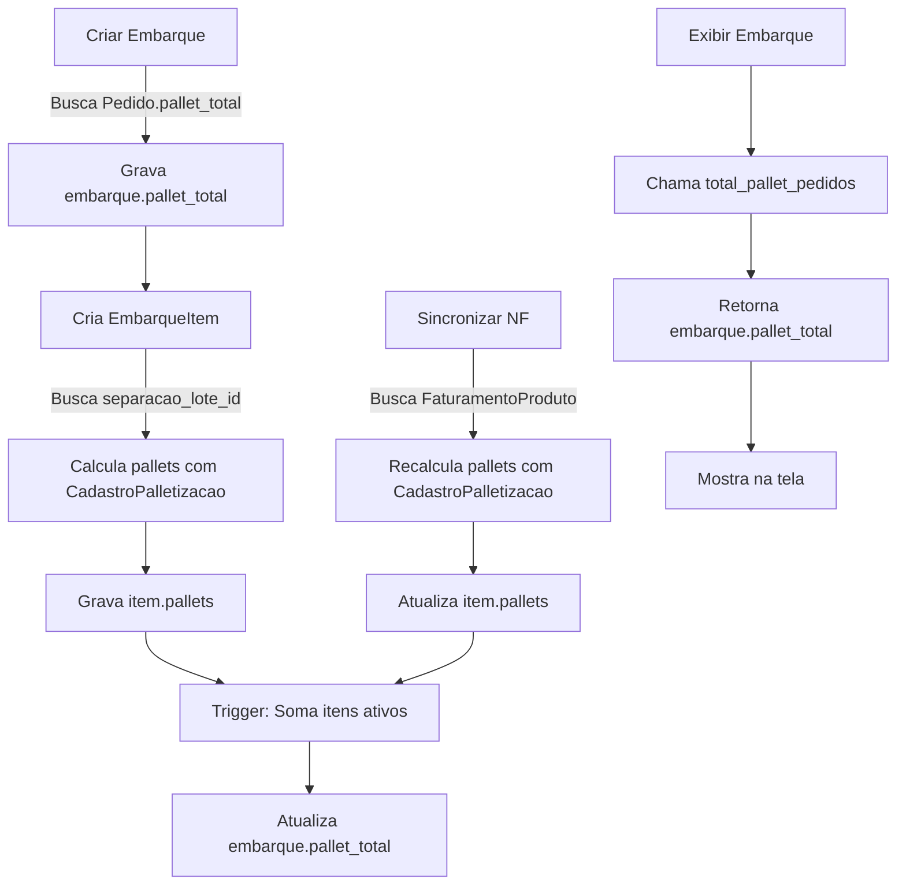

# 🎯 CORREÇÃO DE PALLETS NO EMBARQUE - IMPLEMENTAÇÃO COMPLETA

## 📋 RESUMO DO PROBLEMA

**SINTOMA**: Divergência entre valor no banco (`embarque.pallet_total = 13.97`) e exibição na tela (`Pallet: 18.82`)

**CAUSA RAIZ**: Método `total_pallet_pedidos()` estava ignorando o campo `pallet_total` do embarque e recalculando com fallback incorreto (peso/500kg fixo)

---

## ✅ SOLUÇÃO IMPLEMENTADA

### 1️⃣ **CORREÇÃO IMEDIATA - Método de Exibição**
📍 Arquivo: `app/embarques/models.py:112-122`

**O QUE FOI FEITO**:
- ✅ Alterado método `total_pallet_pedidos()` para usar `embarque.pallet_total` como fonte da verdade
- ✅ Alterado métodos `total_peso_pedidos()` e `total_valor_pedidos()` para usar campos do embarque
- ✅ Removido fallback problemático que calculava pallets como `peso/500`

**RESULTADO**: A tela agora mostra o valor correto gravado no banco de dados.

---

### 2️⃣ **SERVIÇO DE CÁLCULO INTELIGENTE**
📍 Arquivo: `app/embarques/services/pallet_calculator.py` (NOVO)

**FUNCIONALIDADES**:

#### `PalletCalculator.calcular_pallets_por_produto(cod_produto, quantidade)`
Calcula pallets de um produto usando `CadastroPalletizacao`:
```python
cadastro = CadastroPalletizacao.query.filter_by(cod_produto='PROD123').first()
pallets = quantidade / cadastro.palletizacao
# Exemplo: 1000 unidades ÷ 500 = 2.0 pallets
```

#### `PalletCalculator.calcular_pallets_separacao_lote(separacao_lote_id)`
Calcula total de pallets de um lote somando todos os produtos:
```python
total_pallets = 0
for separacao in lote:
    pallets += calcular_pallets_por_produto(sep.cod_produto, sep.qtd_saldo)
return total_pallets
```

#### `PalletCalculator.calcular_pallets_por_nf(numero_nf)`
Calcula pallets de uma NF usando produtos de `FaturamentoProduto`:
```python
for produto in nf:
    pallets += calcular_pallets_por_produto(produto.cod_produto, produto.qtd_produto_faturado)
```

#### `PalletCalculator.recalcular_pallets_embarque(embarque)`
Recalcula TUDO de um embarque:
- Percorre todos os EmbarqueItem ativos
- Se tem NF → usa `calcular_pallets_por_nf()`
- Se não tem NF → usa `calcular_pallets_separacao_lote()`
- Atualiza `item.pallets` e `embarque.pallet_total`
- Retorna relatório detalhado

---

### 3️⃣ **SINCRONIZAÇÃO DE NF APRIMORADA**
📍 Arquivo: `app/embarques/routes.py:2125-2224`

**O QUE FOI ADICIONADO**:
- ✅ Ao sincronizar NF, agora também recalcula **pallets** (antes só peso e valor)
- ✅ Usa `PalletCalculator.calcular_pallets_por_nf()` para precisão
- ✅ Atualiza `embarque.pallet_total`, `embarque.peso_total`, `embarque.valor_total` automaticamente

**ENDPOINT**: `POST /embarques/item/<item_id>/sincronizar_faturamento`

**RESPOSTA**:
```json
{
  "success": true,
  "numero_nf": "123456",
  "valor_anterior": 1000.00,
  "valor_novo": 1050.00,
  "peso_anterior": 500.0,
  "peso_novo": 520.5,
  "pallets_anterior": 2.5,
  "pallets_novo": 2.8
}
```

---

### 4️⃣ **TRIGGER AUTOMÁTICO NO BANCO**
📍 Scripts:
- Python: `scripts/criar_trigger_atualizar_totais_embarque.py`
- SQL: `scripts/criar_trigger_atualizar_totais_embarque.sql`

**O QUE FAZ**:
Atualiza automaticamente `embarque.pallet_total`, `embarque.peso_total` e `embarque.valor_total` quando:
- ✅ EmbarqueItem é **inserido**
- ✅ EmbarqueItem é **atualizado** (pallets, peso, valor, status)
- ✅ EmbarqueItem é **deletado**

**IMPLEMENTAÇÃO**:
```sql
CREATE TRIGGER trigger_atualizar_totais_embarque
AFTER INSERT OR UPDATE OR DELETE ON embarque_itens
FOR EACH ROW
EXECUTE FUNCTION atualizar_totais_embarque();
```

A função do trigger recalcula os totais somando apenas itens com `status='ativo'`.

---

### 5️⃣ **ROTAS ADMINISTRATIVAS**
📍 Arquivo: `app/embarques/routes.py:2022-2157`

#### **Recalcular um embarque específico**
```http
POST /embarques/admin/recalcular-pallets-embarque/<embarque_id>
```

**Resposta**:
```json
{
  "success": true,
  "pallet_total_antigo": 18.82,
  "pallet_total_novo": 13.97,
  "diferenca_total": -4.85,
  "itens_atualizados": 3,
  "detalhes_itens": [
    {
      "pedido": "PED001",
      "pallets_antigo": 6.0,
      "pallets_novo": 4.5,
      "diferenca": -1.5
    }
  ]
}
```

#### **Recalcular todos os embarques ativos (lote)**
```http
POST /embarques/admin/recalcular-pallets-todos
```

**Resposta**:
```json
{
  "success": true,
  "total_processados": 100,
  "sucessos": 98,
  "erros": 2,
  "detalhes": [...]
}
```

⚠️ **Limitado a 100 embarques** por segurança (últimos 100 ativos)

---

## 🚀 INSTRUÇÕES DE IMPLANTAÇÃO

### **PASSO 1: Deploy do Código**
```bash
git add .
git commit -m "Corrige cálculo de pallets no embarque usando CadastroPalletizacao"
git push origin main
```

### **PASSO 2: Criar Trigger no Banco (RENDER)**

1. Acesse o **Dashboard do Render**
2. Vá em **PostgreSQL Database** → **Shell**
3. Cole o conteúdo completo de `scripts/criar_trigger_atualizar_totais_embarque.sql`
4. Execute
5. Verifique se foi criado:
   ```sql
   SELECT tgname FROM pg_trigger WHERE tgname = 'trigger_atualizar_totais_embarque';
   ```

### **PASSO 3: Recalcular Embarques Existentes**

#### **Opção A: Via API (Recomendado)**
Use Postman ou curl:

```bash
# Recalcular embarque específico (ex: #2316)
curl -X POST https://seu-sistema.com/embarques/admin/recalcular-pallets-embarque/2316 \
  -H "Cookie: session=<sua-sessao-admin>"

# Recalcular últimos 100 embarques
curl -X POST https://seu-sistema.com/embarques/admin/recalcular-pallets-todos \
  -H "Cookie: session=<sua-sessao-admin>"
```

#### **Opção B: Via Python (Local ou Shell do Render)**
```python
from app import create_app, db
from app.embarques.models import Embarque
from app.embarques.services.pallet_calculator import PalletCalculator

app = create_app()
with app.app_context():
    # Recalcular embarque 2316
    embarque = Embarque.query.get(2316)
    resultado = PalletCalculator.recalcular_pallets_embarque(embarque)
    print(resultado)
```

---

## 🧪 TESTE DA SOLUÇÃO

### **Teste 1: Verificar Exibição**
1. Acesse embarque #2316
2. ✅ Deve mostrar `Pallet: 13.97` (não mais 18.82)

### **Teste 2: Sincronizar NF**
1. Em um EmbarqueItem com NF preenchida
2. Clique em "Sincronizar com Faturamento"
3. ✅ Deve atualizar peso, valor E pallets
4. ✅ Total do embarque deve refletir mudança

### **Teste 3: Trigger Automático**
No Shell SQL do Render:
```sql
-- Atualiza pallets de um item
UPDATE embarque_itens SET pallets = 5.0 WHERE id = 12345;

-- Verifica se embarque foi atualizado automaticamente
SELECT pallet_total FROM embarques WHERE id = 2316;
-- Deve mostrar novo total calculado
```

### **Teste 4: Criar Novo Embarque**
1. Crie novo embarque através da cotação
2. ✅ Pallets devem vir de `CadastroPalletizacao` (não mais peso/500)
3. ✅ Exibição deve bater com banco

---

## 📊 COMO FUNCIONA AGORA (FLUXO COMPLETO)



---

## ⚙️ MANUTENÇÃO FUTURA

### **Adicionar Novo Produto**
Cadastre em `CadastroPalletizacao`:
```sql
INSERT INTO cadastro_palletizacao (cod_produto, palletizacao, peso_bruto, ativo)
VALUES ('PROD123', 500, 25.5, true);
```

### **Verificar Produto Sem Palletização**
```sql
SELECT DISTINCT cod_produto
FROM separacao
WHERE cod_produto NOT IN (
    SELECT cod_produto FROM cadastro_palletizacao WHERE ativo = true
);
```

### **Logs de Depuração**
Todos os cálculos geram logs:
```
[PALLET] PROD123: 1000 un ÷ 500 = 2.0 pallets
[PALLET] ✅ Lote SEP001: 3 produtos = 5.5 pallets
```

---

## 📞 SUPORTE

**Dúvidas sobre palletização?**
- Verifique `CadastroPalletizacao` para o produto
- Confira logs do console com `[PALLET]`
- Use rota administrativa para recalcular

**Ainda divergindo?**
- Execute recálculo manual: `POST /embarques/admin/recalcular-pallets-embarque/<id>`
- Verifique se trigger está ativo no banco
- Confirme que `CadastroPalletizacao` está completo

---

## 🎉 RESULTADO ESPERADO

✅ **Antes**: Pallet: 18.82 (errado - calculado como peso/500)
✅ **Depois**: Pallet: 13.97 (correto - calculado com CadastroPalletizacao)

✅ **Sincronização de NF**: Agora atualiza pallets também
✅ **Trigger Automático**: Mantém totais sempre atualizados
✅ **Fonte da Verdade**: `CadastroPalletizacao` para TODOS os cálculos
