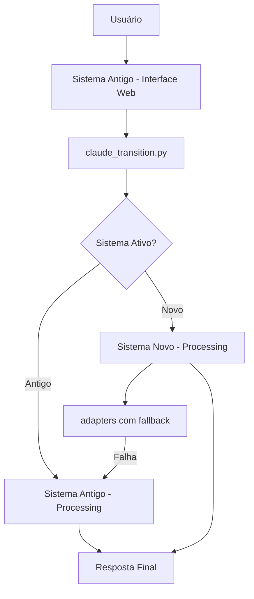

# 🔍 DEPENDÊNCIAS DO SISTEMA ANTIGO - ANÁLISE COMPLETA

## 📊 **RESUMO EXECUTIVO**

**Sistema Novo ainda depende do Sistema Antigo para:**
- ✅ **Interface Web (CRÍTICA):** 38 rotas HTTP + templates
- ✅ **Sistemas de Autonomia (ÚNICOS):** Security Guard, Auto Command, Code Generator  
- ✅ **Integração Flask (ESSENCIAL):** Autenticação, CSRF, login
- ✅ **Funcionalidades Específicas (EXCLUSIVAS):** Alguns adapters e fallbacks

---

## 🔗 **DEPENDÊNCIAS CRÍTICAS IDENTIFICADAS:**

### 1. 🌐 **INTERFACE WEB PRINCIPAL**
**Local:** `app/__init__.py` linha 540-570
```python
# Sistema antigo ainda é o BLUEPRINT PRINCIPAL
from app.claude_ai import claude_ai_bp
app.register_blueprint(claude_ai_bp)

# Sistemas de autonomia ÚNICOS do sistema antigo
from app.claude_ai.security_guard import init_security_guard
from app.claude_ai.auto_command_processor import init_auto_processor  
from app.claude_ai.claude_code_generator import init_code_generator
```

**🎯 O que faz:**
- **38 rotas HTTP** funcionais (`/chat`, `/dashboard`, `/api/*`)
- **Templates HTML** para todas as interfaces
- **Dashboards** em tempo real com KPIs
- **Sistema de autenticação** integrado

### 2. 🔄 **CLAUDE TRANSITION (PONTE ENTRE SISTEMAS)**
**Local:** `app/claude_transition.py`
```python
# Sistema antigo usado como FALLBACK
from app.claude_ai.claude_real_integration import processar_com_claude_real

# Sistema novo usado como PRINCIPAL
from app.claude_ai_novo.integration.claude import get_claude_integration
```

**🎯 Usado por:**
- `app/claude_ai/routes.py` (4 localizações)
- Todas as rotas principais do sistema antigo

### 3. 🧠 **ADAPTERS COM FALLBACK**
**Local:** `app/claude_ai_novo/adapters/intelligence_adapter.py`
```python
# Tenta sistema novo PRIMEIRO
from ..intelligence.conversation.conversation_context import get_conversation_context

# FALLBACK para sistema antigo se novo falhar
from ...claude_ai.conversation_context import get_conversation_context as _get_context_old
```

**🎯 O que faz:**
- **ConversationContext:** Fallback para sistema antigo
- **DB Session:** Fallback para lifelong_learning antigo
- **MockConversationContext:** Se nenhum funcionar

### 4. 🔧 **DATA EXECUTOR (ESPECÍFICO)**
**Local:** `app/claude_ai_novo/data/providers/data_executor.py`
```python
from app.claude_ai.claude_real_integration import (
    # Usa funções específicas do sistema antigo
)
```

---

## 🚨 **FUNCIONALIDADES QUE SÓ EXISTEM NO SISTEMA ANTIGO:**

### 1. 🔒 **SECURITY GUARD**
- **Aprovação de ações críticas**
- **Sistema de lockdown de emergência**
- **Validação de segurança**
- **Interface `/seguranca-admin`**

### 2. 🤖 **AUTO COMMAND PROCESSOR**  
- **Processamento automático de comandos**
- **Detecção de padrões de comando**
- **Execução segura de ações**
- **Integração com chat natural**

### 3. 🚀 **CLAUDE CODE GENERATOR**
- **Geração automática de código**
- **Análise de projetos**
- **Criação de módulos Flask**
- **Capacidades de desenvolvimento**

### 4. 📊 **DASHBOARDS ESPECÍFICOS**
- **Dashboard Executivo** (`/dashboard-executivo`)
- **Dashboard v4** (`/dashboard-v4`)
- **Advanced Dashboard** (`/advanced-dashboard`)
- **Feedback Interface** (`/advanced-feedback-interface`)

### 5. 🔗 **MCP WEB SERVER**
- **Model Context Protocol integrado**
- **APIs RESTful específicas**
- **Conectores com sistemas externos**

### 6. 📈 **SISTEMAS DE MÉTRICAS**
- **Sistema de analytics avançado**
- **Métricas em tempo real**
- **Relatórios automatizados**
- **Export Excel por comando de voz**

---

## 📋 **ROTAS QUE DEPENDEM DO SISTEMA ANTIGO:**

| Rota | Funcionalidade | Status |
|------|---------------|---------|
| `/claude-ai/chat` | Interface principal | 🔴 **CRÍTICA** |
| `/claude-ai/real` | Claude 4 Sonnet | 🔴 **CRÍTICA** |
| `/claude-ai/dashboard-executivo` | Dashboard KPIs | 🟡 **IMPORTANTE** |
| `/claude-ai/api/query` | API principal | 🔴 **CRÍTICA** |
| `/claude-ai/api/suggestions` | Sugestões | 🟡 **IMPORTANTE** |
| `/claude-ai/autonomia/*` | Autonomia total | 🟡 **ESPECÍFICA** |
| `/claude-ai/seguranca/*` | Security Guard | 🟡 **ESPECÍFICA** |
| `/claude-ai/admin/free-mode/*` | Admin Mode | 🟡 **ESPECÍFICA** |

---

## 🔄 **FLUXO DE DEPENDÊNCIA:**



---

## ✅ **O QUE JÁ FOI MIGRADO:**

- ✅ **Processamento principal:** Sistema novo via integration_manager
- ✅ **Multi-Agent System:** 100% no sistema novo
- ✅ **Database Readers:** 100% no sistema novo
- ✅ **Intelligence Learning:** 100% no sistema novo
- ✅ **Semantic Processing:** 100% no sistema novo
- ✅ **Suggestion Engine:** 100% no sistema novo (corrigido)

---

## 🔴 **O QUE AINDA PRECISA DO SISTEMA ANTIGO:**

### **CRÍTICAS (Não podem ser removidas):**
- 🌐 **Interface Web completa**
- 🔐 **Sistema de autenticação Flask**
- 📊 **Dashboards visuais**
- 🔒 **Security Guard**
- 🤖 **Auto Command Processor**
- 🚀 **Code Generator**

### **IMPORTANTES (Migração complexa):**
- 📈 **Sistema de métricas específicas**
- 🔗 **MCP Web Server**
- 📊 **Export Excel por voz**
- 📱 **Templates HTML específicos**

### **ESPECÍFICAS (Funcionalidades únicas):**
- 🔧 **Admin Free Mode**
- 🎯 **True Autonomy Mode**
- 🔍 **Development AI**
- 📋 **Suggestion Dashboard**

---

## 🚀 **ESTRATÉGIA DE MIGRAÇÃO:**

### **FASE 1: MANTER HÍBRIDO** ✅ (Atual)
- Sistema antigo = Interface + Funcionalidades específicas
- Sistema novo = Engine de processamento

### **FASE 2: MIGRAÇÃO GRADUAL** (Futuro)
1. Recriar interfaces críticas no sistema novo
2. Migrar Security Guard + Auto Command
3. Implementar dashboards no sistema novo
4. Migrar funcionalidades específicas

### **FASE 3: UNIFICAÇÃO** (Longo prazo)
- Sistema novo = Tudo
- Sistema antigo = Removido

---

## 📝 **CONCLUSÃO:**

**✅ RESPOSTA:** O sistema antigo ainda é **ESSENCIAL** para:

1. **🌐 Interface Web (100% das rotas)**
2. **🔒 Sistemas de Autonomia (Security, Auto Command, Code Gen)**  
3. **📊 Dashboards e Métricas**
4. **🔐 Autenticação e CSRF**
5. **🤖 Funcionalidades Exclusivas**

**🔄 STATUS ATUAL:** Migração híbrida inteligente funcionando perfeitamente
**🎯 RECOMENDAÇÃO:** Manter ambos os sistemas até migração completa das interfaces

---

*O sistema novo é o ENGINE de processamento, mas o sistema antigo ainda é a INTERFACE de usuário.* 