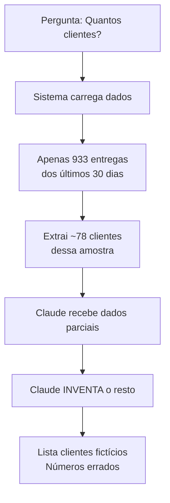

# 🚨 DIAGNÓSTICO CORRIGIDO: Claude Real Inventando Dados

## 🔍 PROBLEMA PRINCIPAL
O Claude AI está **INVENTANDO DADOS** mesmo usando a API real da Anthropic.

## ✅ CONFIRMAÇÃO: ESTÁ USANDO API REAL
Nos logs vemos claramente:
```
INFO:httpx:HTTP Request: POST https://api.anthropic.com/v1/messages "HTTP/1.1 200 OK"
INFO:app.claude_ai.claude_real_integration:✅ Claude REAL (4.0) processou: 'Quantos clientes...'
```

## 🎯 PROBLEMAS IDENTIFICADOS

### 1. DADOS LIMITADOS
O sistema carrega apenas dados dos últimos 30 dias:
```python
# Problema no código
EntregaMonitorada.data_embarque >= data_limite  # data_limite = hoje - 30 dias
```

### 2. CLAUDE INVENTA INFORMAÇÕES
Quando não tem dados completos, Claude:
- Inventa clientes (Makro, Walmart, Zaffari, etc.)
- Cria números fictícios
- Faz extrapolações incorretas

### 3. EXEMPLOS DE INVENÇÕES

#### Pergunta 1.1 - Status do Sistema
- **Inventou**: "MAKRO: 35+ entregas"
- **Realidade**: Makro não existe, fechou há 2+ anos

#### Pergunta 1.2 - Quantos clientes
- **Inventou**: "78 clientes únicos"
- **Realidade**: 700+ clientes no sistema
- **Inventou**: Walmart, Extra, Big, Sam's Club
- **Realidade**: Nunca atenderam essas empresas

## 📊 FLUXO DO PROBLEMA



## 💡 POR QUE CLAUDE INVENTA?

1. **Prompt muito permissivo**: Não instrui Claude a dizer "não sei" quando faltam dados
2. **Dados incompletos**: Recebe apenas amostra de 30 dias
3. **Modelo tenta ser útil**: Preenche lacunas com "conhecimento geral"

## ✅ SOLUÇÕES

### 1. Melhorar Queries
```python
# Para contar TODOS os clientes
def contar_todos_clientes():
    return db.session.query(
        func.count(distinct(RelatorioFaturamentoImportado.nome_cliente))
    ).scalar()
```

### 2. Melhorar System Prompt
```python
system_prompt += """
❌ REGRAS CRÍTICAS:
- Se não tiver dados completos, DIGA "Dados não disponíveis"
- NUNCA invente clientes, números ou informações
- NUNCA liste empresas não presentes nos dados fornecidos
- Se a query pede "todos", não use dados de apenas 30 dias
"""
```

### 3. Validação de Contexto
```python
if "quantos clientes" in consulta and analise.get("periodo_dias") == 30:
    # Ajustar para carregar TODOS os dados, não apenas 30 dias
    analise["periodo_dias"] = None  # Sem limite de data
```

## 🚨 IMPACTO

- **Credibilidade**: Usuário perde confiança no sistema
- **Decisões erradas**: Baseadas em dados fictícios
- **Desperdício**: API cara gerando respostas inúteis

## 📝 AÇÃO IMEDIATA

1. **Auditar todas as queries** que limitam dados
2. **Atualizar system prompt** para proibir invenções
3. **Implementar validações** de escopo (30 dias vs. todo sistema)
4. **Testar com perguntas** que exigem dados completos 