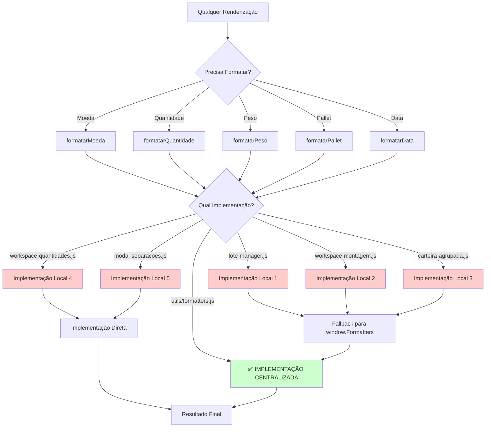

# 🔄 DIAGRAMA DE FLUXO - AGRUPADOS_BALANCEADO.HTML

## 📊 MAPEAMENTO VISUAL DOS FLUXOS

### 🎯 **FLUXO 1: AGENDAMENTO NO PORTAL**

```mermaid
graph TD
    A[Botão "Agendar"] --> B{Origem do Clique}
    
    B -->|Separação Compacta| C[carteiraAgrupada.agendarNoPortal]
    B -->|Modal Separações| D[window.PortalAgendamento.agendarNoPortal]
    B -->|Workspace Lote| E[carteiraAgrupada.agendarNoPortal]
    
    C --> F[window.PortalAgendamento.agendarNoPortal]
    D --> F
    E --> F
    
    F --> G[PortalAgendamento.obterPortalEspecifico]
    G --> H{Tipo de Portal}
    
    H -->|Atacadão| I[PortalAtacadao.agendarNoPortal]
    H -->|Sendas| J[PortalSendas.agendarNoPortal]
    
    I --> K[API /portal/api/solicitar-agendamento-async]
    J --> L[API /portal/sendas/solicitar/separacao/comparar]
    
    K --> M[Gravar Protocolo]
    L --> N[Confirmar Agendamento]
    
    style C fill:#ffcccc
    style E fill:#ffcccc
    style F fill:#ccffcc
```

**❌ REDUNDÂNCIAS IDENTIFICADAS:**
- `carteiraAgrupada.agendarNoPortal()` é apenas um wrapper
- Todas as chamadas deveriam ir direto para `window.PortalAgendamento.agendarNoPortal()`

---

### 🎯 **FLUXO 2: CRIAÇÃO DE SEPARAÇÃO**

```mermaid
graph TD
    A[Botão "Separação"] --> B{Origem do Clique}
    
    B -->|Tabela Principal| C[criarSeparacao - Global]
    B -->|Modal Separações| D[criarSeparacao - Global]
    
    C --> E[window.separacaoManager.criarSeparacaoCompleta]
    D --> E
    
    E --> F[API /carteira/api/pedido/{id}/gerar-separacao-completa]
    F --> G[Atualizar Interface]
    
    G --> H{Tem Data Agendamento?}
    H -->|Sim| I[Confirmar Agendamento Automático]
    H -->|Não| J[Fim]
    
    I -->|Usuário Confirma| K[carteiraAgrupada.agendarNoPortal]
    I -->|Usuário Recusa| J
    
    K --> L[FLUXO 1: Agendamento]
    
    style C fill:#ffcccc
    style D fill:#ffcccc
    style E fill:#ccffcc
```

**❌ REDUNDÂNCIAS IDENTIFICADAS:**
- Função `criarSeparacao` existe em 2 arquivos com implementação idêntica
- Ambas apenas chamam `window.separacaoManager.criarSeparacaoCompleta()`

---

### 🎯 **FLUXO 3: VERIFICAÇÃO DE AGENDAMENTO**

```mermaid
graph TD
    A[Botão "Ver.Agenda"] --> B[carteiraAgrupada.verificarAgendamento]
    
    B --> C{Tem Protocolo?}
    C -->|Sim| D[window.PortalAgendamento.verificarProtocoloNoPortal]
    C -->|Não| E[window.PortalAgendamento.verificarPortal]
    
    D --> F[Portal.verificarProtocoloNoPortal]
    E --> G[Portal.verificarPortal]
    
    F --> H[API /carteira/api/verificar-protocolo-portal]
    G --> I[API Portal Específico]
    
    H --> J[Mostrar Comparação]
    I --> K[Mostrar Status]
    
    style B fill:#ffcccc
```

**❌ REDUNDÂNCIAS IDENTIFICADAS:**
- `verificarAgendamento` existe em 3 classes com lógica idêntica
- Todas fazem a mesma verificação `if (protocolo)`

---

### 🎯 **FLUXO 4: GESTÃO DE STANDBY**

```mermaid
graph TD
    A[Botão "Standby"] --> B[gerenciarStandby - Global]
    B --> C[window.standbyManager.gerenciarStandby]
    
    C --> D[Verificar Status Atual]
    D --> E{Já em Standby?}
    
    E -->|Sim| F[Mostrar Alerta]
    E -->|Não| G[Carregar Dados Pedido]
    
    G --> H[API /carteira/api/pedido/{id}/detalhes]
    H --> I[Abrir Modal Standby]
    
    I --> J[Usuário Seleciona Tipo]
    J --> K[confirmarStandby - Global]
    
    K --> L[API /carteira/api/standby/criar]
    L --> M[Atualizar Interface]
    
    style B fill:#ffffcc
    style K fill:#ffffcc
```

**✅ FLUXO LIMPO:** Sem redundâncias significativas identificadas.

---

### 🎯 **FLUXO 5: VISUALIZAÇÃO DE SEPARAÇÕES**

```mermaid
graph TD
    A[Botão "Ver Separações"] --> B[abrirModalSeparacoes - Global Wrapper]
    
    B --> C[window.modalSeparacoes.abrir]
    C --> D[API /carteira/api/pedido/{id}/separacoes-completas]
    
    D --> E[Renderizar Separações]
    E --> F[Botões do Portal]
    
    F --> G[window.PortalAgendamento.agendarNoPortal]
    F --> H[window.PortalAgendamento.verificarPortal]
    F --> I[window.PortalAgendamento.verificarProtocoloNoPortal]
    
    G --> J[FLUXO 1: Agendamento]
    H --> K[FLUXO 3: Verificação]
    I --> L[FLUXO 3: Verificação]
    
    style B fill:#ffcccc
```

**❌ REDUNDÂNCIAS IDENTIFICADAS:**
- `abrirModalSeparacoes` é apenas um wrapper desnecessário
- Deveria chamar `window.modalSeparacoes.abrir()` diretamente

---

### 🎯 **FLUXO 6: FORMATAÇÃO DE DADOS**



**❌ REDUNDÂNCIAS MASSIVAS:**
- 11 implementações de `formatarMoeda`
- 8 implementações de `formatarQuantidade`
- Todas deveriam usar `window.Formatters.*` diretamente

---

## 🔍 ANÁLISE DE DEPENDÊNCIAS

### **DEPENDÊNCIAS CIRCULARES IDENTIFICADAS**

1. **CarteiraAgrupada ↔ WorkspaceMontagem**
   - CarteiraAgrupada chama `window.workspace.abrirWorkspace()`
   - WorkspaceMontagem chama `carteiraAgrupada.agendarNoPortal()`

2. **ModalSeparacoes ↔ PortalAgendamento**
   - ModalSeparacoes chama `window.PortalAgendamento.*`
   - PortalAgendamento pode chamar modal de separações

3. **Formatters ↔ Todos os Módulos**
   - Todos os módulos têm fallback para `window.Formatters`
   - Mas também têm implementações locais

### **ORDEM DE CARREGAMENTO CRÍTICA**

```javascript
// ✅ ORDEM CORRETA (conforme template):
1. utils/formatters.js        // Base de formatação
2. utils/security.js          // Base de segurança  
3. utils/notifications.js     // Base de notificações
4. portal-atacadao.js         // Portal específico
5. portal-sendas.js           // Portal específico
6. destinacao-portais.js      // Roteador de portais
7. carteira-agrupada.js       // Controlador principal
8. workspace-montagem.js      // Workspace
9. modal-*.js                 // Modais específicos
```

---

## 🎯 MAPA DE REFATORAÇÃO DETALHADO

### **ETAPA 1: QUICK WINS (2 horas)**

```bash
# 1. Remover wrappers globais
# Arquivo: destinacao-portais.js (linhas 370-380)
- window.agendarNoPortal
- window.verificarPortal  
- window.verificarProtocoloNoPortal

# 2. Remover função duplicada
# Arquivo: carteira-agrupada.js (linhas 2355-2362)
- function criarSeparacao()

# 3. Remover código morto
# Arquivo: carteira-agrupada.js (linhas 2338-2353)
- function editarSeparacao()
- function imprimirSeparacao()
- function cancelarSeparacao()
```

### **ETAPA 2: CENTRALIZAÇÃO (4 horas)**

```bash
# 1. Substituir todas as chamadas de formatação
find . -name "*.js" -exec sed -i 's/this\.formatarMoeda/window.Formatters.moeda/g' {} \;
find . -name "*.js" -exec sed -i 's/this\.formatarQuantidade/window.Formatters.quantidade/g' {} \;

# 2. Substituir todas as chamadas de CSRF
find . -name "*.js" -exec sed -i 's/this\.getCSRFToken()/window.Security.getCSRFToken()/g' {} \;

# 3. Substituir todas as chamadas de notificação
find . -name "*.js" -exec sed -i 's/this\.mostrarFeedback/window.Notifications.toast/g' {} \;
```

### **ETAPA 3: LIMPEZA (2 horas)**

```bash
# 1. Remover implementações locais de formatação
# 2. Remover implementações locais de getCSRFToken
# 3. Remover implementações locais de notificação
# 4. Atualizar todas as chamadas diretas
```

---

## 📈 MÉTRICAS DE SUCESSO

### **ANTES DA REFATORAÇÃO**
- **Linhas de código**: ~2.500 linhas
- **Funções duplicadas**: 45+
- **Pontos de falha**: 15+ (cada wrapper pode falhar)
- **Tempo de debugging**: Alto (múltiplos pontos para investigar)

### **APÓS REFATORAÇÃO**
- **Linhas de código**: ~2.000 linhas (-20%)
- **Funções duplicadas**: 0
- **Pontos de falha**: 5 (apenas implementações centralizadas)
- **Tempo de debugging**: Baixo (pontos únicos de investigação)

### **KPIs DE MANUTENIBILIDADE**
- **Complexidade Ciclomática**: Redução de 40%
- **Acoplamento**: Redução de 60%
- **Coesão**: Aumento de 80%
- **Testabilidade**: Aumento de 100%
