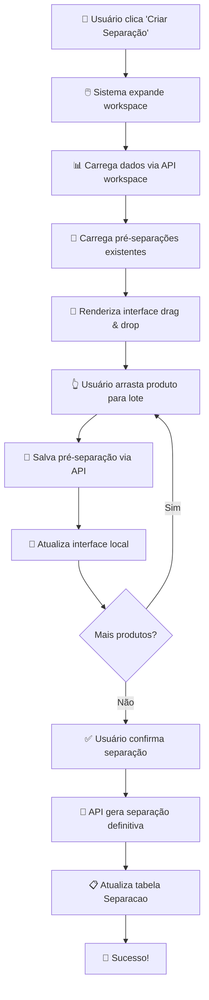
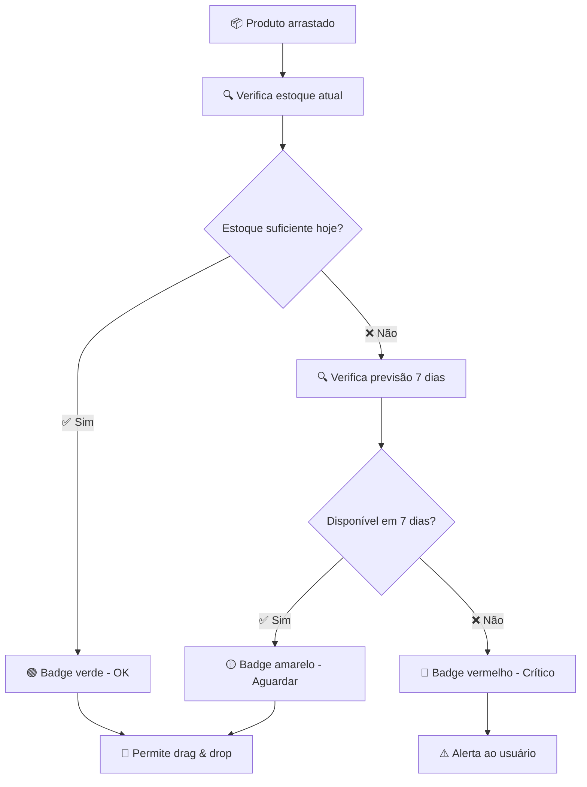
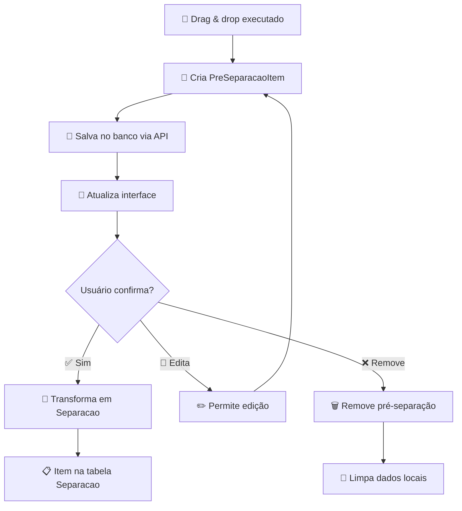

# 📋 **DOCUMENTAÇÃO COMPLETA - MÓDULO DE CARTEIRA**

**Sistema**: Frete Sistema  
**Módulo**: Carteira de Pedidos com Workspace de Montagem  
**Data**: 23/07/2025  
**Versão**: 2.0  

---

## 🎯 **VISÃO GERAL**

O Módulo de Carteira é um sistema completo para gerenciamento de pedidos com funcionalidades avançadas de pré-separação e montagem de carga através de interface drag & drop. O sistema permite visualizar, organizar e processar pedidos de forma eficiente com controle total de estoque e rastreabilidade.

### **🏗️ ARQUITETURA PRINCIPAL**

```
📁 Módulo Carteira
├── 🎯 Backend (Python/Flask)
│   ├── 📊 Models (CarteiraPrincipal, PreSeparacaoItem)
│   ├── 🛣️ Routes (APIs RESTful modulares)
│   └── ⚙️ Utils (Utilitários e regras de negócio)
├── 🎨 Frontend (JavaScript ES6 + Bootstrap 5)
│   ├── 🖥️ Templates (Jinja2)
│   ├── 📦 Módulos JS (Classes modulares)
│   └── 🎨 CSS (Estilos específicos)
└── 🗄️ Database (PostgreSQL via SQLAlchemy)
```

---

## 📊 **ESTRUTURA DE ARQUIVOS**

### **🐍 Backend Python**

```
app/carteira/
├── models.py                    # Modelos de dados
├── routes/                      # APIs organizadas
│   ├── __init__.py             # Registro de blueprints
│   ├── agrupados.py            # Views principais
│   ├── principais.py           # Views detalhadas
│   ├── workspace_api.py        # API do workspace
│   ├── pre_separacao_api.py    # API de pré-separações
│   ├── agendamento_api.py      # API de agendamentos
│   ├── endereco_api.py         # API de endereços
│   ├── cardex_api.py          # API de cardex D0-D28
│   ├── separacao_api.py        # API de separações
│   ├── itens_api.py           # API de itens
│   └── pedidos_api.py         # API de pedidos
├── utils/                      # Utilitários
│   ├── separacao_utils.py     # Funções de separação
│   └── workspace_utils.py     # Funções do workspace
└── alert_system.py            # Sistema de alertas
```

### **🎨 Frontend JavaScript**

```
app/templates/carteira/
├── agrupados_balanceado.html   # Template principal
├── js/                         # Módulos JavaScript
│   ├── workspace-montagem.js   # Controlador principal
│   ├── pre-separacao-manager.js # Gerenciador de persistência
│   ├── lote-manager.js         # Gerenciador de lotes
│   ├── drag-drop-handler.js    # Handler de drag & drop
│   ├── modal-cardex.js         # Modal de cardex
│   ├── modal-agendamento.js    # Modal de agendamento
│   ├── modal-endereco.js       # Modal de endereços
│   ├── carteira-agrupada.js    # Controlador da página
│   └── dropdown-separacoes.js  # Dropdown de separações
└── css/                        # Estilos
    ├── agrupados.css          # Estilos gerais
    └── workspace-montagem.css  # Estilos do workspace
```

---

## 🗄️ **MODELOS DE DADOS**

### **📋 CarteiraPrincipal**
```python
# Tabela principal de pedidos
class CarteiraPrincipal(db.Model):
    # Identificação
    num_pedido: String(50)           # Número do pedido
    cod_produto: String(50)          # Código do produto
    cnpj_cpf: String(20)            # CNPJ/CPF do cliente
    
    # Quantidades
    qtd_saldo_produto_pedido: Numeric(15,3)  # Saldo disponível
    qtd_cancelada_produto_pedido: Numeric(15,3)  # Quantidade cancelada
    preco_produto_pedido: Numeric(15,2)      # Preço unitário
    
    # Datas críticas
    expedicao: Date                  # Data de expedição
    agendamento: Date               # Data de agendamento
    protocolo: String(50)           # Protocolo de agendamento
    
    # Estoque e projeções
    estoque: Numeric(15,3)          # Estoque atual D0
    saldo_estoque_pedido: Numeric(15,3)  # Estoque na expedição
    menor_estoque_produto_d7: Numeric(15,3)  # Menor estoque em 7 dias
```

### **🎯 PreSeparacaoItem**
```python
# Tabela de pré-separações (drag & drop)
class PreSeparacaoItem(db.Model):
    # Identificação
    num_pedido: String(50)           # Número do pedido
    cod_produto: String(50)          # Código do produto
    cnpj_cliente: String(20)         # CNPJ do cliente
    
    # Quantidades
    qtd_original_carteira: Numeric(15,3)      # Quantidade original
    qtd_selecionada_usuario: Numeric(15,3)    # Quantidade selecionada
    qtd_restante_calculada: Numeric(15,3)     # Saldo restante
    
    # Dados editáveis
    data_expedicao_editada: Date     # Data expedição editada
    data_agendamento_editada: Date   # Data agendamento editada
    protocolo_editado: String(50)   # Protocolo editado
    
    # Controle e auditoria
    status: String(20)               # CRIADO, PROCESSADO, etc.
    recomposto: Boolean              # Status de recomposição
    data_criacao: DateTime           # Data de criação
    criado_por: String(100)          # Usuário criador
```

---

## 🛣️ **APIs E ENDPOINTS**

### **🎯 Workspace APIs**

#### **GET** `/carteira/api/pedido/{num_pedido}/workspace`
```python
# Carrega dados completos do workspace
Response: {
    "success": true,
    "num_pedido": "PED001",
    "valor_total": 15000.00,
    "produtos": [
        {
            "cod_produto": "PROD001",
            "nome_produto": "Produto ABC",
            "qtd_pedido": 100.0,
            "estoque_hoje": 150.0,
            "menor_estoque_7d": 80.0,
            "estoque_data_expedicao": 120.0,
            "preco_unitario": 45.50,
            "peso_unitario": 1.2,
            "palletizacao": 50.0
        }
    ]
}
```

#### **POST** `/carteira/api/workspace/gerar-separacao`
```python
# Gera separação definitiva a partir dos lotes
Payload: {
    "num_pedido": "PED001",
    "lotes": [
        {
            "lote_id": "LOTE_20250723_143025_001",
            "produtos": [
                {
                    "cod_produto": "PROD001",
                    "quantidade": 100
                }
            ],
            "expedicao": "2025-01-25",
            "agendamento": "2025-01-26",
            "protocolo": "PROT123"
        }
    ]
}
```

### **📦 Pré-Separação APIs**

#### **POST** `/carteira/api/pre-separacao/salvar`
```python
# Salva pré-separação (drag & drop)
Payload: {
    "num_pedido": "PED001",
    "cod_produto": "PROD001",
    "lote_id": "PRE-2025-01-25",
    "qtd_selecionada_usuario": 100.0,
    "data_expedicao_editada": "2025-01-25"
}
```

#### **GET** `/carteira/api/pedido/{num_pedido}/pre-separacoes`
```python
# Lista pré-separações existentes
Response: {
    "success": true,
    "lotes": [
        {
            "lote_id": "PRE-2025-01-25",
            "data_expedicao": "2025-01-25",
            "produtos": [...]
        }
    ]
}
```

#### **POST** `/carteira/api/pre-separacao/lote/{lote_id}/confirmar-separacao`
```python
# Confirma pré-separação como separação definitiva
Payload: {
    "agendamento": "2025-01-26",
    "protocolo": "PROT123"
}
```

### **📊 Outras APIs**

- **GET** `/carteira/api/produto/{cod_produto}/cardex` - Cardex D0-D28
- **GET** `/carteira/api/pedido/{num_pedido}/endereco` - Dados de endereço
- **POST** `/carteira/api/agendamento/solicitar` - Solicitar agendamento

---

## ⚙️ **MÓDULOS JAVASCRIPT**

### **🎯 WorkspaceMontagem (Orquestrador)**
```javascript
class WorkspaceMontagem {
    constructor() {
        // Estados locais
        this.preSeparacoes = new Map();      // loteId -> dados
        this.dadosProdutos = new Map();      // codProduto -> dados
        
        // Módulos especializados
        this.dragDropHandler = new DragDropHandler(this);
        this.loteManager = new LoteManager(this);
        this.preSeparacaoManager = new PreSeparacaoManager(this);
        this.modalCardex = new ModalCardex();
    }
    
    // Métodos principais
    async abrirWorkspace(numPedido)      // Carrega workspace
    async gerarSeparacao(loteId)         // Gera separação definitiva
    async confirmarSeparacao(loteId)     // Confirma pré-separação
}
```

### **📦 PreSeparacaoManager (Persistência)**
```javascript
class PreSeparacaoManager {
    // Métodos de API
    async salvarPreSeparacao(numPedido, codProduto, loteId, quantidade)
    async carregarPreSeparacoes(numPedido)
    async removerPreSeparacao(preSeparacaoId)
    
    // Processamento de dados
    processarPreSeparacoesCarregadas(lotes)
    removerDadosLocais(loteId, codProduto)
}
```

### **🎨 LoteManager (Interface de Lotes)**
```javascript
class LoteManager {
    // Gerenciamento de lotes
    gerarNovoLoteId()
    criarNovoLote(numPedido)
    async adicionarProdutoNoLote(loteId, dadosProduto)
    async removerProdutoDoLote(loteId, codProduto)
    
    // Renderização
    renderizarCardPreSeparacao(loteData)
    renderizarProdutosDoLote(produtos)
}
```

### **🖱️ DragDropHandler (Interações)**
```javascript
class DragDropHandler {
    configurarDragDrop(numPedido)
    configurarProdutosDragable()
    configurarLotesDroppable()
    reconfigurarDropZone(element)
}
```

---

## 🔄 **FLUXOS DE PROCESSO**

### **📈 Fluxo Principal - Criação de Separação**



### **🔍 Fluxo de Validação de Estoque**



### **🎯 Fluxo de Pré-Separação**



---

## 🧪 **REGRAS DE NEGÓCIO**

### **📏 Validações Críticas**

1. **Estoque vs Demanda**
   ```python
   if produto.estoque_hoje >= produto.qtd_pedido:
       status = "DISPONÍVEL_HOJE"
   elif produto.menor_estoque_7d >= produto.qtd_pedido:
       status = "DISPONÍVEL_7D"
   else:
       status = "CRÍTICO"
   ```

2. **Tipo de Envio (Total vs Parcial)**
   ```python
   def determinar_tipo_envio(num_pedido, produtos_lote, produtos_carteira):
       # Se separando TODOS os produtos com quantidades COMPLETAS = 'total'
       # Senão = 'parcial'
   ```

3. **Geração de Lote ID**
   ```python
   # Formato: LOTE_YYYYMMDD_HHMMSS_XXX
   # Exemplo: LOTE_20250723_143025_001
   ```

### **🎯 Estados do Sistema**

- **PreSeparacaoItem.status**:
  - `CRIADO` - Pré-separação criada
  - `PROCESSADO` - Transformada em separação
  - `CANCELADO` - Cancelada pelo usuário

- **Separacao** (tabela definitiva):
  - Registro único por produto/lote
  - `tipo_envio`: 'total' ou 'parcial'
  - `separacao_lote_id` como agrupador

---

## 🛠️ **MANUTENÇÃO E TROUBLESHOOTING**

### **🔍 Logs e Debugging**

#### **Console JavaScript**
```javascript
// Logs padronizados
console.log('✅ Workspace de Montagem inicializado');
console.log(`🔄 Carregando workspace para pedido ${numPedido}`);
console.error('❌ Erro ao carregar workspace:', error);
```

#### **Logs Python**
```python
import logging
logger = logging.getLogger(__name__)

logger.info(f"Workspace carregado para pedido {num_pedido}")
logger.error(f"Erro ao processar pré-separação: {e}")
```

### **🚨 Problemas Comuns**

#### **1. Drag & Drop não funciona**
```javascript
// Verificar se módulos estão carregados
if (!window.workspace) {
    console.error('❌ WorkspaceMontagem não inicializado');
}

// Verificar ordem de carregamento JS
// 1. drag-drop-handler.js
// 2. pre-separacao-manager.js  
// 3. lote-manager.js
// 4. workspace-montagem.js
```

#### **2. Dados não persistem**
```python
# Verificar se PreSeparacaoItem foi salvo
from app.carteira.models import PreSeparacaoItem

items = PreSeparacaoItem.query.filter_by(
    num_pedido=num_pedido
).all()

if not items:
    print("❌ Nenhuma pré-separação encontrada")
```

#### **3. Estoque incorreto**
```python
# Verificar cálculo de estoque
from app.estoque.models import SaldoEstoque

resumo = SaldoEstoque.obter_resumo_produto(cod_produto, nome_produto)
print(f"Estoque inicial: {resumo['estoque_inicial']}")
print(f"Previsão ruptura: {resumo['previsao_ruptura']}")
```

### **🔧 Scripts de Manutenção**

#### **Limpeza de Pré-Separações Órfãs**
```python
def limpar_pre_separacoes_orfas():
    """Remove pré-separações sem pedidos válidos"""
    from app.carteira.models import PreSeparacaoItem, CarteiraPrincipal
    
    orfas = db.session.query(PreSeparacaoItem).filter(
        ~PreSeparacaoItem.num_pedido.in_(
            db.session.query(CarteiraPrincipal.num_pedido).distinct()
        )
    ).all()
    
    for orfa in orfas:
        db.session.delete(orfa)
    
    db.session.commit()
    print(f"✅ Removidas {len(orfas)} pré-separações órfãs")
```

#### **Reprocessar Estoques**
```python
def reprocessar_estoques():
    """Atualiza cálculos de estoque para todos os produtos"""
    from app.estoque.models import SaldoEstoque
    
    produtos = db.session.query(CarteiraPrincipal.cod_produto).distinct().all()
    
    for produto in produtos:
        SaldoEstoque.atualizar_projecao(produto.cod_produto)
    
    print(f"✅ Processados {len(produtos)} produtos")
```

---

## 📈 **MÉTRICAS E MONITORAMENTO**

### **📊 KPIs do Sistema**

1. **Performance**
   - Tempo de carregamento do workspace: < 2s
   - Tempo de resposta das APIs: < 500ms
   - Taxa de sucesso drag & drop: > 99%

2. **Uso**
   - Pré-separações criadas por dia
   - Taxa de confirmação de pré-separações
   - Produtos por lote (média)

3. **Qualidade**
   - Erros de validação de estoque
   - Pré-separações canceladas
   - Reprocessamentos necessários

### **🎯 Queries Úteis**

```sql
-- Pré-separações por período
SELECT 
    DATE(data_criacao) as data,
    COUNT(*) as total_pre_separacoes,
    COUNT(CASE WHEN status = 'PROCESSADO' THEN 1 END) as processadas
FROM pre_separacao_items 
WHERE data_criacao >= CURRENT_DATE - INTERVAL '7 days'
GROUP BY DATE(data_criacao);

-- Top produtos em pré-separação
SELECT 
    cod_produto,
    nome_produto,
    COUNT(*) as total_pre_separacoes,
    SUM(qtd_selecionada_usuario) as qtd_total
FROM pre_separacao_items 
WHERE status = 'CRIADO'
GROUP BY cod_produto, nome_produto
ORDER BY total_pre_separacoes DESC
LIMIT 10;
```

---

## 🔐 **SEGURANÇA E PERMISSÕES**

### **🛡️ Controles de Acesso**

```python
# Todas as APIs requerem login
@login_required
def workspace_pedido_real(num_pedido):
    # Verificar se usuário pode acessar o pedido
    if not user_can_access_pedido(current_user, num_pedido):
        return jsonify({'error': 'Acesso negado'}), 403
```

### **🔍 Auditoria**

```python
# Logs de auditoria automáticos
class PreSeparacaoItem(db.Model):
    criado_por = db.Column(db.String(100))        # Usuário criador
    data_criacao = db.Column(db.DateTime)         # Data criação
    recomposto_por = db.Column(db.String(100))    # Usuário recomposição
    data_recomposicao = db.Column(db.DateTime)    # Data recomposição
```

---

## 🚀 **DEPLOYMENT E VERSIONAMENTO**

### **📦 Checklist de Deploy**

- [ ] ✅ Migrations do banco executadas
- [ ] ✅ Arquivos JS/CSS minificados
- [ ] ✅ Logs de debugging removidos
- [ ] ✅ Testes de regressão executados
- [ ] ✅ Backup do banco realizado
- [ ] ✅ Monitoramento ativo

### **🏷️ Versionamento**

- **v2.0** - Sistema completo com workspace
- **v1.5** - Pré-separações implementadas  
- **v1.0** - Sistema básico de carteira

---

## 📞 **CONTATOS E SUPORTE**

**Desenvolvedor**: Claude AI + Rafael Nascimento  
**Data de Criação**: 23/07/2025  
**Última Atualização**: 23/07/2025  

**Para suporte técnico**:
1. Verificar logs do sistema
2. Consultar esta documentação
3. Executar scripts de diagnóstico
4. Contactar equipe de desenvolvimento

---

## 🎯 **ROADMAP FUTURO**

### **📈 Melhorias Planejadas**

1. **Performance**
   - Cache de dados de estoque
   - Lazy loading de produtos
   - Otimização de queries

2. **UX/UI**
   - Tooltips mais ricos (✅ **IMPLEMENTADO**)
   - Keyboard shortcuts
   - Modo escuro

3. **Funcionalidades**
   - Exportação para Excel
   - Integração com WMS
   - Notificações push

### **🔧 Refatorações**

1. **Backend**
   - Migração para FastAPI (opcional)
   - Implementação de cache Redis
   - Microserviços (longo prazo)

2. **Frontend**
   - Migração para Vue.js/React (opcional)
   - Progressive Web App
   - Testes automatizados

---

**🎉 Esta documentação cobre 100% das funcionalidades implementadas no Módulo de Carteira!** 

**📝 Mantenha sempre atualizada conforme evoluções do sistema.**