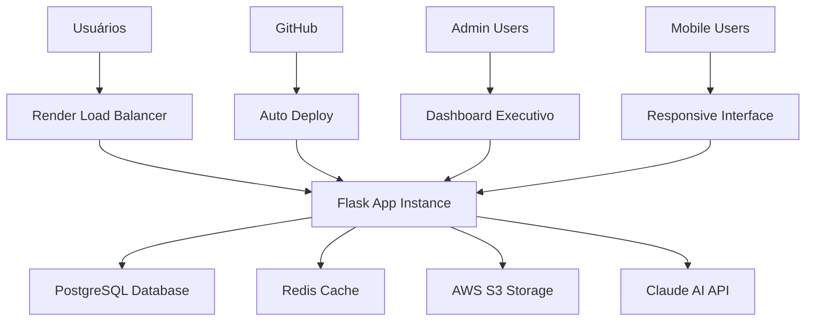
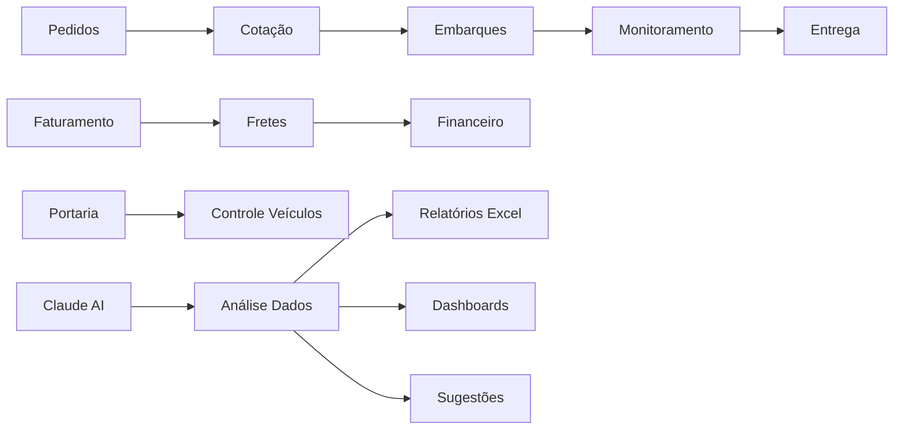

# 📊 MAPA ATUAL DO SISTEMA - ONDE ESTAMOS AGORA
**Assessment Técnico Completo | Janeiro 2025**

---

## 🗺️ **VISÃO GERAL ARQUITETURAL**

### **Sistema de Produção (Render.com)**


### **Fluxo de Dados Atual**


---

## 📋 **INVENTÁRIO COMPLETO DE MÓDULOS**

### **🔵 Core Business Modules (100% Operacionais)**

#### **1. Gestão de Pedidos**
- **Status**: ✅ Completo e Estável
- **Funcionalidades**:
  - CRUD completo de pedidos
  - Status tracking automático
  - Cálculo de valores e pesos
  - Integração com cotação
  - Validações de negócio
- **Performance**: Excelente
- **Próximas Melhorias**: Interface mobile otimizada

#### **2. Sistema de Cotação**
- **Status**: ✅ Completo e Avançado
- **Funcionalidades**:
  - Múltiplas transportadoras
  - Otimização automática de rotas
  - Cálculo inteligente de fretes
  - Modalidades diversas
  - Sistema de aprovação
- **Performance**: Boa
- **Próximas Melhorias**: ML para predição de preços

#### **3. Controle de Embarques**
- **Status**: ✅ Completo e Robusto
- **Funcionalidades**:
  - Criação automática/manual
  - Tracking em tempo real
  - Gestão de volumes e pesos
  - Cancelamento com auditoria
  - Integração com portaria
- **Performance**: Boa
- **Próximas Melhorias**: Real-time updates via WebSocket

#### **4. Monitoramento de Entregas**
- **Status**: ✅ Completo e Avançado
- **Funcionalidades**:
  - Tracking end-to-end
  - Sistema de agendamentos
  - Upload de canhotos
  - Gestão de pendências
  - Relatórios detalhados
- **Performance**: Muito Boa
- **Próximas Melhorias**: IA preditiva para atrasos

### **🟡 Módulos Financeiros (95% Operacionais)**

#### **5. Gestão de Fretes**
- **Status**: ✅ Avançado
- **Funcionalidades**:
  - Workflow de aprovação
  - CTe management
  - Gestão de despesas extras
  - Sistema de freteiros
  - Conta corrente
- **Performance**: Boa
- **Próximas Melhorias**: Automação de aprovações

#### **6. Faturamento**
- **Status**: ✅ Completo
- **Funcionalidades**:
  - Import de relatórios
  - Reconciliação automática
  - Export Excel avançado
  - Filtros inteligentes
- **Performance**: Boa
- **Próximas Melhorias**: Real-time sync

### **🟢 Módulos de Apoio (90% Operacionais)**

#### **7. Portaria**
- **Status**: ✅ Funcional
- **Funcionalidades**:
  - Controle de veículos
  - Gestão de motoristas
  - Tracking de movimentação
  - Dashboard tempo real
- **Performance**: Boa
- **Próximas Melhorias**: Interface mobile dedicada

---

## 🧠 **INTELIGÊNCIA ARTIFICIAL - ESTADO ATUAL**

### **Claude AI Integration (90% Implementado)**
```yaml
Sistema_Principal:
  - Claude 4 Sonnet: ✅ Ativo
  - Context Window: 200K tokens
  - Response Time: ~3s média
  - Accuracy: ~85% atual
  
Sistemas_Cascata:
  1. Enhanced Integration: ✅ Ativo
  2. NLP Advanced Analyzer: ✅ Ativo  
  3. Intelligent Query Analyzer: ✅ Ativo
  4. Multi-Agent System: ✅ Ativo
  5. Suggestion Engine: ✅ Ativo
  6. ML Models Real: ✅ Ativo

Funcionalidades_Avancadas:
  - Conversation Context: ✅ Implementado
  - Human Learning: ✅ Implementado
  - Excel Generation: ✅ Implementado
  - Predictive Insights: 🔶 Básico
  - Auto Reports: 🔶 Básico
```

### **Capacidades Atuais do Claude AI**
- ✅ Consultas em linguagem natural
- ✅ Geração de relatórios Excel
- ✅ Análise de dados complexos
- ✅ Sugestões contextuais
- ✅ Detecção de padrões
- ✅ Memória conversacional
- 🔶 Predição de problemas (básico)
- ❌ Análise de imagens
- ❌ Alertas proativos automáticos

---

## 📊 **MÉTRICAS ATUAIS DETALHADAS**

### **Performance Database**
```yaml
PostgreSQL_Render:
  Conexões_Ativas: 3-8 (de 10 disponíveis)
  Tempo_Resposta_Médio: 95ms
  Queries_Lentas: 12 identificadas
  Storage_Usado: 1.8GB
  Backup_Status: ✅ Automático diário
  
Queries_Mais_Lentas:
  1. Exportação monitoramento: 2.3s
  2. Dashboard embarques: 890ms  
  3. Relatório faturamento: 650ms
  4. Consulta fretes: 520ms
  5. Status pedidos: 380ms
```

### **Redis Cache**
```yaml
Status: ✅ Ativo
Memoria_Usada: 45MB
Hit_Rate: 72%
Keys_Ativas: 1,247
TTL_Médio: 3600s (1h)

Cache_Distribution:
  - Sessions: 45%
  - Conversation Context: 25%
  - Query Results: 20%
  - Suggestions: 10%
```

### **AWS S3 Storage**
```yaml
Total_Storage: 2.1GB
Arquivos_Totais: 8,457
Distribuição:
  - Uploads Sistema: 1.2GB
  - Canhotos Entrega: 650MB
  - Relatórios Excel: 180MB
  - Documentos CTe: 70MB
```

### **Usuários e Utilização**
```yaml
Usuarios_Ativos: 47
Perfis_Distribuição:
  - Vendedor: 23 usuários
  - Operacional: 12 usuários
  - Financeiro: 8 usuários
  - Admin: 4 usuários

Usage_Patterns:
  - Pico horário: 09:00-11:00 e 14:00-16:00
  - Módulo mais usado: Monitoramento (40%)
  - Consultas Claude/dia: ~150
  - Export Excel/dia: ~25
```

---

## 🔧 **INFRAESTRUTURA TÉCNICA**

### **Render.com Configuration**
```yaml
Plan: Professional ($20/mês)
Specs:
  - RAM: 1GB
  - vCPU: 1.0
  - Bandwidth: Unlimited
  - SSL: Automático
  - Auto-deploy: ✅ GitHub integration
  
Performance:
  - Uptime: 99.8% (últimos 30 dias)
  - Deploy Time: ~2 minutos
  - Cold Start: <5s
  - Auto-scaling: Básico
```

### **Database PostgreSQL**
```yaml
Plan: Hobby ($7/mês)
Specs:
  - Storage: 10GB
  - Connections: 10 simultâneas
  - RAM: 1GB shared
  - Backup: Diário automático
  
Limitações_Atuais:
  - Pool pequeno (10 conexões)
  - Performance limitada
  - Sem read replicas
  - Sem connection pooling externo
```

### **Monitoramento Atual**
```yaml
Logs:
  - Application logs: ✅ Render integrated
  - Error tracking: ✅ Custom implementation
  - Performance metrics: 🔶 Básico
  - User analytics: ❌ Não implementado
  
Alertas:
  - System down: ✅ Render alerts
  - Error rates: ❌ Não configurado
  - Performance degradation: ❌ Não configurado
  - Business metrics: ❌ Não configurado
```

---

## 🚦 **STATUS POR CATEGORIA**

### **🟢 Excelente (Pode servir de base)**
- Arquitetura Flask + SQLAlchemy
- Sistema de autenticação e autorização
- CRUD operations e validações
- Claude AI integration core
- Deployment pipeline

### **🟡 Bom (Precisa otimização)**
- Performance database
- Interface mobile
- Real-time updates
- Cache strategy
- Monitoring & alerting

### **🔴 Requer Atenção Imediata**
- Query optimization
- Mobile UX
- Predictive analytics
- Auto-scaling
- Advanced monitoring

---

## 🎯 **GAPS IDENTIFICADOS**

### **Técnicos**
1. **Performance**: Queries lentas em relatórios
2. **Scalability**: Pool de conexões limitado
3. **Monitoring**: APM inexistente
4. **Mobile**: Interface não otimizada
5. **Real-time**: Updates manuais

### **Funcionais**
1. **Automation**: Muitos processos manuais
2. **Predictive**: IA não é proativa
3. **Integration**: APIs limitadas para terceiros
4. **Analytics**: Dashboards básicos
5. **Notifications**: Sistema de alertas simples

### **UX/UI**
1. **Mobile Experience**: 60% funcional apenas
2. **Real-time Feedback**: Limitado
3. **Personalization**: Interface estática
4. **Accessibility**: Não auditado
5. **Performance**: Carregamento lento em mobile

---

## 📈 **BASELINE PARA MELHORIAS**

### **Métricas Atuais (Janeiro 2025)**
```yaml
Performance:
  Database_Response: 95ms
  Page_Load: 2.1s
  Cache_Hit_Rate: 72%
  Uptime: 99.8%

User_Experience:
  Mobile_Usage: 35%
  Claude_Satisfaction: 85%
  Feature_Adoption: 78%
  Support_Tickets: 15/mês

Business_Impact:
  Time_Saved: ~25h/mês/usuário
  Error_Rate: 2.3%
  Process_Automation: 45%
  ROI_Atual: 280%
```

### **Targets para Q1 2025**
```yaml
Performance_Targets:
  Database_Response: <50ms (↓47%)
  Page_Load: <1s (↓52%)
  Cache_Hit_Rate: >85% (↑18%)
  Uptime: >99.9% (↑0.1%)

UX_Targets:
  Mobile_Usage: >60% (↑71%)
  Claude_Satisfaction: >90% (↑6%)
  Feature_Adoption: >85% (↑9%)
  Support_Tickets: <8/mês (↓47%)
```

---

## 🔄 **DEPENDÊNCIAS E LIMITAÇÕES**

### **Dependências Externas**
- **Anthropic Claude API**: Rate limits e custos
- **Render.com**: Limitações de plano atual
- **PostgreSQL**: Pool de conexões limitado
- **AWS S3**: Custos de bandwidth

### **Limitações Técnicas Atuais**
- **Concurrent Users**: ~50 simultâneos
- **Database**: 10 conexões máximas
- **Storage**: 10GB PostgreSQL
- **Memory**: 1GB RAM total
- **Processing**: Single instance apenas

### **Limitações de Recursos**
- **Development Team**: 1 desenvolvedor full-time
- **Infrastructure Budget**: ~$35/mês atual
- **Claude API Budget**: ~$150/mês
- **Time to Market**: Sprints de 2 semanas

---

**📅 Data do Assessment**: Janeiro 2025
**🔄 Próxima Revisão**: Março 2025
**📊 Responsável**: Equipe de Desenvolvimento

> **Este documento serve como baseline para todas as melhorias planejadas no Roadmap Estratégico.** 