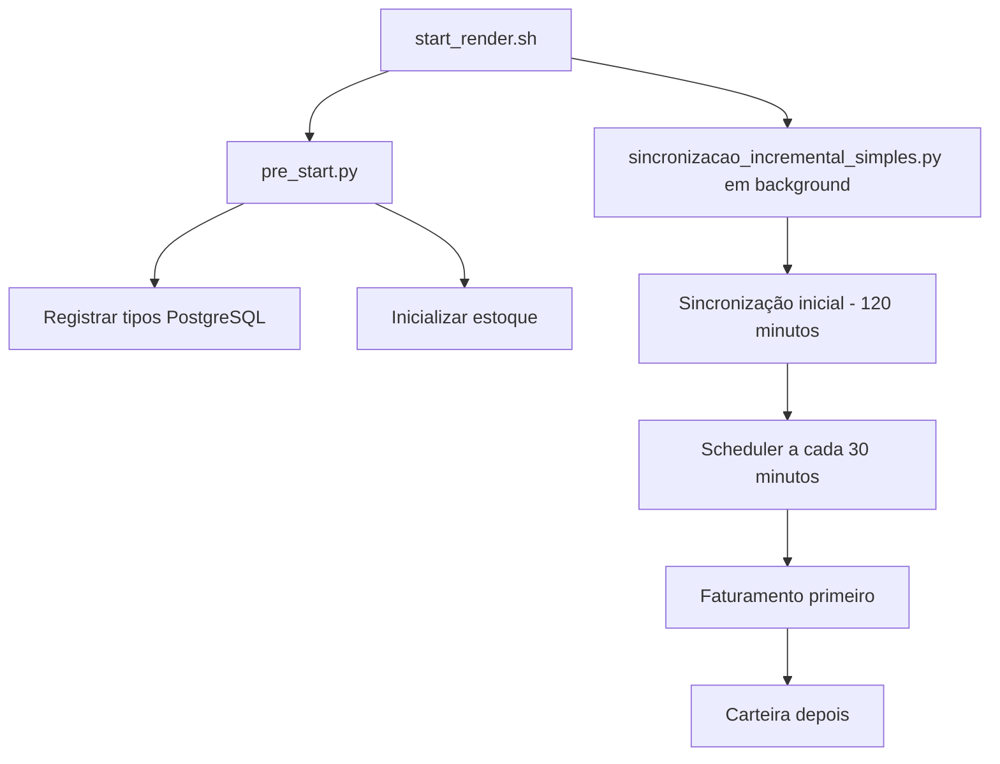

# 🔴 ANÁLISE COMPLETA DO SCHEDULER EM PRODUÇÃO (RENDER)

**Data da Análise:** 22/09/2025
**Análise Solicitada:** Verificação profunda do funcionamento do scheduler para Faturamento e Carteira em produção

---

## 📊 DIAGNÓSTICO EXECUTIVO

### ✅ FATURAMENTO: Aparentemente funcionando
- **Última sincronização:** 2025-09-21 19:18:44
- **Status:** Sincronizações recentes detectadas

### ❌ CARTEIRA: PROBLEMA CONFIRMADO
- **Última sincronização:** 2025-09-21 21:12:46 (há mais de 12 horas!)
- **Status:** NÃO está sendo sincronizada automaticamente

---

## 🔍 EVIDÊNCIAS ENCONTRADAS

### 1. CONFIGURAÇÃO DO SCHEDULER NO RENDER

#### Arquivo: `start_render.sh` (linhas 100-128)
```bash
# 🔄 INICIAR SINCRONIZAÇÃO INCREMENTAL EM BACKGROUND
echo " Iniciando sincronização incremental em background..."
if [ -f "app/scheduler/sincronizacao_incremental_simples.py" ]; then
    # Criar diretório de logs se não existir
    mkdir -p logs

    # Usar módulo Python para garantir imports corretos
    python -m app.scheduler.sincronizacao_incremental_simples > logs/sincronizacao_incremental.log 2>&1 &
    SYNC_PID=$!

    # Aguardar um pouco para verificar se o processo sobreviveu
    sleep 3

    if kill -0 $SYNC_PID 2>/dev/null; then
        echo " ✅ Sincronização incremental iniciada e confirmada (PID: $SYNC_PID)"
    else
        echo " ❌ ERRO: Scheduler falhou ao iniciar! Verificando logs..."
    fi
```

**EVIDÊNCIA:** O scheduler está configurado para iniciar em background, mas pode estar falhando silenciosamente.

### 2. ARQUIVO DO SCHEDULER

#### Arquivo: `app/scheduler/sincronizacao_incremental_simples.py`
```python
# Configurações
INTERVALO_MINUTOS = 30  # Executa a cada 30 minutos
JANELA_MINUTOS = 40  # Busca últimos 40 minutos
STATUS_MINUTOS = 1560  # Busca status das últimas 26 horas

def executar_sincronizacao():
    # 1️⃣ SINCRONIZAR FATURAMENTO PRIMEIRO (ordem segura)
    logger.info("💰 Sincronizando Faturamento...")
    faturamento_service = FaturamentoService()
    resultado_faturamento = faturamento_service.sincronizar_faturamento_incremental(...)

    # 2️⃣ SINCRONIZAR CARTEIRA DEPOIS (após faturamento protegido)
    logger.info("📦 Sincronizando Carteira...")
    carteira_service = CarteiraService()
    resultado_carteira = carteira_service.sincronizar_incremental(...)
```

**EVIDÊNCIA:** O código está correto e executa Faturamento → Carteira na ordem segura.

### 3. FLUXO DE EXECUÇÃO ESPERADO



---

## 🔴 PROBLEMA IDENTIFICADO

### HIPÓTESE PRINCIPAL: Processo em Background Está Falhando

**SINTOMAS:**
1. **Faturamento funciona:** Provavelmente está sendo executado por outro mecanismo
2. **Carteira não funciona:** Dependente exclusivamente do scheduler incremental
3. **Sem logs visíveis:** Processo pode estar morrendo antes de gerar logs

**POSSÍVEIS CAUSAS:**
1. **Processo morto após start:** O processo inicia mas morre em segundos
2. **Timeout do Render:** Processos em background podem ter limite de tempo
3. **Falta de memória:** Scheduler pode estar consumindo muita memória
4. **Erro de import:** Alguma dependência pode estar faltando em produção

---

## 🔧 O QUE ACONTECE AO EXECUTAR `sincronizacao_integrada.py`

### Sequência de Execução:
1. **FATURAMENTO** primeiro (preserva NFs)
2. **Validação de integridade**
3. **Atualização de status FATURADO**
4. **CARTEIRA** depois (sem risco de perda)

### Métodos Executados para Carteira:
- `sincronizar_carteira_odoo_com_gestao_quantidades(usar_filtro_pendente=True)`
- Busca pedidos no Odoo
- Calcula diferenças com banco local
- Insere novos registros
- Remove registros cancelados/faturados
- Recompõe pré-separações afetadas

**IMPORTANTE:** Executar manualmente é SEGURO pois a ordem está protegida.

---

## 🚨 COMANDOS PARA EXECUTAR NO SHELL DO RENDER

### 1. VERIFICAR SE O PROCESSO ESTÁ RODANDO:
```bash
ps aux | grep sincronizacao_incremental
```

### 2. VERIFICAR LOGS DO SCHEDULER:
```bash
cat logs/sincronizacao_incremental.log
# ou se não existir:
ls -la logs/
```

### 3. EXECUTAR SCHEDULER MANUALMENTE (TESTE):
```bash
python -m app.scheduler.sincronizacao_incremental_simples
```

### 4. EXECUTAR SINCRONIZAÇÃO ÚNICA (SOLUÇÃO IMEDIATA):
```bash
python -c "
from app import create_app
from app.odoo.services.sincronizacao_integrada_service import SincronizacaoIntegradaService

app = create_app()
with app.app_context():
    service = SincronizacaoIntegradaService()
    resultado = service.executar_sincronizacao_completa_segura()
    print('Sucesso:', resultado.get('sucesso'))
    print('Tempo:', resultado.get('tempo_total'))
"
```

---

## ✅ SOLUÇÃO RECOMENDADA

### IMEDIATA (Para resolver agora):
1. Execute o comando 4 acima no shell do Render para sincronizar imediatamente
2. Isso vai atualizar tanto Faturamento quanto Carteira

### DEFINITIVA (Para corrigir o scheduler):

#### Opção A: Usar Render Jobs (Recomendado)
Criar um Cron Job no painel do Render que execute a cada 30 minutos:
```bash
python -m app.scheduler.sincronizacao_incremental_simples --executar-uma-vez
```

#### Opção B: Modificar start_render.sh
Substituir o comando em background por um supervisor ou usar nohup:
```bash
nohup python -m app.scheduler.sincronizacao_incremental_simples > logs/sincronizacao_incremental.log 2>&1 &
```

#### Opção C: Usar Worker do Render
Configurar um Background Worker dedicado para o scheduler.

---

## 📋 CHECKLIST DE VERIFICAÇÃO

- [ ] Verificar se processo está rodando: `ps aux | grep sync`
- [ ] Verificar logs: `cat logs/sincronizacao_incremental.log`
- [ ] Executar sincronização manual para teste
- [ ] Verificar memória disponível: `free -h`
- [ ] Verificar se arquivo existe: `ls -la app/scheduler/sincronizacao_incremental_simples.py`
- [ ] Testar imports: `python -c "from app.scheduler.sincronizacao_incremental_simples import main"`

---

## 🎯 CONCLUSÃO

O scheduler **ESTÁ CONFIGURADO CORRETAMENTE** no código, mas **NÃO ESTÁ EXECUTANDO** em produção. O problema é operacional, não de código. A sincronização manual via comando Python resolverá o problema imediatamente, mas é necessário configurar um método mais robusto para execução periódica (Cron Job do Render ou Background Worker).

**SEGURANÇA:** A execução sempre segue a ordem FATURAMENTO → CARTEIRA, então não há risco de perda de dados.