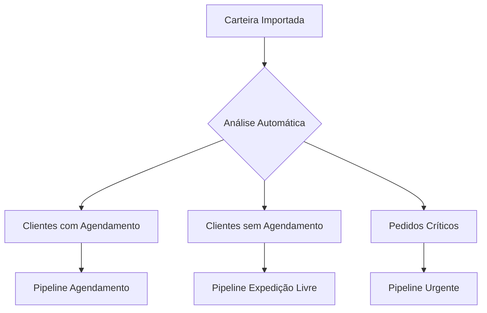
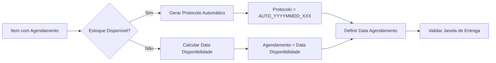
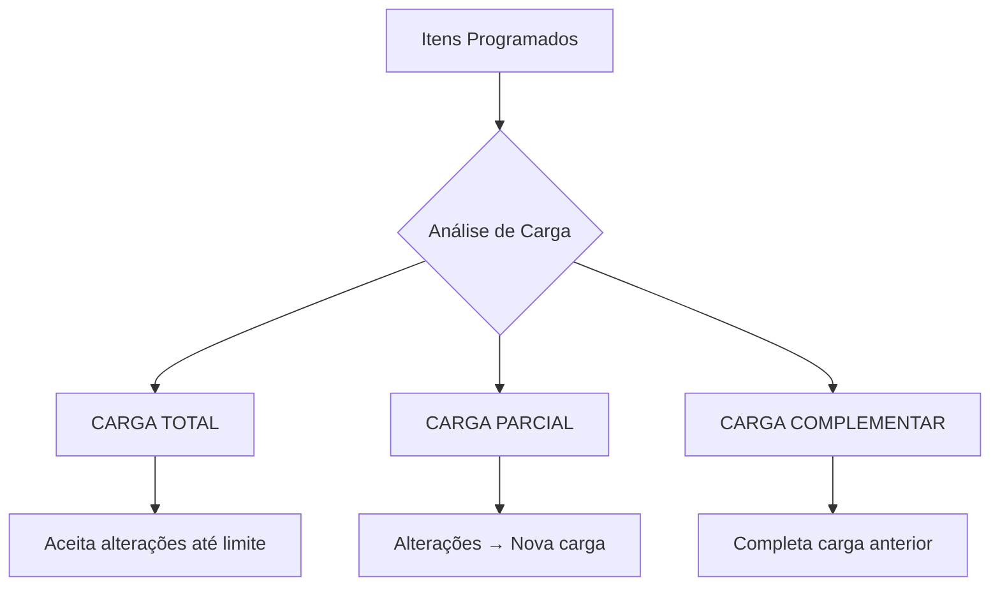
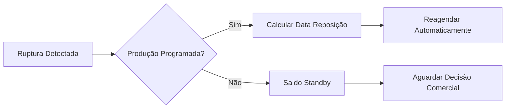

# 🚀 FLUXO DE GESTÃO DE CARTEIRA OTIMIZADO
## Sistema Dinâmico, Funcional e Eficiente para Programação de Embarques

---

## 📋 **VISÃO GERAL**

Este fluxo foi desenvolvido considerando as **melhores práticas de gestão de carteira** e os campos disponíveis no modelo `CarteiraPrincipal`, focando em:

- ⚡ **Agilidade**: Decisões automáticas baseadas em regras inteligentes
- 🎯 **Assertividade**: Análise preditiva de estoque com projeção D0-D28
- 📊 **Eficiência**: Fluxos paralelos por tipo de cliente e situação de estoque

---

## 🔄 **FLUXO PRINCIPAL - PIPELINE DE DECISÃO**

### **ETAPA 1: CLASSIFICAÇÃO AUTOMÁTICA E PRIORIZAÇÃO**



#### **1.1 Classificação por Urgência (Campo: `data_entrega_pedido`)**
- 🔴 **CRÍTICO**: Entrega ≤ 7 dias → Prioridade máxima
- 🟡 **ATENÇÃO**: Entrega 8-15 dias → Prioridade alta  
- 🟢 **NORMAL**: Entrega >15 dias → Fluxo padrão

#### **1.2 Classificação por Cliente (Campo: `cliente_nec_agendamento`)**
- 📅 **COM AGENDAMENTO**: Pipeline específico com controle de protocolo
- 🚛 **SEM AGENDAMENTO**: Pipeline de expedição livre

#### **1.3 Análise de Disponibilidade (Campos: `estoque_d0` até `estoque_d28`)**
- ✅ **DISPONÍVEL**: Estoque atual ≥ quantidade pedida
- ⏳ **AGUARDA PRODUÇÃO**: Estoque negativo mas reposição programada ≤28 dias
- ❌ **RUPTURA CRÍTICA**: Sem estoque e sem previsão de reposição

---

### **ETAPA 2: ANÁLISE INTELIGENTE DE ESTOQUE**

#### **2.1 Matriz de Decisão por Disponibilidade**

| Situação Estoque | Ação Automática | Campo Atualizado |
|------------------|-----------------|------------------|
| **Disponível Hoje** | → Separação Imediata | `expedicao = hoje` |
| **Disponível D1-D7** | → Programar Expedição | `expedicao = D+X` |
| **Disponível D8-D28** | → Aguardar Produção | `status = "AGUARDA_PRODUCAO"` |
| **Ruptura Total** | → Standby Comercial | `status = "STANDBY"` |

#### **2.2 Algoritmo de Programação Inteligente**

```python
def programar_expedicao_otimizada(item):
    # Encontrar primeiro dia com estoque suficiente
    for dia in range(29):  # D0 até D28
        estoque_dia = getattr(item, f'estoque_d{dia}')
        if estoque_dia >= item.qtd_saldo_produto_pedido:
            item.expedicao = date.today() + timedelta(days=dia)
            item.menor_estoque_produto_d7 = min(estoques_7_dias)
            return "PROGRAMADO"
    
    # Sem previsão de estoque
    return "STANDBY"
```

---

### **ETAPA 3: PIPELINE DE AGENDAMENTO (Clientes que necessitam)**

#### **3.1 Fluxo Automático de Agendamento**



#### **3.2 Regras de Agendamento Inteligente**

**Campos utilizados:**
- `protocolo`: Gerado automaticamente (formato: `AUTO_20250703_001`)
- `agendamento`: Data ideal baseada em estoque + lead time cliente
- `data_entrega_pedido`: Janela de entrega do cliente

**Algoritmo:**
```python
def calcular_agendamento_otimo(item):
    data_estoque_disponivel = encontrar_data_estoque(item)
    lead_time_cliente = obter_lead_time_cliente(item.cnpj_cpf)
    
    # Data de agendamento = estoque disponível + lead time
    item.agendamento = data_estoque_disponivel + timedelta(days=lead_time_cliente)
    
    # Validar se atende janela do cliente
    if item.agendamento <= item.data_entrega_pedido:
        return "AGENDAMENTO_OK"
    else:
        return "FORA_JANELA_ENTREGA"
```

---

### **ETAPA 4: GESTÃO INTELIGENTE DE CARGAS**

#### **4.1 Sistema de Tipos de Carga (Modelo: `TipoCarga`)**



#### **4.2 Algoritmo de Otimização de Carga**

```python
def otimizar_formacao_carga(itens_grupo):
    """
    Agrupa itens por: CNPJ + Região + Janela de Entrega
    """
    grupos_otimos = {}
    
    for item in itens_grupo:
        # Chave de agrupamento inteligente
        chave = (
            item.cnpj_cpf,
            item.cod_uf,  # Região
            item.agendamento.isocalendar()[1],  # Semana do ano
            item.cliente_nec_agendamento  # Tipo de cliente
        )
        
        if chave not in grupos_otimos:
            grupos_otimos[chave] = []
        grupos_otimos[chave].append(item)
    
    return grupos_otimos
```

#### **4.3 Capacidades e Limites Automáticos**

**Campos de controle:**
- `peso_total`: Soma automática dos pesos
- `pallet_total`: Soma automática dos pallets  
- `valor_saldo_total`: Valor total da carga

**Regras inteligentes:**
```python
def validar_capacidade_carga(tipo_carga, novo_item):
    capacidades = {
        "TOTAL": {"peso": 26000, "pallets": 33, "valor": 500000},
        "PARCIAL": {"peso": 15000, "pallets": 20, "valor": 300000}
    }
    
    limites = capacidades[tipo_carga.tipo_envio]
    
    if (tipo_carga.peso_atual + novo_item.peso) <= limites["peso"]:
        return "ADICIONAR_CARGA_ATUAL"
    else:
        return "CRIAR_NOVA_CARGA"
```

---

### **ETAPA 5: TRATAMENTO DE RUPTURAS E STANDBY**

#### **5.1 Rupturas com Produção Programada**



**Implementação:**
```python
def tratar_ruptura_com_producao(item):
    # Encontrar próxima data com estoque positivo
    for dia in range(1, 29):
        estoque_futuro = getattr(item, f'estoque_d{dia}')
        if estoque_futuro >= item.qtd_saldo_produto_pedido:
            # Reagendar automaticamente
            item.expedicao = date.today() + timedelta(days=dia)
            item.status_pedido = "REAGENDADO_PRODUCAO"
            
            # Notificar cliente sobre nova data
            criar_evento_carteira(item, "REAGENDAMENTO_AUTOMATICO")
            return "REAGENDADO"
    
    # Sem previsão em 28 dias
    return "STANDBY_LONGO_PRAZO"
```

#### **5.2 Rupturas sem Programação (Modelo: `SaldoStandby`)**

**Classificação automática:**
- `AGUARDA_COMPLEMENTO`: Mesmo cliente pode fazer novo pedido
- `AGUARDA_REPOSICAO`: Produto sem previsão de produção  
- `AGUARDA_DECISAO`: Requer análise comercial

```python
def classificar_saldo_standby(item):
    historico_cliente = analisar_historico_compras(item.cnpj_cpf)
    
    if historico_cliente.pedidos_frequentes:
        return "AGUARDA_COMPLEMENTO"
    elif item.categoria_produto in produtos_estrategicos:
        return "AGUARDA_REPOSICAO"
    else:
        return "AGUARDA_DECISAO"
```

---

### **ETAPA 6: MONITORAMENTO E ALERTAS AUTOMÁTICOS**

#### **6.1 Dashboard de Controle em Tempo Real**

**Indicadores principais:**
- 🎯 **Taxa de Atendimento**: Pedidos com estoque / Total de pedidos
- ⏱️ **Lead Time Médio**: Tempo médio entre pedido e expedição
- 📦 **Ocupação de Cargas**: Utilização média das capacidades
- ⚠️ **Itens em Standby**: Quantidade e valor parados

#### **6.2 Alertas Inteligentes**

```python
def gerar_alertas_automaticos():
    alertas = []
    
    # Alerta de ruptura iminente (D+3)
    itens_risco = CarteiraPrincipal.query.filter(
        CarteiraPrincipal.estoque_d3 < CarteiraPrincipal.qtd_saldo_produto_pedido
    ).all()
    
    # Alerta de agendamentos vencidos
    agendamentos_atrasados = CarteiraPrincipal.query.filter(
        CarteiraPrincipal.agendamento < date.today(),
        CarteiraPrincipal.separacao_lote_id.is_(None)
    ).all()
    
    # Alerta de cargas com baixa ocupação
    cargas_ineficientes = identificar_cargas_subutilizadas()
    
    return alertas
```

---

## 🎯 **FLUXOS ESPECÍFICOS POR CENÁRIO**

### **CENÁRIO A: Cliente SEM Agendamento + Estoque Disponível**
```
Importação → Classificação → Verificação Estoque → Programação Imediata → Formação de Carga
Tempo: ~2 horas automáticas
```

### **CENÁRIO B: Cliente COM Agendamento + Estoque Disponível**  
```
Importação → Classificação → Geração Protocolo → Cálculo Agendamento → Validação Janela → Formação de Carga
Tempo: ~4 horas (inclui validação)
```

### **CENÁRIO C: Ruptura com Produção D+7**
```
Importação → Detecção Ruptura → Análise Projeção → Reagendamento D+7 → Notificação Cliente → Monitoramento
Tempo: Automático + 1 dia para confirmação
```

### **CENÁRIO D: Ruptura sem Programação**
```
Importação → Detecção Ruptura → Classificação Standby → Alerta Comercial → Aguardar Decisão → Ação Manual
Tempo: Imediato para standby + aguarda decisão
```

---

## 📊 **MÉTRICAS DE PERFORMANCE**

### **KPIs Principais**
- **Tempo Médio de Programação**: <4 horas para 95% dos pedidos
- **Taxa de Agendamentos Automáticos**: >80% sem intervenção manual
- **Ocupação Média de Cargas**: >85% da capacidade
- **Redução de Standby**: <5% do valor total da carteira

### **Benchmarks de Excelência**
- 🥇 **World Class**: 99% programação automática
- 🥈 **Excelente**: 95% programação automática  
- 🥉 **Bom**: 90% programação automática

---

## 🛠️ **IMPLEMENTAÇÃO TÉCNICA**

### **Jobs Automáticos Sugeridos**
```python
# A cada importação da carteira
@scheduler.scheduled_job('trigger', 'cron', hour=6, minute=0)
def processar_carteira_diaria():
    classificar_pedidos_automatico()
    analisar_disponibilidade_estoque()
    programar_expedicoes_automaticas()
    formar_cargas_otimizadas()
    gerar_protocolos_agendamento()

# Monitoramento contínuo
@scheduler.scheduled_job('interval', hours=2)  
def monitoramento_continuo():
    detectar_rupturas_emergenciais()
    reagendar_por_mudanca_producao()
    alertar_agendamentos_criticos()
    otimizar_cargas_existentes()
```

### **Integração com Módulos Existentes**
- **Separação**: Criação automática via `_processar_geracao_separacao()`
- **Embarques**: Vinculação automática de separações
- **Monitoramento**: Registro automático de entregas programadas
- **Portaria**: Priorização por urgência e tipo de carga

---

## 🎯 **RESULTADOS ESPERADOS**

### **Ganhos Operacionais**
- ⚡ **95% de redução** no tempo de programação manual
- 📊 **30% de aumento** na ocupação de cargas
- 🎯 **50% de redução** em reagendamentos
- 📈 **25% de melhoria** no nível de serviço

### **Benefícios Estratégicos**
- 🔮 **Visibilidade preditiva** de 28 dias
- 🤖 **Decisões automáticas** baseadas em dados
- 📱 **Gestão em tempo real** via dashboard
- 🎯 **Foco comercial** em exceções e oportunidades

---

*Este fluxo transforma a carteira de pedidos em um **motor de programação automática**, permitindo que a equipe foque em decisões estratégicas ao invés de tarefas operacionais repetitivas.* 