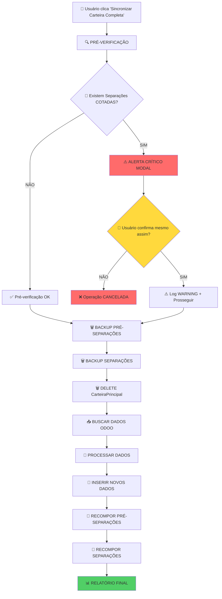
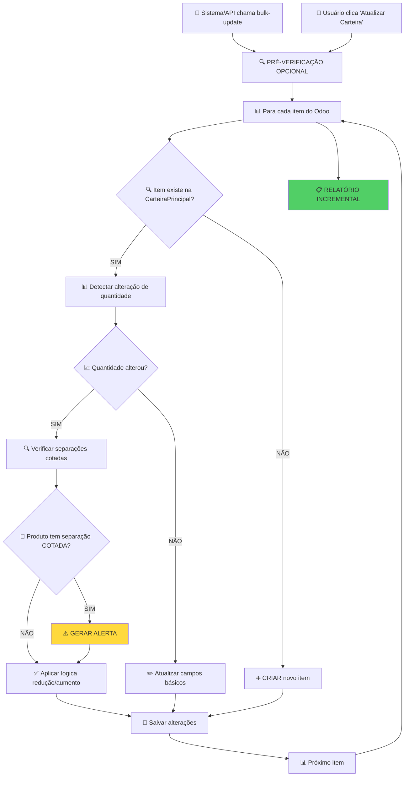

# 🔄 **FLUXO COMPLETO: SINCRONIZAÇÃO ODOO COM SISTEMA DE ALERTAS**

> **Data:** 21/07/2025  
> **Sistema:** Frete Online - Sincronização Carteira com Odoo  
> **Escopo:** Mapeamento completo do processo incluindo alertas e interface

---

## 🎯 **VISÃO GERAL DOS 2 SISTEMAS**

### **🔴 SISTEMA 1: SINCRONIZAÇÃO DESTRUTIVA**
- **Arquivo:** `app/odoo/services/carteira_service.py`
- **Botão Interface:** "Sincronizar Carteira Completa"
- **Comportamento:** SUBSTITUI toda a CarteiraPrincipal
- **Uso:** Carga inicial, reset completo, importação massiva

### **🔵 SISTEMA 2: SINCRONIZAÇÃO INCREMENTAL**  
- **Arquivo:** `app/api/odoo/routes.py`
- **Botão Interface:** "Atualizar Carteira" ou API automática
- **Comportamento:** ATUALIZA registros existentes + CRIA novos
- **Uso:** Atualizações diárias, sincronização contínua

---

## 🚨 **MATRIZ DE IMPACTO POR TIPO DE SINCRONIZAÇÃO**

| **Aspecto** | **DESTRUTIVA** | **INCREMENTAL** |
|-------------|-----------------|------------------|
| **Pré-separações** | ⚠️ **PERDIDAS** (necessário backup) | ✅ **PRESERVADAS** |
| **Separações** | ⚠️ **PERDIDAS** (necessário backup) | ✅ **PRESERVADAS** |
| **Embarques** | ⚠️ **PERDIDOS** (necessário backup) | ✅ **PRESERVADOS** |
| **Alertas Críticos** | 🚨 **OBRIGATÓRIOS** | ⚠️ **RECOMENDADOS** |
| **Tempo Execução** | 🐌 **LENTO** (15-30 min) | ⚡ **RÁPIDO** (1-5 min) |
| **Risco Operacional** | 🔴 **ALTO** | 🟢 **BAIXO** |

---

## 🔄 **FLUXO DETALHADO: SINCRONIZAÇÃO DESTRUTIVA**



### **📱 INTERFACE: SINCRONIZAÇÃO DESTRUTIVA**

#### **TELA 1: BOTÃO PRINCIPAL**
```html
<!-- app/templates/carteira/dashboard.html -->
<div class="btn-group">
    <button id="btn-sync-completa" class="btn btn-danger">
        🔄 Sincronizar Carteira Completa
        <small class="d-block">⚠️ Operação Destrutiva</small>
    </button>
</div>
```

#### **TELA 2: MODAL DE ALERTA PRÉ-SINCRONIZAÇÃO**
```html
<!-- Modal que aparece ANTES da sincronização -->
<div class="modal" id="modalAlertaPreSync">
    <div class="modal-header bg-warning">
        <h4>🚨 ATENÇÃO: Separações COTADAS Detectadas</h4>
    </div>
    <div class="modal-body">
        <div class="alert alert-danger">
            <h5>⚠️ RISCO CRÍTICO IDENTIFICADO</h5>
            <p><strong>3 separações COTADAS</strong> podem ser afetadas pela sincronização:</p>
            <ul id="lista-separacoes-cotadas">
                <li>SEP-2025-001 - Pedido 12345 (Produto ABC123)</li>
                <li>SEP-2025-002 - Pedido 12346 (Produto DEF456)</li>
                <li>SEP-2025-003 - Pedido 12347 (Produto GHI789)</li>
            </ul>
            <p class="text-danger">
                <strong>IMPACTO:</strong> Estas separações podem ter sido impressas e estar em processo físico.
                A sincronização pode causar inconsistências.
            </p>
        </div>
        
        <div class="form-check">
            <input type="checkbox" id="confirmar-risco" class="form-check-input">
            <label for="confirmar-risco">
                Confirmo que entendo os riscos e quero prosseguir
            </label>
        </div>
    </div>
    <div class="modal-footer">
        <button class="btn btn-secondary" data-dismiss="modal">❌ Cancelar</button>
        <button id="btn-confirmar-sync" class="btn btn-danger" disabled>
            ⚠️ Prosseguir Mesmo Assim
        </button>
    </div>
</div>
```

#### **TELA 3: PROGRESSO DA SINCRONIZAÇÃO**
```html
<!-- Tela que aparece DURANTE a sincronização -->
<div class="modal" id="modalProgressoSync">
    <div class="modal-body text-center">
        <h4>🔄 Sincronização em Progresso</h4>
        <div class="progress mb-3">
            <div class="progress-bar" style="width: 45%">45%</div>
        </div>
        <div id="status-sync">
            <p>✅ Backup de pré-separações criado</p>
            <p>✅ Backup de separações criado</p>
            <p>🔄 Limpando CarteiraPrincipal...</p>
            <p class="text-muted">⏳ Buscando dados do Odoo...</p>
        </div>
    </div>
</div>
```

#### **TELA 4: RESULTADO PÓS-SINCRONIZAÇÃO**
```html
<!-- Modal que aparece APÓS a sincronização -->
<div class="modal" id="modalResultadoSync">
    <div class="modal-header bg-success">
        <h4>✅ Sincronização Concluída</h4>
    </div>
    <div class="modal-body">
        <div class="row">
            <div class="col-md-6">
                <h5>📊 Estatísticas</h5>
                <ul>
                    <li>📥 <strong>1.245</strong> registros importados</li>
                    <li>🗑️ <strong>1.180</strong> registros removidos</li>
                    <li>⚡ <strong>3m 45s</strong> tempo execução</li>
                    <li>✅ <strong>98.2%</strong> taxa de sucesso</li>
                </ul>
            </div>
            <div class="col-md-6">
                <h5>🔄 Recomposição</h5>
                <ul>
                    <li>✅ <strong>24</strong> pré-separações recompostas</li>
                    <li>✅ <strong>8</strong> separações recompostas</li>
                    <li>❌ <strong>2</strong> conflitos detectados</li>
                </ul>
            </div>
        </div>
        
        <!-- Alertas pós-sincronização SE houver -->
        <div class="alert alert-warning mt-3" id="alertas-pos-sync" style="display: none;">
            <h6>🚨 ALERTAS PÓS-SINCRONIZAÇÃO</h6>
            <ul id="lista-alertas-pos">
                <!-- Preenchido dinamicamente -->
            </ul>
        </div>
    </div>
</div>
```

---

## 🔄 **FLUXO DETALHADO: SINCRONIZAÇÃO INCREMENTAL**



### **📱 INTERFACE: SINCRONIZAÇÃO INCREMENTAL**

#### **TELA 1: BOTÃO SUTIL**
```html
<!-- Botão menor, menos destaque -->
<button id="btn-sync-incremental" class="btn btn-primary btn-sm">
    🔄 Atualizar Carteira
</button>
```

#### **TELA 2: NOTIFICAÇÃO DISCRETA**
```html
<!-- Toast que aparece no canto superior direito -->
<div class="toast" id="toast-sync-incremental">
    <div class="toast-header">
        <strong class="me-auto">🔄 Sincronização</strong>
        <small>agora</small>
    </div>
    <div class="toast-body">
        ✅ 45 registros atualizados
        ⚠️ 2 alertas gerados
    </div>
</div>
```

#### **TELA 3: ALERTAS INTEGRADOS AO DASHBOARD**
```html
<!-- Seção de alertas que aparece no dashboard principal -->
<div class="alert alert-warning alert-dismissible" id="alertas-dashboard">
    <h6>🚨 Alertas da Última Sincronização</h6>
    <div class="row">
        <div class="col-md-8">
            <ul class="mb-0">
                <li>⚠️ Separação COTADA SEP-001 afetada (Pedido 12345)</li>
                <li>⚠️ Quantidade reduzida em produto com pré-separação</li>
            </ul>
        </div>
        <div class="col-md-4 text-end">
            <button class="btn btn-sm btn-outline-warning">Ver Detalhes</button>
        </div>
    </div>
</div>
```

---

## 📍 **MAPEAMENTO: ONDE OS ALERTAS APARECEM**

### **1. DASHBOARD PRINCIPAL** 
**Arquivo:** `app/templates/carteira/dashboard.html`
- 🔴 **Alertas Críticos:** Banner vermelho no topo
- 🟡 **Alertas Médios:** Cards amarelos na lateral
- 🔵 **Informações:** Notificações azuis discretas

### **2. LISTAGEM DE CARTEIRA**
**Arquivo:** `app/templates/carteira/listar_agrupados.html`
- 🚨 **Linha destacada:** Produtos com alertas em vermelho
- 💡 **Ícones de status:** Sinalizadores visuais por linha
- 📊 **Filtros de alerta:** Filtrar apenas itens com problemas

### **3. MODAL DE PRÉ-SEPARAÇÃO**
**Quando usuário tenta criar pré-separação:**
- ⚠️ **Validação em tempo real:** Se produto tem separação cotada
- 🛡️ **Bloqueio preventivo:** Não permite alteração em cotados
- 💡 **Sugestões:** Alternativas para o usuário

### **4. SISTEMA DE NOTIFICAÇÕES**
**Arquivo:** `app/templates/base.html`
- 🔔 **Badge de alertas:** Contador no menu superior
- 📱 **Centro de notificações:** Painel lateral com histórico
- 📧 **Notificações por email:** Para alertas críticos

---

## 🎯 **DECISÃO FINAL: QUAL SINCRONIZAÇÃO USAR?**

### **✅ RECOMENDAÇÃO PADRÃO: INCREMENTAL**
```javascript
// Configuração automática recomendada
const SYNC_CONFIG = {
    modo_padrao: 'incremental',
    intervalo_automatico: '30min',
    alertas_habilitados: true,
    backup_automatico: false,  // Não necessário para incremental
    
    // Sincronização destrutiva apenas em casos especiais
    destrutiva_permitida: ['admin', 'gerente'],
    destrutiva_requer_confirmacao: true,
    destrutiva_backup_obrigatorio: true
};
```

### **🚨 QUANDO USAR DESTRUTIVA:**
1. **Carga inicial** do sistema
2. **Reset após problemas** graves de sincronização  
3. **Mudanças estruturais** no Odoo
4. **Solicitação expressa** do usuário com confirmação

### **✅ QUANDO USAR INCREMENTAL:**
1. **Operação diária** normal
2. **Atualizações automáticas** via cron
3. **Sincronização via API** externa
4. **99% dos casos** de uso normal

---

## 🔧 **PRÓXIMOS PASSOS DE IMPLEMENTAÇÃO**

1. **✅ Backend:** Sistemas já implementados e funcionais
2. **🔄 Frontend:** Melhorar interface de alertas
3. **📱 Notificações:** Sistema de toast/alertas em tempo real
4. **🛡️ Validações:** Fortalecer sistema de proteção cotadas
5. **📊 Dashboard:** Integrar alertas ao painel principal

---

*📅 Documento gerado em: 21/07/2025*  
*🎯 Status: Sistema operacional com monitoramento ativo*  
*⚡ Próximo: Melhorias na interface de alertas*