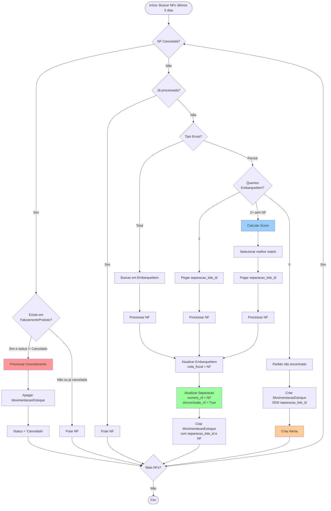
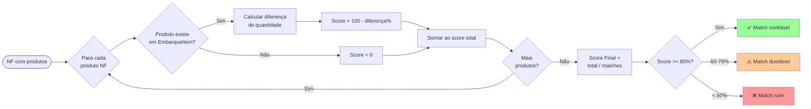
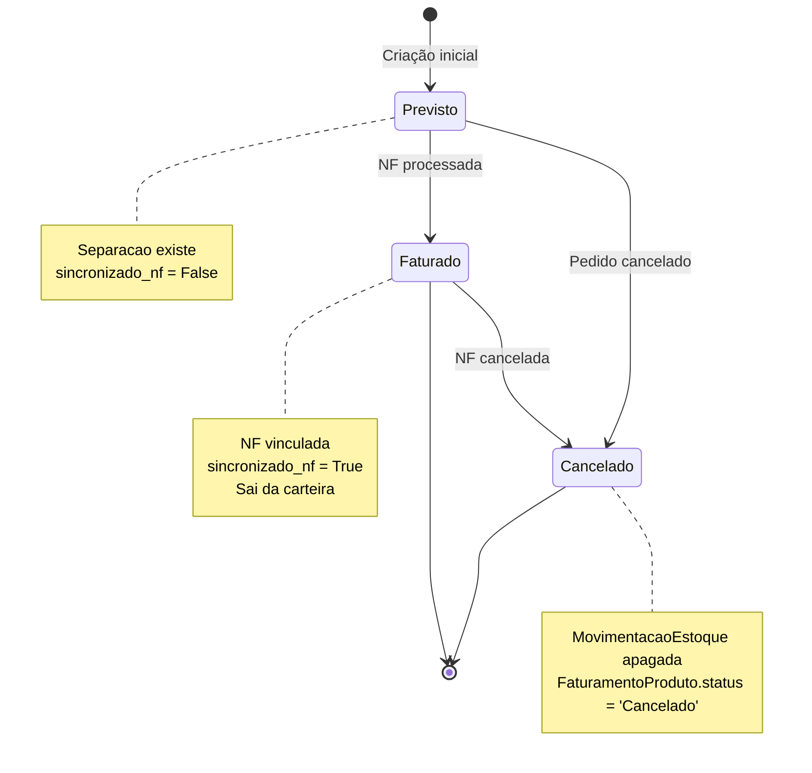
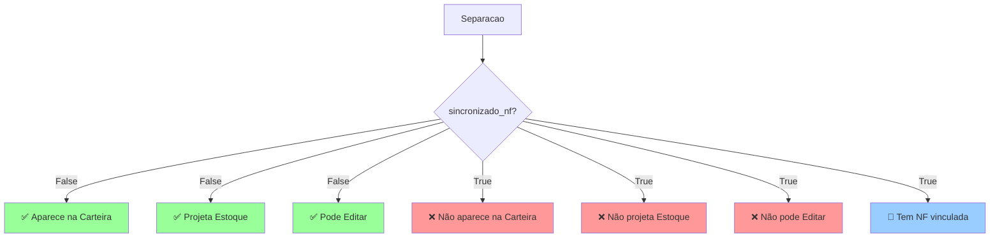
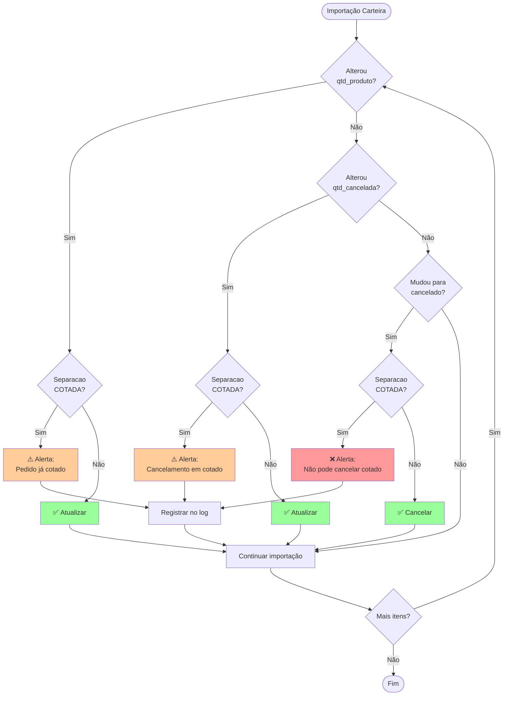

# 📊 FLUXOGRAMA: Sincronização de Notas Fiscais

## Fluxo Principal de Processamento

## Algoritmo de Score para Separações Parciais

## Estados de MovimentacaoEstoque

## Impacto do sincronizado_nf

## Validações na Importação da Carteira

---

**Visualização**: Abra este arquivo em um editor que suporte Mermaid (VS Code com extensão, GitHub, etc.)  
**Última Atualização**: 29/01/2025