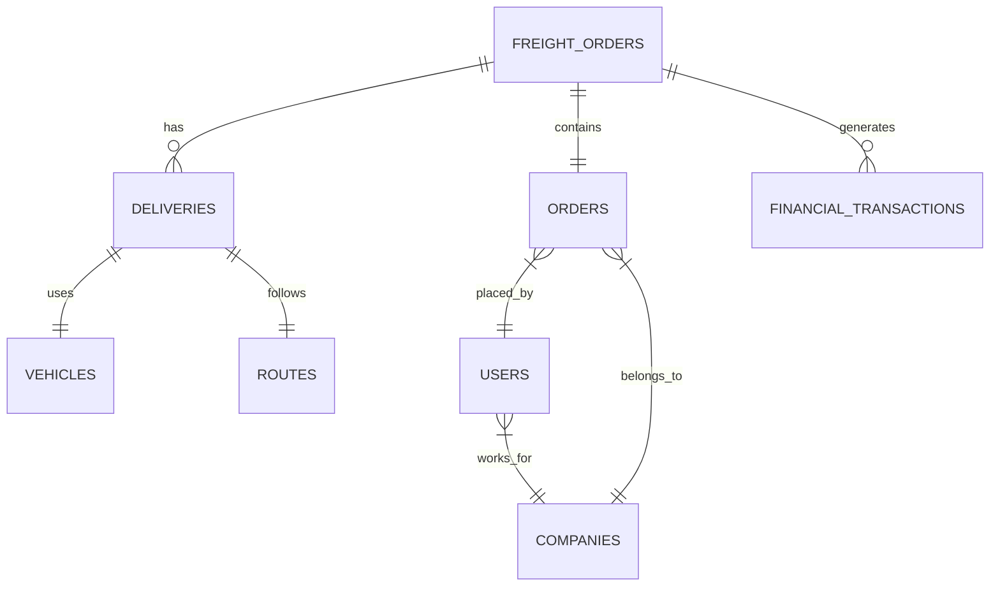

# 🗄️ MCP Database Integration Requirements

## 📋 Overview

This document outlines the database integration requirements for the MCP implementation of the freight system. It covers PostgreSQL connection patterns, query optimization strategies, and data access layer design.

## 🏗️ Database Architecture

### Current Database Structure

```sql
-- Main database: freight_management
-- Schema: public

-- Core Tables:
freight_orders      -- Main freight order records
orders             -- Customer orders
deliveries         -- Delivery tracking
financial_transactions -- Financial records
users              -- System users
companies          -- Company information
vehicles           -- Fleet management
routes             -- Route definitions
```

### Table Relationships



## 🔌 Connection Configuration

### PostgreSQL Connection Pool

```typescript
// config/database.ts
export interface DatabaseConfig {
  host: string;
  port: number;
  database: string;
  user: string;
  password: string;
  ssl?: {
    rejectUnauthorized: boolean;
    ca?: string;
  };
  pool: {
    min: number;
    max: number;
    idleTimeoutMillis: number;
    connectionTimeoutMillis: number;
    maxUses: number;
  };
}

export const dbConfig: DatabaseConfig = {
  host: process.env.DB_HOST || 'localhost',
  port: parseInt(process.env.DB_PORT || '5432'),
  database: process.env.DB_NAME || 'freight_management',
  user: process.env.DB_USER || 'freight_user',
  password: process.env.DB_PASSWORD || '',
  ssl: process.env.NODE_ENV === 'production' ? {
    rejectUnauthorized: false,
    ca: process.env.DB_SSL_CA
  } : undefined,
  pool: {
    min: 2,
    max: 20,
    idleTimeoutMillis: 30000,
    connectionTimeoutMillis: 2000,
    maxUses: 7500
  }
};
```

### Connection Manager

```typescript
// database/connectionManager.ts
import { Pool, PoolClient } from 'pg';
import { dbConfig } from '../config/database';

class ConnectionManager {
  private pool: Pool;
  private isConnected: boolean = false;
  
  constructor() {
    this.pool = new Pool(dbConfig);
    this.setupEventHandlers();
  }
  
  private setupEventHandlers(): void {
    this.pool.on('error', (err) => {
      console.error('Unexpected database error:', err);
      this.isConnected = false;
    });
    
    this.pool.on('connect', () => {
      console.log('Database connection established');
      this.isConnected = true;
    });
  }
  
  async getConnection(): Promise<PoolClient> {
    if (!this.isConnected) {
      await this.testConnection();
    }
    return this.pool.connect();
  }
  
  async testConnection(): Promise<void> {
    const client = await this.pool.connect();
    try {
      await client.query('SELECT 1');
      this.isConnected = true;
    } finally {
      client.release();
    }
  }
  
  async closePool(): Promise<void> {
    await this.pool.end();
    this.isConnected = false;
  }
}

export const connectionManager = new ConnectionManager();
```

## 📊 Data Access Patterns

### Domain-Specific Repositories

```typescript
// repositories/freightRepository.ts
export class FreightRepository {
  async findByFilters(filters: FreightFilters): Promise<FreightOrder[]> {
    const query = this.buildFilterQuery(filters);
    const client = await connectionManager.getConnection();
    
    try {
      const result = await client.query(query.text, query.values);
      return result.rows.map(row => this.mapToFreightOrder(row));
    } finally {
      client.release();
    }
  }
  
  private buildFilterQuery(filters: FreightFilters): QueryConfig {
    const conditions: string[] = [];
    const values: any[] = [];
    let paramIndex = 1;
    
    if (filters.status) {
      conditions.push(`status = $${paramIndex++}`);
      values.push(filters.status);
    }
    
    if (filters.dateFrom) {
      conditions.push(`created_at >= $${paramIndex++}`);
      values.push(filters.dateFrom);
    }
    
    if (filters.dateTo) {
      conditions.push(`created_at <= $${paramIndex++}`);
      values.push(filters.dateTo);
    }
    
    if (filters.companyId) {
      conditions.push(`company_id = $${paramIndex++}`);
      values.push(filters.companyId);
    }
    
    const whereClause = conditions.length > 0 
      ? `WHERE ${conditions.join(' AND ')}` 
      : '';
    
    return {
      text: `
        SELECT 
          fo.*,
          o.order_number,
          o.customer_name,
          c.company_name,
          d.delivery_status,
          d.estimated_arrival
        FROM freight_orders fo
        LEFT JOIN orders o ON fo.order_id = o.id
        LEFT JOIN companies c ON fo.company_id = c.id
        LEFT JOIN deliveries d ON fo.id = d.freight_order_id
        ${whereClause}
        ORDER BY fo.created_at DESC
        LIMIT $${paramIndex}
      `,
      values: [...values, filters.limit || 100]
    };
  }
}
```

### Query Optimization Strategies

```typescript
// database/queryOptimizer.ts
export class QueryOptimizer {
  // Use prepared statements for frequently used queries
  private preparedStatements = new Map<string, string>();
  
  constructor() {
    this.initializePreparedStatements();
  }
  
  private initializePreparedStatements(): void {
    // Common freight queries
    this.preparedStatements.set('freight_by_id', `
      SELECT * FROM freight_orders WHERE id = $1
    `);
    
    this.preparedStatements.set('freight_summary', `
      SELECT 
        COUNT(*) as total_orders,
        SUM(total_value) as total_value,
        AVG(total_value) as avg_value,
        COUNT(CASE WHEN status = 'pending' THEN 1 END) as pending_count,
        COUNT(CASE WHEN status = 'in_transit' THEN 1 END) as in_transit_count,
        COUNT(CASE WHEN status = 'delivered' THEN 1 END) as delivered_count
      FROM freight_orders
      WHERE created_at >= $1 AND created_at <= $2
    `);
    
    this.preparedStatements.set('delivery_performance', `
      SELECT 
        DATE_TRUNC('day', delivered_at) as delivery_date,
        COUNT(*) as deliveries,
        AVG(EXTRACT(EPOCH FROM (delivered_at - created_at))/3600) as avg_hours,
        SUM(CASE WHEN delivered_at <= estimated_arrival THEN 1 ELSE 0 END) as on_time
      FROM deliveries
      WHERE delivered_at IS NOT NULL
        AND delivered_at >= $1
        AND delivered_at <= $2
      GROUP BY delivery_date
      ORDER BY delivery_date DESC
    `);
  }
  
  getPreparedStatement(name: string): string | undefined {
    return this.preparedStatements.get(name);
  }
}
```

## 🔒 Security Implementation

### SQL Injection Prevention

```typescript
// security/sqlSanitizer.ts
export class SqlSanitizer {
  // Whitelist of allowed columns for sorting
  private allowedSortColumns = new Set([
    'created_at', 'updated_at', 'total_value', 
    'delivery_date', 'status', 'priority'
  ]);
  
  // Whitelist of allowed tables
  private allowedTables = new Set([
    'freight_orders', 'orders', 'deliveries',
    'financial_transactions', 'users', 'companies'
  ]);
  
  validateSortColumn(column: string): string {
    if (!this.allowedSortColumns.has(column)) {
      throw new Error(`Invalid sort column: ${column}`);
    }
    return column;
  }
  
  validateTableName(table: string): string {
    if (!this.allowedTables.has(table)) {
      throw new Error(`Invalid table name: ${table}`);
    }
    return table;
  }
  
  // Use parameterized queries exclusively
  escapeIdentifier(identifier: string): string {
    // PostgreSQL identifier escaping
    return `"${identifier.replace(/"/g, '""')}"`;
  }
}
```

### Access Control

```typescript
// security/dataAccessControl.ts
export class DataAccessControl {
  async checkUserAccess(
    userId: string, 
    resource: string, 
    action: string
  ): Promise<boolean> {
    const client = await connectionManager.getConnection();
    
    try {
      const result = await client.query(`
        SELECT 1 
        FROM user_permissions up
        JOIN permissions p ON up.permission_id = p.id
        WHERE up.user_id = $1
          AND p.resource = $2
          AND p.action = $3
          AND up.is_active = true
      `, [userId, resource, action]);
      
      return result.rowCount > 0;
    } finally {
      client.release();
    }
  }
  
  async applyRowLevelSecurity(
    query: string, 
    userId: string, 
    userRole: string
  ): Promise<string> {
    // Apply RLS based on user role
    switch (userRole) {
      case 'admin':
        return query; // No restrictions
        
      case 'company_user':
        return query.replace(
          'WHERE',
          'WHERE company_id IN (SELECT company_id FROM users WHERE id = $USER_ID) AND'
        );
        
      case 'driver':
        return query.replace(
          'WHERE',
          'WHERE driver_id = $USER_ID AND'
        );
        
      default:
        throw new Error('Unauthorized access');
    }
  }
}
```

## 🚀 Performance Optimization

### Indexing Strategy

```sql
-- Essential indexes for performance

-- Freight Orders
CREATE INDEX idx_freight_orders_status ON freight_orders(status);
CREATE INDEX idx_freight_orders_created_at ON freight_orders(created_at DESC);
CREATE INDEX idx_freight_orders_company_id ON freight_orders(company_id);
CREATE INDEX idx_freight_orders_composite ON freight_orders(status, created_at DESC);

-- Deliveries
CREATE INDEX idx_deliveries_freight_order_id ON deliveries(freight_order_id);
CREATE INDEX idx_deliveries_status ON deliveries(delivery_status);
CREATE INDEX idx_deliveries_delivered_at ON deliveries(delivered_at DESC);

-- Financial Transactions
CREATE INDEX idx_financial_type ON financial_transactions(transaction_type);
CREATE INDEX idx_financial_date ON financial_transactions(transaction_date DESC);
CREATE INDEX idx_financial_freight ON financial_transactions(freight_order_id);

-- Full-text search
CREATE INDEX idx_freight_search ON freight_orders 
  USING gin(to_tsvector('portuguese', description || ' ' || notes));
```

### Query Caching

```typescript
// cache/queryCache.ts
import Redis from 'ioredis';

export class QueryCache {
  private redis: Redis;
  private defaultTTL = 300; // 5 minutes
  
  constructor() {
    this.redis = new Redis(process.env.REDIS_URL);
  }
  
  async get<T>(key: string): Promise<T | null> {
    const cached = await this.redis.get(key);
    if (cached) {
      return JSON.parse(cached);
    }
    return null;
  }
  
  async set<T>(key: string, value: T, ttl?: number): Promise<void> {
    await this.redis.set(
      key,
      JSON.stringify(value),
      'EX',
      ttl || this.defaultTTL
    );
  }
  
  async invalidate(pattern: string): Promise<void> {
    const keys = await this.redis.keys(pattern);
    if (keys.length > 0) {
      await this.redis.del(...keys);
    }
  }
  
  generateKey(operation: string, params: any): string {
    const sortedParams = Object.keys(params)
      .sort()
      .map(k => `${k}:${params[k]}`)
      .join(':');
    return `query:${operation}:${sortedParams}`;
  }
}
```

## 📈 Monitoring and Metrics

### Database Performance Monitoring

```typescript
// monitoring/dbMetrics.ts
export class DatabaseMetrics {
  private metrics = {
    queryCount: 0,
    errorCount: 0,
    slowQueries: 0,
    connectionPoolSize: 0,
    averageQueryTime: 0
  };
  
  async recordQuery(
    query: string, 
    duration: number, 
    success: boolean
  ): Promise<void> {
    this.metrics.queryCount++;
    
    if (!success) {
      this.metrics.errorCount++;
    }
    
    if (duration > 1000) { // Slow query threshold: 1 second
      this.metrics.slowQueries++;
      console.warn(`Slow query detected (${duration}ms):`, query);
    }
    
    // Update average query time
    this.metrics.averageQueryTime = 
      (this.metrics.averageQueryTime * (this.metrics.queryCount - 1) + duration) 
      / this.metrics.queryCount;
  }
  
  async getHealthStatus(): Promise<DatabaseHealth> {
    const client = await connectionManager.getConnection();
    
    try {
      // Check database connectivity
      await client.query('SELECT 1');
      
      // Get connection pool stats
      const poolStats = await client.query(`
        SELECT 
          numbackends as active_connections,
          (SELECT setting::int FROM pg_settings WHERE name = 'max_connections') as max_connections
        FROM pg_stat_database 
        WHERE datname = current_database()
      `);
      
      // Get table sizes
      const tableSizes = await client.query(`
        SELECT 
          schemaname,
          tablename,
          pg_size_pretty(pg_total_relation_size(schemaname||'.'||tablename)) as size
        FROM pg_tables 
        WHERE schemaname = 'public'
        ORDER BY pg_total_relation_size(schemaname||'.'||tablename) DESC
        LIMIT 10
      `);
      
      return {
        status: 'healthy',
        metrics: this.metrics,
        poolStats: poolStats.rows[0],
        largeTables: tableSizes.rows
      };
    } catch (error) {
      return {
        status: 'unhealthy',
        error: error.message,
        metrics: this.metrics
      };
    } finally {
      client.release();
    }
  }
}
```

## 🔄 Migration Support

### Data Migration Tools

```typescript
// migration/dataMigration.ts
export class DataMigrationSupport {
  async compareQueryResults(
    mcpQuery: string,
    legacyQuery: string,
    params: any[]
  ): Promise<ComparisonResult> {
    const client = await connectionManager.getConnection();
    
    try {
      const [mcpResult, legacyResult] = await Promise.all([
        client.query(mcpQuery, params),
        client.query(legacyQuery, params)
      ]);
      
      // Compare results
      const differences = this.findDifferences(
        mcpResult.rows,
        legacyResult.rows
      );
      
      return {
        identical: differences.length === 0,
        mcpRowCount: mcpResult.rowCount,
        legacyRowCount: legacyResult.rowCount,
        differences
      };
    } finally {
      client.release();
    }
  }
  
  private findDifferences(mcpRows: any[], legacyRows: any[]): any[] {
    // Implementation to compare row data
    const differences = [];
    
    // Compare row counts
    if (mcpRows.length !== legacyRows.length) {
      differences.push({
        type: 'row_count',
        mcp: mcpRows.length,
        legacy: legacyRows.length
      });
    }
    
    // Compare individual rows
    for (let i = 0; i < Math.min(mcpRows.length, legacyRows.length); i++) {
      const mcpRow = mcpRows[i];
      const legacyRow = legacyRows[i];
      
      for (const key in mcpRow) {
        if (mcpRow[key] !== legacyRow[key]) {
          differences.push({
            type: 'value_mismatch',
            row: i,
            field: key,
            mcp: mcpRow[key],
            legacy: legacyRow[key]
          });
        }
      }
    }
    
    return differences;
  }
}
```

## 📋 Database Schema Documentation

### Freight Orders Table

```sql
CREATE TABLE freight_orders (
    id UUID PRIMARY KEY DEFAULT gen_random_uuid(),
    order_id UUID REFERENCES orders(id),
    company_id UUID REFERENCES companies(id),
    origin_address JSONB NOT NULL,
    destination_address JSONB NOT NULL,
    total_weight DECIMAL(10,2),
    total_volume DECIMAL(10,2),
    total_value DECIMAL(10,2),
    status VARCHAR(50) NOT NULL,
    priority VARCHAR(20) DEFAULT 'normal',
    special_instructions TEXT,
    created_at TIMESTAMP WITH TIME ZONE DEFAULT CURRENT_TIMESTAMP,
    updated_at TIMESTAMP WITH TIME ZONE DEFAULT CURRENT_TIMESTAMP,
    created_by UUID REFERENCES users(id),
    metadata JSONB DEFAULT '{}'
);
```

### Sample Data Access Patterns

```typescript
// Example usage in MCP tools

// 1. Simple freight query
const freightOrders = await freightRepository.findByFilters({
  status: 'pending',
  dateFrom: new Date('2024-01-01'),
  dateTo: new Date('2024-12-31'),
  limit: 50
});

// 2. Complex aggregation
const summary = await statisticsRepository.getFreightSummary({
  groupBy: 'company',
  period: 'monthly',
  year: 2024
});

// 3. Real-time tracking
const tracking = await deliveryRepository.getTrackingInfo(
  freightOrderId,
  { includeHistory: true }
);
```

## ✅ Implementation Checklist

- [ ] Set up connection pooling with proper limits
- [ ] Implement all security measures (SQL injection, RLS)
- [ ] Create necessary database indexes
- [ ] Set up query caching with Redis
- [ ] Implement prepared statements for common queries
- [ ] Add comprehensive error handling
- [ ] Set up monitoring and alerting
- [ ] Create migration validation tools
- [ ] Document all data access patterns
- [ ] Performance test with production-like data

---

This database integration plan ensures secure, performant, and maintainable data access for the MCP implementation.