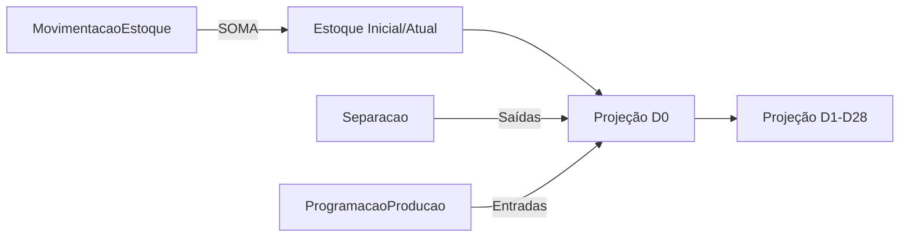

# 📋 PADRONIZAÇÃO DO SISTEMA DE ESTOQUE
**Data:** 03/09/2025  
**Responsável:** Sistema padronizado para usar apenas ServicoEstoqueSimples

## 🎯 OBJETIVO
Eliminar a confusão causada por 3 sistemas de estoque coexistindo e padronizar todo o sistema para usar apenas `ServicoEstoqueSimples`.

## ⚠️ SITUAÇÃO ANTERIOR (PROBLEMÁTICA)

### Arquivos Coexistindo:
1. **estoque_simples.py** - Sistema novo e otimizado
2. **estoque_tempo_real.py** - Sistema antigo com MovimentacaoPrevista  
3. **compatibility_layer.py** - Camada de compatibilidade

### Problemas Identificados:
- ❌ Código tentando chamar `atualizar_movimentacao_prevista()` em `ServicoEstoqueSimples` (método inexistente)
- ❌ Tabelas obsoletas ainda no banco: `movimentacao_prevista`, `estoque_tempo_real`
- ❌ Confusão sobre qual sistema usar
- ❌ Performance degradada por tabelas e índices desnecessários

## ✅ AÇÕES REALIZADAS

### 1. Correção de Código
**Arquivo:** `app/integracoes/tagplus/processador_faturamento_tagplus.py`
- **Linha 77-95:** Removido bloco que tentava chamar `atualizar_movimentacao_prevista()`
- **Justificativa:** O método não existe em `ServicoEstoqueSimples` e o abatimento já é feito via `MovimentacaoEstoque`

### 2. Remoção de Arquivos Obsoletos
**Movidos para backup:**
- `app/estoque/services/estoque_tempo_real.py` → `app/estoque/obsoletos_backup/estoque_tempo_real.py.backup`
- `app/estoque/models_tempo_real.py` → `app/estoque/obsoletos_backup/models_tempo_real.py.backup`

### 3. Script de Limpeza do Banco
**Criado:** `DROP_TABELAS_OBSOLETAS.sql`
- Remove tabelas: `movimentacao_prevista`, `estoque_tempo_real`
- Remove triggers relacionados
- Seguro: verifica existência antes de dropar

### 4. Padronização de Imports
Todos os arquivos agora usam:
```python
from app.estoque.services.estoque_simples import ServicoEstoqueSimples
```

## 📊 SISTEMA ATUAL (SIMPLIFICADO)

### Única Fonte de Verdade: `ServicoEstoqueSimples`

#### Cálculo de Estoque Inicial:
```python
def calcular_estoque_atual(cod_produto: str) -> float:
    # Query única em movimentacao_estoque
    # SOMA todas as movimentações (já com sinal correto)
    # Filtros: ativo=True e status_nf != 'CANCELADO'
```

#### Tabelas Ativas:
- ✅ `movimentacao_estoque` - Todas as movimentações
- ✅ `separacao` - Saídas previstas (sincronizado_nf=False)
- ✅ `programacao_producao` - Entradas previstas

#### Performance:
- Estoque atual: < 10ms
- Projeção completa (28 dias): < 50ms
- Múltiplos produtos: < 200ms (10 produtos)

## 🔄 FLUXO DO ESTOQUE



## 📝 CHECKLIST PÓS-PADRONIZAÇÃO

- [x] Remover arquivos obsoletos
- [x] Corrigir imports
- [x] Remover chamadas para métodos inexistentes
- [x] Criar script SQL de limpeza
- [ ] **EXECUTAR** script SQL no banco (fazer backup antes!)
- [ ] **TESTAR** sistema completo
- [ ] **MONITORAR** logs por 24h

## ⚡ COMANDOS PARA EXECUTAR

### 1. Backup do Banco (IMPORTANTE!)
```bash
pg_dump -U usuario -d database > backup_antes_limpeza_$(date +%Y%m%d_%H%M%S).sql
```

### 2. Executar Limpeza
```bash
psql -U usuario -d database -f DROP_TABELAS_OBSOLETAS.sql
```

### 3. Verificar Sistema
```bash
python -c "from app.estoque.services.estoque_simples import ServicoEstoqueSimples; print('OK')"
```

## 🚨 AVISOS IMPORTANTES

1. **NÃO USE MAIS:**
   - `EstoqueTempoReal`
   - `MovimentacaoPrevista`
   - `atualizar_movimentacao_prevista()`

2. **USE SEMPRE:**
   - `ServicoEstoqueSimples`
   - `MovimentacaoEstoque` para registrar movimentações
   - `Separacao.sincronizado_nf` para controlar faturamento

3. **COMPATIBILITY LAYER:**
   - Mantida temporariamente em `compatibility_layer.py`
   - Use apenas se código legado ainda precisar
   - Planejar remoção futura

## 📊 MÉTRICAS DE SUCESSO

- ✅ Zero erros de "método não encontrado"
- ✅ Performance < 50ms para projeções
- ✅ Apenas 1 sistema de estoque ativo
- ✅ Código mais simples e manutenível

## 📞 SUPORTE

Em caso de problemas após a padronização:
1. Verificar logs em `/var/log/aplicacao/`
2. Restaurar backup se necessário
3. Os arquivos antigos estão em `app/estoque/obsoletos_backup/`

---

**Padronização concluída com sucesso!** 🎉

O sistema agora usa exclusivamente `ServicoEstoqueSimples` para todos os cálculos de estoque.