# 🚀 PROJETO CLAUDE AI: MÁXIMA EFICÁCIA

## 📋 **RESUMO EXECUTIVO DO PROJETO**

**Objetivo:** Transformar o Claude AI Novo em uma máquina de inteligência industrial de máxima eficácia  
**Duração:** 6 semanas (42 dias)  
**Investimento:** Tempo de desenvolvimento + infraestrutura  
**ROI Esperado:** 5-10x melhoria em performance e inteligência  

---

## 🎯 **OBJETIVOS ESPECÍFICOS E MENSURÁVEIS**

### 🏆 **METAS PRIMÁRIAS**
| Métrica | Atual | Meta | Melhoria |
|---------|-------|------|----------|
| **⚡ Tempo de Resposta** | ~3-5s | ~0.5-1s | **5x mais rápido** |
| **🧠 Precisão de Respostas** | ~70% | ~90%+ | **3x mais preciso** |
| **🔗 Disponibilidade** | ~95% | ~99.9% | **2x mais confiável** |
| **💾 Uso de Memória** | Alto | -50% | **2x mais eficiente** |
| **📊 Insights Gerados** | Básicos | Avançados | **10x mais insights** |

### 🎯 **METAS SECUNDÁRIAS**
- **90% redução** em bugs de dependência
- **Zero pontos únicos** de falha
- **Real-time monitoring** implementado
- **Escalabilidade horizontal** habilitada

---

## 📅 **CRONOGRAMA MASTER - 6 SEMANAS**

```
SEMANA 1-2: FUNDAÇÃO SÓLIDA (Quebrar Gargalos)
SEMANA 3-4: ARQUITETURA AVANÇADA (Otimizar Conexões)
SEMANA 5-6: INTELIGÊNCIA MÁXIMA (Conectar Aprendizado)
```

---

## 🏗️ **FASE 1: FUNDAÇÃO SÓLIDA (SEMANAS 1-2)**

### 🎯 **OBJETIVO:** Resolver gargalos críticos e criar base estável

### 📅 **SEMANA 1: QUEBRA DO MULTI-AGENT SYSTEM**

#### 🔥 **DIA 1-2: ANÁLISE E PREPARAÇÃO**
**Tarefas:**
- [ ] **Backup completo** do sistema atual
- [ ] **Análise detalhada** do `multi_agent/system.py` (648 linhas)
- [ ] **Identificar responsabilidades** específicas de cada agente
- [ ] **Mapear dependências internas** do arquivo
- [ ] **Criar testes de regressão** para validação

**Entregáveis:**
- Backup seguro do sistema
- Documento de análise do Multi-Agent
- Suite de testes de regressão

#### ⚙️ **DIA 3-5: QUEBRA ESTRATÉGICA**
**Tarefas:**
- [ ] **Criar estrutura** `agents/` especializada
- [ ] **Implementar DeliveryAgent** (Especialista em entregas)
  ```python
  agents/delivery_agent.py (~150 linhas)
  - Processar consultas de entrega
  - Calcular prazos e status
  - Integrar com monitoramento
  ```
- [ ] **Implementar FreightAgent** (Especialista em fretes)
  ```python
  agents/freight_agent.py (~150 linhas)
  - Analisar custos de frete
  - Processar aprovações
  - Calcular diferenças
  ```
- [ ] **Implementar OrderAgent** (Especialista em pedidos)
  ```python
  agents/order_agent.py (~150 linhas)
  - Gerenciar cotações
  - Status de separação
  - Integrações com carteira
  ```
- [ ] **Implementar FinancialAgent** (Especialista em financeiro)
  ```python
  agents/financial_agent.py (~150 linhas)
  - Pendências financeiras
  - Análises de pagamento
  - Relatórios financeiros
  ```

**Entregáveis:**
- 4 agentes especializados funcionais
- Redução de 648 → 4×150 linhas (modularizado)

#### 🔗 **DIA 6-7: COORDENADOR DE AGENTES**
**Tarefas:**
- [ ] **Implementar AgentCoordinator**
  ```python
  agents/coordinator.py
  - Distribuir consultas por especialidade
  - Combinar resultados de múltiplos agentes
  - Gerenciar prioridades e fallbacks
  ```
- [ ] **Atualizar imports** em `system.py`
- [ ] **Testes de integração** completos
- [ ] **Validação de performance** inicial

**Entregáveis:**
- Sistema Multi-Agent reestruturado
- Performance baseline estabelecida

### 📅 **SEMANA 2: DEPENDENCY INJECTION E UNIFICAÇÃO**

#### 🔧 **DIA 8-10: CONTAINER DE DEPENDÊNCIAS**
**Tarefas:**
- [ ] **Implementar ServiceContainer**
  ```python
  services/container.py
  - DatabaseService (pool otimizado)
  - ClaudeAPIService (cliente único)
  - ConfigService (configurações centralizadas)
  - CacheService (cache multicamada)
  ```
- [ ] **Resolver dependências circulares**
  - Mapear todas as dependências
  - Implementar injeção de dependência
  - Remover imports circulares

**Entregáveis:**
- Container DI funcional
- Zero dependências circulares

#### 🎭 **DIA 11-12: UNIFICAÇÃO CLAUDE INTEGRATION**
**Tarefas:**
- [ ] **Analisar duplicações**
  - `claude.py` vs `claude_integration.py`
  - Identificar funcionalidades únicas
  - Mapear pontos de uso
- [ ] **Criar ClaudeServiceUnified**
  ```python
  services/claude_service.py
  - API client otimizado
  - Rate limiting inteligente
  - Retry logic robusto
  - Connection pooling
  ```
- [ ] **Migrar todas as referências**
- [ ] **Remover arquivos duplicados**

**Entregáveis:**
- Claude Integration unificada
- 50% redução na complexidade

#### 📊 **DIA 13-14: VALIDAÇÃO E MÉTRICAS**
**Tarefas:**
- [ ] **Implementar monitoramento básico**
- [ ] **Testes de carga** comparativos
- [ ] **Métricas de performance** (antes vs depois)
- [ ] **Validação de funcionalidades** críticas

**Entregáveis:**
- Relatório de melhoria Fase 1
- Métricas baseline estabelecidas

---

## ⚡ **FASE 2: ARQUITETURA AVANÇADA (SEMANAS 3-4)**

### 🎯 **OBJETIVO:** Implementar orquestração central e otimizações de performance

### 📅 **SEMANA 3: MASTER ORCHESTRATOR**

#### 🏗️ **DIA 15-17: ORQUESTRADOR CENTRAL**
**Tarefas:**
- [ ] **Implementar MasterOrchestrator**
  ```python
  orchestration/master_orchestrator.py
  - Ponto central de controle
  - Roteamento inteligente de consultas
  - Coordenação de todas as camadas
  - Health checking automático
  ```
- [ ] **Implementar SmartRouter**
  ```python
  orchestration/smart_router.py
  - Classificação automática de consultas
  - Roteamento por especialidade
  - Load balancing entre agentes
  - Fallback strategies
  ```
- [ ] **Camadas de abstração**
  ```python
  layers/
  ├── integration_layer.py
  ├── intelligence_layer.py
  ├── processing_layer.py
  └── learning_layer.py
  ```

**Entregáveis:**
- MasterOrchestrator funcional
- Roteamento inteligente implementado

#### 💾 **DIA 18-19: CACHE INTELIGENTE MULTICAMADA**
**Tarefas:**
- [ ] **Implementar SemanticCache**
  ```python
  cache/semantic_cache.py
  - Cache por similaridade semântica
  - TTL dinâmico baseado em relevância
  - Invalidação inteligente
  ```
- [ ] **Implementar ContextCache**
  ```python
  cache/context_cache.py
  - Cache de conversas ativas
  - Contexto persistente por usuário
  - Compressão de histórico
  ```
- [ ] **Implementar SuggestionCache**
  ```python
  cache/suggestion_cache.py
  - Cache de sugestões personalizadas
  - Pré-computação de recomendações
  - Refresh automático
  ```

**Entregáveis:**
- Sistema de cache multicamada
- 3x redução na latência

#### 🔄 **DIA 20-21: PIPELINE PARALELO**
**Tarefas:**
- [ ] **Implementar ProcessingPipeline**
  ```python
  pipeline/processing_pipeline.py
  - Processamento assíncrono
  - Pipeline stages configuráveis
  - Parallel execution
  - Result synthesis
  ```
- [ ] **Otimizar operações I/O**
- [ ] **Implementar connection pooling**

**Entregáveis:**
- Pipeline paralelo funcional
- 5x melhoria na throughput

### 📅 **SEMANA 4: OTIMIZAÇÕES AVANÇADAS**

#### 📊 **DIA 22-24: MONITORAMENTO AVANÇADO**
**Tarefas:**
- [ ] **Implementar MetricsCollector**
  ```python
  monitoring/metrics_collector.py
  - Performance metrics
  - Business metrics
  - Error tracking
  - Resource utilization
  ```
- [ ] **Dashboard de Performance**
  ```python
  monitoring/dashboard.py
  - Real-time metrics
  - Health indicators
  - Alert system
  - Historical trends
  ```
- [ ] **Sistema de Alertas**

**Entregáveis:**
- Dashboard de monitoramento
- Sistema de alertas automático

#### 🔧 **DIA 25-28: OTIMIZAÇÕES FINAIS**
**Tarefas:**
- [ ] **Profile de performance** completo
- [ ] **Otimização de queries** de banco
- [ ] **Memory optimization**
- [ ] **CPU optimization**
- [ ] **Testes de stress** e load testing

**Entregáveis:**
- Sistema otimizado para produção
- Documentação de performance

---

## 🧠 **FASE 3: INTELIGÊNCIA MÁXIMA (SEMANAS 5-6)**

### 🎯 **OBJETIVO:** Conectar todos os sistemas de aprendizado para inteligência máxima

### 📅 **SEMANA 5: LEARNING LOOP COMPLETO**

#### 📚 **DIA 29-31: CONEXÃO DE APRENDIZADO**
**Tarefas:**
- [ ] **Implementar LearningOrchestrator**
  ```python
  learning/learning_orchestrator.py
  - Coordenar Human-in-Loop + Lifelong
  - Pattern recognition avançado
  - Model updates automáticos
  - Knowledge graph building
  ```
- [ ] **Conectar feedback loops**
  ```
  User Feedback → Pattern Analysis → Model Update → Performance Improvement
  ```
- [ ] **Implementar semantic mappings** avançados

**Entregáveis:**
- Learning loop completo
- 3x melhoria na precisão

#### 🔍 **DIA 32-33: INTELLIGENCE SYNTHESIS**
**Tarefas:**
- [ ] **Implementar IntelligenceSynthesizer**
  ```python
  synthesis/intelligence_synthesizer.py
  - Combinar insights de múltiplas fontes
  - Detectar padrões complexos
  - Gerar recomendações proativas
  - Predict user needs
  ```
- [ ] **Advanced analytics** implementation

**Entregáveis:**
- Sistema de síntese inteligente
- Insights preditivos funcionais

#### 🎯 **DIA 34-35: PERSONALIZAÇÃO AVANÇADA**
**Tarefas:**
- [ ] **Implementar UserProfileEngine**
- [ ] **Adaptive learning** por usuário
- [ ] **Contextual recommendations**
- [ ] **Behavioral pattern analysis**

**Entregáveis:**
- Personalização avançada
- 5x melhoria em sugestões

### 📅 **SEMANA 6: PRODUÇÃO E OTIMIZAÇÃO FINAL**

#### 🚀 **DIA 36-38: DEPLOY E VALIDAÇÃO**
**Tarefas:**
- [ ] **Deploy em staging** completo
- [ ] **Testes end-to-end** extensivos
- [ ] **Performance testing** sob carga real
- [ ] **User acceptance testing**

#### 📊 **DIA 39-42: OTIMIZAÇÃO E DOCUMENTAÇÃO**
**Tarefas:**
- [ ] **Fine-tuning** baseado em métricas reais
- [ ] **Documentação completa** do sistema
- [ ] **Training** da equipe
- [ ] **Go-live** em produção

**Entregáveis:**
- Sistema em produção
- Documentação completa
- Equipe treinada

---

## 📊 **CRONOGRAMA DE ENTREGAS**

```mermaid
gantt
    title Projeto Claude AI - Máxima Eficácia
    dateFormat X
    axisFormat %d
    
    section Fase 1: Fundação
    Quebra Multi-Agent        :1, 7
    Dependency Injection      :8, 14
    
    section Fase 2: Arquitetura
    Master Orchestrator       :15, 21
    Otimizações Avançadas     :22, 28
    
    section Fase 3: Inteligência
    Learning Loop             :29, 35
    Produção                  :36, 42
```



---

## 🛡️ **GESTÃO DE RISCOS E MITIGAÇÕES**

### 🔴 **RISCOS ALTOS**

#### 1. **Quebra de Funcionalidades Existentes**
- **Probabilidade:** Média
- **Impacto:** Alto
- **Mitigação:** 
  - Testes de regressão extensivos
  - Deploy incremental
  - Rollback automático

#### 2. **Performance Degradation Durante Transição**
- **Probabilidade:** Alta
- **Impacto:** Médio
- **Mitigação:**
  - Ambiente de staging idêntico
  - Load testing antes de deploy
  - Blue-green deployment

### 🟡 **RISCOS MÉDIOS**

#### 3. **Complexidade de Integração**
- **Probabilidade:** Alta
- **Impacto:** Médio
- **Mitigação:**
  - Documentação detalhada
  - Pair programming
  - Code reviews rigorosos

#### 4. **Sobrecarga da Equipe**
- **Probabilidade:** Média
- **Impacto:** Médio
- **Mitigação:**
  - Cronograma realista
  - Priorização clara
  - Suporte externo se necessário

---

## 📈 **MÉTRICAS DE ACOMPANHAMENTO**

### 🎯 **KPIs SEMANAIS**

| Semana | Entregável Principal | Métrica de Sucesso |
|--------|---------------------|-------------------|
| **1** | Multi-Agent Quebrado | 4 agentes funcionais |
| **2** | DI Container | Zero dependências circulares |
| **3** | Master Orchestrator | Roteamento inteligente ativo |
| **4** | Cache Multicamada | 3x redução latência |
| **5** | Learning Loop | 3x melhoria precisão |
| **6** | Sistema Produção | 5x performance overall |

### 📊 **DASHBOARD DE PROGRESSO**

**Métricas Diárias:**
- Lines of code refatoradas
- Tests passing %
- Performance benchmarks
- Bug count

**Métricas Semanais:**
- Feature completion %
- Performance improvement
- System stability
- Team velocity

---

## 💰 **ORÇAMENTO E RECURSOS**

### 👥 **RECURSOS HUMANOS**
- **1 Arquiteto Senior** (6 semanas) - Liderança técnica
- **2 Desenvolvedores Full-Stack** (6 semanas) - Implementação
- **1 DevOps Engineer** (2 semanas) - Deploy e monitoramento
- **1 QA Engineer** (3 semanas) - Testes e validação

### 🖥️ **RECURSOS TÉCNICOS**
- **Ambiente de staging** dedicado
- **Ferramentas de monitoramento** avançadas
- **Load testing tools**
- **CI/CD pipeline** otimizado

### 📚 **RECURSOS DE CONHECIMENTO**
- **Documentação técnica** completa
- **Training materials**
- **Best practices** guides

---

## 🏁 **CRITÉRIOS DE SUCESSO**

### ✅ **SUCESSO TOTAL (100%)**
- **5x melhoria** em performance
- **3x melhoria** em precisão
- **2x melhoria** em confiabilidade
- **10x melhoria** em insights
- **Zero bugs críticos** em produção

### ✅ **SUCESSO PARCIAL (80%)**
- **3x melhoria** em performance
- **2x melhoria** em precisão
- **1.5x melhoria** em confiabilidade
- **5x melhoria** em insights

### ❌ **CRITÉRIOS DE FALHA**
- **Degradação** de performance atual
- **Perda** de funcionalidades existentes
- **Instabilidade** em produção

---

## 🚀 **PRÓXIMOS PASSOS IMEDIATOS**

### 📅 **ESTA SEMANA**
1. **Aprovação do projeto** pela liderança
2. **Alocação de recursos** (equipe + infraestrutura)
3. **Setup do ambiente** de desenvolvimento
4. **Backup completo** do sistema atual

### 📅 **PRIMEIRA SEMANA**
1. **Kick-off meeting** com toda a equipe
2. **Análise detalhada** do Multi-Agent System
3. **Início da quebra** do arquivo crítico
4. **Setup de métricas** baseline

---

## 📚 **DOCUMENTAÇÃO DO PROJETO**

### 📋 **DOCUMENTOS CRIADOS**
- [x] `PROJETO_CLAUDE_AI_MAXIMA_EFICACIA.md` - Este documento
- [x] `ANALISE_ESTRATEGICA_CLAUDE_AI_NOVO.md` - Análise técnica
- [x] `RESUMO_EXECUTIVO_ESTRATEGICO.md` - Resumo executivo

### 📋 **DOCUMENTOS A CRIAR**
- [ ] `ARQUITETURA_TECNICA_DETALHADA.md` - Especificações técnicas
- [ ] `GUIA_IMPLEMENTACAO.md` - Guia passo-a-passo
- [ ] `PLANO_TESTES.md` - Estratégia de testes
- [ ] `MANUAL_DEPLOY.md` - Procedimentos de deploy

---

## 🏆 **CONCLUSÃO DO PROJETO**

Este projeto representa uma **transformação fundamental** do Claude AI Novo, evoluindo de um sistema complexo para uma **máquina de inteligência industrial de máxima eficácia**.

**Com execução disciplinada** deste plano em **6 semanas**, alcançaremos:
- **Performance 5x superior**
- **Inteligência 3x mais avançada**  
- **Confiabilidade 2x maior**
- **Insights 10x mais valiosos**

**O investimento é estratégico** e o **ROI é exponencial**. Este projeto estabelecerá uma **vantagem competitiva definitiva** e criará a **base tecnológica** para os próximos anos de evolução.

**🚀 AUTORIZAÇÃO PARA INÍCIO: AGUARDANDO APROVAÇÃO**

---

*Projeto criado com base na análise estratégica completa da arquitetura Claude AI Novo* 