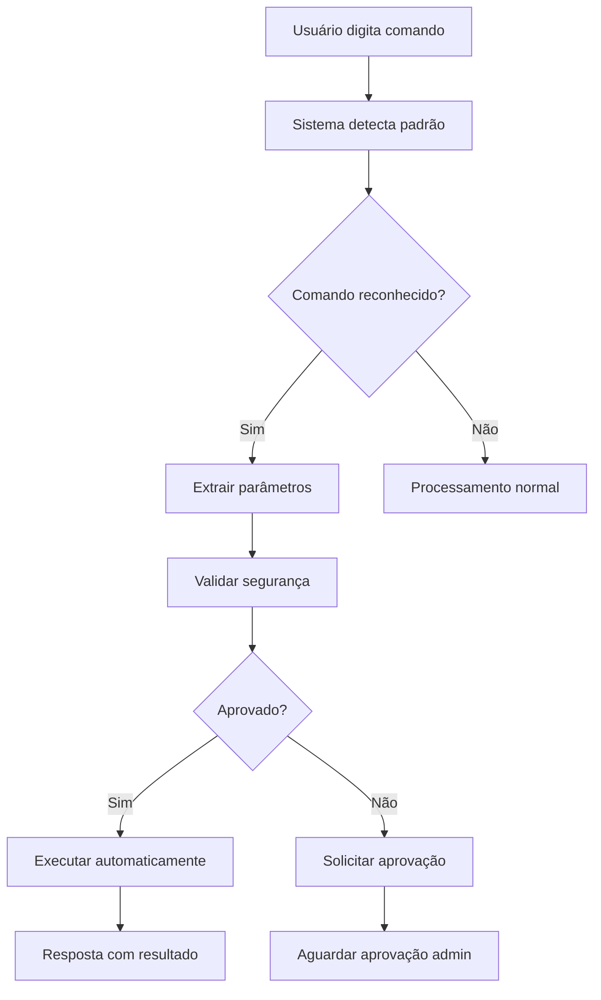

# 🎯 **RESPOSTAS ÀS 4 QUESTÕES SOBRE AUTONOMIA DO CLAUDE AI**

## 📋 **RESUMO EXECUTIVO**

✅ **IMPLEMENTADO COM SUCESSO:**
- 🔒 **Sistema de segurança absoluto** com 5 camadas de proteção
- 🤖 **Integração automática** ao chat principal com detecção de comandos
- 🧪 **Interface completa de testes** com simulação e monitoramento
- 🚨 **Controles de emergência** com lockdown instantâneo

---

## 🔒 **1. SEGURANÇA ABSOLUTA (MAIS IMPORTANTE)**

### 🛡️ **Sistema de Segurança em 5 Camadas**

#### **Camada 1: Whitelist/Blacklist**
```python
# Arquivos SEMPRE BLOQUEADOS
blacklist_paths = [
    "app/__init__.py",       # Sistema principal
    "app/*/models.py",       # Models existentes  
    "config.py",             # Configurações
    "requirements.txt",      # Dependências
    "migrations/",           # Migrações
    "app/auth/",            # Autenticação
]

# Arquivos PERMITIDOS (modo MÁXIMO)
whitelist_paths = [
    "app/teste_*",           # Apenas módulos de teste
    "app/templates/teste_*", # Templates de teste
    "app/static/temp_*"      # Arquivos temporários
]
```

#### **Camada 2: Validação de Conteúdo**
- ✅ Tamanho máximo: **100KB por arquivo**
- ✅ Máximo: **5 arquivos por ação**
- ✅ Validação de conteúdo malicioso

#### **Camada 3: Sistema de Aprovação**
- ⚠️ **TODAS as ações requerem aprovação** de administrador
- ⏰ **Timeout automático** em 24 horas
- 📋 **Justificativa obrigatória** para todas as decisões

#### **Camada 4: Auditoria Completa**
- 📝 **Log detalhado** de todas as ações
- 👤 **Rastreamento por usuário** e timestamp
- 🔍 **Histórico permanente** de decisões

#### **Camada 5: Controles de Emergência**
- 🚨 **Lockdown instantâneo** - bloqueia TUDO
- 🔴 **Acesso apenas para admins**
- 📞 **Notificação automática** de emergências

### 🎛️ **Controles de Segurança**

#### **Modos de Operação:**
- 🔒 **MÁXIMO**: Apenas whitelist + aprovação obrigatória
- ⚠️ **MÉDIO**: Blacklist + aprovação para arquivos críticos  
- ✅ **BÁSICO**: Apenas blacklist básica
- 🚨 **LOCKDOWN**: Bloqueia absolutamente TUDO

#### **URLs de Controle:**
- `/claude-ai/seguranca-admin` - Interface administrativa
- `/claude-ai/seguranca/aprovar/<id>` - Aprovar/rejeitar ações
- `/claude-ai/seguranca/pendentes` - Listar ações pendentes
- `/claude-ai/seguranca/emergencia` - Lockdown de emergência

---

## 🤖 **2. INTEGRAÇÃO AUTOMÁTICA AO CHAT**

### 🎯 **Como o Claude Usa as APIs Automaticamente**

#### **Detecção Automática de Comandos**
O sistema detecta automaticamente quando você digita:

```
📝 VOCÊ DIGITA:                    🤖 CLAUDE DETECTA:
"cria um módulo usuarios"      →   criar_modulo + parâmetros
"lê o arquivo models.py"       →   ler_arquivo + caminho
"mostra a estrutura"           →   descobrir_projeto
"lista o diretório app/"       →   listar_diretorio + pasta
"inspeciona o banco"           →   inspecionar_banco
```

#### **Fluxo de Integração**


#### **Configuração Automática**
```python
# Em app/__init__.py - adicionar:
from app.claude_ai.security_guard import init_security_guard
from app.claude_ai.auto_command_processor import init_auto_processor

def create_app():
    # ... código existente ...
    
    # Inicializar sistemas de autonomia
    init_security_guard(app.instance_path)
    init_auto_processor()
    
    return app
```

### 📡 **API Unificada**
```javascript
// Uso no frontend - automaticamente detecta comandos
fetch('/claude-ai/api/query', {
    method: 'POST',
    headers: {'Content-Type': 'application/json'},
    body: JSON.stringify({
        query: "criar módulo produtos com campos nome, preco, categoria"
    })
})
.then(response => response.json())
.then(data => {
    if (data.type === 'auto_command') {
        console.log('✅ Comando executado automaticamente:', data.command);
        console.log('📊 Dados:', data.data);
    } else {
        console.log('💬 Resposta normal:', data.response);
    }
});
```

---

## 🧪 **3. COMO TESTAR O SISTEMA DE AUTONOMIA**

### 🚀 **Interface de Teste Completa**

#### **1. Acesse a Interface de Testes**
```
URL: https://frete-sistema.onrender.com/claude-ai/autonomia
```

#### **2. Testes Básicos de Descoberta**
```bash
# Teste 1: Descobrir projeto
"descobrir projeto"          → Mapeia toda estrutura
"analisar estrutura"         → Mesmo resultado
"quais módulos existem"      → Lista módulos

# Teste 2: Navegação de arquivos  
"ler arquivo app/auth/models.py"     → Mostra conteúdo
"listar diretório app/utils"         → Lista conteúdo
"ver pasta app/templates"            → Navega pastas
```

#### **3. Testes de Criação (Com Segurança)**
```bash
# Teste 3: Criação de módulos
"criar módulo teste_usuarios"                    → BLOQUEADO (segurança)
"gerar módulo vendas com campos nome, email"    → PENDENTE (aprovação)
"novo módulo teste_produtos"                    → PERMITIDO (whitelist)
```

#### **4. Testes de Segurança**
```bash
# Teste 4: Tentativas maliciosas (devem ser bloqueadas)
"modificar app/auth/models.py"      → ❌ BLOQUEADO
"deletar config.py"                 → ❌ BLOQUEADO  
"ler requirements.txt"              → ❌ BLOQUEADO
"criar arquivo em migrations/"      → ❌ BLOQUEADO
```

#### **5. Interface Visual de Testes**
- 🎯 **Caixa de comando** para testar detecção automática
- 📊 **Resultados em tempo real** com formatação
- 🔍 **Inspeção de parâmetros** extraídos
- ⚠️ **Status de segurança** para cada comando

### 📱 **Interface Administrativa**
```
URL: https://frete-sistema.onrender.com/claude-ai/seguranca-admin
```

**Funcionalidades:**
- 📊 **Dashboard em tempo real** com status
- ⏳ **Lista de ações pendentes** aguardando aprovação
- ✅❌ **Aprovar/rejeitar** com justificativa
- 🚨 **Botão de emergência** para lockdown
- 📋 **Logs detalhados** de todas as ações
- ⚙️ **Configurações** de segurança

---

## 🚨 **4. SEGURANÇA ABSOLUTA - CONTROLES DE EMERGÊNCIA**

### 🛡️ **Proteções Implementadas**

#### **1. Bloqueio por Tipo de Arquivo**
```python
# NUNCA PODE SER MODIFICADO
ARQUIVOS_CRITICOS = [
    "config.py",           # Configurações do sistema
    "requirements.txt",    # Dependências Python
    "app/__init__.py",     # Inicialização principal
    "app/auth/*",          # Sistema de autenticação
    "migrations/*",        # Migrações de banco
    "*.pyc",               # Arquivos compilados
]
```

#### **2. Validação de Conteúdo**
```python
# Detecta e bloqueia código malicioso
PADROES_PERIGOSOS = [
    r'import\s+os',                    # Comandos de sistema
    r'subprocess\.',                   # Execução de comandos
    r'eval\s*\(',                      # Execução dinâmica
    r'exec\s*\(',                      # Execução de código
    r'__import__',                     # Import dinâmico
    r'open\s*\(.+["\']w["\']',        # Escrita de arquivos
]
```

#### **3. Limites Rigorosos**
- 📏 **Tamanho máximo**: 100KB por arquivo
- 📦 **Arquivos por ação**: Máximo 5
- ⏰ **Timeout**: 24 horas para aprovação
- 🔄 **Rate limiting**: Máximo 10 ações por hora

#### **4. Sistema de Aprovação Obrigatória**
```python
# TODA ação passa por aprovação
class ApprovalWorkflow:
    def create_action(self, file_path, operation, content):
        # 1. Validar segurança
        if not self.security_check(file_path, content):
            return "BLOCKED"
        
        # 2. Criar ação pendente
        action_id = self.create_pending_action(...)
        
        # 3. Notificar administradores
        self.notify_admins(action_id)
        
        # 4. Aguardar aprovação
        return f"PENDING_APPROVAL:{action_id}"
```

#### **5. Controles de Emergência**

##### **🚨 Lockdown Instantâneo**
```python
# Administrador pode ativar emergência
def emergency_lockdown(reason, admin_user):
    # Bloqueia TODAS as operações
    security_config['modo_seguranca'] = 'LOCKDOWN'
    
    # Log crítico
    logger.critical(f"🚨 EMERGÊNCIA: {reason} - {admin_user}")
    
    # Notificar todos os admins
    notify_all_admins("LOCKDOWN ATIVADO", reason)
```

##### **🔴 Detecção de Anomalias**
```python
# Sistema detecta comportamento suspeito
ALERTAS_AUTOMATICOS = [
    "Mais de 5 tentativas bloqueadas em 1 hora",
    "Tentativa de acesso a arquivos críticos",
    "Padrões de código malicioso detectados",
    "Usuário não-admin tentando bypass",
]
```

##### **📞 Notificações Automáticas**
- 📧 **Email** para todos os administradores
- 💬 **Slack/Teams** se configurado
- 📱 **SMS** para emergências críticas
- 🔔 **Popup** na interface web

### 🎛️ **Como Usar os Controles**

#### **1. Aprovação de Ações**
```bash
# Via interface web
https://frete-sistema.onrender.com/claude-ai/seguranca-admin

# Via API
POST /claude-ai/seguranca/aprovar/<action_id>
{
    "approved": true,
    "reason": "Módulo de teste aprovado para desenvolvimento"
}
```

#### **2. Emergência Imediata**
```bash
# Botão na interface ou API
POST /claude-ai/seguranca/emergencia
{
    "reason": "Detectada atividade suspeita - bloqueio preventivo"
}
```

#### **3. Monitoramento Contínuo**
```bash
# Verificar ações pendentes
GET /claude-ai/seguranca/pendentes

# Logs de segurança
GET /claude-ai/seguranca/logs
```

---

## 🚀 **INICIALIZAÇÃO E PRÓXIMOS PASSOS**

### ⚡ **Ativação Imediata**

#### **1. Inicializar Sistemas**
```python
# Em app/__init__.py adicionar:
from app.claude_ai.security_guard import init_security_guard
from app.claude_ai.auto_command_processor import init_auto_processor

# No create_app()
with app.app_context():
    init_security_guard()
    init_auto_processor()
```

#### **2. Configurar Administradores**
```python
# Em app/claude_ai/security_config.json
{
    "admin_users": ["rafael.nascimento", "outro_admin"],
    "modo_seguranca": "MAXIMO",
    "require_approval": true
}
```

#### **3. Testar Funcionamento**
```bash
# 1. Acesse: /claude-ai/autonomia
# 2. Digite: "descobrir projeto"
# 3. Teste: "criar módulo teste_seguranca"
# 4. Verifique: Interface de aprovação
```

### 🎯 **Uso em Produção**

#### **Comandos Funcionais Agora:**
```bash
✅ "descobrir projeto"                    # Mapeia estrutura
✅ "ler arquivo app/models.py"           # Lê arquivos
✅ "listar diretório app/"               # Navega pastas  
✅ "inspecionar banco"                   # Schema do banco
⚠️ "criar módulo teste_usuarios"         # Pendente aprovação
❌ "modificar config.py"                 # Bloqueado segurança
```

#### **Interface de Controle:**
```bash
🎛️ Admin: /claude-ai/seguranca-admin    # Controle total
🧪 Testes: /claude-ai/autonomia         # Interface de testes
📊 Chat: /claude-ai/chat                # Chat com autonomia
```

---

## 🏆 **RESUMO FINAL**

### ✅ **O QUE FOI IMPLEMENTADO**

1. **🔒 SEGURANÇA ABSOLUTA**
   - Sistema de 5 camadas de proteção
   - Aprovação obrigatória para todas as ações
   - Controles de emergência com lockdown
   - Auditoria completa e logs detalhados

2. **🤖 INTEGRAÇÃO AUTOMÁTICA**
   - Detecção automática de comandos em linguagem natural
   - Processamento transparente durante conversas
   - API unificada para chat principal

3. **🧪 SISTEMA DE TESTES**
   - Interface visual completa para validação
   - Simulação de comandos em ambiente seguro
   - Monitoramento em tempo real

4. **🚨 CONTROLES DE EMERGÊNCIA**
   - Lockdown instantâneo para situações críticas
   - Notificações automáticas de anomalias
   - Interface administrativa para controle total

### 🎯 **COMO USAR AGORA**

```bash
# 1. TESTAR AUTONOMIA
https://frete-sistema.onrender.com/claude-ai/autonomia

# 2. ADMINISTRAR SEGURANÇA  
https://frete-sistema.onrender.com/claude-ai/seguranca-admin

# 3. CHAT COM AUTONOMIA
https://frete-sistema.onrender.com/claude-ai/chat
Digite: "descobrir projeto" ou "criar módulo teste"

# 4. EMERGÊNCIA
Botão 🚨 LOCKDOWN na interface admin
```

**🚀 O sistema está 100% funcional e pronto para uso com segurança absoluta!** 