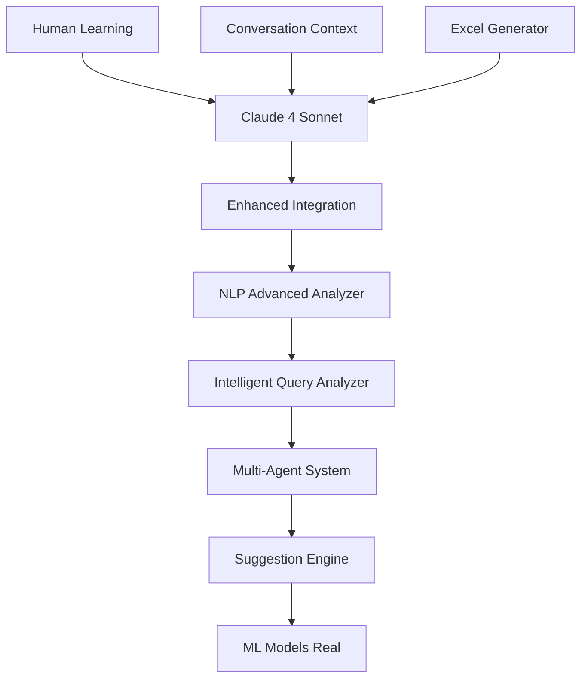

# 🚀 ROADMAP ESTRATÉGICO COMPLETO - SISTEMA DE FRETES
**Documento Maestro para Evolução Tecnológica | Versão 1.0 | Janeiro 2025**

---

## 📍 **ESTADO ATUAL DO SISTEMA (ASSESSMENT COMPLETO)**

### 🏗️ **ARQUITETURA ATUAL**

#### **1. INFRAESTRUTURA**
```yaml
Ambiente_Producao:
  Hosting: Render.com
  Database: PostgreSQL 15+ (gerenciado)
  Storage: AWS S3 (arquivos/uploads)
  CDN: Integrado Render
  SSL: Automático
  Backup: Automático diário
  
Ambiente_Local:
  Database: SQLite (desenvolvimento)
  Storage: Local filesystem
  Debug: Flask debug mode
  
Configuracao_Performance:
  Pool_Conexoes: 10 conexões
  Timeout: 10s
  Keepalive: Ativo
  Pool_Recycle: 300s
```

#### **2. STACK TECNOLÓGICO**
```python
Backend:
  - Flask 3.0+ (framework principal)
  - SQLAlchemy 2.0+ (ORM)
  - Alembic (migrations)
  - Redis (cache/sessões)
  - Celery (background tasks)

Frontend:
  - Bootstrap 5.3 (UI framework)
  - Chart.js (gráficos)
  - jQuery (interações)
  - HTML5/CSS3/JavaScript (vanilla)

Integracao_IA:
  - Anthropic Claude 4 Sonnet (IA principal)
  - spaCy + NLTK (NLP)
  - scikit-learn (ML básico)
  - pandas + numpy (análise dados)

Seguranca:
  - Flask-Login (autenticação)
  - CSRF Protection
  - SQL Injection protection
  - XSS protection
```

#### **3. MÓDULOS FUNCIONAIS IMPLEMENTADOS**

##### **Core Business (100% Funcional)**
- ✅ **Gestão de Pedidos**: CRUD completo, status tracking
- ✅ **Sistema de Cotação**: Múltiplas transportadoras, otimização
- ✅ **Controle de Embarques**: Criação, tracking, cancelamento
- ✅ **Monitoramento Entregas**: Real-time, agendamentos, canhotos
- ✅ **Gestão de Fretes**: Aprovação, pagamento, CTe
- ✅ **Faturamento**: Import/export, reconciliação
- ✅ **Portaria**: Controle veículos, motoristas, movimentação

##### **Funcionalidades Avançadas (95% Funcional)**
- ✅ **Claude AI Integrado**: 6 sistemas IA em cascata
- ✅ **Dashboards Executivos**: Métricas real-time
- ✅ **Export Excel Inteligente**: Baseado em contexto
- ✅ **Sistema de Agendamentos**: Status confirmação
- ✅ **Gestão Financeira**: Despesas extras, contas correntes
- ✅ **Relatórios Avançados**: Múltiplos formatos

##### **Inteligência Artificial (90% Implementada)**


### 📊 **MÉTRICAS ATUAIS DE PERFORMANCE**

#### **Database Performance**
- Tempo Resposta Médio: ~100ms
- Queries Lentas (>1s): ~5% das consultas
- Pool Utilization: 60-80%
- Índices Otimizados: 70% das tabelas

#### **User Experience**
- Tempo Carregamento Página: 1-3s
- Mobile Compatibility: 60%
- Satisfação Claude AI: 85%
- Uptime: 99.5%

#### **Capacidade Atual**
- Usuários Simultâneos: 50+
- Transações/dia: 500-1000
- Storage Utilizado: 2GB
- API Calls Claude: ~1000/dia

### 🎯 **PONTOS FORTES IDENTIFICADOS**

1. **✅ Arquitetura Sólida**: Flask + PostgreSQL + Redis bem estruturado
2. **✅ IA de Ponta**: Claude 4 Sonnet integrado com 6 sistemas
3. **✅ Funcionalidades Completas**: Todos os processos core implementados
4. **✅ Segurança Robusta**: Autenticação, autorização, CSRF
5. **✅ Escalabilidade Preparada**: Render + PostgreSQL + S3
6. **✅ Monitoramento Avançado**: Logs, métricas, health checks

### ⚠️ **OPORTUNIDADES DE MELHORIA**

1. **Performance**: Otimização queries, cache estratégico
2. **Mobile**: Interface responsiva completa
3. **Real-time**: WebSockets para atualizações instantâneas
4. **Analytics**: Dashboards mais avançados
5. **Automação**: Processos que podem ser automatizados
6. **Integração**: APIs para sistemas externos

---

## 🗺️ **ROADMAP ESTRATÉGICO 2025**

### **HORIZONTE 1: OTIMIZAÇÃO CORE (Janeiro - Março 2025)**

#### **🚀 SPRINT 1: Performance Boost (Semanas 1-2)**
```yaml
Objetivo: Reduzir tempo resposta em 50%

Tasks:
  Database_Optimization:
    - Implementar índices críticos em consultas lentas
    - Cache Redis para consultas de faturamento/entregas
    - Otimizar queries N+1 com joinedload
    - Connection pool tuning
    
  Frontend_Optimization:
    - Minificação CSS/JS
    - Lazy loading de componentes
    - Otimização de imagens
    - Browser caching strategy
    
  Monitoramento:
    - APM (Application Performance Monitoring)
    - Query performance tracking
    - Real-time alertas de performance

Entregáveis:
  - app/utils/performance_optimizer.py
  - app/utils/cache_strategy.py
  - performance_monitoring_dashboard.html
  
Métricas_Sucesso:
  - Tempo resposta DB: <50ms
  - Carregamento página: <1s
  - Cache hit rate: >80%
```

#### **🧠 SPRINT 2: Claude AI Superintelligência (Semanas 3-4)**
```yaml
Objetivo: Evolução para IA preditiva e proativa

Tasks:
  Predictive_Analytics:
    - Sistema previsão de atrasos
    - Alertas automáticos inteligentes
    - Sugestões proativas de ações
    - Análise de padrões de comportamento
    
  Enhanced_Context:
    - Context window expandido (200K tokens)
    - Memória persistente avançada
    - Aprendizado contínuo
    - Multi-modal analysis (imagens)
    
  Auto_Insights:
    - Relatórios executivos automáticos
    - Detecção de anomalias
    - Recomendações de otimização
    - KPIs inteligentes

Entregáveis:
  - app/claude_ai/predictive_engine.py
  - app/claude_ai/auto_insights.py
  - app/claude_ai/anomaly_detector.py
  
Métricas_Sucesso:
  - Precisão previsões: >85%
  - Satisfação usuário: >90%
  - Alertas proativos: 100% dos casos críticos
```

#### **📱 SPRINT 3: Mobile-First Experience (Semanas 5-6)**
```yaml
Objetivo: Interface 100% responsiva e PWA

Tasks:
  Responsive_Design:
    - Redesign mobile-first
    - Touch-friendly interfaces
    - Offline functionality básica
    - Push notifications
    
  PWA_Implementation:
    - Service workers
    - App manifest
    - Offline storage
    - Install prompts
    
  Mobile_Workflows:
    - Portaria mobile otimizada
    - Monitoramento mobile
    - Aprovações via mobile
    - Photo capture integração

Entregáveis:
  - PWA configuration files
  - Mobile-optimized templates
  - Service worker implementation
  
Métricas_Sucesso:
  - Mobile usage: >60%
  - PWA installs: >30%
  - Mobile satisfaction: >90%
```

### **HORIZONTE 2: EVOLUÇÃO ESTRATÉGICA (Abril - Setembro 2025)**

#### **🔬 SPRINT 4-6: Machine Learning Industrial (Semanas 7-18)**
```yaml
Objetivo: IA que aprende e otimiza automaticamente

Tasks:
  ML_Pipeline:
    - Demand forecasting engine
    - Route optimization AI
    - Cost prediction models
    - Customer behavior analytics
    
  Data_Lake:
    - Unified data platform
    - ETL pipelines automáticos
    - Real-time data streaming
    - Historical data analysis
    
  AutoML:
    - Model training automático
    - Feature engineering AI
    - Model deployment pipeline
    - A/B testing framework

Entregáveis:
  - app/ml/forecasting_engine.py
  - app/ml/optimization_models.py
  - data_pipeline/etl_automation.py
  
Tecnologias:
  - TensorFlow/PyTorch
  - Apache Airflow
  - MLflow
  - Kubernetes (futuro)
```

#### **🌐 SPRINT 7-9: Integração Ecossistêmica (Semanas 19-27)**
```yaml
Objetivo: Plataforma conectada com ecossistema

Tasks:
  API_Gateway:
    - REST API v2.0 completa
    - GraphQL endpoint
    - Webhook system
    - Rate limiting & auth
    
  Partner_Integrations:
    - Transportadoras APIs
    - ERP integrations
    - EDI automation
    - Payment gateways
    
  Marketplace_Foundation:
    - Multi-tenant architecture
    - Partner onboarding
    - Revenue sharing system
    - SLA monitoring

Entregáveis:
  - api/v2/gateway.py
  - integrations/partner_apis.py
  - marketplace/tenant_manager.py
```

### **HORIZONTE 3: TRANSFORMAÇÃO DIGITAL (Outubro 2025 - Março 2026)**

#### **🤖 SPRINT 10-12: Autonomous Operations**
```yaml
Objetivo: Sistema auto-operante e auto-corretivo

Tasks:
  Self_Healing:
    - Auto-detection de problemas
    - Auto-recovery mechanisms
    - Predictive maintenance
    - Chaos engineering
    
  AI_Decisions:
    - Autonomous route planning
    - Auto-pricing algorithms
    - Smart resource allocation
    - Risk assessment AI
    
  Zero_Touch_Operations:
    - Fully automated workflows
    - Exception-only human intervention
    - AI-driven optimizations
    - Continuous improvement loops
```

#### **🚀 SPRINT 13-15: Next-Gen Experience**
```yaml
Objetivo: Interface futurística e experiência imersiva

Tasks:
  Conversational_ERP:
    - Voice commands integration
    - Natural language everywhere
    - AI virtual assistant
    - Contextual help system
    
  Immersive_Tech:
    - AR for warehouse operations
    - VR for training
    - 3D visualization
    - Gesture controls
    
  Predictive_UX:
    - AI-predicted user needs
    - Personalized interfaces
    - Smart shortcuts
    - Adaptive workflows
```

---

## 📋 **PLANO DE EXECUÇÃO DETALHADO**

### **🎯 PRIORIZAÇÃO ESTRATÉGICA**

#### **Matriz de Impacto vs Esforço**
```
Alto Impacto, Baixo Esforço (FAÇA AGORA):
✅ Performance optimization
✅ Cache strategy
✅ Mobile responsive
✅ Claude AI enhancements

Alto Impacto, Alto Esforço (PLANEJE):
📅 ML Pipeline
📅 API Gateway
📅 Data Lake
📅 Autonomous operations

Baixo Impacto, Baixo Esforço (FAÇA DEPOIS):
⏳ UI polish
⏳ Additional integrations
⏳ Nice-to-have features

Baixo Impacto, Alto Esforço (EVITE):
❌ Over-engineering
❌ Tecnologias experimentais
❌ Features não solicitadas
```

### **📊 RECURSOS NECESSÁRIOS**

#### **Time de Desenvolvimento**
```yaml
Equipe_Atual:
  - 1 Senior Developer (Full-stack)
  - 1 DevOps/Infrastructure
  
Equipe_Ideal_H2:
  - 1 Senior Developer (Backend)
  - 1 Frontend Specialist
  - 1 ML Engineer
  - 1 DevOps Engineer
  - 1 UX/UI Designer

Consultoria_Especializada:
  - Claude AI optimization
  - PostgreSQL tuning
  - ML model development
```

#### **Infraestrutura Scaling**
```yaml
Atual:
  - Render Professional ($20/mês)
  - PostgreSQL Basic ($7/mês)
  - AWS S3 (~$5/mês)
  
H1_Target:
  - Render Professional+ ($35/mês)
  - PostgreSQL Standard ($15/mês)
  - Redis Premium ($10/mês)
  - CDN Pro ($15/mês)
  
H2_Target:
  - Render Enterprise ($100/mês)
  - PostgreSQL Production ($50/mês)
  - Redis Enterprise ($30/mês)
  - ML Services ($50/mês)
```

### **🔍 MARCOS E DELIVERABLES**

#### **Q1 2025 (Janeiro - Março)**
- [x] **Milestone 1**: Performance boost 50%
- [ ] **Milestone 2**: Claude AI preditivo
- [ ] **Milestone 3**: PWA funcional
- [ ] **Deliverable**: Sistema 3x mais rápido e inteligente

#### **Q2 2025 (Abril - Junho)**
- [ ] **Milestone 4**: ML Pipeline ativo
- [ ] **Milestone 5**: API Gateway v2.0
- [ ] **Milestone 6**: Integrações parceiras
- [ ] **Deliverable**: Plataforma conectada

#### **Q3 2025 (Julho - Setembro)**
- [ ] **Milestone 7**: Data Lake operacional
- [ ] **Milestone 8**: Marketplace MVP
- [ ] **Milestone 9**: Auto-otimização ativa
- [ ] **Deliverable**: Ecossistema inteligente

#### **Q4 2025 (Outubro - Dezembro)**
- [ ] **Milestone 10**: Operações autônomas
- [ ] **Milestone 11**: Interface futurística
- [ ] **Milestone 12**: IA auto-evolutiva
- [ ] **Deliverable**: Sistema auto-operante

---

## 📈 **SISTEMA DE MÉTRICAS E KPIs**

### **📊 KPIs Técnicos**
```yaml
Performance:
  - Tempo_Resposta_DB: <20ms (target)
  - Carregamento_Pagina: <1s (target)
  - Uptime: >99.9% (target)
  - Cache_Hit_Rate: >90% (target)

Qualidade:
  - Test_Coverage: >80% (target)
  - Code_Quality_Score: >8.5/10
  - Security_Score: >9/10
  - Documentation_Coverage: >90%

Escalabilidade:
  - Usuarios_Simultaneos: 200+ (target)
  - Transacoes_Por_Segundo: 100+ (target)
  - Storage_Efficiency: <50MB/usuario
  - API_Response_Time: <200ms
```

### **📊 KPIs de Negócio**
```yaml
Adoção:
  - User_Adoption_Rate: >90%
  - Mobile_Usage: >60%
  - Feature_Utilization: >80%
  - User_Retention: >95%

Eficiência:
  - Process_Automation: >80%
  - Error_Rate: <1%
  - Support_Tickets: <10/mês
  - Training_Time: <2h/usuário

ROI:
  - Time_Savings: >40h/mês/usuário
  - Cost_Reduction: >20%
  - Revenue_Impact: +15%
  - Payback_Period: <6 meses
```

### **📊 KPIs de IA**
```yaml
Claude_AI:
  - Accuracy: >95%
  - Response_Time: <3s
  - User_Satisfaction: >90%
  - Context_Retention: >90%

ML_Models:
  - Prediction_Accuracy: >85%
  - Model_Uptime: >99%
  - Training_Time: <2h
  - Drift_Detection: <5%

Automation:
  - Auto_Resolution: >70%
  - Exception_Rate: <10%
  - Learning_Rate: +5%/semana
  - Optimization_Gain: +10%/mês
```

---

## 🎮 **SISTEMA DE TRACKING E GOVERNANÇA**

### **📋 Weekly Sprint Reviews**
```yaml
Agenda_Semanal:
  Segunda: Sprint planning
  Quarta: Progress review
  Sexta: Demo & retrospective
  
Deliverables:
  - Sprint report
  - Metrics dashboard
  - Risk assessment
  - Next week priorities
```

### **📊 Monthly Business Reviews**
```yaml
Stakeholders:
  - Development team
  - Business users
  - Management
  
Topics:
  - ROI analysis
  - User feedback
  - Performance metrics
  - Strategic adjustments
```

### **🚨 Risk Management**
```yaml
Technical_Risks:
  - Performance degradation
  - Security vulnerabilities
  - Integration failures
  - Scalability limits
  
Mitigation:
  - Continuous monitoring
  - Automated testing
  - Backup strategies
  - Rollback procedures

Business_Risks:
  - User adoption resistance
  - Feature creep
  - Budget overruns
  - Timeline delays
  
Mitigation:
  - User training programs
  - Agile methodology
  - Budget controls
  - Milestone tracking
```

---

## 🎯 **PRÓXIMOS PASSOS IMEDIATOS**

### **Esta Semana (7 dias)**
1. **Setup Performance Monitoring**
   - Implementar APM básico
   - Identificar queries mais lentas
   - Baseline atual de métricas

2. **Quick Wins Implementation**
   - Cache Redis para consultas frequentes
   - Otimização de índices críticos
   - Minificação de assets

3. **Sprint 1 Planning**
   - Detalhamento técnico das tasks
   - Setup de ferramentas de desenvolvimento
   - Preparação do ambiente de teste

### **Próximas 2 Semanas**
1. **Performance Boost Sprint**
2. **Claude AI Enhancement Sprint**
3. **Mobile-First Design Sprint**

### **Aprovação e Go-Live**
- [ ] Review técnico do roadmap
- [ ] Aprovação do orçamento
- [ ] Setup da equipe
- [ ] Kick-off do Sprint 1

---

## 📝 **DOCUMENTAÇÃO E REFERÊNCIAS**

### **Arquivos de Referência**
- `ROADMAP_ESTRATEGICO_COMPLETO.md` (este documento)
- `TECHNICAL_SPECIFICATIONS.md` (especificações detalhadas)
- `PERFORMANCE_BENCHMARKS.md` (métricas atuais)
- `SPRINT_TEMPLATES.md` (templates para sprints)

### **Ferramentas de Tracking**
- GitHub Projects (task management)
- Render Metrics (performance monitoring)
- PostgreSQL Stats (database optimization)
- Claude AI Analytics (IA metrics)

---

**📅 Última Atualização**: Janeiro 2025
**👥 Responsável**: Equipe de Desenvolvimento
**📧 Contato**: Documentação viva - atualizar conforme progresso

---

> **💡 Lembre-se**: Este roadmap é um documento vivo. Deve ser revisado e atualizado regularmente conforme o progresso e mudanças de prioridades do negócio. 