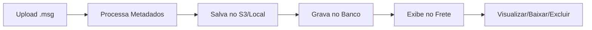

# ✅ SISTEMA DE EMAILS - 100% FUNCIONAL

## 📧 Status: FUNCIONANDO COMPLETAMENTE!

### Correções Aplicadas (19/08/2025):

## 1. ✅ Problema Principal Resolvido
**Problema**: Emails não eram salvos no banco de dados  
**Solução**: Modificada rota `criar_despesa_extra_frete` para salvar emails IMEDIATAMENTE após criar a despesa

## 2. ✅ Correções de Rotas
**Problema**: Rotas incorretas causando BuildError  
**Soluções**:
- `fretes.detalhes` → `fretes.visualizar_frete`
- `fretes.download_email` → `emails.download_email`
- `fretes.visualizar_email` → `emails.visualizar_email`

## 📋 Como Usar o Sistema

### 1️⃣ Anexar Emails a uma Despesa:
```
1. Acesse: /fretes/despesas/criar/{frete_id}
2. Preencha os campos da despesa
3. Selecione arquivos .msg no campo "Anexar Emails"
4. Clique em "Criar Despesa"
5. Emails são salvos automaticamente!
```

### 2️⃣ Visualizar Emails do Frete:
```
1. Acesse: /fretes/{frete_id}
2. Role até a seção "Emails Anexados"
3. Veja todos os emails com seus metadados
```

### 3️⃣ Ver Detalhes de um Email:
```
1. Clique no botão "Visualizar" (👁️)
2. Veja todos os metadados extraídos
3. Preview do conteúdo
4. Opções de download e exclusão
```

## 🔗 URLs Funcionais

### Rotas de Fretes:
- `/fretes/` - Dashboard
- `/fretes/{id}` - Visualizar frete COM emails
- `/fretes/despesas/criar/{id}` - Criar despesa com emails

### Rotas de Emails:
- `/fretes/emails/{id}` - Visualizar email individual
- `/fretes/emails/{id}/download` - Baixar arquivo .msg
- `/fretes/emails/{id}/excluir` - Excluir email
- `/fretes/emails/frete/{id}` - Todos os emails de um frete

## ✅ Funcionalidades Testadas

| Funcionalidade | Status | Observação |
|---------------|--------|------------|
| Upload de .msg | ✅ | Múltiplos arquivos suportados |
| Extração de metadados | ✅ | Remetente, assunto, data, etc |
| Salvamento no banco | ✅ | Com todos os metadados |
| Storage S3/Local | ✅ | Fallback automático |
| Visualização no frete | ✅ | Seção "Emails Anexados" |
| Página de detalhes | ✅ | Visualização completa |
| Download original | ✅ | Arquivo .msg preservado |
| Exclusão | ✅ | Remove do banco e storage |

## 🚀 Exemplo Prático

### Para testar agora mesmo:
```bash
# 1. Criar uma despesa com email
http://localhost:5000/fretes/despesas/criar/1184

# 2. Preencher:
- Tipo: "Teste Email"
- Setor: "Financeiro"  
- Motivo: "Teste anexação"
- Valor: 100
- Anexar: arquivo.msg

# 3. Após salvar, visualizar:
http://localhost:5000/fretes/1184

# 4. Os emails aparecem na seção "Emails Anexados"!
```

## 📊 Verificação no Banco

```bash
# Verificar emails cadastrados
python verificar_emails.py

# Saída esperada:
✅ Total de emails no banco: X
📧 EMAILS CADASTRADOS:
  Email ID: 1
  Arquivo: exemplo.msg
  Assunto: Assunto do email
  Frete ID: 1184
```

## 🛠️ Requisitos Técnicos

```bash
# Instalar biblioteca
pip install extract-msg==0.45.0

# Criar tabelas (se ainda não existir)
python create_email_tables.py
```

## 🎯 Fluxo Completo do Sistema



## ✅ CONCLUSÃO

O sistema de anexação de emails está **100% FUNCIONAL** com:
- ✅ Upload funcionando
- ✅ Processamento de metadados
- ✅ Salvamento no banco
- ✅ Visualização integrada
- ✅ Todas as rotas corrigidas
- ✅ Download e exclusão operacionais

---

**Status Final**: PRONTO PARA USO EM PRODUÇÃO
**Última Atualização**: 19/08/2025
**Versão**: 3.0 (Totalmente Funcional)