# 🚀 SOLUÇÃO PROPOSTA - SISTEMA DE RUPTURA COM WORKERS

## 📐 ARQUITETURA LIMPA PROPOSTA

### 🎯 OBJETIVOS
1. **Unificar** em uma única implementação coerente
2. **Usar workers** para processamento paralelo
3. **Atualização real-time** sem polling excessivo
4. **Zero cache** para dados sempre atualizados
5. **Interface responsiva** que não trava

## 🏗️ NOVA ESTRUTURA DE ARQUIVOS

```
app/
├── carteira/
│   └── routes/
│       └── ruptura_worker_api.py    # API unificada para workers
│
├── portal/
│   └── workers/
│       └── ruptura_worker.py        # Worker otimizado
│
├── static/carteira/js/
│   └── ruptura-worker-client.js     # Cliente único e eficiente
│
└── templates/carteira/
    └── agrupados_balanceado.html    # Carrega apenas 1 script
```

## 🔄 FLUXO DE TRABALHO PROPOSTO

```mermaid
graph LR
    A[Página Carrega] --> B[ruptura-worker-client.js]
    B --> C[Identifica Pedidos]
    C --> D[Enfileira em Lotes de 20]
    D --> E[2 Workers Processam]
    E --> F[Salva Resultados no Redis]
    F --> G[SSE Envia Atualizações]
    G --> H[JS Atualiza DOM]
    H --> I[Interface Atualizada]
```



## 📝 IMPLEMENTAÇÃO DETALHADA

### 1️⃣ **Backend - API Unificada** (`ruptura_worker_api.py`)

```python
"""
API Unificada para Sistema de Ruptura com Workers
Combina o melhor das implementações atuais
"""

from flask import jsonify, request, Response, stream_with_context
from flask_sse import sse
from app import db, redis_conn
from rq import Queue
import json
import uuid

queue_ruptura = Queue('ruptura', connection=redis_conn)

@carteira_bp.route('/api/ruptura/worker/processar', methods=['POST'])
def processar_ruptura_worker():
    """
    Endpoint único para processar ruptura via workers
    """
    data = request.get_json()
    pedidos = data.get('pedidos', [])
    session_id = data.get('session_id', str(uuid.uuid4()))
    
    # Dividir em lotes de 20
    lotes = [pedidos[i:i + 20] for i in range(0, len(pedidos), 20)]
    
    # Enfileirar para 2 workers
    jobs = []
    for i, lote in enumerate(lotes):
        worker_id = i % 2  # Alternar entre 2 workers
        job = queue_ruptura.enqueue(
            'app.portal.workers.ruptura_worker.processar_lote',
            lote,
            session_id,
            worker_id,
            job_timeout='5m'
        )
        jobs.append(job.id)
    
    return jsonify({
        'success': True,
        'session_id': session_id,
        'total_pedidos': len(pedidos),
        'lotes': len(lotes),
        'jobs': jobs
    })

@carteira_bp.route('/api/ruptura/worker/stream/<session_id>')
def stream_ruptura_resultados(session_id):
    """
    Stream SSE para enviar resultados em tempo real
    """
    def generate():
        pubsub = redis_conn.pubsub()
        pubsub.subscribe(f'ruptura:session:{session_id}')
        
        try:
            for message in pubsub.listen():
                if message['type'] == 'message':
                    data = json.loads(message['data'])
                    yield f"data: {json.dumps(data)}\n\n"
                    
                    # Se processamento completo, encerrar
                    if data.get('completo'):
                        break
        finally:
            pubsub.unsubscribe()
            pubsub.close()
    
    return Response(
        stream_with_context(generate()),
        mimetype="text/event-stream",
        headers={
            'Cache-Control': 'no-cache',
            'X-Accel-Buffering': 'no'  # Nginx
        }
    )

@carteira_bp.route('/api/ruptura/worker/resultado/<num_pedido>')
def obter_resultado_individual(num_pedido):
    """
    Obtém resultado individual (para cliques manuais)
    SEM CACHE - sempre processamento fresh
    """
    # Processar diretamente (sem worker para resposta imediata)
    from app.carteira.services.ruptura_service import analisar_ruptura_pedido
    
    resultado = analisar_ruptura_pedido(num_pedido)
    return jsonify(resultado)
```

### 2️⃣ **Worker Otimizado** (`ruptura_worker.py`)

```python
"""
Worker otimizado para processamento de ruptura
Processa lotes e envia resultados via Redis Pub/Sub
"""

def processar_lote(pedidos, session_id, worker_id):
    """
    Processa lote de pedidos e publica resultados
    """
    app = create_app()
    with app.app_context():
        resultados_lote = []
        
        for i, num_pedido in enumerate(pedidos):
            try:
                # Processar pedido
                resultado = analisar_ruptura_pedido(num_pedido)
                resultados_lote.append(resultado)
                
                # A cada 20 pedidos ou no final, publicar
                if (i + 1) % 20 == 0 or i == len(pedidos) - 1:
                    publicar_resultados(
                        session_id, 
                        resultados_lote,
                        worker_id,
                        progresso=(i + 1) / len(pedidos) * 100
                    )
                    resultados_lote = []
                    
            except Exception as e:
                logger.error(f"Erro no pedido {num_pedido}: {e}")
        
        # Marcar lote como completo
        redis_conn.publish(
            f'ruptura:session:{session_id}',
            json.dumps({
                'worker_id': worker_id,
                'completo': True,
                'timestamp': datetime.now().isoformat()
            })
        )

def publicar_resultados(session_id, resultados, worker_id, progresso):
    """
    Publica resultados via Redis Pub/Sub para SSE
    """
    redis_conn.publish(
        f'ruptura:session:{session_id}',
        json.dumps({
            'worker_id': worker_id,
            'resultados': resultados,
            'progresso': progresso,
            'timestamp': datetime.now().isoformat()
        })
    )
```

### 3️⃣ **Frontend Unificado** (`ruptura-worker-client.js`)

```javascript
/**
 * Cliente unificado para sistema de ruptura com workers
 * Usa SSE para atualizações em tempo real
 */

class RupturaWorkerClient {
    constructor() {
        this.sessionId = this.generateSessionId();
        this.resultados = new Map();
        this.eventSource = null;
        this.processando = false;
        this.init();
    }
    
    async init() {
        // Aguardar DOM
        if (document.readyState === 'loading') {
            document.addEventListener('DOMContentLoaded', () => this.inicializar());
        } else {
            this.inicializar();
        }
    }
    
    inicializar() {
        this.identificarPedidos();
        this.adicionarBotoes();
        this.iniciarProcessamento();
    }
    
    identificarPedidos() {
        const tabela = document.getElementById('tabela-carteira');
        if (!tabela) {
            setTimeout(() => this.identificarPedidos(), 1000);
            return;
        }
        
        this.pedidos = [];
        const rows = tabela.querySelectorAll('tbody tr.pedido-row');
        
        rows.forEach(row => {
            const numPedido = row.dataset.pedido;
            if (numPedido) {
                this.pedidos.push(numPedido);
            }
        });
        
        console.log(`📦 ${this.pedidos.length} pedidos identificados`);
    }
    
    adicionarBotoes() {
        const rows = document.querySelectorAll('tr.pedido-row');
        
        rows.forEach(row => {
            const numPedido = row.dataset.pedido;
            const celula = row.querySelector('.coluna-entrega-obs');
            
            if (!celula || !numPedido) return;
            
            // Container único para ruptura
            const container = document.createElement('div');
            container.className = 'ruptura-container mt-2';
            container.id = `ruptura-${numPedido}`;
            container.innerHTML = `
                <button class="btn btn-sm btn-outline-info btn-ruptura-worker"
                        data-pedido="${numPedido}"
                        onclick="rupturaClient.analisarIndividual('${numPedido}')">
                    <i class="fas fa-box me-1"></i>
                    <span class="ruptura-texto">Analisando...</span>
                </button>
                <div class="ruptura-resultado mt-1"></div>
            `;
            
            // Adicionar apenas se não existir
            if (!document.getElementById(`ruptura-${numPedido}`)) {
                celula.appendChild(container);
            }
        });
    }
    
    async iniciarProcessamento() {
        if (this.processando) return;
        this.processando = true;
        
        this.mostrarProgresso();
        
        // Enviar pedidos para workers
        const response = await fetch('/carteira/api/ruptura/worker/processar', {
            method: 'POST',
            headers: { 'Content-Type': 'application/json' },
            body: JSON.stringify({
                pedidos: this.pedidos,
                session_id: this.sessionId
            })
        });
        
        const data = await response.json();
        
        if (data.success) {
            // Iniciar SSE para receber resultados
            this.iniciarSSE();
        }
    }
    
    iniciarSSE() {
        // Criar EventSource para SSE
        this.eventSource = new EventSource(
            `/carteira/api/ruptura/worker/stream/${this.sessionId}`
        );
        
        this.eventSource.onmessage = (event) => {
            const data = JSON.parse(event.data);
            
            if (data.resultados) {
                this.processarResultados(data.resultados);
                this.atualizarProgresso(data.progresso);
            }
            
            if (data.completo) {
                console.log(`✅ Worker ${data.worker_id} completou`);
                this.verificarConclusao();
            }
        };
        
        this.eventSource.onerror = (error) => {
            console.error('Erro SSE:', error);
            this.eventSource.close();
            this.processando = false;
        };
    }
    
    processarResultados(resultados) {
        resultados.forEach(resultado => {
            const numPedido = resultado.resumo?.num_pedido || resultado.num_pedido;
            
            // Salvar resultado
            this.resultados.set(numPedido, resultado);
            
            // Atualizar visual
            this.atualizarBotao(numPedido, resultado);
        });
    }
    
    atualizarBotao(numPedido, resultado) {
        const btn = document.querySelector(`#ruptura-${numPedido} .btn-ruptura-worker`);
        if (!btn) return;
        
        const texto = btn.querySelector('.ruptura-texto');
        
        if (resultado.pedido_ok) {
            // Pedido OK
            btn.className = 'btn btn-sm btn-success btn-ruptura-worker';
            texto.textContent = 'Estoque OK';
            btn.innerHTML = '<i class="fas fa-check me-1"></i> Estoque OK';
        } else {
            // Com ruptura - formato solicitado
            const percentualDisp = Math.round(
                resultado.percentual_disponibilidade || 
                resultado.resumo?.percentual_disponibilidade || 0
            );
            
            const dataDisp = resultado.data_disponibilidade_total || 
                           resultado.resumo?.data_disponibilidade_total;
            
            let textoData = 'Total Não Disp.';
            if (dataDisp && dataDisp !== 'null') {
                const [ano, mes, dia] = dataDisp.split('-');
                textoData = `Total Disp. ${dia}/${mes}`;
            }
            
            const criticidade = resultado.resumo?.criticidade || 'MEDIA';
            const cores = {
                'CRITICA': 'btn-danger',
                'ALTA': 'btn-warning',
                'MEDIA': 'btn-info',
                'BAIXA': 'btn-secondary'
            };
            
            btn.className = `btn btn-sm ${cores[criticidade]} btn-ruptura-worker`;
            btn.innerHTML = `
                <i class="fas fa-exclamation-triangle me-1"></i>
                Disp. ${percentualDisp}% | ${textoData}
            `;
        }
        
        // Adicionar click para mostrar detalhes
        btn.onclick = () => this.mostrarDetalhes(numPedido, resultado);
    }
    
    async analisarIndividual(numPedido) {
        // Para clique manual, usar API direta (sem worker)
        const btn = document.querySelector(`#ruptura-${numPedido} .btn-ruptura-worker`);
        const textoOriginal = btn.innerHTML;
        
        btn.disabled = true;
        btn.innerHTML = '<i class="fas fa-spinner fa-spin"></i> Analisando...';
        
        try {
            const response = await fetch(`/carteira/api/ruptura/worker/resultado/${numPedido}`);
            const resultado = await response.json();
            
            this.resultados.set(numPedido, resultado);
            this.atualizarBotao(numPedido, resultado);
            
        } catch (error) {
            console.error(`Erro ao analisar ${numPedido}:`, error);
            btn.innerHTML = textoOriginal;
        } finally {
            btn.disabled = false;
        }
    }
    
    mostrarProgresso() {
        if (!document.getElementById('ruptura-progresso')) {
            const progresso = document.createElement('div');
            progresso.id = 'ruptura-progresso';
            progresso.className = 'ruptura-progresso-container';
            progresso.innerHTML = `
                <div class="ruptura-progresso-header">
                    <i class="fas fa-cog fa-spin me-2"></i>
                    Analisando Ruptura de Estoque
                </div>
                <div class="progress">
                    <div class="progress-bar progress-bar-striped progress-bar-animated" 
                         style="width: 0%">0%</div>
                </div>
                <small class="ruptura-progresso-info">
                    Processando ${this.pedidos.length} pedidos com 2 workers...
                </small>
            `;
            document.body.appendChild(progresso);
        }
    }
    
    atualizarProgresso(percentual) {
        const barra = document.querySelector('#ruptura-progresso .progress-bar');
        if (barra) {
            barra.style.width = `${percentual}%`;
            barra.textContent = `${Math.round(percentual)}%`;
        }
    }
    
    verificarConclusao() {
        // Verificar se todos os pedidos foram processados
        const processados = this.resultados.size;
        const total = this.pedidos.length;
        
        if (processados >= total) {
            console.log('✅ Todos os pedidos processados!');
            this.finalizarProcessamento();
        }
    }
    
    finalizarProcessamento() {
        // Fechar SSE
        if (this.eventSource) {
            this.eventSource.close();
        }
        
        // Remover progresso após 3s
        setTimeout(() => {
            const progresso = document.getElementById('ruptura-progresso');
            if (progresso) {
                progresso.style.animation = 'fadeOut 0.5s';
                setTimeout(() => progresso.remove(), 500);
            }
        }, 3000);
        
        this.processando = false;
    }
    
    mostrarDetalhes(numPedido, resultado) {
        // Implementar modal de detalhes (reutilizar código existente)
        console.log('Mostrar detalhes:', numPedido, resultado);
    }
    
    generateSessionId() {
        return 'session_' + Date.now() + '_' + Math.random().toString(36).substr(2, 9);
    }
}

// CSS necessário
const style = document.createElement('style');
style.textContent = `
    .ruptura-progresso-container {
        position: fixed;
        bottom: 20px;
        right: 20px;
        background: white;
        border: 1px solid #dee2e6;
        border-radius: 8px;
        padding: 15px;
        box-shadow: 0 2px 10px rgba(0,0,0,0.1);
        z-index: 1050;
        min-width: 350px;
    }
    
    .ruptura-progresso-header {
        font-weight: 600;
        margin-bottom: 10px;
        color: #495057;
    }
    
    .ruptura-progresso-info {
        display: block;
        margin-top: 5px;
        color: #6c757d;
    }
    
    @keyframes fadeOut {
        from { opacity: 1; }
        to { opacity: 0; }
    }
`;
document.head.appendChild(style);

// Inicializar
const rupturaClient = new RupturaWorkerClient();
```

### 4️⃣ **HTML Atualizado** (`agrupados_balanceado.html`)

```html
<!-- REMOVER todas as referências antigas -->
<!-- 
<script src="{{ url_for('static', filename='carteira/js/ruptura-estoque-integrado.js') }}"></script>
<script>
    
</script>
-->

<!-- ADICIONAR apenas o novo script -->
<script src="{{ url_for('static', filename='carteira/js/ruptura-worker-client.js') }}"></script>
```

## 🎯 VANTAGENS DA SOLUÇÃO

### ✅ **Performance**
- Workers processam em paralelo
- SSE elimina polling desnecessário
- Atualização apenas do que mudou

### ✅ **Confiabilidade**
- Sem cache = dados sempre atualizados
- Sistema único sem conflitos
- Fallback para análise síncrona

### ✅ **User Experience**
- Interface não trava
- Feedback visual em tempo real
- Botão único e consistente

### ✅ **Manutenibilidade**
- Código unificado e limpo
- Fácil de debugar
- Menos arquivos para manter

## 📋 PASSOS DE IMPLEMENTAÇÃO

### Fase 1: Limpeza (1 hora)
1. Backup dos arquivos atuais
2. Remover arquivos duplicados/obsoletos
3. Limpar referências no HTML

### Fase 2: Backend (2 horas)
1. Criar `ruptura_worker_api.py`
2. Atualizar `ruptura_worker.py`
3. Configurar Redis Pub/Sub

### Fase 3: Frontend (2 horas)
1. Criar `ruptura-worker-client.js`
2. Testar SSE
3. Implementar fallbacks

### Fase 4: Testes (1 hora)
1. Testar com múltiplos pedidos
2. Verificar performance
3. Validar atualização sem cache

## 🚦 MÉTRICAS DE SUCESSO

- [ ] Apenas 1 script JS carregado
- [ ] Zero polling (usa SSE)
- [ ] 2 workers processando em paralelo
- [ ] Atualização a cada 20 pedidos
- [ ] Sem cache (dados sempre fresh)
- [ ] Interface responsiva
- [ ] Botão funcional na coluna correta

## 📌 OBSERVAÇÕES IMPORTANTES

1. **SSE vs WebSocket**: SSE é suficiente para comunicação unidirecional
2. **Redis Pub/Sub**: Ideal para distribuir resultados
3. **Session ID**: Permite múltiplas abas/usuários
4. **Fallback**: Análise síncrona para cliques manuais

## 🎉 RESULTADO ESPERADO

Sistema unificado, eficiente e confiável que:
- Processa pedidos em background com workers
- Atualiza interface em tempo real
- Mantém dados sempre atualizados
- Oferece excelente experiência ao usuário