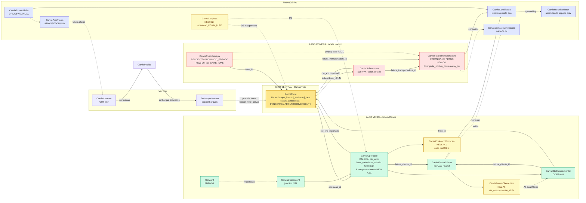
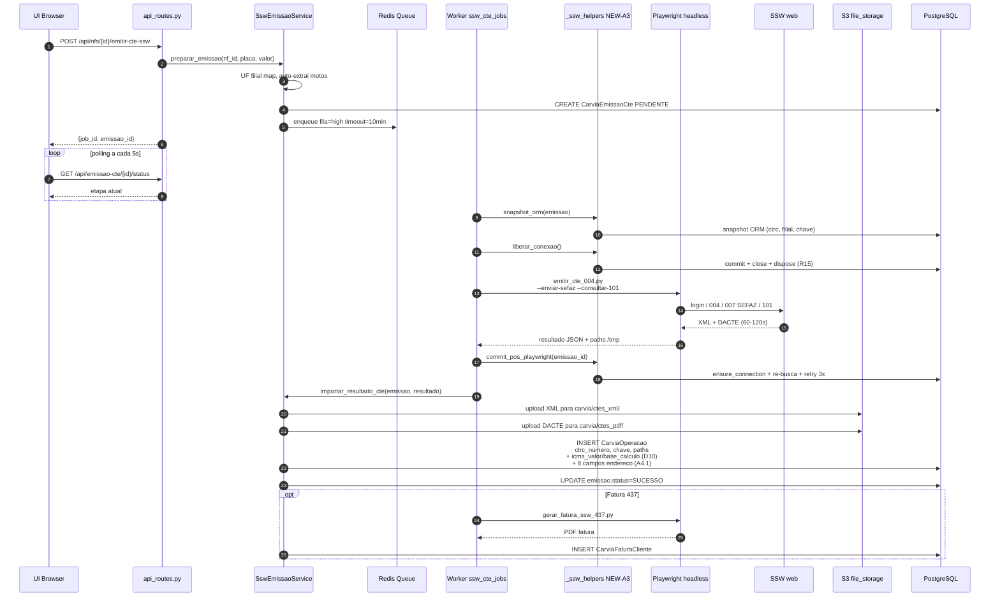

# CarVia — Fluxograma Completo do Modulo

**Gerado em**: 2026-04-19
**Ultima revisao**: 2026-04-19 (pos-Sprints A+B+C+D — commit `a40eaf4a`)
**Escopo**: Visao 100% conectada do modulo CarVia — arquitetura, fluxo de dados, lifecycles, workers e pontos de aprofundamento.

**Stats**: 96 arquivos | ~55.5K LOC | 103 templates | 29 routes | 11 models | 27+ services | 3 workers RQ

> Este documento e um **mapa de alto nivel**. Para aprofundamento tecnico, consulte os sub-docs referenciados em cada secao:
> [CLAUDE.md](CLAUDE.md) · [CONFERENCIA.md](CONFERENCIA.md) · [FINANCEIRO.md](FINANCEIRO.md) · [FLUXOS_CRIACAO.md](FLUXOS_CRIACAO.md) · [IMPORTACAO.md](IMPORTACAO.md) · [COTACAO.md](COTACAO.md) · [SSW_INTEGRATION.md](SSW_INTEGRATION.md) · [AUDIT_ADMIN_SERVICE.md](AUDIT_ADMIN_SERVICE.md)

---

## Changelog deste fluxograma

| Data | Mudanca |
|------|---------|
| 2026-04-19 | **Sprints A+B+C+D** (commit `a40eaf4a`): 4 bugs + hygiene + Fase 1B + debito tecnico. Novos: `CarviaEnderecoCorrecao`, `operacao_cancel_service.py`, `_ssw_helpers.py`, `upload_policies.py`, tipo `GNRE_ICMS`, FKs `CarviaDespesa.operacao_id/frete_id`, FK `CarviaFaturaClienteItem.cte_complementar_id`, 8 campos endereco em `CarviaOperacao`, 4 campos autoria em `CarviaFaturaTransportadora`, `icms_valor/base_calculo` persistidos, feature flags. |
| 2026-04-19 | Criacao inicial do fluxograma |

---

## 1. Arquitetura Geral (Camadas)

```mermaid
flowchart TB
    subgraph ENTRADA["PONTOS DE ENTRADA"]
        E1[Portaria Hook<br/>portaria/routes.py:374]
        E2[Importacao Upload<br/>/carvia/importar]
        E3[Emissao SSW UI<br/>POST /api/nfs/id/emitir-cte-ssw]
        E4[Cotacao Comercial<br/>/carvia/cotacoes-v2]
        E5[Conciliacao OFX/CSV<br/>/carvia/extrato-bancario]
        E6[Admin/Manual<br/>wizard DEPRECATED]
    end

    subgraph ROUTES["ROUTES - 29 blueprints"]
        R1[dashboard_routes]
        R2[importacao_routes<br/>+ importacao_config]
        R3[nf_routes / operacao_routes<br/>subcontrato_routes]
        R4[fatura_routes<br/>cte_complementar_routes<br/>custo_entrega_routes]
        R5[conciliacao_routes<br/>fluxo_caixa_routes<br/>despesa/receita_routes]
        R6[cotacao_v2_routes<br/>pedido_routes / frete_routes<br/>cliente_routes]
        R7[api_routes / scanner_routes<br/>simulador_routes<br/>exportacao_routes]
        R8[admin_routes / aprovacao<br/>conta_corrente / comissao<br/>config / tabela / gerencial]
    end

    subgraph SERVICES["SERVICES - 27+ orquestradores"]
        S1[ImportacaoService<br/>parsers/importacao_service.py:60]
        S2[CarviaFreteService<br/>documentos/carvia_frete_service.py:32]
        S3[SswEmissaoService<br/>documentos/ssw_emissao_service.py:40]
        S4[ConferenciaService<br/>+ AprovacaoFreteService<br/>documentos/]
        S5[LinkingService<br/>MatchingService<br/>documentos/]
        S6[CarviaConciliacaoService<br/>+ PreVinculoService<br/>+ HistoricoMatchService<br/>financeiro/]
        S7[CotacaoService<br/>CarviaTabelaService<br/>pricing/]
        S8[CustoEntregaFaturaService<br/>FluxoCaixaService<br/>ComissaoService<br/>ContaCorrenteService]
        S9["OperacaoCancelService<br/>documentos/operacao_cancel_service.py<br/>(B3 cascade — 2026-04-18)"]
    end

    subgraph MODELS["MODELS - 11 arquivos / 31+ tabelas"]
        M1[documentos.py<br/>Nf - NfItem - NfVeiculo<br/>Operacao - OperacaoNf - Subcontrato<br/>EnderecoCorrecao-NEW-A4.1]
        M2[frete.py<br/>Frete - EmissaoCte]
        M3[faturas.py<br/>FaturaCliente - FaturaTransportadora<br/>+ Itens<br/>FCI.cte_complementar_id-NEW-A1<br/>FT.divergente_por/em_conferencia_por-NEW-D6]
        M4[cte_custos.py<br/>CteComplementar - CustoEntrega<br/>CustoEntregaAnexo - EmissaoCteComp<br/>CE.tipo: GNRE_ICMS-NEW-D9]
        M5[financeiro.py<br/>Despesa - Receita<br/>ContaMovimentacao - ExtratoLinha<br/>Conciliacao - PreVinculo - HistoricoMatch<br/>Despesa.operacao_id/frete_id-NEW-D2]
        M6[cotacao.py - clientes.py<br/>Cotacao - CotacaoMoto<br/>Pedido - PedidoItem<br/>Cliente - ClienteEndereco]
        M7[tabelas.py - config_moto.py<br/>TabelaFrete - CidadeAtendida<br/>GrupoCliente - CategoriaMoto<br/>ModeloMoto - PrecoCategoria - Config]
        M8[admin - aprovacao<br/>comissao - conta_corrente<br/>AdminAudit - AprovacaoFrete<br/>ComissaoFechamento - CC_Transp]
    end

    subgraph WORKERS["WORKERS RQ - 3 filas + helpers"]
        W1[ssw_cte_jobs<br/>fila: high / 10min]
        W2[ssw_cte_complementar_jobs<br/>fila: default]
        W3[verificar_ctrc_ssw_jobs<br/>fila: default / backfill<br/>A3: EXTRACAO/VERIFICACAO/SKIPPED]
        WH["_ssw_helpers.py-NEW-A3<br/>R15 SSL resilience compartilhada"]
    end

    subgraph UTILS["UTILS"]
        U1["upload_policies.py-NEW-C3<br/>50MB import / 10MB anexo"]
        U2[tomador.py]
    end

    subgraph EXT["EXTERNOS"]
        X1[Playwright SSW<br/>.claude/skills/operando-ssw]
        X2[S3 file_storage<br/>carvia/ctes_xml - ctes_pdf<br/>nfs_pdf - faturas_pdf]
        X3[PostgreSQL Render]
        X4[Modulos siblings<br/>transportadoras - tabelas<br/>vinculos - embarques - portaria]
    end

    ENTRADA --> ROUTES
    ROUTES --> SERVICES
    SERVICES --> MODELS
    MODELS --> X3
    SERVICES --> WORKERS
    WORKERS --> WH
    WORKERS --> X1
    WORKERS --> SERVICES
    SERVICES --> X2
    ROUTES --> UTILS
    SERVICES -.lazy imports.-> X4

    classDef entry fill:#fef3c7,stroke:#f59e0b,color:#78350f
    classDef route fill:#dbeafe,stroke:#3b82f6,color:#1e3a8a
    classDef service fill:#dcfce7,stroke:#16a34a,color:#14532d
    classDef model fill:#fce7f3,stroke:#db2777,color:#831843
    classDef worker fill:#fee2e2,stroke:#dc2626,color:#7f1d1d
    classDef util fill:#f3e8ff,stroke:#9333ea,color:#581c87
    classDef ext fill:#e5e7eb,stroke:#6b7280,color:#1f2937
    classDef new fill:#fef9c3,stroke:#ca8a04,stroke-width:2px,color:#713f12

    class E1,E2,E3,E4,E5,E6 entry
    class R1,R2,R3,R4,R5,R6,R7,R8 route
    class S1,S2,S3,S4,S5,S6,S7,S8 service
    class M1,M2,M3,M4,M5,M6,M7,M8 model
    class W1,W2,W3 worker
    class U2 util
    class X1,X2,X3,X4 ext
    class S9,WH,U1 new
```



**Legenda**: nos com borda amarela (🆕) foram adicionados/modificados no Sprint A+B+C+D (2026-04-18/19).

---

## 2. Fluxo de Dados — Bifurcacao VENDA vs COMPRA

**Regra de ouro** ([CONFERENCIA.md](CONFERENCIA.md)): CarVia opera em **2 dominios independentes** com eixo unificado em `CarviaFrete`.

- **VENDA** (receita): tabela CarVia -> `CarviaOperacao` -> `CarviaFaturaCliente` - conferencia manual
- **COMPRA** (custo): tabela Nacom -> `CarviaSubcontrato` -> `CarviaFaturaTransportadora` - conferencia automatica



---

## 3. State Machines — Lifecycle de Status

**Regra R4**: status e **irreversivel** exceto cancelamento. Cancelar e criar novo — NUNCA mover para tras.
**B1 (2026-04-18)**: matriz de transicoes CTe Comp agora **bloqueia regressoes** RASCUNHO/EMITIDO.
**B2**: UniqueConstraint parcial `WHERE status != CANCELADO` em `cte_numero` (ops/subs) e `numero_comp` (CTe Comp).

```mermaid
stateDiagram-v2
    direction LR
    state "CarviaOperacao (VENDA)" as O {
        [*] --> RASCUNHO
        RASCUNHO --> COTADO
        COTADO --> CONFIRMADO
        CONFIRMADO --> FATURADO
        RASCUNHO --> CANCELADO
        COTADO --> CANCELADO
        CONFIRMADO --> CANCELADO
        note right of CANCELADO: B3 cascade: CarviaFrete -> CE -> CTe Comp -> Sub -> Operacao
    }

    state "CarviaSubcontrato (COMPRA)" as S {
        [*] --> PENDENTE_s
        PENDENTE_s --> COTADO_s
        COTADO_s --> CONFIRMADO_s
        CONFIRMADO_s --> FATURADO_s
        FATURADO_s --> CONFERIDO_s
    }

    state "CarviaFrete (EIXO - Phase C)" as F {
        [*] --> PENDENTE_f
        PENDENTE_f --> APROVADO : ConferenciaService auto
        PENDENTE_f --> DIVERGENTE : tolerancia excedida
        DIVERGENTE --> APROVADO : AprovacaoFrete resolvida
    }

    state "CarviaFaturaTransportadora (2 status)" as FT {
        state "status_conferencia" as SC {
            EM_CONFERENCIA --> CONFERIDO : Gate1+Gate2
            EM_CONFERENCIA --> DIVERGENTE_ft
            note right of DIVERGENTE_ft: D6 autoria: divergente_por/em
        }
        state "status_pagamento" as SP {
            PENDENTE_p --> PAGO_p : conciliacao 100%
        }
    }

    state "CarviaCteComplementar (B1 — matriz 2026-04-18)" as CTC {
        [*] --> RASCUNHO_c
        RASCUNHO_c --> EMITIDO_c : SSW 222 SUCESSO
        EMITIDO_c --> FATURADO_c
        RASCUNHO_c --> CANCELADO_c
        EMITIDO_c --> CANCELADO_c
        note right of EMITIDO_c: Bloqueia regressao RASCUNHO->RASCUNHO ou EMITIDO->RASCUNHO
    }

    state "CarviaCustoEntrega" as CE {
        [*] --> PENDENTE_ce
        PENDENTE_ce --> VINCULADO_FT
        VINCULADO_FT --> PAGO_ce : propagacao FT
        note right of PENDENTE_ce: D9: tipo GNRE_ICMS elegivel para sugestao D11
    }

    state "CarviaPreVinculo" as PV {
        [*] --> ATIVO
        ATIVO --> RESOLVIDO : fatura chega
        ATIVO --> CANCELADO_pv : usuario
    }
```

---

## 4. Workers SSW — Emissao CTe via Playwright

**Regra R15**: workers Playwright (60-120s+) DEVEM aplicar **SSL Drop Resilience** — ver [SSW_INTEGRATION.md](SSW_INTEGRATION.md).
**A3 (2026-04-18)**: helpers `_ssw_helpers.py` extraidos para **reuso** entre workers (evita duplicacao de padrao R15). `verificar_ctrc_ssw_jobs` refatorado com 3 casos: EXTRACAO, VERIFICACAO, SKIPPED.

Padrao canonico:
1. **Snapshot ORM** em variaveis locais (`ctrc_numero_local`, `filial_local`, ...)
2. **Liberar conexao**: `db.session.commit() + close() + engine.dispose()` ANTES do Playwright
3. **Re-busca + retry 3x** com backoff 1s/2s/4s apos Playwright



---

## 5. Fluxos Principais — 7 Pontos de Aprofundamento

| # | Fluxo | Ponto de entrada | Orquestrador | Sub-doc |
|---|-------|------------------|--------------|---------|
| **F1** | **Cotacao -> Embarque -> Frete** (fluxo oficial) | `/carvia/cotacoes-v2` + Portaria | `CarviaFreteService.lancar_frete_carvia` | [FLUXOS_CRIACAO.md](FLUXOS_CRIACAO.md) |
| **F2** | **Importacao documentos** (NF+CTe+Fatura) | `/carvia/importar` | `ImportacaoService.salvar_importacao` + `LinkingService` | [IMPORTACAO.md](IMPORTACAO.md) |
| **F3** | **Emissao SSW CTe** (Playwright) | `POST /api/nfs/<id>/emitir-cte-ssw` | `SswEmissaoService` + workers RQ + `_ssw_helpers` (A3) | [SSW_INTEGRATION.md](SSW_INTEGRATION.md) |
| **F4** | **Conferencia Frete -> Fatura Transp** (Gate 1 + Gate 2) | `/carvia/faturas-transportadora/<id>` | `ConferenciaService` + `AprovacaoFreteService` | [CONFERENCIA.md](CONFERENCIA.md) |
| **F5** | **Conciliacao Bancaria** (OFX/CSV -> docs) | `/carvia/conciliacao` + `/extrato-bancario` | `CarviaConciliacaoService` + propagacao FT->CE | [FINANCEIRO.md](FINANCEIRO.md) |
| **F6** | **Pre-vinculo Extrato <-> Cotacao** (frete pre-pago) | Botao em `cotacoes/detalhe.html` | `PreVinculoService` + `HistoricoMatchService` | [FINANCEIRO.md](FINANCEIRO.md) (R16-R17) |
| **F7** | **CTe Complementar** (CustoEntrega -> opcao 222) | `/carvia/custos-entrega/<id>/gerar-cte-complementar` | `ssw_cte_complementar_jobs` + `cte_complementar_persistencia` + fallback A3 | [SSW_INTEGRATION.md](SSW_INTEGRATION.md) |
| **F8** 🆕 | **Cascade de Cancelamento** (B3) | `POST /operacoes/<id>/cascade/cancelar` | `operacao_cancel_service.py` | [CLAUDE.md](CLAUDE.md) R14.1 |
| **F9** 🆕 | **CC-e Enderecos** (Bug #4 — A4) | UI edit no detalhe operacao | parser + `CarviaEnderecoCorrecao` audit trail | commit `a40eaf4a` |

---

## 6. Regras Criticas Resumidas

| # | Regra | Impacto |
|---|-------|---------|
| **R1** | Modulo isolado (sem deps Embarque/Frete/Financeiro Nacom) | Lazy imports obrigatorios |
| **R2** | Lazy imports em routes e services | Evita circular imports |
| **R3** | `peso_utilizado = max(bruto, cubado)` — sempre recalcular | Stale -> cotacao errada |
| **R4** | Status irreversivel (CONFIRMADO !-> COTADO) | Cancelar + criar novo |
| **R5** | Fatura so vincula `fatura_id IS NULL` + status elegivel | Nunca desvincular pos-faturamento |
| **R6** | Classificacao CTe por `CARVIA_CNPJ` env var | CarVia vs Subcontrato |
| **R7** | `numero_sequencial_transportadora` auto-increment por transportadora | Unique partial index |
| **R8** | Numeracao CTe-### / Sub-### / COMP-### | Macro `carvia_ref` para UI |
| **R10** | Fluxo unico Cotacao->Portaria (wizard DEPRECATED) | `CarviaFreteService` e orquestrador unico |
| **R11** | Conciliacao 100% auto-quita titulo | Propagacao FT -> CE |
| **R13** | Condicoes comerciais propagam Cotacao -> Frete | 5 campos informativos |
| **R14** | Admin hard delete com `CarviaAdminAudit` | **Atualizado B4**: apenas FC / FT / receita / subcontrato-orfao. Resto via cancelamento normal |
| **R14.1** 🆕 | Cascade cancelamento atomico (B3) | `operacao_cancel_service` / feature flag `CARVIA_FEATURE_CASCADE_CANCELAMENTO` |
| **R15** | SSL drop resilience workers Playwright | commit+close+dispose antes. A3 extraiu para `_ssw_helpers.py` |
| **R16** | Pre-vinculo extrato-cotacao (frete pre-pago) | Soft vinculo, nao polui conciliacao |
| **R17** | Historico match append-only (aprendizado) | Boost scoring 1.4x |

---

## 7. Feature Flags (novas — Sprint A+B+D)

| Flag | Default | Controla |
|------|---------|----------|
| `CARVIA_FEATURE_AUTO_VINCULAR_CTE_COMP` | — | A1 Bug #2: fechar vinculo CTe Comp tardio apos import do XML |
| `CARVIA_FEATURE_EDITAR_ENDERECO_CCE` | — | A4 Bug #4: UI de correcao de endereco via CC-e |
| `CARVIA_FEATURE_CASCADE_CANCELAMENTO` | `False` | B3: cascade de cancelamento atomico |

---

## 8. Interdependencias com outros Modulos

| Importa de | O que | Cuidado |
|-----------|-------|---------|
| `app/transportadoras/models.py` | `Transportadora` | Campo `razao_social` (NAO `nome`), `cnpj`, `freteiro`, `ativo` |
| `app/tabelas/models.py` | `TabelaFrete` | FK de subcontratos. NAO tem campo `ativo` (filtrar via `Transportadora.ativo`) |
| `app/odoo/utils/cte_xml_parser.py` | `CTeXMLParser` | Classe pai de `CTeXMLParserCarvia` |
| `app/utils/calculadora_frete.py` | `CalculadoraFrete` | Calculo unificado de frete |
| `app/utils/frete_simulador.py` | `buscar_cidade_unificada` | Resolve nome+UF -> Cidade obj |
| `app/vinculos/models.py` | `CidadeAtendida` | Vinculos cidade -> transportadora via `codigo_ibge` |
| `app/utils/grupo_empresarial.py` | `GrupoEmpresarialService` | Filiais mesma transportadora |
| `app/utils/file_storage.py` | `get_file_storage()` | Upload/download anexos (S3/local) |
| `app/embarques/` | `Embarque`, `EmbarqueItem` | Hook da portaria cria `CarviaFrete` |
| `app/portaria/routes.py:374` | Hook saida portaria | Dispara `lancar_frete_carvia` |
| `app/monitoramento/` | `EntregaMonitorada(origem='CARVIA')` | Sync pos-portaria para NFs CarVia |

> **Exporta para**: apenas `app/__init__.py` (registro do blueprint). Modulo e isolado — sem dependentes externos.

---

## 9. Parser CTe — atualizacoes recentes

- **`e3d2cc4e`**: parser CTe usa `<receb>` (LOC ENTREGA) em vez de `<dest>` — endereco correto de entrega
- **A4 (2026-04-18)**: `get_todas_informacoes_carvia` popula 8 campos de endereco (remetente + destinatario) em `CarviaOperacao`
- **D10 (2026-04-19)**: parser extrai `vICMS` e `vBC` do XML → persiste em `icms_valor` / `icms_base_calculo`

---

## 10. Permissao

Toggle `sistema_carvia` no model `Usuario`.
Decorator `@require_carvia()` em `app/utils/auth_decorators.py`.
Menu condicional em `base.html`: ``.

Badge de aprovacoes pendentes: context processor em `app/carvia/__init__.py:24` injeta `carvia_aprovacoes_pendentes`.

---

## 11. Como ler este fluxograma

1. **Comece pela secao 1** (arquitetura) para entender as camadas.
2. **Secao 2** mostra o DADO fluindo (VENDA/COMPRA + eixo central CarviaFrete).
3. **Secao 3** mostra os ESTADOS (lifecycles).
4. **Secao 4** e deep-dive do SSW (o unico worker externo).
5. **Secao 5** lista os 9 fluxos principais com link para sub-doc de cada.
6. **Secoes 6-10** sao regras/flags/interdependencias/parser/auth.

Para aprofundar cada fluxo: abrir o sub-doc referenciado na tabela da secao 5.

---

## 12. Quick reference — Bugs corrigidos no Sprint A

| Bug | Sprint | Descricao | Arquivos tocados |
|-----|--------|-----------|------------------|
| **#1 NF tardia** | A2 | `vincular_nf_a_itens_fatura_orfaos` retorna dict + expansao retroativa | `linking_service.py`, `importacao_service.py` |
| **#2 CTe Comp tardio** | A1 | `fechar_vinculo_cte_comp_fatura` com savepoint/lock/idempotencia | `linking_service.py`, `faturas.py` (FK nova), `fatura_routes.py` |
| **#3 CTRC CTe Comp** | A3 | fallback pos-222 + `_ssw_helpers.py` R15 + 3 casos verificar_ctrc | `workers/*`, rota API nova, botao UI |
| **#4 CC-e enderecos** | A4 | 8 campos textuais + audit `CarviaEnderecoCorrecao` + UI historico | `documentos.py`, `forms.py`, `operacao_routes.py`, parser |
