# CarVia — Fluxograma, Roadmap e Checklist da Refatoracao

**Data**: 20/03/2026
**Baseado em**: `app/carvia/refatoracao.md` (requisitos do Rafael)
**Status**: Auditoria pos-implementacao

---

## 1. FLUXOGRAMA COMPLETO

```mermaid
flowchart TD
    subgraph FORA_SISTEMA["FORA DO SISTEMA"]
        A[Jessica recebe Pedido/NF do cliente]
        E[Jessica envia cotacao ao cliente]
        F{Cliente responde}
    end

    subgraph COTACAO["MODULO CARVIA — COTACAO COMERCIAL"]
        B[Cadastrar CLIENTE<br/>CarviaCliente + CarviaClienteEndereco]
        B1[ORIGEM: CNPJ + API Receita<br/>End. Receita readonly + End. Fisico editavel]
        B2[DESTINO: vinculado ao CLIENTE<br/>Pre-preenche ao informar CNPJ]
        C[Criar CarviaCotacao COT-###<br/>Tipo: CARGA_GERAL ou MOTO]
        C1{Material?}
        C1A[CARGA GERAL<br/>Peso + CxLxA opcional<br/>Peso cubado = se CxLxA]
        C1B[MOTO<br/>Modelo + Qtd<br/>CarviaCotacaoMoto<br/>Valida categoria_moto_id NOT NULL]
        C2[Datas: Cotacao auto + Expedicao obrig. + Agenda opc.]
        D{Dentro da tabela<br/>CarVia?}
        D1[DENTRO: CarViaTabelaService.cotar_carvia<br/>Tabela CARVIA = preco de VENDA<br/>Se moto: CarviaPrecoCategoriaMoto]
        D2[FORA: CotacaoService.cotar_todas_opcoes<br/>Tabela NACOM = opcoes de referencia]
        D3{Desconto > limite?}
        D3A[status = PENDENTE_ADMIN<br/>Admin aprova ou rejeita]
        D3B[Jessica pode prosseguir<br/>Aplica desconto direto]
        D4[status = ENVIADO]
    end

    subgraph APROVACAO["APROVACAO"]
        F1[APROVADO<br/>registrar_aprovacao_cliente]
        F2[RECUSADO<br/>registrar_recusa_cliente]
        F3[CONTRA PROPOSTA<br/>Novo valor → volta RASCUNHO]
    end

    subgraph PEDIDO["PEDIDO CARVIA"]
        G[Criar CarviaPedido PED-CV-###<br/>Filial: SP ou RJ<br/>SP=ESTOQUE / RJ=CROSSDOCK]
        G1[CarviaPedidoItem<br/>N modelos + cor + qtd + valor]
        G2[VIEW pedidos UNION<br/>Cotacao APROVADA aparece em<br/>lista_pedidos.html com rota=CARVIA]
    end

    subgraph EMBARQUE["EMBARQUE + PORTARIA"]
        H[Elaine roteiriza<br/>Junto com pedidos Nacom]
        H1[Embarque criado<br/>Transportadora selecionada]
        H2[Separacao:<br/>SP=pelo pedido<br/>RJ=pela NF crossdocking]
        H3[Faturamento: NFs geradas<br/>CarviaPedidoItem.numero_nf preenchido<br/>CarviaPedido.status=FATURADO]
        H4[Portaria: Registrar saida]
    end

    subgraph AUTO_GERACAO["AUTO-GERACAO — CarviaFreteService (orquestrador)"]
        I[CarviaFreteService<br/>.lancar_frete_carvia]
        I1{Embarque tem<br/>itens CarVia?}
        I2[Identificar NFs CarVia<br/>via CARVIA-% prefix + NF preenchida]
        I3[Agrupar por<br/>cnpj_emitente + cnpj_destino]
        I4["CarviaOperacao CTe-###<br/>cte_valor = CarViaTabelaService<br/>(TABELA CARVIA = VENDA)"]
        I5[CarviaOperacaoNf<br/>Junctions NF-Operacao]
        I6["CarviaSubcontrato Sub-###<br/>valor_cotado = CotacaoService<br/>(TABELA NACOM = CUSTO)"]
        I6B["CarviaFrete<br/>operacao_id + subcontrato_id<br/>valor_cotado + valor_venda"]
        I7[CarviaPedido.status = EMBARCADO]
    end

    subgraph CONFERENCIA["CONFERENCIA SUBCONTRATO"]
        J[ConferenciaService<br/>.calcular_opcoes_conferencia]
        J1[Compara: CTe real vs Tabela Nacom<br/>Valor CTE / Valor Considerado /<br/>Valor Cotado]
        J2{Resultado?}
        J2A[APROVADO: valor dentro tolerancia]
        J2B[DIVERGENTE: valor fora tolerancia]
        J3[Cascade para fatura:<br/>Todos APROVADO → CONFERIDO<br/>Algum DIVERGENTE → DIVERGENTE]
    end

    subgraph FATURAMENTO_CARVIA["FATURAMENTO"]
        K1[CarviaFaturaCliente<br/>Agrupa operacoes + CTe Comp<br/>A RECEBER do cliente]
        K2[CarviaFaturaTransportadora<br/>Agrupa subcontratos<br/>A PAGAR a transportadora]
    end

    subgraph CONCILIACAO["CONCILIACAO BANCARIA"]
        L[Importar extrato OFX/CSV]
        L1{Direcao?}
        L2[CREDITO → match com<br/>Fatura Cliente / Receita<br/>CarVia = RECEBER]
        L3[DEBITO → match com<br/>Fatura Transp / Despesa / Custo<br/>Subcontrato = PAGAR]
        L4{100% conciliado?}
        L5["QUITA AUTOMATICAMENTE<br/>Fat.Cliente: status=PAGA<br/>Fat.Transp: status_pagamento=PAGO<br/>Despesa: status=PAGO<br/>Custo: status=PAGO<br/>Receita: status=RECEBIDO"]
        L6[PARCIAL: aguarda<br/>proximas linhas de extrato]
    end

    subgraph MARGEM["ANALISE DE MARGEM"]
        M[MargemService<br/>Venda TabCarVia - Custo TabNacom<br/>= Margem absoluta e percentual]
    end

    %% FLUXO PRINCIPAL
    A --> B
    B --> B1 --> B2 --> C
    C --> C1
    C1 -->|Carga Geral| C1A --> C2
    C1 -->|Moto| C1B --> C2
    C2 --> D
    D -->|Sim| D1
    D -->|Nao| D2
    D1 --> D3
    D2 --> D3
    D3 -->|Sim| D3A --> D4
    D3 -->|Nao| D3B --> D4
    D4 --> E --> F
    F -->|Aprova| F1
    F -->|Recusa| F2
    F -->|Contra proposta| F3 --> D3

    F1 --> G --> G1 --> G2
    G2 --> H --> H1 --> H2 --> H3 --> H4

    H4 --> I
    I --> I1
    I1 -->|Nao| I1N[Nenhuma acao<br/>Embarque normal Nacom]
    I1 -->|Sim| I2 --> I3
    I3 --> I4 --> I5 --> I6 --> I6B --> I7

    I6 --> J
    J --> J1 --> J2
    J2 -->|OK| J2A
    J2 -->|Divergente| J2B
    J2A --> J3
    J2B --> J3

    I4 --> K1
    I6 --> K2
    J3 --> K2

    K1 --> L
    K2 --> L
    L --> L1
    L1 -->|Credito| L2
    L1 -->|Debito| L3
    L2 --> L4
    L3 --> L4
    L4 -->|Sim| L5
    L4 -->|Nao| L6

    K1 --> M
    K2 --> M

    %% ESTILOS
    style FORA_SISTEMA fill:#fff3cd,stroke:#ffc107
    style COTACAO fill:#d1ecf1,stroke:#0dcaf0
    style APROVACAO fill:#d1ecf1,stroke:#0dcaf0
    style PEDIDO fill:#cfe2ff,stroke:#0d6efd
    style EMBARQUE fill:#e2e3e5,stroke:#6c757d
    style AUTO_GERACAO fill:#d4edda,stroke:#198754
    style CONFERENCIA fill:#f8d7da,stroke:#dc3545
    style FATURAMENTO_CARVIA fill:#e2e3e5,stroke:#6c757d
    style CONCILIACAO fill:#d4edda,stroke:#198754
    style MARGEM fill:#e0cffc,stroke:#6f42c1
```



### Regra de Ouro — Uso Correto de Tabelas

```
TABELA CARVIA (preco VENDA ao cliente)        TABELA NACOM (preco CUSTO do transporte)
CarViaTabelaFrete                              TabelaFrete
  |                                              |
  v                                              v
CarViaTabelaService.cotar_carvia()             CotacaoService.cotar_subcontrato()
  |                                              |
  v                                              v
CarviaOperacao.cte_valor                       CarviaSubcontrato.valor_cotado
CarviaFaturaCliente (A RECEBER)                CarviaFaturaTransportadora (A PAGAR)
CarviaCotacao.valor_tabela                     Conferencia: valor real vs cotado
  |                                              |
  +---------- MARGEM = VENDA - CUSTO -----------+
```

---

## 2. ROADMAP

### Fase 0: Fundacao (Models + Migrations) — CONCLUIDO
> Models CarVia novos para o fluxo comercial

| # | Entrega | Artefato | Status |
|---|---------|----------|--------|
| 0.1 | CarviaCliente + CarviaClienteEndereco | models.py + migration | FEITO |
| 0.2 | CarviaCotacao + CarviaCotacaoMoto | models.py + migration | FEITO |
| 0.3 | CarviaPedido + CarviaPedidoItem | models.py + migration | FEITO |
| 0.4 | CarviaConfig (parametros globais) | models.py + migration | FEITO |
| 0.5 | VIEW pedidos UNION carvia_cotacoes | migration SQL | FEITO |

### Fase 1: Cotacao Comercial — CONCLUIDO
> Jessica cota frete de venda para o cliente

| # | Entrega | Artefato | Status |
|---|---------|----------|--------|
| 1.1 | CRUD Cliente + enderecos (API Receita) | cliente_service + cliente_routes + 4 templates | FEITO |
| 1.2 | Criar cotacao (Geral ou Moto) | cotacao_v2_service + cotacao_v2_routes + 3 templates | FEITO |
| 1.3 | Pricing dentro/fora tabela CarVia | CotacaoV2Service.calcular_preco() | FEITO |
| 1.4 | Validacao categoria_moto_id NOT NULL (BUG-2) | cotacao_v2_service.py:117 | FEITO |
| 1.5 | Desconto com limite cadastravel | CarviaConfigService + CotacaoV2Service.aplicar_desconto() | FEITO |
| 1.6 | Fluxo status: RASCUNHO→PENDENTE_ADMIN→ENVIADO→APROVADO | cotacao_v2_service transicoes | FEITO |
| 1.7 | Pricing moto por categoria | CarViaTabelaService + CarviaPrecoCategoriaMoto | FEITO |

### Fase 2: Pedidos + Integracao lista_pedidos — CONCLUIDO
> Pedido vinculado a cotacao, visivel para Elaine roteirizar

| # | Entrega | Artefato | Status |
|---|---------|----------|--------|
| 2.1 | Criar pedido (split SP/RJ, ESTOQUE/CROSSDOCK) | pedido_routes.api_criar_pedido | FEITO |
| 2.2 | Itens pedido (modelo, cor, qtd, valor) | CarviaPedidoItem via JSON | FEITO |
| 2.3 | VIEW UNION em lista_pedidos.html | migration alterar_view_pedidos_union_carvia | FEITO |
| 2.4 | Lista e detalhe pedidos CarVia | 2 templates pedidos/ | FEITO |
| 2.5 | Atualizar status pedido (PENDENTE→SEPARADO→FATURADO) | api_atualizar_status_pedido | FEITO |

### Fase 3: Auto-geracao na Portaria (BUG-1 + BUG-4) — CONCLUIDO
> Saida da portaria gera CarviaOperacao + CarviaSubcontrato automaticamente

| # | Entrega | Artefato | Status |
|---|---------|----------|--------|
| 3.1 | Rewrite completo SubcontratoAutoService | subcontrato_auto_service.py | FEITO |
| 3.2 | Cadeia: CarviaOperacao → CarviaOperacaoNf → CarviaSubcontrato | _criar_operacao_e_subcontrato() | FEITO |
| 3.3 | Preco VENDA via CarViaTabelaService (cte_valor) | _cotar_venda() | FEITO |
| 3.4 | Preco CUSTO via CotacaoService.cotar_subcontrato (valor_cotado) | _cotar_custo() | FEITO |
| 3.5 | Identificacao via CarviaPedidoItem.numero_nf | match EmbarqueItem.nota_fiscal | FEITO |
| 3.6 | Agregacao por (cnpj + cidade + UF) | defaultdict grupo | FEITO |
| 3.7 | Dedup: nao duplica em saida dupla | observacoes ILIKE auto:embarque= | FEITO |
| 3.8 | Hook nao-bloqueante na portaria | try/except em portaria/routes.py:330 | FEITO |
| 3.9 | Pedido status → EMBARCADO | _processar() linha 169 | FEITO |

### Fase 4: Conferencia + Faturamento — CONCLUIDO (pre-existente)
> Conferencia dos fretes subcontratados = mesma logica Nacom

| # | Entrega | Artefato | Status |
|---|---------|----------|--------|
| 4.1 | Calcular opcoes conferencia (tabela Nacom) | ConferenciaService.calcular_opcoes_conferencia | FEITO |
| 4.2 | Registrar conferencia (APROVADO/DIVERGENTE) | ConferenciaService.registrar_conferencia | FEITO |
| 4.3 | Cascade status fatura transportadora | _verificar_fatura_completa | FEITO |
| 4.4 | Campos: Valor CTE, Valor Considerado, Valor Cotado | CarviaSubcontrato (cte_valor, valor_considerado, valor_cotado) | FEITO |
| 4.5 | Fatura Cliente (a receber, tabela CarVia) | CarviaFaturaCliente | FEITO |
| 4.6 | Fatura Transportadora (a pagar, tabela Nacom) | CarviaFaturaTransportadora | FEITO |

### Fase 5: Conciliacao quita titulo (BUG-3) — CONCLUIDO
> Conciliacao 100% muda status para PAGA/PAGO/RECEBIDO

| # | Entrega | Artefato | Status |
|---|---------|----------|--------|
| 5.1 | Quitacao automatica (5 tipos) | _atualizar_totais_documento com usuario | FEITO |
| 5.2 | Reversao na desconciliacao | status→PENDENTE, limpa pago_em/pago_por | FEITO |
| 5.3 | CREDITO = Fatura Cliente + Receita (a receber) | DOCS_CREDITO | FEITO |
| 5.4 | DEBITO = Fatura Transp + Despesa + Custo (a pagar) | DOCS_DEBITO | FEITO |
| 5.5 | Parametro usuario propagado em todos chamadores | conciliar, desconciliar, desconciliar_linha | FEITO |

### Fase 6: Naming + Documentacao — CONCLUIDO

| # | Entrega | Artefato | Status |
|---|---------|----------|--------|
| 6.1 | Quick nav: labels claros | "Cotacao Comercial" + "Cotacao de Rotas" | FEITO |
| 6.2 | CLAUDE.md: R10 auto-geracao + R11 conciliacao | app/carvia/CLAUDE.md | FEITO |
| 6.3 | CLAUDE.md: tabela COT-### vs COTACAO-### | secao "Dois tipos de cotacao" | FEITO |
| 6.4 | Margem service (venda vs custo) | margem_service.py | FEITO |
| 6.5 | Config service (limite desconto, parametros) | config_service.py | FEITO |

---

## 3. CHECKLIST DE VERIFICACAO COM FLAGS

> Legenda: FEITO = implementado e verificado | PENDENTE = nao implementado | N/A = fora do sistema

### A. Requisitos do refatoracao.md — Linha a linha

| # | Requisito (refatoracao.md) | Linha | Implementacao | FLAG |
|---|---------------------------|-------|---------------|------|
| A1 | Jessica recebe pedidos/NF | L3 | Fora do sistema | N/A |
| A2 | CLIENTE com nome comercial + vinculo destinatario | L9 | CarviaCliente.nome_comercial + CarviaClienteEndereco | FEITO |
| A3 | ORIGEM: CNPJ + API Receita + end. receita/fisico | L10-20 | CarviaClienteEndereco.receita_* + fisico_* (editavel, persistido) | FEITO |
| A4 | DESTINO vinculado ao CLIENTE, pre-preenche por CNPJ | L22-32 | CarviaClienteEndereco tipo=DESTINO, FK cliente_id | FEITO |
| A5 | Material Geral: peso + CxLxA (cubagem se preenchido) | L36-38 | CarviaCotacao.peso, dimensao_c/l/a, peso_cubado (calc automatico) | FEITO |
| A6 | Material Moto: modelo + qtd | L39-41 | CarviaCotacaoMoto.modelo_moto_id + quantidade | FEITO |
| A7 | Mostrar total M3 e peso cubado | L42 | peso_cubado calculado; peso_total_motos @property | FEITO |
| A8 | Datas: cotacao (readonly), expedicao (obrig), agenda (opc) | L44-47 | data_cotacao (auto), data_expedicao, data_agenda | FEITO |
| A9 | Dentro da tabela: usar tabela CarVia (VENDA) | L50 | CarViaTabelaService.cotar_carvia() → cte_valor | FEITO |
| A10 | Fora da tabela: pendente admin + cotar por tabela Nacom | L52-53 | PENDENTE_ADMIN + CotacaoService.cotar_todas_opcoes() | FEITO |
| A11 | Envia para o cliente | L55 | status=ENVIADO via marcar_enviado() | FEITO |
| A12 | Cliente aprova | L59 | registrar_aprovacao_cliente() → APROVADO | FEITO |
| A13 | Cliente solicita desconto + limite cadastravel | L61-62 | aplicar_desconto() + CarviaConfigService.limite_desconto_percentual() | FEITO |
| A14 | Jessica aprova cotacao | L65 | admin_aprovar() | FEITO |
| A15 | Pedido exibido em lista_pedidos.html para Elaine | L67 | VIEW pedidos UNION carvia_cotacoes WHERE status=APROVADO | FEITO |
| A16 | Elaine roteiriza junto com pedidos Nacom | L70 | VIEW unificada, rota=CARVIA | FEITO |
| A17 | N pedidos por cotacao, split SP/RJ | L75-77 | CarviaPedido FK cotacao_id, filial SP/RJ | FEITO |
| A18 | SP=separado de estoque, RJ=crossdocking | L78-79 | tipo_separacao ESTOQUE (SP) / CROSSDOCK (RJ) | FEITO |
| A19 | Separacao RJ pela NF, SP pelo pedido | L80 | Processo operacional (manual) | N/A |
| A20 | Apos NFs + saida portaria → gerar frete subcontratado | L82 | SubcontratoAutoService.processar_saida_portaria() | FEITO |
| A21 | Tabela Nacom para calculo do subcontratado | L82 | CotacaoService.cotar_subcontrato() → valor_cotado | FEITO |
| A22 | Peso cubado quando aplicavel | L82 | R3: peso_utilizado = max(bruto, cubado) | FEITO |
| A23 | Gravado no modulo CarVia | L82 | CarviaSubcontrato + CarviaOperacao | FEITO |
| A24 | Agregacao/juncao por CNPJ do embarque | L82 | Grupo por (cnpj_cliente + cidade + UF) | FEITO |
| A25 | Conferencia = mesma logica Nacom no modulo CarVia | L84-86 | ConferenciaService usa CotacaoService (tabela Nacom) | FEITO |
| A26 | Campos: Valor CTE, Valor Considerado, Valor Cotado, Valor Pago | L88 | CarviaSubcontrato: cte_valor, valor_considerado, valor_cotado, valor_final(@property) | FEITO |
| A27 | CTe inserido em fatura | L88 | CarviaFaturaTransportadora + subcontratos relationship | FEITO |
| A28 | Fretes CarVia comparando com tabela precos CarVia | L90 | CarViaTabelaService.cotar_carvia() | FEITO |
| A29 | Se moto: tabela precos motos CarVia | L90 | CarviaPrecoCategoriaMoto (valor_unitario por categoria) | FEITO |
| A30 | Conciliacao paga faturas Subcontrato | L92 | status_pagamento=PAGO + pago_em/pago_por | FEITO |
| A31 | Conciliacao paga faturas CarVia | L92 | status=PAGA + pago_em/pago_por | FEITO |
| A32 | CarVia = Receber (CREDITO) | L92 | DOCS_CREDITO = {fatura_cliente, receita} | FEITO |
| A33 | Subcontrato = A Pagar (DEBITO) | L92 | DOCS_DEBITO = {fatura_transportadora, despesa, custo_entrega} | FEITO |

### B. Bugs Criticos Corrigidos

| # | Bug | Causa | Fix | FLAG |
|---|-----|-------|-----|------|
| B1 | SubcontratoAutoService nao gera CarviaOperacao | Criava so CarviaSubcontrato, operacao_id NOT NULL | Rewrite: cria CarviaOperacao → junction → CarviaSubcontrato | FEITO |
| B2 | categoria_moto_id=0 (FK violation) | `or 0` quando modelo nao tem categoria | Validacao NOT NULL antes do INSERT + mensagem clara | FEITO |
| B3 | Conciliacao NAO quita titulo | _atualizar_totais_documento so atualizava total_conciliado | Agora seta status PAGA/PAGO/RECEBIDO + pago_em/pago_por | FEITO |
| B4 | Uso incorreto de tabelas no SubcontratoAutoService | cotar_todas_opcoes() (tudo) em vez de cotar_subcontrato() (1 transp) | VENDA=CarViaTabelaService / CUSTO=CotacaoService.cotar_subcontrato | FEITO |
| B5 | Naming confuso no quick_nav | "Cotacoes Comerciais" + "Sessoes Cotacao" | "Cotacao Comercial" + "Cotacao de Rotas" | FEITO |

### C. Uso Correto de Tabelas

| Contexto | Tabela Usada | Service | Campo Destino | FLAG |
|----------|-------------|---------|---------------|------|
| Cotacao comercial (pricing VENDA) | Tabela CarVia | CarViaTabelaService.cotar_carvia() | CarviaCotacao.valor_tabela | FEITO |
| Cotacao moto (pricing VENDA) | Precos Categoria Moto | CarViaTabelaService (CarviaPrecoCategoriaMoto) | CarviaCotacao.valor_tabela | FEITO |
| Operacao auto-gerada (VENDA) | Tabela CarVia | SubcontratoAutoService._cotar_venda() | CarviaOperacao.cte_valor | FEITO |
| Subcontrato auto-gerado (CUSTO) | Tabela Nacom | SubcontratoAutoService._cotar_custo() | CarviaSubcontrato.valor_cotado | FEITO |
| Conferencia subcontrato (CUSTO) | Tabela Nacom | ConferenciaService (via CotacaoService) | CarviaSubcontrato.valor_considerado | FEITO |
| Fatura Cliente (A RECEBER) | Tabela CarVia | Soma CarviaOperacao.cte_valor | CarviaFaturaCliente.valor_total | FEITO |
| Fatura Transportadora (A PAGAR) | Tabela Nacom | Soma CarviaSubcontrato.valor_final | CarviaFaturaTransportadora.valor_total | FEITO |

### D. Conferencia Integrada

| # | Aspecto | Implementacao | FLAG |
|---|---------|---------------|------|
| D1 | Conferencia funciona para subs auto-gerados | ConferenciaService le operacao_id do sub → busca tabela Nacom | FEITO |
| D2 | Campos completos: Valor CTE, Considerado, Cotado | cte_valor, valor_considerado, valor_cotado + valor_final(@property) | FEITO |
| D3 | Status conferencia individual | status_conferencia: PENDENTE→APROVADO/DIVERGENTE | FEITO |
| D4 | Cascade para fatura | _verificar_fatura_completa: todos OK→CONFERIDO, algum DIV→DIVERGENTE | FEITO |
| D5 | Snapshot detalhes | detalhes_conferencia JSONB com breakdown do calculo | FEITO |

### E. Conciliacao + Quitacao

| # | Tipo Documento | Direcao | Status Quitado | Campos Preenchidos | FLAG |
|---|---------------|---------|----------------|-------------------|------|
| E1 | fatura_cliente | CREDITO | PAGA | pago_em, pago_por | FEITO |
| E2 | fatura_transportadora | DEBITO | PAGO (status_pagamento) | pago_em, pago_por | FEITO |
| E3 | despesa | DEBITO | PAGO | pago_em, pago_por | FEITO |
| E4 | custo_entrega | DEBITO | PAGO | pago_em, pago_por | FEITO |
| E5 | receita | CREDITO | RECEBIDO | recebido_em, recebido_por | FEITO |
| E6 | Reversao (desconciliacao) | ambos | PENDENTE | limpa pago_em/pago_por | FEITO |

### F. Fluxo E2E

| # | Passo | Artefato | FLAG |
|---|-------|----------|------|
| F1 | Criar cliente + enderecos | cliente_routes + cliente_service | FEITO |
| F2 | Criar cotacao (CARGA_GERAL ou MOTO) | cotacao_v2_routes + cotacao_v2_service | FEITO |
| F3 | Calcular preco (dentro/fora tabela) | CotacaoV2Service.calcular_preco | FEITO |
| F4 | Aplicar desconto (com limite) | CotacaoV2Service.aplicar_desconto | FEITO |
| F5 | Enviar ao cliente + registrar resposta | marcar_enviado + registrar_aprovacao_cliente | FEITO |
| F6 | Criar pedido (split SP/RJ) | pedido_routes.api_criar_pedido | FEITO |
| F7 | Pedido visivel em lista_pedidos.html | VIEW pedidos UNION | FEITO |
| F8 | Embarque + saida portaria | Hook SubcontratoAutoService | FEITO |
| F9 | Auto-geracao: CarviaOperacao + CarviaSubcontrato | _criar_operacao_e_subcontrato | FEITO |
| F10 | Conferencia subcontrato (tabela Nacom) | ConferenciaService | FEITO |
| F11 | Faturas (cliente + transportadora) | CarviaFaturaCliente + CarviaFaturaTransportadora | FEITO |
| F12 | Conciliacao extrato → quita titulo | CarviaConciliacaoService._atualizar_totais_documento | FEITO |
| F13 | Margem: venda (CarVia) - custo (Nacom) | MargemService.calcular_margem_cotacao | FEITO |

### G. Deprecated / Limpeza

| # | Item | Acao | FLAG |
|---|------|------|------|
| G1 | `or 0` em categoria_moto_id | Removido (era BUG-2) | LIMPO |
| G2 | cotar_todas_opcoes() no SubcontratoAutoService | Substituido por _cotar_venda() + _cotar_custo() | LIMPO |
| G3 | SubcontratoAutoService criava sub sem operacao | Rewrite completo com cadeia correta | LIMPO |
| G4 | _atualizar_totais_documento sem param usuario | Parametro adicionado, propagado em 3 chamadores | LIMPO |
| G5 | Label "Cotacoes Comerciais" (confuso) | Renomeado para "Cotacao Comercial" | LIMPO |
| G6 | Label "Sessoes Cotacao" (confuso) | Renomeado para "Cotacao de Rotas" | LIMPO |
| G7 | `app/carvia/refatoracao.md` (requisitos originais) | Substituido por ESTE documento (fluxograma + roadmap + checklist) | DEPRECADO |

---

## 4. ANALISE CRITICA — GAPS E OBSERVACOES

### Gaps Identificados (NAO bloqueantes)

| # | Gap | Severidade | Observacao |
|---|-----|-----------|------------|
| GAP-1 | Separacao RJ pela NF vs SP pelo pedido (L80) | BAIXA | Processo operacional manual. Sistema suporta via tipo_separacao ESTOQUE/CROSSDOCK mas nao impoe regra automatica. |
| GAP-2 | VIEW pedidos: migration precisa ser executada em producao | MEDIA | Arquivo existe (`alterar_view_pedidos_union_carvia.sql`) mas precisa deploy. Sem ela, cotacoes nao aparecem em lista_pedidos. |
| GAP-3 | Templates cotacao/pedido: telas podem precisar polish visual | BAIXA | Templates existem e funcionam, mas podem precisar refinamento de UX apos uso real. |

### O que NAO e gap (esclarecimentos)

1. **"Elaine roteiriza"** (L70) — O sistema ja exibe cotacoes aprovadas na lista de pedidos via VIEW UNION. Elaine ve junto com pedidos Nacom.
2. **"Mesmo principio de rateio"** (L82) — Agregacao por (cnpj + cidade + UF) implementada. Mesmo principio.
3. **"Mesmas telas da conferencia"** (L86) — ConferenciaService usa API identica. Tela de detalhe do subcontrato ja exibe conferencia.

---

## RESUMO EXECUTIVO

| Metrica | Valor |
|---------|-------|
| **Requisitos no refatoracao.md** | 33 itens mapeados |
| **FEITO** | 31 (94%) |
| **N/A (fora do sistema/manual)** | 2 (6%) |
| **PENDENTE** | 0 (0%) |
| **Bugs criticos corrigidos** | 5/5 (100%) |
| **Uso correto de tabelas verificado** | 7/7 (100%) |
| **Conciliacao + quitacao** | 6/6 (100%) |
| **Fluxo E2E** | 13/13 (100%) |
| **Deprecated limpo** | 7/7 (100%) |
