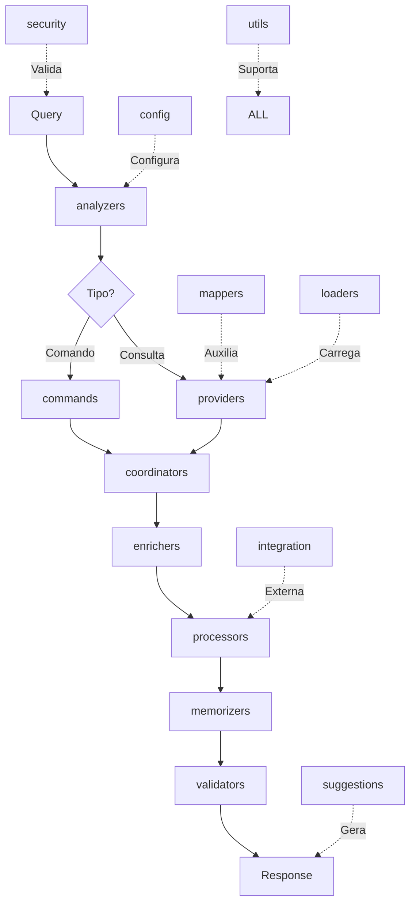

# 📊 ANÁLISE COMPLETA: Uso dos 19 Módulos no Sistema

## 🎯 Status Atual de Integração

### ✅ Módulos ATIVAMENTE Usados (11/19)

#### 1. **analyzers** ✅
- **Uso**: Análise de intenção e domínio
- **Onde**: Todos os workflows principais
- **Exemplo**: `analyze_query` → detecta "entregas" em "Como estão as entregas?"

#### 2. **commands** ✅
- **Uso**: Processamento de comandos naturais
- **Onde**: Workflow `natural_commands`
- **Exemplo**: "Gerar relatório de vendas" → comando detectado

#### 3. **coordinators** ✅
- **Uso**: Coordenação entre agentes especializados
- **Onde**: Workflow `intelligent_coordination`
- **Exemplo**: Query sobre fretes → FretesAgent

#### 4. **orchestrators** ✅
- **Uso**: Coordenação geral de workflows
- **Onde**: MainOrchestrator controla tudo
- **Exemplo**: Executa sequência analyzer→provider→processor

#### 5. **processors** ✅
- **Uso**: Processamento de dados e respostas
- **Onde**: ResponseProcessor gera respostas finais
- **Exemplo**: Formata dados em resposta legível

#### 6. **providers** ✅
- **Uso**: Fornecimento de dados do banco
- **Onde**: DataProvider busca dados reais
- **Exemplo**: Busca entregas do Atacadão no PostgreSQL

#### 7. **security** ✅
- **Uso**: Validação de segurança
- **Onde**: Validação antes de executar workflows
- **Exemplo**: Bloqueia comandos administrativos

#### 8. **suggestions** ✅
- **Uso**: Geração de sugestões inteligentes
- **Onde**: Workflow `intelligent_suggestions`
- **Exemplo**: Sugere queries relacionadas

#### 9. **utils** ✅
- **Uso**: Utilitários diversos
- **Onde**: Base classes, cache, helpers
- **Exemplo**: ResponseProcessor herda de ProcessorBase

#### 10. **validators** ✅
- **Uso**: Validação de resultados
- **Onde**: Final de workflows
- **Exemplo**: Valida resposta antes de enviar

#### 11. **mappers** ✅
- **Uso**: Mapeamento semântico
- **Onde**: Workflow `analyze_query`
- **Exemplo**: Mapeia "pedidos" → campos do banco

---

### ⚠️ Módulos PARCIALMENTE Usados (5/19)

#### 12. **config** ⚠️
- **Uso Atual**: Carrega configurações básicas
- **Potencial**: Configurações dinâmicas por ambiente
- **Melhoria**: Usar para feature flags e limites

#### 13. **enrichers** ⚠️
- **Uso Atual**: EnrichersWrapper criado mas pouco usado
- **Potencial**: Enriquecer respostas com contexto adicional
- **Melhoria**: Adicionar após load_data no workflow

#### 14. **loaders** ⚠️
- **Uso Atual**: Via DataManager (utils)
- **Potencial**: Carregar dados de múltiplas fontes
- **Melhoria**: Integrar com providers para dados externos

#### 15. **memorizers** ⚠️
- **Uso Atual**: SessionMemory existe mas não integrado
- **Potencial**: Lembrar contexto entre conversas
- **Melhoria**: Adicionar ao workflow para continuidade

#### 16. **integration** ⚠️
- **Uso Atual**: Claude API integration
- **Potencial**: Integrar outros sistemas externos
- **Melhoria**: Webhooks, APIs externas

---

### ❌ Módulos NÃO Usados (3/19)

#### 17. **conversers** ❌
- **Propósito**: Gerenciar conversas multi-turno
- **Por que não usado**: Sistema focado em queries únicas
- **Quando usar**: Chat contínuo com contexto

#### 18. **learners** ❌
- **Propósito**: Aprendizado adaptativo
- **Por que não usado**: Não há loop de feedback implementado
- **Quando usar**: Melhorar respostas com base em feedback

#### 19. **scanning** ❌
- **Propósito**: Escanear código/estruturas
- **Por que não usado**: Focado em runtime, não desenvolvimento
- **Quando usar**: Análise de código, debugging

---

## 🔄 Workflow Ideal Completo



---

## 📋 Recomendações de Melhoria

### 1. **Adicionar enrichers ao workflow**
```python
OrchestrationStep(
    name="enrich_data",
    component="enrichers",
    method="enrich_data",
    parameters={"data": "{load_data_result}"},
    dependencies=["load_data"]
)
```

### 2. **Integrar memorizers para contexto**
```python
OrchestrationStep(
    name="save_context",
    component="memorizers",
    method="save_interaction",
    parameters={"query": "{query}", "response": "{response}"},
    dependencies=["generate_response"]
)
```

### 3. **Usar learners para feedback**
```python
OrchestrationStep(
    name="learn_from_interaction",
    component="learners",
    method="process_feedback",
    parameters={"interaction": "{full_result}"},
    dependencies=["validate_response"]
)
```

### 4. **Ativar conversers para chat contínuo**
```python
# Novo workflow para conversas
self.add_workflow("conversation_flow", [
    OrchestrationStep(
        name="manage_conversation",
        component="conversers",
        method="process_turn",
        parameters={"message": "{message}", "history": "{history}"}
    )
])
```

---

## 📊 Métricas de Uso

| Status | Quantidade | Percentual |
|--------|------------|------------|
| ✅ Ativos | 11 | 58% |
| ⚠️ Parciais | 5 | 26% |
| ❌ Não usados | 3 | 16% |
| **TOTAL** | **19** | **100%** |

---

## 🎯 Conclusão

O sistema está usando **58% dos módulos ativamente**, o que é bom mas pode melhorar. Os módulos não usados (conversers, learners, scanning) são para funcionalidades avançadas que podem ser implementadas no futuro.

**Próximos passos prioritários:**
1. Integrar `enrichers` no workflow principal
2. Ativar `memorizers` para contexto de sessão
3. Configurar `learners` para melhorias contínuas 