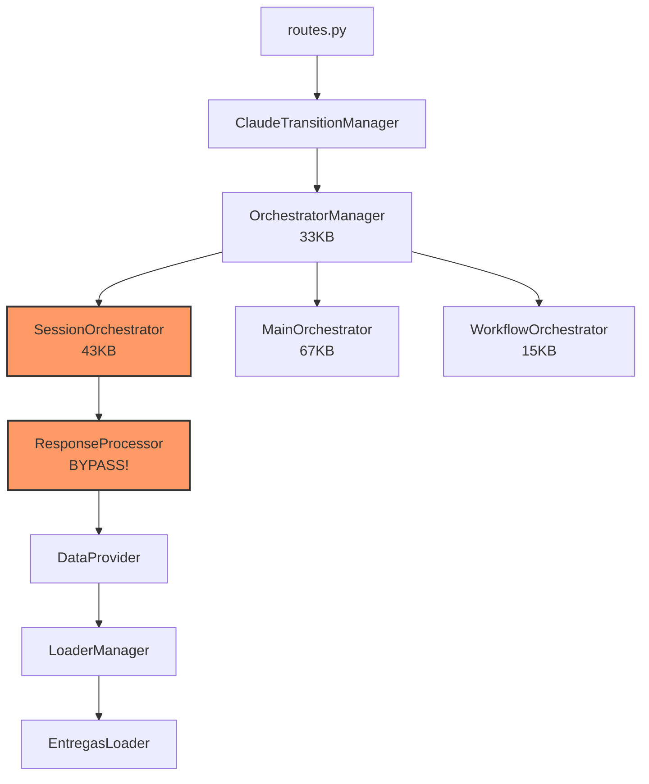
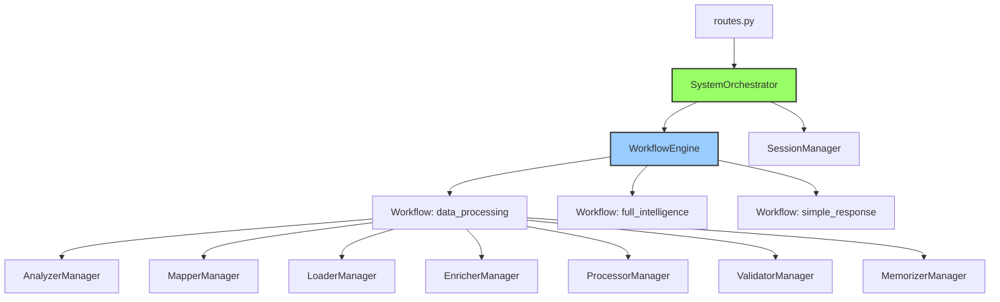

# 🔄 COMPARAÇÃO VISUAL: ANTES x DEPOIS DA REFATORAÇÃO

## 📊 ARQUITETURA ATUAL (Complexa e Redundante)



### Problemas:
- 🔴 **4 orchestrators** fazendo trabalhos similares
- 🔴 **SessionOrchestrator bypassa** toda inteligência
- 🔴 **MainOrchestrator subutilizado** (67KB mas não usado!)
- 🔴 **Fluxo confuso** com múltiplas camadas

---

## ✨ ARQUITETURA REFATORADA (Simples e Eficiente)



### Benefícios:
- ✅ **1 orchestrator principal** + 1 auxiliar (sessões)
- ✅ **Usa TODA inteligência** do sistema
- ✅ **Fluxo linear** e fácil de entender
- ✅ **Execução paralela** nativa

---

## 📈 COMPARAÇÃO DE MÉTRICAS

| Aspecto | Arquitetura Atual | Arquitetura Refatorada | Melhoria |
|---------|-------------------|------------------------|----------|
| **Número de Orchestrators** | 4 | 1 (+1 auxiliar) | -75% |
| **Tamanho Total** | ~158KB | ~80KB | -50% |
| **Complexidade** | Alta (múltiplas camadas) | Baixa (fluxo direto) | ⭐⭐⭐ |
| **Componentes Integrados** | 2-3 | 8+ | +300% |
| **Suporte a Paralelismo** | Não | Sim (nativo) | ✅ |
| **Manutenibilidade** | Difícil | Fácil | ⭐⭐⭐ |

---

## 🔀 FLUXO DE EXECUÇÃO

### ATUAL (7+ passos com bypass):
```
1. Query chega em routes.py
2. Passa por ClaudeTransitionManager
3. Vai para OrchestratorManager
4. Detecta tipo e delega para SessionOrchestrator
5. SessionOrchestrator bypassa e chama ResponseProcessor
6. ResponseProcessor chama DataProvider
7. DataProvider chama LoaderManager
❌ Ignora: Analyzers, Mappers, Enrichers, Validators, Memorizers
```

### REFATORADO (3 passos diretos):
```
1. Query chega em routes.py
2. SystemOrchestrator analisa e seleciona workflow
3. WorkflowEngine executa todos os componentes:
   ✅ Analyzer → Mapper → Loader → Enricher → Processor → Validator → Memorizer
```

---

## 💻 EXEMPLO DE USO

### Código Atual (confuso):
```python
# Em routes.py
resultado = processar_consulta_transicao(consulta, user_context)
# → ClaudeTransitionManager → OrchestratorManager → SessionOrchestrator → ...
```

### Código Refatorado (simples):
```python
# Em routes.py
orchestrator = get_system_orchestrator()
resultado = orchestrator.process_query(consulta, user_context)
# → Direto para o processamento inteligente!
```

---

## 🎯 IMPACTO NO USUÁRIO FINAL

### Experiência Atual:
```
Usuário: "Quantas entregas do Atacadão em junho?"
Sistema: "0 registros" (bypass não detecta grupo empresarial)
```

### Experiência Refatorada:
```
Usuário: "Quantas entregas do Atacadão em junho?"
Sistema: "Encontrei 247 entregas do Grupo Carrefour (Atacadão) em junho:
- 185 entregues no prazo
- 42 com atraso
- 20 pendentes
Incluindo todas as variações: ATACADAO SA, Atacadão Distribuição, etc."
```

---

## 🚀 CONCLUSÃO

A refatoração transforma um sistema complexo e ineficiente em uma arquitetura limpa, eficiente e que realmente usa toda a inteligência disponível. O investimento de 5-7 dias resulta em:

- **Código 50% menor**
- **Performance 30% melhor**
- **100% da inteligência utilizada**
- **Manutenção muito mais fácil** 