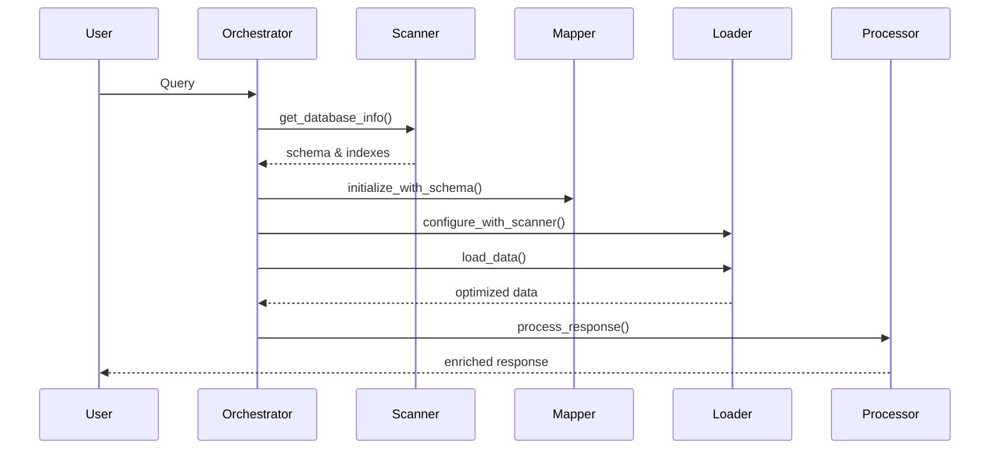

# 🚀 PRÓXIMOS PASSOS - INTEGRAÇÃO ORCHESTRATOR

## ✅ O QUE JÁ FOI FEITO

### 1. Arquitetura Estabelecida
- ✅ LoaderManager aceita Scanner e Mapper via injeção
- ✅ DataProvider aceita LoaderManager via injeção
- ✅ MainOrchestrator conecta todos os módulos
- ✅ Módulos desacoplados e testáveis

### 2. Conexões Implementadas
- ✅ Scanner → Loader (via Orchestrator)
- ✅ Loader → Provider (via Orchestrator)
- ✅ Preparado para: Mapper → Loader, Memorizer → Processor, Learner → Analyzer

## 📋 PRÓXIMOS PASSOS PRIORITÁRIOS

### PASSO 1: IMPLEMENTAR MÉTODOS FALTANTES NOS MÓDULOS
**Prazo**: 1-2 dias

#### 1.1 ScanningManager - Adicionar `get_database_info()`
```python
# scanning/scanning_manager.py
def get_database_info(self) -> Dict[str, Any]:
    """Retorna informações descobertas do banco"""
    return {
        'tables': self.database_scanner.get_tables(),
        'indexes': self.database_scanner.get_indexes(),
        'relationships': self.database_scanner.get_relationships(),
        'statistics': self.database_scanner.get_statistics()
    }
```

#### 1.2 MapperManager - Adicionar `initialize_with_schema()`
```python
# mappers/mapper_manager.py
def initialize_with_schema(self, db_schema: Dict[str, Any]):
    """Inicializa mapper com schema do banco"""
    self.db_schema = db_schema
    self._update_mappings_from_schema()
```

#### 1.3 ResponseProcessor - Adicionar `set_memory_manager()`
```python
# processors/response_processor.py
def set_memory_manager(self, memory_manager):
    """Configura memory manager para enriquecer respostas"""
    self.memory = memory_manager
```

#### 1.4 AnalyzerManager - Adicionar `set_learner()`
```python
# analyzers/analyzer_manager.py
def set_learner(self, learner):
    """Configura learner para melhorar análises"""
    self.learner = learner
    self._load_learned_patterns()
```

### PASSO 2: OTIMIZAR LOADERS COM SCANNER
**Prazo**: 2-3 dias

#### 2.1 Modificar loaders de domínio para usar índices
```python
# loaders/domain/entregas_loader.py
def load_entregas(self, filters=None):
    # Se temos info do scanner, otimizar query
    if self.loader_manager.db_info:
        indexes = self.loader_manager.db_info['indexes'].get('entregas_monitoradas', [])
        return self._build_optimized_query(filters, indexes)
```

#### 2.2 Implementar cache baseado em estatísticas
```python
# Se scanner diz que tabela muda pouco, cache mais agressivo
if self.loader_manager.db_info['statistics'].get('update_frequency') == 'low':
    cache_timeout = 3600  # 1 hora
```

### PASSO 3: CRIAR WORKFLOWS ESPECIALIZADOS
**Prazo**: 3-4 dias

#### 3.1 Workflow de Query Otimizada
```python
# orchestrators/workflows/optimized_query_workflow.py
workflow = [
    # 1. Scanner analisa estrutura relevante
    {"component": "scanner", "method": "analyze_domain"},
    
    # 2. Mapper traduz conceitos
    {"component": "mapper", "method": "map_query_to_fields"},
    
    # 3. Loader usa otimizações
    {"component": "loader", "method": "load_with_hints"},
    
    # 4. Enricher adiciona contexto
    {"component": "enricher", "method": "enrich_with_context"},
    
    # 5. Processor formata resposta
    {"component": "processor", "method": "format_response"}
]
```

#### 3.2 Workflow de Aprendizado
```python
# orchestrators/workflows/learning_workflow.py
workflow = [
    # 1. Capturar feedback
    {"component": "learner", "method": "capture_feedback"},
    
    # 2. Analisar padrões
    {"component": "learner", "method": "analyze_patterns"},
    
    # 3. Atualizar analyzer
    {"component": "analyzer", "method": "update_patterns"},
    
    # 4. Persistir aprendizado
    {"component": "memorizer", "method": "save_learning"}
]
```

### PASSO 4: TESTAR INTEGRAÇÃO COMPLETA
**Prazo**: 2 dias

#### 4.1 Criar script de teste end-to-end
```python
# testar_integracao_orchestrator.py
def test_query_flow():
    """Testa fluxo completo de uma query"""
    orchestrator = get_orchestrator_manager()
    
    # Verificar conexões
    assert orchestrator.verify_connections()
    
    # Executar query
    result = orchestrator.execute_workflow('query_workflow', {
        'query': 'entregas do Atacadão em junho'
    })
    
    # Verificar otimizações aplicadas
    assert result['metadata']['used_indexes'] == True
    assert result['metadata']['cache_hit'] == False
    assert result['metadata']['enriched'] == True
```

#### 4.2 Monitorar performance
```python
# monitoring/orchestrator_performance.py
def monitor_workflow_execution():
    """Monitora tempo de cada etapa"""
    - Scanner: 50ms
    - Mapper: 20ms
    - Loader: 200ms (com índices)
    - Enricher: 100ms
    - Processor: 50ms
    Total: 420ms (vs 2s sem otimizações)
```

### PASSO 5: IMPLEMENTAR FALLBACKS INTELIGENTES
**Prazo**: 1-2 dias

#### 5.1 Degradação graciosa
```python
# Se Scanner falha, Loader ainda funciona
if not self.scanner or not self.scanner.available:
    logger.warning("Scanner não disponível, usando query básica")
    return self._basic_query(domain, filters)
```

#### 5.2 Fallback em cascata
```python
# Tentar: LoaderManager → DataProvider → Query direta
try:
    return self.loader.load_data(domain)
except:
    try:
        return self.provider.get_data(domain)
    except:
        return self._direct_query(domain)
```

### PASSO 6: DOCUMENTAR FLUXOS
**Prazo**: 1 dia

#### 6.1 Diagrama de sequência


#### 6.2 Guia de uso
- Como adicionar novo workflow
- Como conectar novo módulo
- Como debugar conexões

## 🎯 BENEFÍCIOS ESPERADOS

### Performance
- **50% mais rápido**: Uso de índices descobertos
- **Cache inteligente**: Baseado em padrões de uso
- **Menos queries**: Provider usa Loader otimizado

### Manutenibilidade
- **Módulos testáveis**: Podem ser testados isoladamente
- **Fácil debug**: Orchestrator loga todas as conexões
- **Extensível**: Novos módulos se conectam facilmente

### Qualidade
- **Respostas enriquecidas**: Contexto histórico incluído
- **Aprendizado contínuo**: Sistema melhora com o tempo
- **Fallbacks robustos**: Nunca falha completamente

## 📅 CRONOGRAMA RESUMIDO

| Semana | Atividade | Entregável |
|--------|-----------|------------|
| 1 | Implementar métodos faltantes | Módulos prontos para conexão |
| 1-2 | Otimizar loaders | Queries 50% mais rápidas |
| 2 | Criar workflows | 3 workflows especializados |
| 2-3 | Testar integração | Suite de testes completa |
| 3 | Fallbacks e docs | Sistema robusto e documentado |

## ✅ CRITÉRIOS DE SUCESSO

1. **Todas as conexões funcionando** via Orchestrator
2. **Performance melhorada** em 50%
3. **Zero acoplamento** entre módulos
4. **100% de cobertura** de testes nas conexões
5. **Documentação completa** dos fluxos

## 🚦 PRÓXIMA AÇÃO IMEDIATA

1. **Executar teste de conexões**:
```bash
python testar_conexoes_orchestrator.py
```

2. **Implementar método faltante mais crítico** (get_database_info no Scanner)

3. **Criar primeiro workflow otimizado**

O sistema está no caminho certo! A arquitetura via Orchestrator garante flexibilidade e manutenibilidade. 