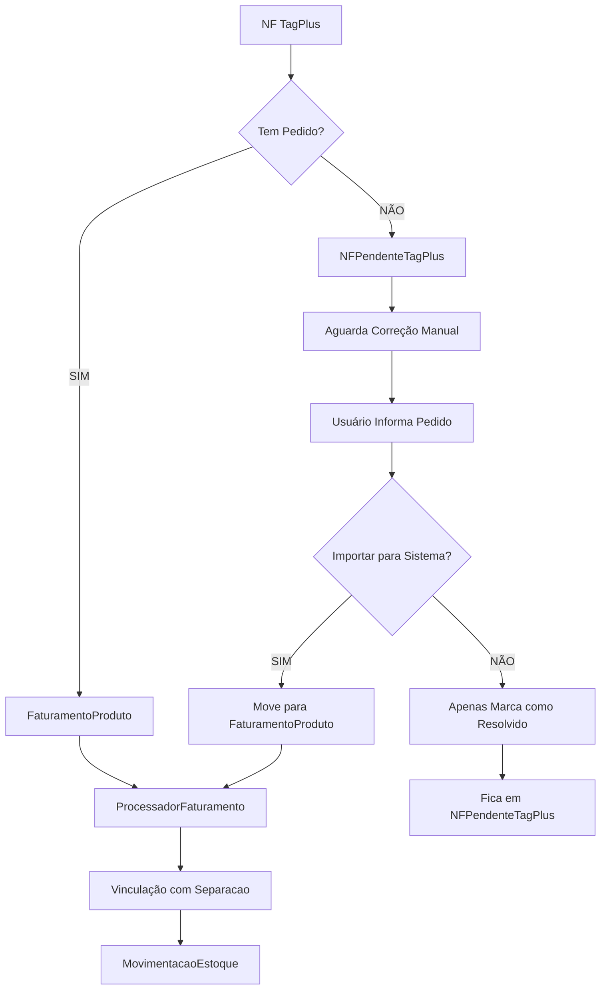

# 🔄 FLUXO CORRIGIDO DE IMPORTAÇÃO DE NFS TAGPLUS

## 🎯 VISÃO GERAL DO PROBLEMA

### Situação Atual (PROBLEMAS):
1. NFs sem pedido vão para NFPendenteTagPlus ✓
2. Mas ao corrigir, o botão "Salvar" não deixa claro o que faz
3. Checkbox "Reprocessar automaticamente" é confuso
4. Processamento não sai da tela após concluir
5. MovimentacaoEstoque pode ser criada sem pedido (via score)

---

## 📊 FLUXO PROPOSTO (CORRIGIDO)



---

## 🛠️ CORREÇÕES NECESSÁRIAS

### 1. **RENOMEAR BOTÕES E LABELS**

#### Tela de Correção (`tagplus_correcao_pedidos.html`):
- **Botão "Salvar"** → **"Importar para Sistema"**
- **Checkbox** → **"Processar vinculação após importar"**
- **Descrição clara**: "Ao clicar em 'Importar', a NF será movida para o faturamento principal"

### 2. **FLUXO DE PROCESSAMENTO**

#### Estados de uma NF Pendente:

| Estado | resolvido | importado | origem | Descrição |
|--------|-----------|-----------|--------|-----------|
| **Pendente** | false | false | null | Aguardando pedido |
| **Resolvido** | true | false | PED-123 | Pedido informado, não importado |
| **Importado** | true | true | PED-123 | Movido para FaturamentoProduto |

### 3. **AÇÕES DISPONÍVEIS**

#### Para NF Individual:
1. **"Preencher Pedido"** - Apenas atualiza campo `origem`
2. **"Importar para Sistema"** - Move para FaturamentoProduto + Processa

#### Para Lote:
1. **"Atualizar Pedidos"** - Apenas atualiza campos
2. **"Importar Selecionadas"** - Move todas + Processa

---

## 🔧 IMPLEMENTAÇÃO

### PASSO 1: Clarificar Interface

```javascript
// Botão individual
<button onclick="importarNF('{{ nf.numero_nf }}')"
        class="btn btn-sm btn-success"
        title="Importar para Sistema">
    <i class="fas fa-file-import"></i> Importar
</button>

// Checkbox com texto claro
<label for="processarAposImportar">
    <input type="checkbox" id="processarAposImportar" checked>
    Processar vinculação com embarques após importar
    <small class="text-muted d-block">
        (Marca como faturado e vincula com separações existentes)
    </small>
</label>
```

### PASSO 2: Separar Ações

```python
def atualizar_pedido_nf(numero_nf, numero_pedido):
    """APENAS atualiza o pedido, NÃO importa"""
    # Atualiza origem
    # Marca resolvido=True
    # NÃO marca importado
    # NÃO cria FaturamentoProduto

def importar_nf_resolvida(numero_nf, processar=True):
    """Importa NF para FaturamentoProduto"""
    # Verifica se tem origem preenchida
    # Cria FaturamentoProduto
    # Marca importado=True
    # Se processar=True: ProcessadorFaturamento
```

### PASSO 3: Feedback Claro

```javascript
// Após importar com sucesso
Swal.fire({
    icon: 'success',
    title: 'NF Importada!',
    html: `
        <p>✅ NF ${nf} importada para o sistema principal</p>
        <p>✅ ${itens} itens criados em FaturamentoProduto</p>
        ${processado ? '<p>✅ Vinculação processada</p>' : ''}
    `,
    showConfirmButton: true,
    confirmButtonText: 'Ver Faturamento',
    showCancelButton: true,
    cancelButtonText: 'Continuar Aqui'
}).then(result => {
    if (result.isConfirmed) {
        window.location.href = '/faturamento/dashboard';
    }
});
```

---

## 🚫 REGRAS DE NEGÓCIO

### NÃO PERMITIR:
1. ❌ Importar NF sem número de pedido
2. ❌ Duplicar NF em FaturamentoProduto
3. ❌ Criar MovimentacaoEstoque sem pedido válido
4. ❌ Processar a mesma NF duas vezes

### SEMPRE VERIFICAR:
1. ✅ Se NF já existe em FaturamentoProduto antes de importar
2. ✅ Se pedido existe em Separacao antes de vincular
3. ✅ Se há itens pendentes antes de marcar como concluído

---

## 📋 CHECKLIST DE VALIDAÇÃO

### Ao Importar NF do TagPlus:
- [ ] Tem número de pedido? → FaturamentoProduto
- [ ] Não tem pedido? → NFPendenteTagPlus

### Ao Corrigir Pedido:
- [ ] Pedido preenchido? → Habilita botão "Importar"
- [ ] Clicou "Importar"? → Move para FaturamentoProduto
- [ ] Processar vinculação? → Chama ProcessadorFaturamento

### Ao Processar:
- [ ] Existe Separacao com mesmo pedido? → Vincula
- [ ] Não existe? → Mantém sem vinculação (não cria falso positivo)

---

## 🔄 FLUXO DE FALLBACK

### Cenário 1: NF sem pedido
1. Vai para NFPendenteTagPlus
2. Usuário pesquisa/descobre pedido
3. Informa pedido e importa
4. Sistema processa normalmente

### Cenário 2: NF com pedido errado
1. Já foi para FaturamentoProduto
2. Usuário corrige campo `origem`
3. Reprocessa vinculação

### Cenário 3: NF sem embarque correspondente
1. Fica em FaturamentoProduto
2. NÃO cria MovimentacaoEstoque falsa
3. Aguarda criação do embarque

---

## 💡 MELHORIAS FUTURAS

1. **Auto-descoberta de pedido**:
   - Buscar por CNPJ + data aproximada
   - Sugerir pedidos prováveis

2. **Validação em tempo real**:
   - Verificar se pedido existe ao digitar
   - Mostrar preview do que será vinculado

3. **Auditoria completa**:
   - Log de todas as correções
   - Histórico de mudanças

---

## 🎯 RESULTADO ESPERADO

Com essas correções:
1. **Clareza**: Usuário entende exatamente o que cada botão faz
2. **Consistência**: Dados sempre fluem na direção correta
3. **Rastreabilidade**: Sempre possível saber o estado de uma NF
4. **Sem duplicação**: Impossível processar duas vezes
5. **Sem dados falsos**: Não cria vinculações incorretas