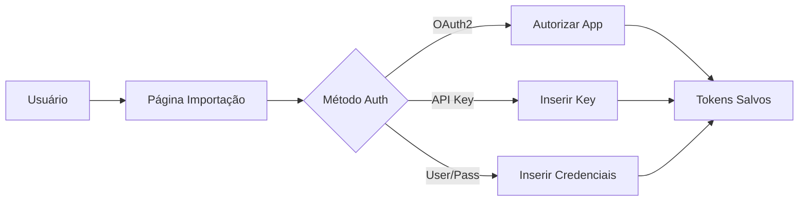
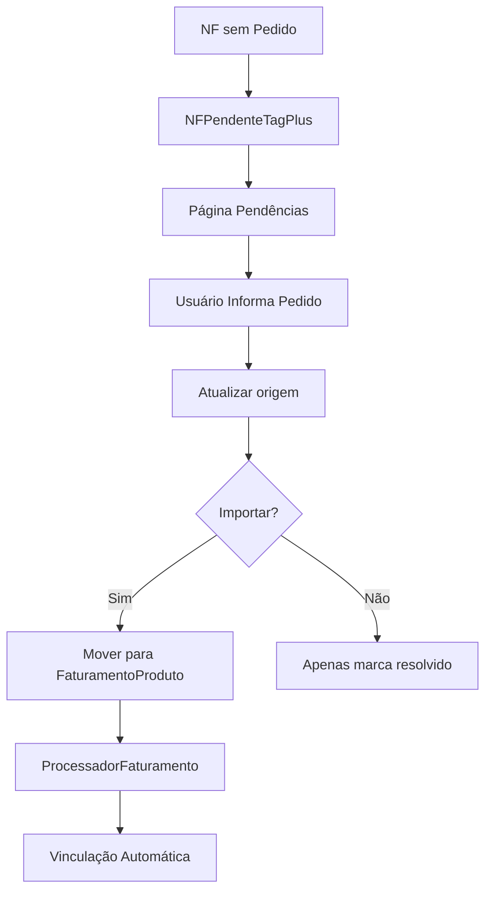

# 📊 FLUXO COMPLETO DE IMPORTAÇÃO TAGPLUS

## 🎯 Visão Geral

O sistema de importação TagPlus permite importar Clientes e Notas Fiscais do sistema TagPlus para o Sistema de Fretes, com processamento automático de faturamento e vinculação com pedidos.

---

## 🔗 Endpoints e Rotas

### 1. **Rotas de Interface (Browser)**

| Rota | Método | Descrição | Template |
|------|--------|-----------|----------|
| `/integracoes/tagplus/importacao` | GET | Página principal de importação | `tagplus_importacao.html` |
| `/integracoes/tagplus/importar` | GET | Redireciona para OAuth2 | - |
| `/integracoes/tagplus/pendencias` | GET | NFs pendentes (sem pedido) | `tagplus_correcao_pedidos.html` |
| `/integracoes/tagplus/correcao-pedidos` | GET | Redireciona para pendências | - |

### 2. **Rotas de API (AJAX)**

| Rota | Método | Descrição | Parâmetros |
|------|--------|-----------|------------|
| `/integracoes/tagplus/api/testar-conexao` | POST | Testa conexão com TagPlus | `{usuario, senha, access_token, etc}` |
| `/integracoes/tagplus/api/importar-clientes` | POST | Importa clientes | `{limite}` |
| `/integracoes/tagplus/api/importar-nfs` | POST | Importa notas fiscais | `{data_inicio, data_fim, limite}` |
| `/integracoes/tagplus/api/status` | GET | Status das APIs | - |

### 3. **Rotas V2 - Pendências**

| Rota | Método | Descrição | Parâmetros |
|------|--------|-----------|------------|
| `/integracoes/tagplus/api/v2/atualizar-pedido-pendente` | POST | Atualiza pedido em NF pendente | `{numero_nf, numero_pedido, importar}` |
| `/integracoes/tagplus/api/v2/atualizar-pedidos-pendentes-lote` | POST | Atualiza múltiplos pedidos | `{atualizacoes[], importar}` |
| `/integracoes/tagplus/api/v2/estatisticas-pendentes` | GET | Estatísticas de pendências | - |
| `/integracoes/tagplus/api/v2/buscar-pedido-sugerido/<nf>` | GET | Busca sugestão de pedido | - |

### 4. **Webhooks (Recebimento Automático)**

| Rota | Método | Descrição | Headers |
|------|--------|-----------|---------|
| `/webhook/tagplus/cliente` | POST | Recebe cliente novo/atualizado | `X-TagPlus-Signature` |
| `/webhook/tagplus/nfe` | POST | Recebe NFE autorizada/cancelada | `X-TagPlus-Signature` |
| `/webhook/tagplus/teste` | GET/POST | Teste de webhook | - |

---

## 📋 Fluxo de Importação Passo a Passo

### **PASSO 1: Autenticação**



**Arquivos envolvidos:**
- `app/integracoes/tagplus/oauth2_v2.py` - Gerencia tokens OAuth2
- `app/integracoes/tagplus/routes.py:25-27` - Rota de autorização

### **PASSO 2: Teste de Conexão**

```python
# Fluxo interno:
1. POST /api/testar-conexao
2. ImportadorTagPlusV2.testar_conexoes()
3. oauth_clientes.test_connection()
4. oauth_notas.test_connection()
5. Retorna status de cada API
```

### **PASSO 3: Importação de Clientes**

```python
# Processo de importação:
1. POST /api/importar-clientes
2. ImportadorTagPlusV2.importar_clientes(limite)
3. Loop paginado:
   - GET /clientes da API TagPlus
   - Para cada cliente:
     - Verifica se existe por CNPJ
     - Cria ou atualiza CadastroCliente
4. Commit no banco
5. Retorna estatísticas
```

**Tabela afetada:** `cadastro_cliente`

### **PASSO 4: Importação de Notas Fiscais**

```python
# Processo completo:
1. POST /api/importar-nfs (data_inicio, data_fim)
2. ImportadorTagPlusV2.importar_nfs()
3. Loop paginado:
   - GET /notas-fiscais da API TagPlus
   - Para cada NF:
     a) Verifica se tem número de pedido
     b) SE tem pedido:
        - Cria itens em FaturamentoProduto
        - Marca como created_by='TagPlus'
     c) SE NÃO tem pedido:
        - Cria itens em NFPendenteTagPlus
        - Marca como resolvido=False
4. ProcessadorFaturamento.processar_nfs_importadas()
   - Calcula scores de vinculação
   - Cria MovimentacaoEstoque
   - Vincula com Separacao
5. Retorna estatísticas
```

**Tabelas afetadas:**
- `faturamento_produto` - NFs com pedido
- `nf_pendente_tagplus` - NFs sem pedido
- `movimentacao_estoque` - Após processamento
- `separacao` - Vinculação

---

## 🔄 Fluxo de Correção de Pedidos Pendentes

### **Situação:** NF importada sem número de pedido



**Processo detalhado:**

1. **Visualização:** `/integracoes/tagplus/pendencias`
   - Lista NFs pendentes de NFPendenteTagPlus
   - Mostra estatísticas

2. **Correção individual:**
   ```javascript
   POST /api/v2/atualizar-pedido-pendente
   {
     "numero_nf": "3753",
     "numero_pedido": "PED-001",
     "importar": true
   }
   ```

3. **Correção em lote:**
   ```javascript
   POST /api/v2/atualizar-pedidos-pendentes-lote
   {
     "atualizacoes": [
       {"numero_nf": "3753", "numero_pedido": "PED-001"},
       {"numero_nf": "3754", "numero_pedido": "PED-002"}
     ],
     "importar": true
   }
   ```

4. **Processamento após correção:**
   - Atualiza campo `origem` em NFPendenteTagPlus
   - Se `importar=true`:
     - Move dados para FaturamentoProduto
     - Executa ProcessadorFaturamento
     - Marca como `importado=true`

---

## 🗄️ Estrutura de Dados

### **NFPendenteTagPlus** (`app/integracoes/tagplus/models.py:8`)

```python
class NFPendenteTagPlus:
    # Identificação
    numero_nf           # NF do TagPlus
    cnpj_cliente       # CNPJ do cliente
    nome_cliente       # Nome do cliente

    # Produto
    cod_produto        # Código do produto
    nome_produto       # Descrição
    qtd_produto_faturado
    preco_produto_faturado
    valor_produto_faturado

    # Controle
    origem            # Número do pedido (a preencher)
    resolvido        # Se foi resolvido
    importado        # Se foi importado para FaturamentoProduto

    # Unique constraint: (numero_nf, cod_produto)
```

---

## 🔧 Script de Exclusão de NFs de Teste

**Arquivo:** `app/integracoes/tagplus/excluir_nfs_teste.py`

### **Uso:**

```bash
# Modo simulação (mostra o que seria excluído)
python app/integracoes/tagplus/excluir_nfs_teste.py

# Modo execução (exclui de verdade)
python app/integracoes/tagplus/excluir_nfs_teste.py --execute
```

### **O que faz:**
- Exclui NFs 3753 até 3771 de:
  - FaturamentoProduto
  - NFPendenteTagPlus
- Mostra detalhes de cada item antes de excluir
- Permite reexecutar testes de importação

---

## 🚀 Fluxo de Teste Completo

1. **Limpar dados de teste:**
   ```bash
   python app/integracoes/tagplus/excluir_nfs_teste.py --execute
   ```

2. **Acessar página de importação:**
   ```
   http://localhost:5000/integracoes/tagplus/importacao
   ```

3. **Testar conexão:**
   - Inserir credenciais
   - Clicar em "Testar Conexão"

4. **Importar clientes:**
   - Definir limite (opcional)
   - Clicar em "Importar Clientes"

5. **Importar NFs:**
   - Selecionar período
   - Clicar em "Importar Notas Fiscais"

6. **Verificar pendências:**
   - Acessar "Corrigir Pedidos"
   - Informar números de pedido
   - Processar importação

7. **Verificar resultados:**
   - Checar FaturamentoProduto
   - Verificar vinculações em Separacao
   - Confirmar MovimentacaoEstoque

---

## 📊 Monitoramento e Logs

### **Logs importantes:**

```python
# Importação de clientes
logger.info(f"📥 Importando clientes (limite: {limite})...")

# Importação de NFs
logger.info(f"📦 Importando NFs de {data_inicio} até {data_fim}")

# NFs sem pedido
logger.warning(f"⚠️ NF {numero_nf} sem pedido - enviando para pendências")

# Processamento
logger.info(f"✅ NF {numero_nf} processada com sucesso")
```

### **Tabelas de controle:**

- `nf_pendente_tagplus` - NFs aguardando pedido
- `faturamento_produto` - NFs importadas
- `movimentacao_estoque` - Vinculações realizadas

---

## 🛠️ Troubleshooting

### **Problema: Token OAuth2 expirado**
- **Solução:** Clicar em "Autorizar OAuth2" novamente

### **Problema: NFs não vinculando**
- **Verificar:**
  1. Se tem número de pedido (`origem`)
  2. Se existe Separacao correspondente
  3. Se ProcessadorFaturamento foi executado

### **Problema: Duplicação de NFs**
- **Verificar:** Unique constraint em NFPendenteTagPlus
- **Solução:** Script de limpeza antes de reimportar

---

## 📝 Notas Importantes

1. **Sempre importar clientes antes das NFs**
2. **NFs sem pedido vão para tabela de pendências**
3. **Processamento automático usa score de vinculação**
4. **Webhooks permitem importação em tempo real**
5. **Script de exclusão facilita retestes**