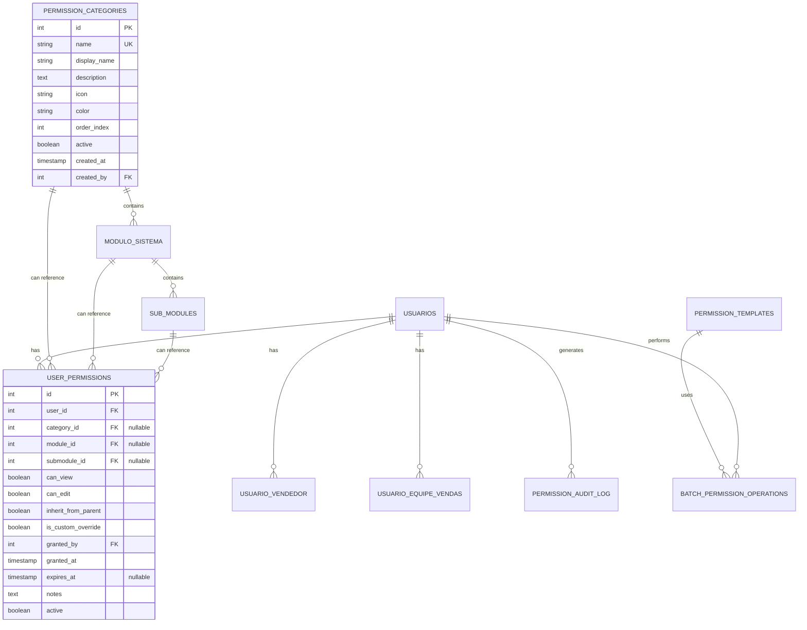

# Permission System Database Schema Design

## Overview

This document provides the detailed database schema design for the hierarchical permission system with support for categories, modules, submodules, and flexible user associations.

## Entity Relationship Diagram



## Detailed Table Specifications

### 1. permission_categories

**Purpose**: Top-level grouping of related modules (e.g., "Commercial", "Financial", "Operational")

```sql
CREATE TABLE permission_categories (
    id SERIAL PRIMARY KEY,
    name VARCHAR(50) UNIQUE NOT NULL,  -- Unique identifier (e.g., 'commercial')
    display_name VARCHAR(100) NOT NULL, -- UI display name
    description TEXT,
    icon VARCHAR(50) DEFAULT 'folder',  -- Icon identifier or emoji
    color VARCHAR(7) DEFAULT '#6c757d', -- Hex color for UI
    order_index INTEGER DEFAULT 0,      -- Display order
    active BOOLEAN DEFAULT TRUE,
    created_at TIMESTAMP DEFAULT CURRENT_TIMESTAMP,
    created_by INTEGER REFERENCES usuarios(id),
    updated_at TIMESTAMP DEFAULT CURRENT_TIMESTAMP,
    
    -- Constraints
    CONSTRAINT chk_color_format CHECK (color ~ '^#[0-9A-Fa-f]{6}$'),
    CONSTRAINT chk_name_format CHECK (name ~ '^[a-z_]+$')
);

-- Indexes
CREATE INDEX idx_categories_active ON permission_categories(active);
CREATE INDEX idx_categories_order ON permission_categories(order_index, name);
```

### 2. modulo_sistema (Enhanced)

**Purpose**: Modules within categories (e.g., "Order Management" within "Commercial")

```sql
-- Drop existing foreign key if needed
ALTER TABLE modulo_sistema DROP CONSTRAINT IF EXISTS fk_module_category;

-- Add category relationship
ALTER TABLE modulo_sistema 
ADD COLUMN category_id INTEGER REFERENCES permission_categories(id),
ADD COLUMN parent_module_id INTEGER REFERENCES modulo_sistema(id),
ADD COLUMN is_system_module BOOLEAN DEFAULT FALSE,
ADD COLUMN updated_at TIMESTAMP DEFAULT CURRENT_TIMESTAMP;

-- Add constraints
ALTER TABLE modulo_sistema
ADD CONSTRAINT chk_no_self_parent CHECK (id != parent_module_id);

-- Create indexes
CREATE INDEX idx_modules_category ON modulo_sistema(category_id, active);
CREATE INDEX idx_modules_parent ON modulo_sistema(parent_module_id);
```

### 3. sub_modules

**Purpose**: Specific functions within modules (replaces funcao_modulo)

```sql
CREATE TABLE sub_modules (
    id SERIAL PRIMARY KEY,
    module_id INTEGER NOT NULL REFERENCES modulo_sistema(id) ON DELETE CASCADE,
    name VARCHAR(50) NOT NULL,
    display_name VARCHAR(100) NOT NULL,
    description TEXT,
    route_pattern VARCHAR(200),        -- URL pattern for this submodule
    api_endpoint VARCHAR(200),         -- API endpoint pattern
    critical_level VARCHAR(10) DEFAULT 'NORMAL' CHECK (critical_level IN ('LOW', 'NORMAL', 'HIGH', 'CRITICAL')),
    requires_reason BOOLEAN DEFAULT FALSE,  -- Requires reason for access
    max_access_duration INTEGER,       -- Max minutes for temporary access
    active BOOLEAN DEFAULT TRUE,
    order_index INTEGER DEFAULT 0,
    created_at TIMESTAMP DEFAULT CURRENT_TIMESTAMP,
    updated_at TIMESTAMP DEFAULT CURRENT_TIMESTAMP,
    
    -- Unique constraint
    CONSTRAINT uq_submodule_name UNIQUE (module_id, name),
    
    -- Name format
    CONSTRAINT chk_submodule_name CHECK (name ~ '^[a-z_]+$')
);

-- Indexes
CREATE INDEX idx_submodules_module ON sub_modules(module_id, active);
CREATE INDEX idx_submodules_critical ON sub_modules(critical_level) WHERE active = TRUE;
```

### 4. user_permissions

**Purpose**: Stores actual permissions at any hierarchy level with inheritance control

```sql
CREATE TABLE user_permissions (
    id SERIAL PRIMARY KEY,
    user_id INTEGER NOT NULL REFERENCES usuarios(id) ON DELETE CASCADE,
    
    -- Permission level (one must be set)
    category_id INTEGER REFERENCES permission_categories(id) ON DELETE CASCADE,
    module_id INTEGER REFERENCES modulo_sistema(id) ON DELETE CASCADE,
    submodule_id INTEGER REFERENCES sub_modules(id) ON DELETE CASCADE,
    
    -- Permissions
    can_view BOOLEAN DEFAULT FALSE,
    can_edit BOOLEAN DEFAULT FALSE,
    can_delete BOOLEAN DEFAULT FALSE,
    can_export BOOLEAN DEFAULT FALSE,
    
    -- Inheritance control
    inherit_from_parent BOOLEAN DEFAULT TRUE,
    is_custom_override BOOLEAN DEFAULT FALSE,
    override_notes TEXT,
    
    -- Metadata
    granted_by INTEGER REFERENCES usuarios(id),
    granted_at TIMESTAMP DEFAULT CURRENT_TIMESTAMP,
    expires_at TIMESTAMP,
    last_used_at TIMESTAMP,
    usage_count INTEGER DEFAULT 0,
    
    -- Soft delete and notes
    active BOOLEAN DEFAULT TRUE,
    deactivated_at TIMESTAMP,
    deactivated_by INTEGER REFERENCES usuarios(id),
    notes TEXT,
    
    -- Ensure unique permission per level
    CONSTRAINT uq_user_permission UNIQUE (user_id, category_id, module_id, submodule_id),
    
    -- Ensure at least one level is specified
    CONSTRAINT chk_permission_level CHECK (
        (category_id IS NOT NULL AND module_id IS NULL AND submodule_id IS NULL) OR
        (category_id IS NULL AND module_id IS NOT NULL AND submodule_id IS NULL) OR
        (category_id IS NULL AND module_id IS NULL AND submodule_id IS NOT NULL)
    ),
    
    -- Ensure edit requires view
    CONSTRAINT chk_edit_requires_view CHECK (NOT can_edit OR can_view),
    CONSTRAINT chk_delete_requires_edit CHECK (NOT can_delete OR can_edit),
    CONSTRAINT chk_export_requires_view CHECK (NOT can_export OR can_view)
);

-- Indexes for performance
CREATE INDEX idx_user_permissions_user ON user_permissions(user_id, active);
CREATE INDEX idx_user_permissions_category ON user_permissions(category_id) WHERE category_id IS NOT NULL;
CREATE INDEX idx_user_permissions_module ON user_permissions(module_id) WHERE module_id IS NOT NULL;
CREATE INDEX idx_user_permissions_submodule ON user_permissions(submodule_id) WHERE submodule_id IS NOT NULL;
CREATE INDEX idx_user_permissions_expires ON user_permissions(expires_at) WHERE expires_at IS NOT NULL AND active = TRUE;
```

### 5. permission_templates

**Purpose**: Pre-defined permission sets for quick assignment

```sql
CREATE TABLE permission_templates (
    id SERIAL PRIMARY KEY,
    name VARCHAR(100) NOT NULL,
    code VARCHAR(50) UNIQUE NOT NULL,  -- Unique identifier
    description TEXT,
    category VARCHAR(50),               -- Template category (e.g., 'roles', 'departments')
    
    -- JSON structure for permissions
    template_data JSONB NOT NULL,
    /* Example structure:
    {
        "permissions": [
            {
                "type": "category",
                "id": 1,
                "can_view": true,
                "can_edit": false
            },
            {
                "type": "module", 
                "id": 10,
                "can_view": true,
                "can_edit": true,
                "apply_to_submodules": true
            }
        ],
        "vendors": ["Vendor A", "Vendor B"],
        "teams": ["Sales Team 1"]
    }
    */
    
    -- Metadata
    is_system_template BOOLEAN DEFAULT FALSE,
    created_by INTEGER REFERENCES usuarios(id),
    created_at TIMESTAMP DEFAULT CURRENT_TIMESTAMP,
    updated_at TIMESTAMP DEFAULT CURRENT_TIMESTAMP,
    active BOOLEAN DEFAULT TRUE,
    usage_count INTEGER DEFAULT 0,
    
    -- Constraints
    CONSTRAINT chk_template_code CHECK (code ~ '^[a-z_]+$')
);

-- Indexes
CREATE INDEX idx_templates_code ON permission_templates(code) WHERE active = TRUE;
CREATE INDEX idx_templates_category ON permission_templates(category);
CREATE INDEX idx_templates_data ON permission_templates USING GIN (template_data);
```

### 6. batch_permission_operations

**Purpose**: Track bulk permission changes for audit and rollback

```sql
CREATE TABLE batch_permission_operations (
    id SERIAL PRIMARY KEY,
    operation_id UUID DEFAULT gen_random_uuid(),
    operation_type VARCHAR(50) NOT NULL,
    
    -- Operation details (JSON)
    operation_details JSONB NOT NULL,
    /* Example:
    {
        "template_id": 1,
        "user_ids": [1, 2, 3],
        "permissions_before": {...},
        "permissions_after": {...},
        "options": {
            "override_existing": true,
            "send_notifications": false
        }
    }
    */
    
    -- Affected entities
    affected_users JSONB NOT NULL,      -- Array of user IDs
    changes_made JSONB NOT NULL,        -- Detailed changes per user
    
    -- Execution info
    performed_by INTEGER NOT NULL REFERENCES usuarios(id),
    performed_at TIMESTAMP DEFAULT CURRENT_TIMESTAMP,
    ip_address INET,
    user_agent TEXT,
    
    -- Status tracking
    status VARCHAR(20) DEFAULT 'PENDING',
    started_at TIMESTAMP,
    completed_at TIMESTAMP,
    error_details TEXT,
    rollback_data JSONB,                -- Data needed for rollback
    rolled_back_at TIMESTAMP,
    rolled_back_by INTEGER REFERENCES usuarios(id),
    
    -- Constraints
    CONSTRAINT chk_operation_status CHECK (
        status IN ('PENDING', 'IN_PROGRESS', 'COMPLETED', 'FAILED', 'ROLLED_BACK')
    )
);

-- Indexes
CREATE INDEX idx_batch_ops_status ON batch_permission_operations(status, performed_at);
CREATE INDEX idx_batch_ops_user ON batch_permission_operations(performed_by);
CREATE INDEX idx_batch_ops_affected ON batch_permission_operations USING GIN (affected_users);
```

### 7. permission_audit_log (Enhanced)

**Purpose**: Comprehensive audit trail for all permission-related actions

```sql
-- Rename existing table if needed
ALTER TABLE log_permissao RENAME TO permission_audit_log;

-- Add new columns
ALTER TABLE permission_audit_log
ADD COLUMN action_category VARCHAR(50),    -- 'PERMISSION', 'VENDOR', 'TEAM', 'TEMPLATE'
ADD COLUMN entity_type VARCHAR(50),        -- 'USER', 'CATEGORY', 'MODULE', 'SUBMODULE'
ADD COLUMN entity_id INTEGER,
ADD COLUMN old_values JSONB,
ADD COLUMN new_values JSONB,
ADD COLUMN batch_operation_id INTEGER REFERENCES batch_permission_operations(id),
ADD COLUMN risk_level VARCHAR(20),         -- 'LOW', 'MEDIUM', 'HIGH', 'CRITICAL'
ADD COLUMN flagged_for_review BOOLEAN DEFAULT FALSE;

-- Create comprehensive indexes
CREATE INDEX idx_audit_category ON permission_audit_log(action_category, timestamp);
CREATE INDEX idx_audit_entity ON permission_audit_log(entity_type, entity_id);
CREATE INDEX idx_audit_risk ON permission_audit_log(risk_level) WHERE risk_level IN ('HIGH', 'CRITICAL');
CREATE INDEX idx_audit_review ON permission_audit_log(flagged_for_review) WHERE flagged_for_review = TRUE;
```

## Migration Views

### Effective Permissions View

```sql
CREATE OR REPLACE VIEW v_effective_permissions AS
WITH RECURSIVE permission_hierarchy AS (
    -- Get direct permissions
    SELECT 
        up.user_id,
        COALESCE(c.id, m.category_id, (SELECT category_id FROM modulo_sistema WHERE id = sm.module_id)) as category_id,
        COALESCE(up.module_id, sm.module_id) as module_id,
        up.submodule_id,
        up.can_view,
        up.can_edit,
        up.can_delete,
        up.can_export,
        up.inherit_from_parent,
        up.is_custom_override,
        CASE 
            WHEN up.category_id IS NOT NULL THEN 'CATEGORY'
            WHEN up.module_id IS NOT NULL THEN 'MODULE'
            WHEN up.submodule_id IS NOT NULL THEN 'SUBMODULE'
        END as permission_level
    FROM user_permissions up
    LEFT JOIN permission_categories c ON up.category_id = c.id
    LEFT JOIN modulo_sistema m ON up.module_id = m.id
    LEFT JOIN sub_modules sm ON up.submodule_id = sm.id
    WHERE up.active = TRUE 
    AND (up.expires_at IS NULL OR up.expires_at > CURRENT_TIMESTAMP)
)
SELECT DISTINCT ON (user_id, category_id, module_id, submodule_id)
    user_id,
    category_id,
    module_id,
    submodule_id,
    can_view,
    can_edit,
    can_delete,
    can_export,
    permission_level
FROM permission_hierarchy
ORDER BY user_id, category_id, module_id, submodule_id, 
    CASE permission_level 
        WHEN 'SUBMODULE' THEN 1 
        WHEN 'MODULE' THEN 2 
        WHEN 'CATEGORY' THEN 3 
    END;
```

### User Permission Summary View

```sql
CREATE OR REPLACE VIEW v_user_permission_summary AS
SELECT 
    u.id as user_id,
    u.nome as user_name,
    u.email,
    COUNT(DISTINCT up.id) as total_permissions,
    COUNT(DISTINCT up.category_id) as category_permissions,
    COUNT(DISTINCT up.module_id) as module_permissions,
    COUNT(DISTINCT up.submodule_id) as submodule_permissions,
    COUNT(DISTINCT uv.vendedor) as vendor_count,
    COUNT(DISTINCT ue.equipe_vendas) as team_count,
    MAX(up.granted_at) as last_permission_update,
    BOOL_OR(up.expires_at IS NOT NULL AND up.expires_at > CURRENT_TIMESTAMP) as has_temporary_permissions
FROM usuarios u
LEFT JOIN user_permissions up ON u.id = up.user_id AND up.active = TRUE
LEFT JOIN usuario_vendedor uv ON u.id = uv.usuario_id AND uv.ativo = TRUE
LEFT JOIN usuario_equipe_vendas ue ON u.id = ue.usuario_id AND ue.ativo = TRUE
WHERE u.status = 'ativo'
GROUP BY u.id, u.nome, u.email;
```

## Performance Considerations

### Indexing Strategy

1. **Primary Access Patterns**
   - User permission lookups: `(user_id, active)`
   - Hierarchy traversal: `(category_id)`, `(module_id)`, `(submodule_id)`
   - Expiration checks: `(expires_at, active)`

2. **Composite Indexes**
   ```sql
   -- For permission resolution
   CREATE INDEX idx_permission_resolution 
   ON user_permissions(user_id, category_id, module_id, submodule_id) 
   WHERE active = TRUE;
   
   -- For vendor/team filtering
   CREATE INDEX idx_vendor_filtering 
   ON usuario_vendedor(vendedor, ativo, usuario_id);
   
   CREATE INDEX idx_team_filtering 
   ON usuario_equipe_vendas(equipe_vendas, ativo, usuario_id);
   ```

### Partitioning Strategy

For large-scale deployments, consider partitioning the audit log:

```sql
-- Partition by month
CREATE TABLE permission_audit_log_2024_01 PARTITION OF permission_audit_log
FOR VALUES FROM ('2024-01-01') TO ('2024-02-01');
```

## Data Integrity Rules

### Triggers

```sql
-- Ensure module belongs to category when setting permissions
CREATE OR REPLACE FUNCTION check_module_category_consistency()
RETURNS TRIGGER AS $$
BEGIN
    IF NEW.module_id IS NOT NULL AND NEW.category_id IS NOT NULL THEN
        IF NOT EXISTS (
            SELECT 1 FROM modulo_sistema 
            WHERE id = NEW.module_id AND category_id = NEW.category_id
        ) THEN
            RAISE EXCEPTION 'Module does not belong to specified category';
        END IF;
    END IF;
    RETURN NEW;
END;
$$ LANGUAGE plpgsql;

CREATE TRIGGER trg_check_module_category
BEFORE INSERT OR UPDATE ON user_permissions
FOR EACH ROW EXECUTE FUNCTION check_module_category_consistency();

-- Update usage statistics
CREATE OR REPLACE FUNCTION update_permission_usage()
RETURNS TRIGGER AS $$
BEGIN
    UPDATE user_permissions 
    SET last_used_at = CURRENT_TIMESTAMP, 
        usage_count = usage_count + 1
    WHERE id = NEW.permission_id;
    RETURN NEW;
END;
$$ LANGUAGE plpgsql;
```

## Security Considerations

1. **Row-Level Security**
   ```sql
   -- Enable RLS on sensitive tables
   ALTER TABLE user_permissions ENABLE ROW LEVEL SECURITY;
   
   -- Policy for permission managers
   CREATE POLICY permission_managers ON user_permissions
   FOR ALL TO permission_managers
   USING (
       current_user_has_permission('admin.permissions.manage') OR
       granted_by = current_user_id()
   );
   ```

2. **Audit Requirements**
   - All permission changes must be logged
   - High-risk operations flagged for review
   - Batch operations tracked separately
   - IP address and user agent captured

## Migration Scripts

See `migrations/add_hierarchical_permissions.sql` for the complete migration script that:
1. Creates new tables
2. Migrates existing data
3. Sets up views and triggers
4. Validates data integrity