# 📋 PROJETO: INTEGRAÇÃO COM PORTAIS DE AGENDAMENTO

**Data de Criação**: 20/08/2025  
**Versão**: 2.0  
**Status**: Em Desenvolvimento

---

## 📌 RESUMO EXECUTIVO

### Objetivo
Automatizar o processo de agendamento de entregas nos portais dos clientes (Atacadão, Sendas, Tenda), eliminando trabalho manual e centralizando o controle no sistema de frete.

### Escopo
- Integração com 3 portais: Atacadão (Hodie), Sendas (Trizy), Tenda (AgendarEntrega)
- Criação automática de agendamentos
- Monitoramento de status e confirmações
- Registro de protocolos
- Propagação de dados para toda cadeia do sistema

### Benefícios Esperados
- Redução de 90% do tempo gasto em agendamentos
- Eliminação de erros manuais
- Rastreabilidade completa
- Centralização de informações

---

## ⚠️ RISCOS IDENTIFICADOS E MITIGAÇÕES

### 1. Dependência do Chrome com Remote Debugging
**Problema**: Incompatível com servidores sem interface gráfica (Render/Heroku)

**Solução**: Implementação de modo híbrido com Playwright headless como fallback automático

### 2. Expiração de Sessão
**Problema**: Sistema falha quando sessão expira

**Solução**: Sistema de detecção, salvamento de cookies criptografados e reautenticação automática

### 3. Gargalo de Concorrência
**Problema**: BrowserManager único pode travar com múltiplos agendamentos

**Solução**: Pool de browsers com processamento assíncrono via Celery

---

## 🏗️ ARQUITETURA DA SOLUÇÃO

### 1. Estrutura de Diretórios
```
app/portal/
├── __init__.py                    # Blueprint e inicialização
├── models.py                      # Modelos do banco de dados
├── routes.py                      # Rotas principais da API
├── base_client.py                 # Classe base para todos os portais
├── browser_manager_v2.py          # Gerenciamento multi-modo de navegador
├── browser_pool.py                # Pool de browsers para concorrência
├── session_manager.py             # Gerenciamento de sessões e cookies
├── auth_manager.py                # Autenticação automática
├── scheduler.py                   # Jobs de sincronização
├── tasks.py                       # Tasks assíncronas Celery
├── monitoring.py                  # Métricas e observabilidade
├── utils.py                       # Funções auxiliares
│
├── atacadao/
│   ├── __init__.py
│   ├── client.py                  # Cliente específico Atacadão
│   ├── config.py                  # URLs e seletores do portal
│   └── mapper.py                  # Mapeamento de campos
│
├── sendas/
│   ├── __init__.py
│   ├── client.py                  # Cliente específico Sendas/Trizy
│   ├── config.py
│   └── mapper.py
│
├── tenda/
│   ├── __init__.py
│   ├── client.py                  # Cliente específico Tenda
│   ├── config.py
│   └── mapper.py
│
├── portal_sessions/               # Diretório para cookies/storage
│   └── .gitignore
│
└── tests/
    ├── __init__.py
    ├── test_browser_manager.py
    ├── test_browser_pool.py
    ├── test_session_manager.py
    ├── test_atacadao_client.py
    ├── test_integration.py
    └── fixtures/                  # Dados de teste
```

### 2. Fluxo de Dados Aprimorado

```mermaid
graph TD
    A[Usuário clica Solicitar Agendamento] --> B{Detectar Ambiente}
    B -->|Local| C[Chrome Debug Mode]
    B -->|Servidor| D[Playwright Headless]
    B -->|Docker| E[Chrome Container]
    
    C --> F[Browser Pool]
    D --> F
    E --> F
    
    F --> G[Adquirir Browser Disponível]
    G --> H[Verificar/Restaurar Sessão]
    H -->|Expirada| I[Reautenticação Automática]
    H -->|Válida| J[Processar Agendamento]
    I --> J
    
    J --> K[Task Assíncrona Celery]
    K --> L[Preencher Formulário]
    L --> M[Submeter e Capturar Protocolo]
    M --> N[Salvar Cookies/Session]
    N --> O[Registrar em PortalIntegracao]
    O --> P[Liberar Browser para Pool]
    P --> Q[Job Monitora Confirmação]
    Q --> R[Atualizar AgendamentoEntrega]
    R --> S[Propagar para EntregaMonitorada]
```



---

## 📊 MODELAGEM DE DADOS (PostgreSQL)

### Migrations - Tabelas Novas

```sql
-- Migration: 001_create_portal_tables.sql

-- Tabela principal de integrações
CREATE TABLE portal_integracoes (
    id SERIAL PRIMARY KEY,
    portal VARCHAR(50) NOT NULL,
    lote_id VARCHAR(50) NOT NULL,
    tipo_lote VARCHAR(20) NOT NULL,
    
    -- Protocolo pode ser NULL inicialmente, UNIQUE permite múltiplos NULL
    protocolo_portal VARCHAR(100) UNIQUE,
    status VARCHAR(50) DEFAULT 'aguardando',
    data_solicitacao TIMESTAMP,
    data_confirmacao TIMESTAMP,
    data_agendamento DATE,
    hora_agendamento TIME,
    
    -- Controle
    usuario_solicitante VARCHAR(100),
    navegador_sessao_id VARCHAR(100),
    tentativas INTEGER DEFAULT 0,
    ultimo_erro TEXT,
    
    -- JSON logs para PostgreSQL
    dados_enviados JSONB,
    resposta_portal JSONB,
    
    -- Auditoria
    criado_em TIMESTAMP DEFAULT CURRENT_TIMESTAMP,
    atualizado_em TIMESTAMP DEFAULT CURRENT_TIMESTAMP
);

-- Índices criados separadamente (sintaxe PostgreSQL)
CREATE INDEX idx_portal_lote ON portal_integracoes(lote_id);
CREATE INDEX idx_portal_status ON portal_integracoes(status);
CREATE INDEX idx_portal_protocolo ON portal_integracoes(protocolo_portal);
CREATE INDEX idx_portal_data_solicitacao ON portal_integracoes(data_solicitacao);

-- Trigger para atualizar timestamp
CREATE OR REPLACE FUNCTION update_updated_at_column()
RETURNS TRIGGER AS $$
BEGIN
    NEW.atualizado_em = CURRENT_TIMESTAMP;
    RETURN NEW;
END;
$$ language 'plpgsql';

CREATE TRIGGER update_portal_integracoes_updated_at 
    BEFORE UPDATE ON portal_integracoes 
    FOR EACH ROW EXECUTE FUNCTION update_updated_at_column();

-- Configurações dos portais
CREATE TABLE portal_configuracoes (
    id SERIAL PRIMARY KEY,
    portal VARCHAR(50) NOT NULL,
    cnpj_cliente VARCHAR(20),
    url_portal VARCHAR(255),
    url_login VARCHAR(255),
    usuario VARCHAR(100),
    senha_criptografada VARCHAR(255),
    totp_secret VARCHAR(100),  -- Para 2FA automático
    instrucoes_acesso TEXT,
    seletores_css JSONB,
    login_indicators JSONB,    -- Seletores para detectar página de login
    ativo BOOLEAN DEFAULT TRUE,
    criado_em TIMESTAMP DEFAULT CURRENT_TIMESTAMP,
    atualizado_em TIMESTAMP DEFAULT CURRENT_TIMESTAMP,
    
    CONSTRAINT portal_cliente_unique UNIQUE(portal, cnpj_cliente)
);

CREATE INDEX idx_portal_config_ativo ON portal_configuracoes(portal, ativo);

CREATE TRIGGER update_portal_configuracoes_updated_at 
    BEFORE UPDATE ON portal_configuracoes 
    FOR EACH ROW EXECUTE FUNCTION update_updated_at_column();

-- Log de execuções
CREATE TABLE portal_logs (
    id SERIAL PRIMARY KEY,
    integracao_id INTEGER REFERENCES portal_integracoes(id) ON DELETE CASCADE,
    acao VARCHAR(100),
    sucesso BOOLEAN,
    mensagem TEXT,
    screenshot_path VARCHAR(500),
    dados_contexto JSONB,
    criado_em TIMESTAMP DEFAULT CURRENT_TIMESTAMP
);

CREATE INDEX idx_portal_logs_integracao ON portal_logs(integracao_id);
CREATE INDEX idx_portal_logs_criado ON portal_logs(criado_em);

-- Tabela para gerenciar sessões salvas
CREATE TABLE portal_sessoes (
    id SERIAL PRIMARY KEY,
    portal VARCHAR(50) NOT NULL,
    usuario VARCHAR(100),
    cookies_criptografados TEXT,
    storage_state JSONB,
    valido_ate TIMESTAMP,
    ultima_utilizacao TIMESTAMP,
    criado_em TIMESTAMP DEFAULT CURRENT_TIMESTAMP,
    atualizado_em TIMESTAMP DEFAULT CURRENT_TIMESTAMP
);

CREATE INDEX idx_portal_sessoes_portal ON portal_sessoes(portal, valido_ate);

CREATE TRIGGER update_portal_sessoes_updated_at 
    BEFORE UPDATE ON portal_sessoes 
    FOR EACH ROW EXECUTE FUNCTION update_updated_at_column();

-- Alterações em tabelas existentes
ALTER TABLE agendamentos_entrega 
ADD COLUMN IF NOT EXISTS portal_integracao_id INTEGER REFERENCES portal_integracoes(id);

ALTER TABLE separacao 
ADD COLUMN IF NOT EXISTS agendamento_portal_solicitado BOOLEAN DEFAULT FALSE;

ALTER TABLE pre_separacao_items 
ADD COLUMN IF NOT EXISTS agendamento_portal_solicitado BOOLEAN DEFAULT FALSE;

-- Índices para melhor performance nas alterações
CREATE INDEX IF NOT EXISTS idx_agendamentos_portal ON agendamentos_entrega(portal_integracao_id);
CREATE INDEX IF NOT EXISTS idx_separacao_portal_solicitado ON separacao(agendamento_portal_solicitado) 
    WHERE agendamento_portal_solicitado = TRUE;
CREATE INDEX IF NOT EXISTS idx_pre_separacao_portal_solicitado ON pre_separacao_items(agendamento_portal_solicitado) 
    WHERE agendamento_portal_solicitado = TRUE;
```

### Tratamento de Conflitos de Protocolo

```python
# app/portal/models.py
from sqlalchemy.exc import IntegrityError
from sqlalchemy.dialects.postgresql import insert

class PortalIntegracao(db.Model):
    __tablename__ = 'portal_integracoes'
    
    # ... campos definidos anteriormente ...
    
    @classmethod
    def criar_ou_atualizar(cls, dados):
        """
        Cria nova integração ou atualiza existente se protocolo já existe.
        Útil quando portal pode regenerar protocolos.
        """
        try:
            # Tentar inserir
            nova_integracao = cls(**dados)
            db.session.add(nova_integracao)
            db.session.commit()
            return nova_integracao, 'created'
            
        except IntegrityError as e:
            db.session.rollback()
            
            # Se violou unique de protocolo, atualizar registro existente
            if 'protocolo_portal' in str(e):
                integracao_existente = cls.query.filter_by(
                    protocolo_portal=dados.get('protocolo_portal')
                ).first()
                
                if integracao_existente:
                    # Atualizar campos permitidos
                    campos_atualizaveis = [
                        'status', 'data_confirmacao', 'data_agendamento',
                        'resposta_portal', 'atualizado_em'
                    ]
                    
                    for campo in campos_atualizaveis:
                        if campo in dados:
                            setattr(integracao_existente, campo, dados[campo])
                    
                    db.session.commit()
                    return integracao_existente, 'updated'
            
            raise e
    
    @classmethod
    def upsert(cls, **kwargs):
        """
        Implementação usando PostgreSQL UPSERT (INSERT ... ON CONFLICT)
        Mais eficiente que try/except
        """
        stmt = insert(cls).values(**kwargs)
        stmt = stmt.on_conflict_do_update(
            index_elements=['protocolo_portal'],
            set_={
                'status': stmt.excluded.status,
                'data_confirmacao': stmt.excluded.data_confirmacao,
                'data_agendamento': stmt.excluded.data_agendamento,
                'resposta_portal': stmt.excluded.resposta_portal,
                'atualizado_em': func.now()
            }
        )
        result = db.session.execute(stmt)
        db.session.commit()
        return result
```

---

## 💻 IMPLEMENTAÇÃO DETALHADA

### FASE 1: Browser Manager Multi-Modo (2 dias)

```python
# app/portal/browser_manager_v2.py
import os
from enum import Enum
from selenium import webdriver
from selenium.webdriver.chrome.options import Options
from playwright.sync_api import sync_playwright
import logging

logger = logging.getLogger(__name__)

class BrowserMode(Enum):
    LOCAL_DEBUG = "local_debug"      # Chrome local com debugging
    HEADLESS = "headless"            # Playwright headless
    DOCKER = "docker"                # Container com Chrome
    CLOUD = "cloud"                  # BrowserStack/Selenium Grid

class BrowserManagerV2:
    """Gerenciador de browser com múltiplos modos de operação"""
    
    def __init__(self, mode=None):
        self.mode = mode or self._detect_environment()
        self.driver = None
        self.playwright = None
        self.browser = None
        logger.info(f"BrowserManager iniciado em modo: {self.mode.value}")
        
    def _detect_environment(self):
        """Detecta ambiente automaticamente"""
        # Verificar variáveis de ambiente de plataformas conhecidas
        if os.environ.get('RENDER') or os.environ.get('HEROKU'):
            return BrowserMode.HEADLESS
        elif os.environ.get('DOCKER_CONTAINER'):
            return BrowserMode.DOCKER
        elif os.environ.get('SELENIUM_GRID_URL'):
            return BrowserMode.CLOUD
        elif self._check_local_chrome():
            return BrowserMode.LOCAL_DEBUG
        else:
            return BrowserMode.HEADLESS
    
    def _check_local_chrome(self):
        """Verifica se Chrome local está disponível na porta 9222"""
        try:
            import socket
            sock = socket.socket(socket.AF_INET, socket.SOCK_STREAM)
            result = sock.connect_ex(('127.0.0.1', 9222))
            sock.close()
            return result == 0
        except:
            return False
    
    def get_driver(self):
        """Obtém driver apropriado baseado no modo"""
        if self.mode == BrowserMode.LOCAL_DEBUG:
            return self._get_selenium_driver()
        elif self.mode == BrowserMode.HEADLESS:
            return self._get_playwright_driver()
        elif self.mode == BrowserMode.DOCKER:
            return self._get_docker_driver()
        elif self.mode == BrowserMode.CLOUD:
            return self._get_cloud_driver()
    
    def _get_selenium_driver(self):
        """Driver Selenium para Chrome local com debugging"""
        try:
            chrome_options = Options()
            chrome_options.add_experimental_option("debuggerAddress", "127.0.0.1:9222")
            chrome_options.add_argument("--no-sandbox")
            chrome_options.add_argument("--disable-dev-shm-usage")
            
            driver = webdriver.Chrome(options=chrome_options)
            logger.info("Conectado ao Chrome local com sucesso")
            return driver
        except Exception as e:
            logger.error(f"Erro ao conectar ao Chrome local: {e}")
            logger.info("Tentando fallback para modo headless")
            self.mode = BrowserMode.HEADLESS
            return self._get_playwright_driver()
    
    def _get_playwright_driver(self):
        """Driver Playwright headless para produção"""
        if not self.playwright:
            self.playwright = sync_playwright().start()
            
            # Configurações para evitar detecção de bot
            self.browser = self.playwright.chromium.launch(
                headless=True,
                args=[
                    '--no-sandbox',
                    '--disable-dev-shm-usage',
                    '--disable-blink-features=AutomationControlled',
                    '--user-agent=Mozilla/5.0 (Windows NT 10.0; Win64; x64) AppleWebKit/537.36'
                ]
            )
        
        # Criar contexto com cookies persistentes se existirem
        storage_state = self._load_storage_state()
        context = self.browser.new_context(
            storage_state=storage_state,
            viewport={'width': 1920, 'height': 1080},
            locale='pt-BR',
            timezone_id='America/Sao_Paulo'
        )
        
        page = context.new_page()
        
        # Adicionar scripts para evitar detecção
        page.add_init_script("""
            Object.defineProperty(navigator, 'webdriver', {
                get: () => undefined
            })
        """)
        
        logger.info("Driver Playwright criado com sucesso")
        return page
    
    def _get_docker_driver(self):
        """Driver para container Docker com Chrome"""
        chrome_options = Options()
        chrome_options.add_argument('--no-sandbox')
        chrome_options.add_argument('--disable-dev-shm-usage')
        chrome_options.add_argument('--headless')
        chrome_options.add_argument('--disable-gpu')
        chrome_options.add_argument('--window-size=1920,1080')
        
        # URL do Selenium no container
        selenium_url = os.environ.get('SELENIUM_URL', 'http://selenium-chrome:4444/wd/hub')
        
        driver = webdriver.Remote(
            command_executor=selenium_url,
            options=chrome_options
        )
        
        logger.info(f"Conectado ao Selenium em {selenium_url}")
        return driver
    
    def _get_cloud_driver(self):
        """Driver para serviços cloud como BrowserStack"""
        capabilities = {
            'browserName': 'chrome',
            'browserVersion': 'latest',
            'bstack:options': {
                'os': 'Windows',
                'osVersion': '10',
                'local': 'false',
                'seleniumVersion': '4.0.0'
            }
        }
        
        grid_url = os.environ.get('SELENIUM_GRID_URL')
        driver = webdriver.Remote(
            command_executor=grid_url,
            desired_capabilities=capabilities
        )
        
        logger.info(f"Conectado ao Selenium Grid: {grid_url}")
        return driver
    
    def _load_storage_state(self):
        """Carrega estado salvo (cookies/localStorage)"""
        storage_file = 'portal_sessions/storage_state.json'
        if os.path.exists(storage_file):
            try:
                import json
                with open(storage_file, 'r') as f:
                    return json.load(f)
            except:
                pass
        return None
    
    def save_storage_state(self, portal_name):
        """Salva estado da sessão para reutilização"""
        if self.mode == BrowserMode.HEADLESS and self.browser:
            try:
                os.makedirs('portal_sessions', exist_ok=True)
                context = self.browser.contexts[0]
                context.storage_state(path=f'portal_sessions/{portal_name}_storage.json')
                logger.info(f"Estado da sessão salvo para {portal_name}")
            except Exception as e:
                logger.error(f"Erro ao salvar estado: {e}")
    
    def take_screenshot(self, filename):
        """Tira screenshot para debug"""
        try:
            os.makedirs('app/static/screenshots', exist_ok=True)
            filepath = f"app/static/screenshots/{filename}"
            
            if self.mode in [BrowserMode.LOCAL_DEBUG, BrowserMode.DOCKER, BrowserMode.CLOUD]:
                self.driver.save_screenshot(filepath)
            elif self.mode == BrowserMode.HEADLESS:
                # Para Playwright
                if hasattr(self, 'driver') and hasattr(self.driver, 'screenshot'):
                    self.driver.screenshot(path=filepath)
            
            logger.info(f"Screenshot salvo: {filepath}")
            return filepath
        except Exception as e:
            logger.error(f"Erro ao tirar screenshot: {e}")
            return None
    
    def close(self):
        """Fecha conexões adequadamente"""
        try:
            if self.driver:
                if self.mode != BrowserMode.LOCAL_DEBUG:  # Não fechar Chrome do usuário
                    self.driver.quit()
                self.driver = None
            
            if self.playwright:
                self.playwright.stop()
                self.playwright = None
            
            logger.info("BrowserManager fechado")
        except Exception as e:
            logger.error(f"Erro ao fechar browser: {e}")
```

### FASE 2: Pool de Browsers para Concorrência (1 dia)

```python
# app/portal/browser_pool.py
from queue import Queue, Empty
from threading import Lock, Thread
from datetime import datetime, timedelta
from contextlib import contextmanager
import logging

logger = logging.getLogger(__name__)

class BrowserPool:
    """Pool de instâncias de browser para processamento paralelo"""
    
    def __init__(self, pool_size=3, max_age_minutes=30):
        self.pool_size = pool_size
        self.max_age_minutes = max_age_minutes
        self.available = Queue()
        self.in_use = {}
        self.lock = Lock()
        self._initialize_pool()
        
        # Thread para limpeza periódica
        self.cleanup_thread = Thread(target=self._cleanup_worker, daemon=True)
        self.cleanup_thread.start()
    
    def _initialize_pool(self):
        """Inicializa pool de browsers"""
        for i in range(self.pool_size):
            try:
                from .browser_manager_v2 import BrowserManagerV2
                browser = BrowserManagerV2()
                self.available.put({
                    'id': f'browser_{i}',
                    'browser': browser,
                    'created_at': datetime.utcnow(),
                    'last_used': datetime.utcnow(),
                    'usage_count': 0
                })
                logger.info(f"Browser {i} adicionado ao pool")
            except Exception as e:
                logger.error(f"Erro ao criar browser {i}: {e}")
    
    @contextmanager
    def get_browser(self, timeout=30):
        """Context manager para obter e liberar browser automaticamente"""
        browser_info = None
        try:
            browser_info = self.acquire(timeout)
            yield browser_info['browser']
        finally:
            if browser_info:
                self.release(browser_info)
    
    def acquire(self, timeout=30):
        """Obtém browser disponível do pool"""
        try:
            browser_info = self.available.get(timeout=timeout)
            
            with self.lock:
                browser_info['usage_count'] += 1
                self.in_use[browser_info['id']] = browser_info
            
            logger.info(f"Browser {browser_info['id']} adquirido (uso #{browser_info['usage_count']})")
            return browser_info
            
        except Empty:
            # Se não há browsers disponíveis, tentar criar um temporário
            logger.warning("Pool esgotado, criando browser temporário")
            from .browser_manager_v2 import BrowserManagerV2
            temp_browser = BrowserManagerV2()
            return {
                'id': f'temp_{datetime.utcnow().timestamp()}',
                'browser': temp_browser,
                'created_at': datetime.utcnow(),
                'last_used': datetime.utcnow(),
                'usage_count': 1,
                'temporary': True
            }
    
    def release(self, browser_info):
        """Devolve browser ao pool"""
        with self.lock:
            browser_id = browser_info['id']
            if browser_id in self.in_use:
                del self.in_use[browser_id]
            
            browser_info['last_used'] = datetime.utcnow()
            
            # Se é temporário ou muito usado, fechar
            if browser_info.get('temporary') or browser_info['usage_count'] > 50:
                logger.info(f"Fechando browser {browser_id} (temporário ou muito usado)")
                try:
                    browser_info['browser'].close()
                except:
                    pass
            else:
                # Devolver ao pool
                self.available.put(browser_info)
                logger.info(f"Browser {browser_id} devolvido ao pool")
    
    def _cleanup_worker(self):
        """Thread que limpa browsers antigos periodicamente"""
        import time
        while True:
            try:
                time.sleep(300)  # A cada 5 minutos
                self.cleanup_stale()
            except Exception as e:
                logger.error(f"Erro no cleanup: {e}")
    
    def cleanup_stale(self):
        """Remove browsers inativos há muito tempo"""
        threshold = datetime.utcnow() - timedelta(minutes=self.max_age_minutes)
        cleaned = []
        temp_items = []
        
        # Esvaziar fila temporariamente
        while not self.available.empty():
            try:
                item = self.available.get_nowait()
                temp_items.append(item)
            except:
                break
        
        # Processar cada item
        for browser_info in temp_items:
            if browser_info['created_at'] < threshold:
                # Browser muito antigo, recriar
                logger.info(f"Reciclando browser {browser_info['id']} (idade > {self.max_age_minutes} min)")
                try:
                    browser_info['browser'].close()
                except:
                    pass
                
                # Criar novo
                try:
                    from .browser_manager_v2 import BrowserManagerV2
                    new_browser = BrowserManagerV2()
                    browser_info['browser'] = new_browser
                    browser_info['created_at'] = datetime.utcnow()
                    browser_info['usage_count'] = 0
                except Exception as e:
                    logger.error(f"Erro ao recriar browser: {e}")
                    continue
            
            # Devolver ao pool
            self.available.put(browser_info)
    
    def get_status(self):
        """Retorna status do pool para monitoramento"""
        with self.lock:
            return {
                'pool_size': self.pool_size,
                'available': self.available.qsize(),
                'in_use': len(self.in_use),
                'browsers': [
                    {
                        'id': b['id'],
                        'usage_count': b['usage_count'],
                        'age_minutes': (datetime.utcnow() - b['created_at']).total_seconds() / 60
                    }
                    for b in list(self.in_use.values())
                ]
            }
    
    def shutdown(self):
        """Fecha todos os browsers do pool"""
        logger.info("Encerrando pool de browsers")
        
        # Fechar browsers em uso
        with self.lock:
            for browser_info in self.in_use.values():
                try:
                    browser_info['browser'].close()
                except:
                    pass
        
        # Fechar browsers disponíveis
        while not self.available.empty():
            try:
                browser_info = self.available.get_nowait()
                browser_info['browser'].close()
            except:
                break
        
        logger.info("Pool de browsers encerrado")

# Singleton global do pool
_browser_pool = None

def get_browser_pool():
    """Obtém instância singleton do pool"""
    global _browser_pool
    if _browser_pool is None:
        pool_size = int(os.environ.get('BROWSER_POOL_SIZE', 3))
        _browser_pool = BrowserPool(pool_size=pool_size)
    return _browser_pool
```

### FASE 3: Gerenciamento de Sessões (1 dia)

```python
# app/portal/session_manager.py
import os
import json
import pickle
from datetime import datetime, timedelta
from cryptography.fernet import Fernet
from app import db
from app.portal.models import PortalSessao
import logging

logger = logging.getLogger(__name__)

class SessionManager:
    """Gerencia sessões e cookies dos portais com criptografia"""
    
    def __init__(self):
        # Gerar ou carregar chave de criptografia
        self.cipher_key = self._get_or_create_key()
        self.cipher = Fernet(self.cipher_key)
    
    def _get_or_create_key(self):
        """Obtém ou cria chave de criptografia"""
        key_file = 'portal_sessions/.encryption_key'
        
        if os.path.exists(key_file):
            with open(key_file, 'rb') as f:
                return f.read()
        else:
            os.makedirs('portal_sessions', exist_ok=True)
            key = Fernet.generate_key()
            with open(key_file, 'wb') as f:
                f.write(key)
            return key
    
    def save_cookies(self, driver, portal_name, usuario=None):
        """Salva cookies criptografados no banco"""
        try:
            # Obter cookies do driver
            if hasattr(driver, 'get_cookies'):
                cookies = driver.get_cookies()
            else:
                # Para Playwright
                cookies = driver.context.cookies()
            
            # Criptografar
            cookies_json = json.dumps(cookies)
            encrypted = self.cipher.encrypt(cookies_json.encode())
            
            # Salvar no banco
            sessao = PortalSessao.query.filter_by(
                portal=portal_name,
                usuario=usuario
            ).first()
            
            if not sessao:
                sessao = PortalSessao(
                    portal=portal_name,
                    usuario=usuario
                )
                db.session.add(sessao)
            
            sessao.cookies_criptografados = encrypted.decode()
            sessao.valido_ate = datetime.utcnow() + timedelta(hours=8)
            sessao.ultima_utilizacao = datetime.utcnow()
            
            # Salvar storage state se for Playwright
            if hasattr(driver, 'context'):
                storage = driver.context.storage_state()
                sessao.storage_state = storage
            
            db.session.commit()
            logger.info(f"Cookies salvos para {portal_name}")
            return True
            
        except Exception as e:
            logger.error(f"Erro ao salvar cookies: {e}")
            return False
    
    def load_cookies(self, driver, portal_name, usuario=None):
        """Carrega cookies salvos do banco"""
        try:
            # Buscar sessão válida
            sessao = PortalSessao.query.filter(
                PortalSessao.portal == portal_name,
                PortalSessao.valido_ate > datetime.utcnow()
            ).order_by(PortalSessao.ultima_utilizacao.desc()).first()
            
            if not sessao:
                logger.info(f"Nenhuma sessão válida para {portal_name}")
                return False
            
            # Descriptografar
            cookies_json = self.cipher.decrypt(
                sessao.cookies_criptografados.encode()
            )
            cookies = json.loads(cookies_json)
            
            # Aplicar cookies
            if hasattr(driver, 'add_cookie'):
                # Selenium
                for cookie in cookies:
                    # Limpar campos que podem causar erro
                    if 'sameSite' in cookie and cookie['sameSite'] not in ['Strict', 'Lax', 'None']:
                        cookie['sameSite'] = 'None'
                    driver.add_cookie(cookie)
            else:
                # Playwright
                driver.context.add_cookies(cookies)
            
            # Atualizar última utilização
            sessao.ultima_utilizacao = datetime.utcnow()
            db.session.commit()
            
            logger.info(f"Cookies carregados para {portal_name}")
            return True
            
        except Exception as e:
            logger.error(f"Erro ao carregar cookies: {e}")
            return False
    
    def detect_login_page(self, driver, portal_config):
        """Detecta se está na página de login"""
        login_indicators = portal_config.get('login_indicators', [])
        
        for selector in login_indicators:
            try:
                if hasattr(driver, 'find_element'):
                    # Selenium
                    from selenium.webdriver.common.by import By
                    driver.find_element(By.CSS_SELECTOR, selector)
                else:
                    # Playwright
                    driver.locator(selector).first
                
                logger.info(f"Página de login detectada (selector: {selector})")
                return True
            except:
                continue
        
        return False
    
    def is_session_valid(self, driver, portal_config):
        """Verifica se a sessão atual é válida"""
        # Primeiro verificar se não está na página de login
        if self.detect_login_page(driver, portal_config):
            return False
        
        # Verificar indicadores de sessão válida
        valid_indicators = portal_config.get('session_valid_indicators', [])
        for selector in valid_indicators:
            try:
                if hasattr(driver, 'find_element'):
                    from selenium.webdriver.common.by import By
                    driver.find_element(By.CSS_SELECTOR, selector)
                else:
                    driver.locator(selector).first
                return True
            except:
                continue
        
        # Se não encontrou indicadores, assumir que sessão é válida
        # (melhor tentar do que falhar prematuramente)
        return True
    
    def handle_session_expired(self, portal_name, integracao_id, user_email=None):
        """Trata sessão expirada"""
        from app.portal.models import PortalIntegracao, PortalLog
        
        # Atualizar status da integração
        integracao = PortalIntegracao.query.get(integracao_id)
        if integracao:
            integracao.status = 'sessao_expirada'
            integracao.ultimo_erro = 'Sessão expirada no portal'
            
            # Log
            log = PortalLog(
                integracao_id=integracao_id,
                acao='sessao_expirada',
                sucesso=False,
                mensagem='Sessão expirada, reautenticação necessária'
            )
            db.session.add(log)
            db.session.commit()
        
        # Notificar usuário se email disponível
        if user_email:
            self._send_notification(
                user_email,
                f"Sessão expirada no portal {portal_name}",
                "Por favor, faça login novamente para continuar."
            )
        
        return {
            'success': False,
            'error': 'Sessão expirada',
            'action_required': 'login',
            'portal': portal_name
        }
    
    def _send_notification(self, email, subject, message):
        """Envia notificação por email"""
        # Implementar envio de email
        # Por enquanto, apenas log
        logger.info(f"Notificação: {subject} - {message}")
```

### FASE 4: Processamento Assíncrono com Celery (2 dias)

```python
# app/portal/tasks.py
from celery import Celery, group
from celery.result import AsyncResult
from app import create_app, db
from datetime import datetime, timedelta
import logging

logger = logging.getLogger(__name__)

# Configurar Celery
app = create_app()
celery = Celery(
    app.import_name,
    broker=app.config.get('CELERY_BROKER_URL', 'redis://localhost:6379/0'),
    backend=app.config.get('CELERY_RESULT_BACKEND', 'redis://localhost:6379/0')
)

# Configurações do Celery
celery.conf.update(
    task_serializer='json',
    accept_content=['json'],
    result_serializer='json',
    timezone='America/Sao_Paulo',
    enable_utc=True,
    task_track_started=True,
    task_time_limit=300,  # 5 minutos máximo por task
    task_soft_time_limit=240,  # Warning aos 4 minutos
    worker_prefetch_multiplier=1,  # Processar uma task por vez
    worker_max_tasks_per_child=50,  # Reciclar worker após 50 tasks
)

@celery.task(bind=True, max_retries=3)
def processar_agendamento_async(self, integracao_id):
    """Task assíncrona para processar agendamento"""
    from app.portal.browser_pool import get_browser_pool
    from app.portal.models import PortalIntegracao, PortalLog
    from app.portal.session_manager import SessionManager
    
    with app.app_context():
        try:
            # Buscar integração
            integracao = PortalIntegracao.query.get(integracao_id)
            if not integracao:
                return {'success': False, 'error': 'Integração não encontrada'}
            
            logger.info(f"Processando agendamento {integracao_id} - Portal: {integracao.portal}")
            
            # Obter browser do pool
            pool = get_browser_pool()
            
            with pool.get_browser() as browser_manager:
                driver = browser_manager.get_driver()
                session_manager = SessionManager()
                
                # Tentar carregar sessão salva
                session_loaded = session_manager.load_cookies(driver, integracao.portal)
                
                # Obter cliente do portal
                if integracao.portal == 'atacadao':
                    from app.portal.atacadao.client import AtacadaoClient
                    client = AtacadaoClient(browser_manager)
                elif integracao.portal == 'sendas':
                    from app.portal.sendas.client import SendasClient
                    client = SendasClient(browser_manager)
                elif integracao.portal == 'tenda':
                    from app.portal.tenda.client import TendaClient
                    client = TendaClient(browser_manager)
                else:
                    raise NotImplementedError(f"Portal {integracao.portal} não implementado")
                
                # Verificar se precisa fazer login
                if not session_loaded or not client.validar_login():
                    logger.warning(f"Sessão inválida para {integracao.portal}, tentando auto-login")
                    
                    from app.portal.auth_manager import AuthManager
                    auth = AuthManager()
                    
                    if not auth.auto_login(driver, integracao.portal):
                        # Se auto-login falhou, marcar como sessão expirada
                        return session_manager.handle_session_expired(
                            integracao.portal,
                            integracao_id
                        )
                
                # Processar agendamento
                resultado = client.criar_agendamento(integracao.dados_enviados)
                
                # Salvar sessão se sucesso
                if resultado['sucesso']:
                    session_manager.save_cookies(driver, integracao.portal)
                    
                    # Atualizar integração
                    integracao.protocolo_portal = resultado['protocolo']
                    integracao.status = 'aguardando'
                    integracao.resposta_portal = resultado
                    
                    # Log de sucesso
                    log = PortalLog(
                        integracao_id=integracao_id,
                        acao='agendamento_criado',
                        sucesso=True,
                        mensagem=f"Protocolo: {resultado['protocolo']}",
                        dados_contexto=resultado
                    )
                    db.session.add(log)
                    
                else:
                    # Erro no agendamento
                    integracao.status = 'erro'
                    integracao.ultimo_erro = resultado.get('erro')
                    integracao.tentativas += 1
                    
                    # Log de erro
                    log = PortalLog(
                        integracao_id=integracao_id,
                        acao='agendamento_erro',
                        sucesso=False,
                        mensagem=resultado.get('erro'),
                        screenshot_path=resultado.get('screenshot'),
                        dados_contexto=resultado
                    )
                    db.session.add(log)
                    
                    # Retry se ainda tem tentativas
                    if integracao.tentativas < 3:
                        raise self.retry(countdown=60 * (2 ** self.request.retries))
                
                db.session.commit()
                return resultado
                
        except Exception as e:
            logger.error(f"Erro na task {integracao_id}: {e}")
            
            # Atualizar status de erro
            if integracao:
                integracao.status = 'erro'
                integracao.ultimo_erro = str(e)
                integracao.tentativas += 1
                db.session.commit()
            
            # Retry automático com backoff exponencial
            if self.request.retries < self.max_retries:
                raise self.retry(exc=e, countdown=60 * (2 ** self.request.retries))
            
            return {'success': False, 'error': str(e)}

@celery.task
def verificar_status_individual(integracao_id):
    """Verifica status de um agendamento específico"""
    from app.portal.browser_pool import get_browser_pool
    from app.portal.models import PortalIntegracao, PortalLog
    from app.monitoramento.models import AgendamentoEntrega, EntregaMonitorada
    
    with app.app_context():
        try:
            integracao = PortalIntegracao.query.get(integracao_id)
            if not integracao or not integracao.protocolo_portal:
                return {'success': False, 'error': 'Integração inválida'}
            
            pool = get_browser_pool()
            
            with pool.get_browser() as browser_manager:
                # Obter cliente
                if integracao.portal == 'atacadao':
                    from app.portal.atacadao.client import AtacadaoClient
                    client = AtacadaoClient(browser_manager)
                else:
                    return {'success': False, 'error': f'Portal {integracao.portal} não suportado'}
                
                # Consultar status
                resultado = client.consultar_status(integracao.protocolo_portal)
                
                if resultado['sucesso']:
                    status_info = resultado['status']
                    
                    # Mapear status
                    from app.portal.atacadao.mapper import AtacadaoMapper
                    novo_status = AtacadaoMapper.mapear_status_portal(status_info['status'])
                    
                    # Atualizar se mudou
                    if novo_status != integracao.status:
                        integracao.status = novo_status
                        
                        if novo_status == 'confirmado':
                            integracao.data_confirmacao = datetime.utcnow()
                            
                            # Extrair data se disponível
                            if status_info.get('data_confirmada'):
                                integracao.data_agendamento = datetime.strptime(
                                    status_info['data_confirmada'],
                                    '%d/%m/%Y'
                                ).date()
                            
                            # Criar/atualizar AgendamentoEntrega
                            criar_agendamento_entrega.delay(integracao_id)
                        
                        # Log
                        log = PortalLog(
                            integracao_id=integracao_id,
                            acao='status_atualizado',
                            sucesso=True,
                            mensagem=f"Status mudou para: {novo_status}",
                            dados_contexto=resultado
                        )
                        db.session.add(log)
                        db.session.commit()
                
                return resultado
                
        except Exception as e:
            logger.error(f"Erro ao verificar status {integracao_id}: {e}")
            return {'success': False, 'error': str(e)}

@celery.task
def criar_agendamento_entrega(integracao_id):
    """Cria registro em AgendamentoEntrega quando confirmado"""
    from app.portal.models import PortalIntegracao
    from app.separacao.models import Separacao
    from app.carteira.models import PreSeparacaoItem
    from app.monitoramento.models import AgendamentoEntrega, EntregaMonitorada
    
    with app.app_context():
        try:
            integracao = PortalIntegracao.query.get(integracao_id)
            if not integracao:
                return
            
            # Buscar dados do lote
            if integracao.tipo_lote == 'separacao':
                items = Separacao.query.filter_by(
                    separacao_lote_id=integracao.lote_id
                ).all()
            else:
                items = PreSeparacaoItem.query.filter_by(
                    separacao_lote_id=integracao.lote_id
                ).all()
            
            if not items:
                return
            
            # Buscar ou criar EntregaMonitorada
            primeiro_item = items[0]
            entrega = EntregaMonitorada.query.filter_by(
                separacao_lote_id=integracao.lote_id
            ).first()
            
            if not entrega:
                entrega = EntregaMonitorada(
                    numero_nf=getattr(primeiro_item, 'nota_fiscal', None) or primeiro_item.num_pedido,
                    cliente=getattr(primeiro_item, 'raz_social_red', 'Cliente'),
                    municipio=getattr(primeiro_item, 'nome_cidade', None),
                    uf=getattr(primeiro_item, 'cod_uf', None),
                    cnpj_cliente=getattr(primeiro_item, 'cnpj_cpf', None),
                    separacao_lote_id=integracao.lote_id,
                    data_agenda=integracao.data_agendamento,
                    criado_por='Portal Integration'
                )
                db.session.add(entrega)
                db.session.flush()
            
            # Criar AgendamentoEntrega
            agendamento = AgendamentoEntrega(
                entrega_id=entrega.id,
                data_agendada=integracao.data_agendamento,
                hora_agendada=integracao.hora_agendamento,
                forma_agendamento='Portal',
                contato_agendamento=integracao.portal.title(),
                protocolo_agendamento=integracao.protocolo_portal,
                status='confirmado',
                confirmado_por='Sistema Portal',
                confirmado_em=datetime.utcnow(),
                autor='Sistema Portal',
                portal_integracao_id=integracao.id
            )
            db.session.add(agendamento)
            
            # Atualizar flags nos itens
            for item in items:
                if hasattr(item, 'agendamento_confirmado'):
                    item.agendamento_confirmado = True
                if hasattr(item, 'protocolo'):
                    item.protocolo = integracao.protocolo_portal
                if hasattr(item, 'agendamento'):
                    item.agendamento = integracao.data_agendamento
            
            db.session.commit()
            logger.info(f"AgendamentoEntrega criado para integração {integracao_id}")
            
        except Exception as e:
            logger.error(f"Erro ao criar AgendamentoEntrega: {e}")
            db.session.rollback()

@celery.task
def verificar_agendamentos_pendentes_batch():
    """Verifica todos os agendamentos pendentes em batch"""
    from app.portal.models import PortalIntegracao
    
    with app.app_context():
        # Buscar integrações pendentes dos últimos 7 dias
        data_limite = datetime.utcnow() - timedelta(days=7)
        
        pendentes = PortalIntegracao.query.filter(
            PortalIntegracao.status == 'aguardando',
            PortalIntegracao.data_solicitacao >= data_limite
        ).all()
        
        if not pendentes:
            logger.info("Nenhum agendamento pendente para verificar")
            return {'total': 0, 'processados': 0}
        
        logger.info(f"Verificando {len(pendentes)} agendamentos pendentes")
        
        # Criar grupo de tasks paralelas
        job = group([
            verificar_status_individual.s(p.id)
            for p in pendentes
        ])
        
        # Executar em paralelo
        result = job.apply_async()
        
        # Aguardar conclusão (com timeout)
        try:
            resultados = result.get(timeout=300)  # 5 minutos máximo
            
            sucesso = sum(1 for r in resultados if r.get('success'))
            
            return {
                'total': len(pendentes),
                'processados': sucesso,
                'erros': len(pendentes) - sucesso
            }
        except Exception as e:
            logger.error(f"Erro no batch de verificação: {e}")
            return {
                'total': len(pendentes),
                'processados': 0,
                'erro': str(e)
            }

# Tarefas periódicas (beat schedule)
celery.conf.beat_schedule = {
    'verificar-agendamentos-pendentes': {
        'task': 'app.portal.tasks.verificar_agendamentos_pendentes_batch',
        'schedule': timedelta(minutes=30),  # A cada 30 minutos
    },
    'limpar-sessoes-expiradas': {
        'task': 'app.portal.tasks.limpar_sessoes_expiradas',
        'schedule': timedelta(hours=24),  # Diariamente
    },
}

@celery.task
def limpar_sessoes_expiradas():
    """Remove sessões expiradas do banco"""
    from app.portal.models import PortalSessao
    
    with app.app_context():
        try:
            expiradas = PortalSessao.query.filter(
                PortalSessao.valido_ate < datetime.utcnow()
            ).delete()
            
            db.session.commit()
            logger.info(f"Removidas {expiradas} sessões expiradas")
            
            return {'removidas': expiradas}
            
        except Exception as e:
            logger.error(f"Erro ao limpar sessões: {e}")
            db.session.rollback()
            return {'erro': str(e)}
```

### FASE 5: Configuração Docker e Deploy (1 dia)

```dockerfile
# Dockerfile.portal
FROM python:3.9-slim

# Variáveis de ambiente
ENV PYTHONUNBUFFERED=1
ENV DEBIAN_FRONTEND=noninteractive

# Instalar dependências do sistema
RUN apt-get update && apt-get install -y \
    wget \
    gnupg \
    unzip \
    curl \
    libglib2.0-0 \
    libnss3 \
    libnspr4 \
    libatk1.0-0 \
    libatk-bridge2.0-0 \
    libcups2 \
    libdrm2 \
    libdbus-1-3 \
    libatspi2.0-0 \
    libx11-6 \
    libxcomposite1 \
    libxdamage1 \
    libxext6 \
    libxfixes3 \
    libxrandr2 \
    libgbm1 \
    libxcb1 \
    libxkbcommon0 \
    libpango-1.0-0 \
    libcairo2 \
    libasound2 \
    && rm -rf /var/lib/apt/lists/*

# Instalar Chrome
RUN wget -q -O - https://dl.google.com/linux/linux_signing_key.pub | apt-key add - \
    && echo "deb [arch=amd64] http://dl.google.com/linux/chrome/deb/ stable main" >> /etc/apt/sources.list.d/google.list \
    && apt-get update \
    && apt-get install -y google-chrome-stable \
    && rm -rf /var/lib/apt/lists/*

# Instalar ChromeDriver
RUN CHROME_VERSION=$(google-chrome --version | awk '{print $3}' | awk -F. '{print $1}') \
    && wget -O /tmp/chromedriver.zip https://chromedriver.storage.googleapis.com/LATEST_RELEASE_${CHROME_VERSION}/chromedriver_linux64.zip \
    && unzip /tmp/chromedriver.zip -d /usr/local/bin/ \
    && rm /tmp/chromedriver.zip \
    && chmod +x /usr/local/bin/chromedriver

# Criar usuário não-root
RUN useradd -m -u 1000 appuser && usermod -aG audio,video appuser

WORKDIR /app

# Copiar requirements e instalar
COPY requirements.txt .
RUN pip install --no-cache-dir -r requirements.txt

# Instalar Playwright
RUN pip install playwright \
    && playwright install chromium \
    && playwright install-deps

# Copiar aplicação
COPY --chown=appuser:appuser . .

# Criar diretórios necessários
RUN mkdir -p portal_sessions app/static/screenshots \
    && chown -R appuser:appuser portal_sessions app/static/screenshots

# Script de inicialização
COPY docker-entrypoint.sh /usr/local/bin/
RUN chmod +x /usr/local/bin/docker-entrypoint.sh

USER appuser

ENTRYPOINT ["docker-entrypoint.sh"]
CMD ["gunicorn", "app:app", "--bind", "0.0.0.0:5000", "--workers", "2", "--timeout", "120"]
```

```bash
#!/bin/bash
# docker-entrypoint.sh

# Iniciar Redis se necessário
if [ "$START_REDIS" = "true" ]; then
    redis-server --daemonize yes
fi

# Iniciar Celery worker em background
if [ "$START_CELERY" = "true" ]; then
    celery -A app.portal.tasks worker --loglevel=info --concurrency=2 &
fi

# Iniciar Celery beat em background
if [ "$START_CELERY_BEAT" = "true" ]; then
    celery -A app.portal.tasks beat --loglevel=info &
fi

# Executar migrations
flask db upgrade

# Iniciar aplicação
exec "$@"
```

```yaml
# docker-compose.yml
version: '3.8'

services:
  web:
    build:
      context: .
      dockerfile: Dockerfile.portal
    ports:
      - "5000:5000"
    environment:
      - DATABASE_URL=postgresql://user:pass@db:5432/frete_sistema
      - REDIS_URL=redis://redis:6379/0
      - BROWSER_MODE=headless
      - BROWSER_POOL_SIZE=5
    depends_on:
      - db
      - redis
    volumes:
      - ./portal_sessions:/app/portal_sessions
      - ./app/static/screenshots:/app/app/static/screenshots
    networks:
      - frete_network

  celery_worker:
    build:
      context: .
      dockerfile: Dockerfile.portal
    command: celery -A app.portal.tasks worker --loglevel=info --concurrency=4
    environment:
      - DATABASE_URL=postgresql://user:pass@db:5432/frete_sistema
      - REDIS_URL=redis://redis:6379/0
      - BROWSER_MODE=headless
      - BROWSER_POOL_SIZE=3
    depends_on:
      - db
      - redis
    volumes:
      - ./portal_sessions:/app/portal_sessions
    networks:
      - frete_network

  celery_beat:
    build:
      context: .
      dockerfile: Dockerfile.portal
    command: celery -A app.portal.tasks beat --loglevel=info
    environment:
      - DATABASE_URL=postgresql://user:pass@db:5432/frete_sistema
      - REDIS_URL=redis://redis:6379/0
    depends_on:
      - db
      - redis
    networks:
      - frete_network

  redis:
    image: redis:6-alpine
    ports:
      - "6379:6379"
    networks:
      - frete_network

  db:
    image: postgres:13
    environment:
      - POSTGRES_USER=user
      - POSTGRES_PASSWORD=pass
      - POSTGRES_DB=frete_sistema
    volumes:
      - postgres_data:/var/lib/postgresql/data
    networks:
      - frete_network

networks:
  frete_network:
    driver: bridge

volumes:
  postgres_data:
```

---

## 🧪 PLANO DE TESTES

### Testes Automatizados

```python
# app/portal/tests/test_integration_complete.py
import pytest
from unittest.mock import Mock, patch
from app import create_app, db
from app.portal.models import PortalIntegracao
from app.portal.browser_manager_v2 import BrowserManagerV2, BrowserMode
from app.portal.browser_pool import BrowserPool
from app.portal.session_manager import SessionManager

class TestPortalIntegration:
    
    @pytest.fixture
    def app(self):
        app = create_app('testing')
        with app.app_context():
            db.create_all()
            yield app
            db.session.remove()
            db.drop_all()
    
    def test_browser_mode_detection(self):
        """Testa detecção automática de modo do browser"""
        # Simular ambiente Render
        with patch.dict('os.environ', {'RENDER': 'true'}):
            manager = BrowserManagerV2()
            assert manager.mode == BrowserMode.HEADLESS
        
        # Simular ambiente Docker
        with patch.dict('os.environ', {'DOCKER_CONTAINER': 'true'}):
            manager = BrowserManagerV2()
            assert manager.mode == BrowserMode.DOCKER
    
    def test_browser_pool_concurrency(self):
        """Testa pool de browsers com múltiplas requisições"""
        pool = BrowserPool(pool_size=2)
        
        # Simular múltiplas aquisições
        browsers = []
        for i in range(2):
            browser_info = pool.acquire(timeout=1)
            browsers.append(browser_info)
            assert browser_info is not None
        
        # Pool deve estar vazio
        assert pool.available.empty()
        
        # Liberar um browser
        pool.release(browsers[0])
        
        # Deve ser possível adquirir novamente
        new_browser = pool.acquire(timeout=1)
        assert new_browser is not None
    
    def test_session_manager_encryption(self):
        """Testa criptografia de cookies"""
        manager = SessionManager()
        
        # Dados de teste
        cookies = [
            {'name': 'session', 'value': 'secret123'},
            {'name': 'token', 'value': 'abc456'}
        ]
        
        # Criptografar
        encrypted = manager.cipher.encrypt(
            json.dumps(cookies).encode()
        )
        
        # Descriptografar
        decrypted = json.loads(
            manager.cipher.decrypt(encrypted)
        )
        
        assert decrypted == cookies
    
    @patch('app.portal.tasks.processar_agendamento_async.delay')
    def test_async_processing(self, mock_task, app):
        """Testa processamento assíncrono"""
        with app.test_client() as client:
            # Criar integração
            response = client.post('/portal/solicitar-agendamento',
                json={
                    'lote_id': 'TEST001',
                    'tipo': 'separacao',
                    'portal': 'atacadao'
                }
            )
            
            # Verificar que task foi chamada
            assert mock_task.called
    
    def test_protocolo_duplicate_handling(self, app):
        """Testa tratamento de protocolo duplicado"""
        with app.app_context():
            # Criar primeira integração
            integ1 = PortalIntegracao(
                portal='atacadao',
                lote_id='LOTE001',
                tipo_lote='separacao',
                protocolo_portal='PROT123'
            )
            db.session.add(integ1)
            db.session.commit()
            
            # Tentar criar com mesmo protocolo usando upsert
            result = PortalIntegracao.criar_ou_atualizar({
                'portal': 'atacadao',
                'lote_id': 'LOTE002',
                'tipo_lote': 'separacao',
                'protocolo_portal': 'PROT123',
                'status': 'confirmado'
            })
            
            # Deve ter atualizado o existente
            assert result[1] == 'updated'
            assert result[0].status == 'confirmado'
            assert result[0].lote_id == 'LOTE001'  # Mantém lote original
```

---

## 📈 MÉTRICAS E MONITORAMENTO

### Prometheus Metrics

```python
# app/portal/monitoring.py
from prometheus_client import Counter, Histogram, Gauge, generate_latest
from flask import Response
import time

# Métricas
portal_requests_total = Counter(
    'portal_agendamentos_total',
    'Total de requisições de agendamento',
    ['portal', 'status']
)

portal_request_duration = Histogram(
    'portal_agendamento_duration_seconds',
    'Duração do processamento de agendamento',
    ['portal', 'action']
)

browser_pool_size = Gauge(
    'portal_browser_pool_size',
    'Tamanho atual do pool de browsers'
)

browser_pool_available = Gauge(
    'portal_browser_pool_available',
    'Browsers disponíveis no pool'
)

session_validity = Gauge(
    'portal_session_validity_hours',
    'Horas restantes de validade da sessão',
    ['portal']
)

# Endpoint para métricas
@portal_bp.route('/metrics')
def metrics():
    return Response(generate_latest(), mimetype='text/plain')

# Decorador para medir duração
def measure_duration(portal, action):
    def decorator(func):
        def wrapper(*args, **kwargs):
            start = time.time()
            try:
                result = func(*args, **kwargs)
                status = 'success'
            except Exception as e:
                status = 'error'
                raise
            finally:
                duration = time.time() - start
                portal_request_duration.labels(
                    portal=portal,
                    action=action
                ).observe(duration)
                portal_requests_total.labels(
                    portal=portal,
                    status=status
                ).inc()
            return result
        return wrapper
    return decorator
```

---

## 🚀 DEPLOYMENT EM PRODUÇÃO

### Render.com

```yaml
# render.yaml
services:
  - type: web
    name: frete-sistema-portal
    env: docker
    dockerfilePath: ./Dockerfile.portal
    envVars:
      - key: DATABASE_URL
        fromDatabase:
          name: frete-db
          property: connectionString
      - key: REDIS_URL
        fromService:
          name: redis
          property: connectionString
      - key: BROWSER_MODE
        value: headless
      - key: BROWSER_POOL_SIZE
        value: 5

  - type: worker
    name: frete-portal-worker
    env: docker
    dockerfilePath: ./Dockerfile.portal
    dockerCommand: celery -A app.portal.tasks worker --loglevel=info
    envVars:
      - key: DATABASE_URL
        fromDatabase:
          name: frete-db
          property: connectionString
      - key: REDIS_URL
        fromService:
          name: redis
          property: connectionString

  - type: cron
    name: frete-portal-beat
    env: docker
    dockerfilePath: ./Dockerfile.portal
    dockerCommand: celery -A app.portal.tasks beat --loglevel=info
    schedule: "*/30 * * * *"

databases:
  - name: frete-db
    plan: starter
    databaseName: frete_sistema
    user: frete_user

services:
  - type: redis
    name: redis
    plan: starter
```

### Heroku

```json
// app.json
{
  "name": "Portal Integration",
  "description": "Sistema de integração com portais de agendamento",
  "stack": "container",
  "formation": {
    "web": {
      "quantity": 1,
      "size": "standard-1x"
    },
    "worker": {
      "quantity": 1,
      "size": "standard-1x"
    }
  },
  "addons": [
    "heroku-postgresql:hobby-dev",
    "heroku-redis:hobby-dev"
  ],
  "buildpacks": [
    {
      "url": "heroku/python"
    },
    {
      "url": "https://github.com/heroku/heroku-buildpack-chrome-for-testing"
    }
  ]
}
```

---

## 📞 SUPORTE E TROUBLESHOOTING

### Problemas Comuns e Soluções

#### 1. Browser não conecta
```bash
# Verificar modo atual
echo $BROWSER_MODE

# Forçar modo headless
export BROWSER_MODE=headless

# Verificar se Chrome está instalado (Docker)
google-chrome --version

# Testar Playwright
playwright install chromium
playwright test
```

#### 2. Sessão expira frequentemente
```python
# Aumentar tempo de validade
# Em session_manager.py
sessao.valido_ate = datetime.utcnow() + timedelta(hours=24)  # 24h ao invés de 8h

# Verificar cookies salvos
flask shell
>>> from app.portal.models import PortalSessao
>>> sessoes = PortalSessao.query.all()
>>> for s in sessoes: print(f"{s.portal}: {s.valido_ate}")
```

#### 3. Pool de browsers travando
```bash
# Verificar status do pool
curl http://localhost:5000/portal/pool-status

# Reiniciar workers Celery
celery -A app.portal.tasks control shutdown
celery -A app.portal.tasks worker --loglevel=info

# Limpar tasks pendentes
celery -A app.portal.tasks purge
```

#### 4. Protocolo duplicado
```sql
-- Verificar duplicatas
SELECT protocolo_portal, COUNT(*) 
FROM portal_integracoes 
GROUP BY protocolo_portal 
HAVING COUNT(*) > 1;

-- Remover duplicatas mantendo mais recente
DELETE FROM portal_integracoes a
USING portal_integracoes b
WHERE a.id < b.id 
  AND a.protocolo_portal = b.protocolo_portal;
```

---

**Documento criado em**: 20/08/2025  
**Última atualização**: 20/08/2025  
**Versão**: 2.0.0


  1. URLs Corretas:

  - URL de login: https://atacadao.hodiebooking.com.br/
  - URL para criar agendamento: 
  - URL para consultar status: _______________
  - Outras URLs importantes: _______________

  2. Seletores CSS/IDs dos Campos de Login:

  - Campo usuário/email: _______________
  - Campo senha: _______________
  - Botão de login: _______________

  3. Seletores do Formulário de Agendamento:

  - Campo CNPJ: _______________
  - Campo Nota Fiscal: _______________
  - Campo Data: _______________
  - Campo Hora: _______________
  - Campo Volumes: _______________
  - Campo Peso: _______________
  - Campo Valor: _______________
  - Campo Observações: _______________
  - Botão Enviar: _______________

  4. Como Identificar:

  - Login bem-sucedido (que elemento aparece?): _______________
  - Protocolo gerado (onde aparece?): _______________
  - Mensagem de sucesso: _______________
  - Mensagem de erro: _______________

  5. Fluxo Específico:

  - Precisa selecionar tipo de operação (descarga/devolução)?:
  _______________
  - Tem captcha?: Sim
  - Tem 2FA?: Não
  - Outros detalhes importantes: _______________


  1- https://atacadao.hodiebooking.com.br/pedidos
  Preencher no campo abaixo o pedido localizado em: CarteiraPrincipal.pedido_cliente que pode ser localizado através do join com num_pedido com outras tabelas.
  
  Exemplo de pedido usado: 606833

  Campo: 
  <input type="text" name="nr_pedido" id="nr_pedido" placeholder="N° pedido filial / Pedido original" maxlength="50" value="" class="form-control ">
  
  Após deverá ser clicado em: 
  <button id="enviarFiltros" type="button" class="btn btn-primary">Aplicar filtros</button> para Filtrar o pedido especifico e 
  
  depois clicado em "Exibir" em:
   <tr class=""><td class="">109561</td><td class="">606833</td><td class=""><span>
        31/07/2025 21:00
    </span></td><td class=""><span>
        61 724 241/0003-30
    </span></td><td class=""><span>
        NACOM GOYA IND E COMERCIO DE ALIM LTDA
    </span></td><td class=""><span>
        119 - MANAUS-AT
    </span></td><td class="">492</td><td class=""><div class="acoes"><a href="pedidos/912933499" title="Exibir" class="acao"><i class="fas fa-lg fa-file"></i></a></div></td> </tr>

    Onde será redirecionado para: 
    https://atacadao.hodiebooking.com.br/pedidos/912933499  

    Com isso estará dentro do pedido.
    Para solicitar o agendamento deverá clicar em:
    <div class="btn-panel btn_solicitar_agendamento" style="display: inline-block;">
                        <div class="btn-image">
                            <i class="orange fas fa-calendar-check fa-2x"></i>
                        </div>
                        <label>Solicitar agendamento / Montar carga</label>
                    </div>
    Com isso abrirá a tela de criação de agendamento:https://atacadao.hodiebooking.com.br/cargas/create?id_pedido=912933499
    Onde deverá ser preenchido:
    #Agendamento:

    A data de agendamento desejada será preenchida em:
    <div class="input-group"><input name="leadtime_minimo" id="leadtime_minimo" data-datepicker_options="{&quot;widgetPositioning&quot;: {&quot;vertical&quot;:&quot;bottom&quot;}}" type="text" value="" class="form-control datepicker datepicker_aplicado" readonly="readonly"><input name="leadtime_minimo_iso" type="hidden"><span class="input-group-btn"><button class="btn btn-default" data-target_datepicker="leadtime_minimo" data-action="show" type="button" title="Buscar"><i class="far fa-calendar-alt"></i></button></span><span class="input-group-btn"><button class="btn btn-default" data-target_datepicker="leadtime_minimo" data-action="remove" type="button" title="Limpar"><i class="fas fa-times"></i></button></span></div>

    E tambem em:

    <div class="input-group"><input name="data_desejada" type="text" class="form-control datepicker datepicker_aplicado" readonly="readonly"><input name="data_desejada_iso" type="hidden"><span class="input-group-btn"><button class="btn btn-default" data-target_datepicker="data_desejada" data-action="show" type="button" title="Buscar"><i class="far fa-calendar-alt"></i></button></span><span class="input-group-btn"><button class="btn btn-default" data-target_datepicker="data_desejada" data-action="remove" type="button" title="Limpar"><i class="fas fa-times"></i></button></span></div>

    Aqui preencherá a transportadora:

    <div class="input-group"><input type="hidden" name="id_transportadora" id="id_transportadora" value=""> <div id="transportadora" name="transportadora" readonly="readonly" class="form-control"></div> <span title="Buscar" class="input-group-btn"><button data-target="#modal-transportadoras" data-toggle="modal" type="button" class="btn btn-default"><i class="fas fa-search"></i></button></span> <span title="Limpar" class="input-group-btn"><button type="button" class="btn btn-default remover_transp"><i class="fas fa-times"></i></button></span></div>
    
    Seleção da transportadora (Sempre usar essa seleção):
    <tr class=""><td class=""><input id="1" name="m_transportadoras_modal-transportadoras" type="radio" class="select" value="{&quot;id_entidade&quot;:1,&quot;entidade_tipo_id&quot;:null,&quot;codalfa&quot;:&quot;Agregado&quot;,&quot;nome&quot;:&quot;Agregado / Frota Própria / A definir&quot;,&quot;cnpj_completo&quot;:&quot;&quot;,&quot;cnpj_raiz&quot;:&quot;&quot;,&quot;dominio_email_corporativo&quot;:null,&quot;ativo&quot;:1,&quot;telefone&quot;:null,&quot;email&quot;:null,&quot;endereco&quot;:null,&quot;contato&quot;:null,&quot;ramal&quot;:null,&quot;cep&quot;:null,&quot;bairro&quot;:null,&quot;id_municipio&quot;:null,&quot;info_gerais&quot;:null,&quot;flag_regional&quot;:0,&quot;timezone&quot;:&quot;-3&quot;,&quot;flag_unidade_sistema&quot;:1,&quot;tipos&quot;:[{&quot;id_entidade_tipo&quot;:1,&quot;nome&quot;:&quot;Fornecedor&quot;,&quot;pivot&quot;:{&quot;id_entidade&quot;:1,&quot;id_entidade_tipo&quot;:1}},{&quot;id_entidade_tipo&quot;:2,&quot;nome&quot;:&quot;Transportadora&quot;,&quot;pivot&quot;:{&quot;id_entidade&quot;:1,&quot;id_entidade_tipo&quot;:2}},{&quot;id_entidade_tipo&quot;:3,&quot;nome&quot;:&quot;Unidade&quot;,&quot;pivot&quot;:{&quot;id_entidade&quot;:1,&quot;id_entidade_tipo&quot;:3}}],&quot;cnpj_formatado&quot;:&quot;&quot;,&quot;codigo_nome&quot;:&quot;Agregado - Agregado / Frota Própria / A definir&quot;}"></td><td class=""><label for="1" class="label-modal">Agregado / Frota Própria / A definir</label></td><td class=""><label for="1" class="label-modal"></label></td> </tr>

    Depois clicar para confirmar a seleção em:

    <button type="button" class="btn btn-primary selecionar">Selecionar</button>

    Aqui selecionará se a carga será paletizada (Sempre escolher Paletizada):

    <select name="carga_especie_id" class="form-control"><option value="">Selecionar</option> <option value="1">Paletizada</option> <option selected="selected" value="2">Não Paletizada</option></select>

    Aqui selecionará o veiculo (Nesse caso acho melhor solicitar o Usuario escolher o veiculo e mostrar como opção apenas as opções de Cod.: 1, 3, 4, 5 e 7 para não confundir, pois são os que trabalhamos ):

    <select name="tipo_veiculo" class="form-control"><option value="">Selecionar</option> <option value="1">
                                        Bitrem-Graneleiro - (Cód.: 10 - Máx: 56 paletes)
                                        </option> <option value="2">
                                        Carreta-Baú - (Cód.: 7 - Máx: 80 paletes)
                                        </option> <option value="3">
                                        Carreta-Container - (Cód.: 9 - Máx: 56 paletes)
                                        </option> <option value="10">
                                        Carreta-Graneleira - (Cód.: 2 - Máx: 60 paletes)
                                        </option> <option value="4">
                                        Carreta-Sider - (Cód.: 8 - Máx: 80 paletes)
                                        </option> <option value="5">
                                        F4000-3/4 - Baú - (Cód.: 3 - Máx: 10 paletes)
                                        </option> <option value="6">
                                        Kombi/Van - (Cód.: 1 - Máx: 5 paletes)
                                        </option> <option value="7">
                                        Rodotrem-Baú - (Cód.: 11 - Máx: 100 paletes)
                                        </option> <option value="11">
                                        Toco-Baú - (Cód.: 4 - Máx: 24 paletes)
                                        </option> <option value="12">
                                        Truck - Graneleiro - (Cód.: 12 - Máx: 32 paletes)
                                        </option> <option value="8">
                                        Truck-Baú - (Cód.: 5 - Máx: 75 paletes)
                                        </option> <option value="9">
                                        Truck-Sider - (Cód.: 6 - Máx: 75 paletes)
                                        </option></select>

    Nessa área será selecionado as qtds através dos produtos (Lembrando disso, cada cliente tem um código de produto especifico, necessitando criarmos uma tabela de "De-Para" de código cliente X nosso código):

    <tbody><tr class=""><td class=""><span>
                                35642
                            </span></td><td class=""><span>
                                AZEITONA VERDE CAMPO BELO BALDE 2KG
                            </span></td><td class=""><span>
                                109561
                            </span></td><td class="">CXA</td><td class="f_editando">210</td><td class=""><div class="form-group" style="margin: 0px;"><div class="f_editando"><input type="text" name="qtd_alocada[114841358]" class="form-control input-sm" _mascara_inteiro_aplicada="true"></div> <span class="f_exibindo no-border" style="display: none;">210</span></div></td><td class=""><span>
                                6
                            </span></td><td class=""><div class="acoes"><div class="f_editando"><a href="javascript:void(0)" class="acao acao-sm"><i class="fas fa-lg fa-times"></i></a></div></div></td> </tr><!----><tr class=""><td class=""><span>
                                35646
                            </span></td><td class=""><span>
                                AZEITONA VERDE CAMPO BELO FAT.BLD 2KG
                            </span></td><td class=""><span>
                                109561
                            </span></td><td class="">CXA</td><td class="f_editando">70</td><td class=""><div class="form-group" style="margin: 0px;"><div class="f_editando"><input type="text" name="qtd_alocada[114841359]" class="form-control input-sm"></div> <span class="f_exibindo no-border" style="display: none;">70</span></div></td><td class=""><span>
                                2
                            </span></td><td class=""><div class="acoes"><div class="f_editando"><a href="javascript:void(0)" class="acao acao-sm"><i class="fas fa-lg fa-times"></i></a></div></div></td> </tr><!----><tr class=""><td class=""><span>
                                46625
                            </span></td><td class=""><span>
                                AZEITONA VERDE CAMPO BELO FAT.POUCH 150G
                            </span></td><td class=""><span>
                                109561
                            </span></td><td class="">CXA</td><td class="f_editando">32</td><td class=""><div class="form-group" style="margin: 0px;"><div class="f_editando"><input type="text" name="qtd_alocada[114841360]" class="form-control input-sm"></div> <span class="f_exibindo no-border" style="display: none;">32</span></div></td><td class=""><span>
                                0,286
                            </span></td><td class=""><div class="acoes"><div class="f_editando"><a href="javascript:void(0)" class="acao acao-sm"><i class="fas fa-lg fa-times"></i></a></div></div></td> </tr><!----><tr class=""><td class=""><span>
                                46624
                            </span></td><td class=""><span>
                                AZEITONA VERDE CAMPO BELO POUCH 180G
                            </span></td><td class=""><span>
                                109561
                            </span></td><td class="">CXA</td><td class="f_editando">56</td><td class=""><div class="form-group" style="margin: 0px;"><div class="f_editando"><input type="text" name="qtd_alocada[114841361]" class="form-control input-sm"></div> <span class="f_exibindo no-border" style="display: none;">56</span></div></td><td class=""><span>
                                0,5
                            </span></td><td class=""><div class="acoes"><div class="f_editando"><a href="javascript:void(0)" class="acao acao-sm"><i class="fas fa-lg fa-times"></i></a></div></div></td> </tr><!----><tr class=""><td class=""><span>
                                35645
                            </span></td><td class=""><span>
                                AZEITONA VERDE CAMPO BELO S/C BALDE 2KG
                            </span></td><td class=""><span>
                                109561
                            </span></td><td class="">CXA</td><td class="f_editando">70</td><td class=""><div class="form-group" style="margin: 0px;"><div class="f_editando"><input type="text" name="qtd_alocada[114841362]" class="form-control input-sm"></div> <span class="f_exibindo no-border" style="display: none;">70</span></div></td><td class=""><span>
                                2
                            </span></td><td class=""><div class="acoes"><div class="f_editando"><a href="javascript:void(0)" class="acao acao-sm"><i class="fas fa-lg fa-times"></i></a></div></div></td> </tr><!----><tr class=""><td class=""><span>
                                70839
                            </span></td><td class=""><span>
                                CATCHUP CAMPO BELO BOMBONA 3,050KG
                            </span></td><td class=""><span>
                                109561
                            </span></td><td class="">CXA</td><td class="f_editando">1472</td><td class=""><div class="form-group" style="margin: 0px;"><div class="f_editando"><input type="text" name="qtd_alocada[114841363]" class="form-control input-sm"></div> <span class="f_exibindo no-border" style="display: none;">1472</span></div></td><td class=""><span>
                                23
                            </span></td><td class=""><div class="acoes"><div class="f_editando"><a href="javascript:void(0)" class="acao acao-sm"><i class="fas fa-lg fa-times"></i></a></div></div></td> </tr><!----><tr class=""><td class=""><span>
                                35640
                            </span></td><td class=""><span>
                                CHAMPIGNON CAMPO BELO FATIADO POUCH 100G
                            </span></td><td class=""><span>
                                109561
                            </span></td><td class="">CXA</td><td class="f_editando">112</td><td class=""><div class="form-group" style="margin: 0px;"><div class="f_editando"><input type="text" name="qtd_alocada[114841364]" class="form-control input-sm"></div> <span class="f_exibindo no-border" style="display: none;">112</span></div></td><td class=""><span>
                                1
                            </span></td><td class=""><div class="acoes"><div class="f_editando"><a href="javascript:void(0)" class="acao acao-sm"><i class="fas fa-lg fa-times"></i></a></div></div></td> </tr><!----></tbody>

    Para concluir a criação do agendamento, precisamos clicar em:

    <div id="salvar" class="btn-panel f_editando" style="display: inline-block;"><div class="btn-image btns"><i class="orange far fa-check-circle fa-2x"></i></div> <label>Salvar</label></div>

    Com isso aparecerá o modal:

    <div class="modal-content">
      <div class="modal-header">
        <h5 class="modal-title" id="exampleModalLabel"></h5>
        <button type="button" class="close" data-dismiss="modal" aria-label="Close">
          
        </button>
      </div>
      <div class="modal-body">
            <p id="regSucesso" name="regSucesso" class="orange">Registro salvo com sucesso !</p>
            <p id="incNota" name="incNota" class="orange" style="display: none">Incluir notas na carga:</p>
            <p id="incNotaPergunta" name="incNotaPergunta">Deseja incluir o número da nota ?</p>
            <div id="avisoNf" name="avisoNf" class="box-inserenf">
            <p class="text-justify" style="padding: 10px 10px 10px 10px;">A inclusão da(s) chave(s) de acesso(s) da(s) NF-e(s) agilizará o processo de verificação/conferência entre pedido Atacadao e
            dados de emissão da nota fiscal. Além de deixar tudo pronto para o recebimento é possível identificar e corrigir de forma adiantada possíveis problemas e divergências.</p>
            </div>

  
               <input type="hidden" id="idCarga" name="idCarga">
               <div id="frmNotas" style="display:none;">
                  <div class="row notas-campos">
                      <div class="col-md-10 form-group nota">
                          <div class="input-group">
                              <span class="input-group-addon" id="contaNotas" name="contaNotas">1</span>
                              
                              <input name="nota[]" id="nota[]" class="form-control imputChaveNF inteiro imputNF_1" type="text" maxlength="44" onkeyup="validaChave(1)" _mascara_inteiro_aplicada="true">
                              
                          </div>
                          <spam id="chaveErro_1" name="chaveErro_1" class="text-danger" style="display: none"></spam>
                      </div>
                      <div class="col-md-2">
                          <i id="btnAdd_1" name="btnAdd_1" style="margin-top: 10px" class="fa fa-plus orange btnADD"></i>
                      </div>
  
                      <div id="inputsAdd">
                        
                      </div>
                    </div>
                    <div class="text-right">
                      <div id="btnCancelarNota" name="btnCancelarNota" type="button" class="btn btn-primary">Cancelar</div>
                      <div id="btnSalvarNota" style="display:none" name="btnSalvarNota" type="button" class="btn btn-primary">Salvar</div>
                    </div>
                 </div>
           
      </div>
      <div class="modal-footer">
        <div onclick="btnSimNFC()" id="btnSim" name="btnSim" type="button" class="btn btn-primary">Sim</div>
        <div id="btnNao" name="btnNao" type="button" class="btn btn-primary">Não</div>
      </div>
    </div>

    Onde deveremos clicar em "Não"

    Com isso seremos redirecionado para o url: https://atacadao.hodiebooking.com.br/cargas/10860534?frmNF=show

    Onde deveremos clicar em:

    <i class="orange fa-2x fas fa-arrow-circle-right"><br><p style="font-size: 10px; padding: 5px;">ACOMPANHE AGENDAMENTO</p></i>

    Com isso seremos redirecionado para: https://atacadao.hodiebooking.com.br/agendamentos/2508200042350

    Nessa tela poderemos consultar os agendamentos através do protocolo que consta no próprio URL e poderemos preencher no próprio URL para consultar outros agendamentos.

    o status do agendamento estará nesse trecho:

    <div class="box-numero-protocolo" style="height: 111.844px;">
                        <label class="titulo orange ">Solicitação de Agendamento</label>
                        <span class="valor">2508200042350</span>
                        <div class="status sombra" style="background: #f16530;">
                                                            <span>Aguardando aprovação</span>
                                                                                </div>
                    </div>

    Onde nesse caso está Aguardando Aprovação.