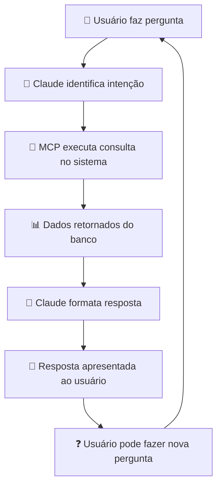

# 🚀 Como Usar o MCP no Sistema de Fretes

## 🎯 Comportamento e Layout

### 📱 **No Claude Desktop** 
Após configurar, você terá acesso direto aos dados do sistema via chat natural.

---

## 💬 Exemplos de Conversas

### 🔍 **Consultas Operacionais**

**Você:** *"Quais embarques estão ativos hoje?"*

**Claude com MCP:** 
```json
📦 Embarques: 8 encontrados
{
  "dados": [
    {
      "id": 1523,
      "numero": "EMB240001",
      "status": "ativo",
      "data_embarque": "2025-06-20T08:30:00",
      "transportadora": "TRANSPORTES ABC LTDA",
      "total_fretes": 3
    },
    {
      "id": 1524,
      "numero": "EMB240002",
      "status": "ativo",
      "data_embarque": null,
      "transportadora": "LOG EXPRESS",
      "total_fretes": 1
    }
  ]
}
```

---

### 📊 **Análises Gerenciais**

**Você:** *"Mostre estatísticas dos últimos 7 dias"*

**Claude com MCP:**
```json
📊 Período Analisado: Últimos 7 dias
{
  "📦 Embarques": {
    "Total": 45,
    "Ativos": 8,
    "Cancelados": 37
  },
  "🚛 Fretes": {
    "Total": 127,
    "Pendentes Aprovação": 15,
    "Aprovados": 102,
    "% Aprovação": 80.3
  },
  "📋 Entregas": {
    "Total Monitoradas": 234,
    "Entregues": 189,
    "Pendências Financeiras": 12,
    "% Entrega": 80.8
  }
}
```

---

### 🔍 **Consultas Específicas**

**Você:** *"Status da NF 123456"*

**Claude com MCP:**
```json
📋 Entregas Monitoradas: 1 encontrada
{
  "dados": [
    {
      "numero_nf": "123456",
      "status": "Em Transito",
      "cliente": "EMPRESA TESTE LTDA",
      "cidade_destino": "São Paulo - SP",
      "pendencia_financeira": false,
      "valor_nf": 2850.75
    }
  ]
}
```

---

## ⚙️ **Funcionalidades Disponíveis**

### 🔧 **Ferramentas MCP**

| Comando | Descrição | Exemplo de Uso |
|---------|-----------|----------------|
| `consultar_embarques` | Lista embarques | *"Embarques ativos"* |
| `consultar_fretes` | Busca fretes | *"Fretes pendentes"* |
| `consultar_monitoramento` | Status entregas | *"NF 123456"* |
| `estatisticas_sistema` | Métricas gerais | *"Estatísticas do mês"* |
| `consultar_portaria` | Veículos na portaria | *"Quem está na portaria?"* |

### 🎯 **Casos de Uso por Perfil**

#### 👨‍💼 **Para Gestores**
```
"Quantos embarques saíram esta semana?"
"Qual o percentual de aprovação de fretes?"
"Há entregas com pendências financeiras?"
"Relatório de performance dos últimos 30 dias"
```

#### 🚛 **Para Operação**
```
"Quais veículos estão aguardando na portaria?"
"Embarques que ainda não têm CTe"
"Status dos embarques de hoje"
"Fretes pendentes de aprovação"
```

#### 💰 **Para Financeiro**
```
"Quantas entregas têm pendência financeira?"
"Fretes aprovados mas não pagos"
"Relatório de pendências por cliente"
"Estatísticas de aprovação de fretes"
```

---

## 🎨 **Interface Visual**

### 📺 **No Claude Desktop**

```
┌─────────────────────────────────────────┐
│ 💬 Claude Desktop                       │
├─────────────────────────────────────────┤
│ Você: Quais embarques estão ativos?     │
│                                         │
│ 🤖 Claude: Vou consultar os embarques  │
│ ativos no sistema para você...          │
│                                         │
│ [Usando ferramenta: consultar_embarques]│
│                                         │
│ 📦 Encontrei 8 embarques ativos:       │
│                                         │
│ • EMB240001 - TRANSPORTES ABC          │
│   Saída: 20/06 08:30 | 3 fretes        │
│                                         │
│ • EMB240002 - LOG EXPRESS              │
│   Aguardando saída | 1 frete           │
│                                         │
│ Precisa de mais detalhes sobre algum?   │
└─────────────────────────────────────────┘
```

### 🔄 **Fluxo de Uso**



---

## 🛠️ **Configuração Final**

### 1. **Arquivo de Configuração**
Copie este conteúdo para:
`C:\Users\rafael.nascimento\AppData\Roaming\Claude\claude_desktop_config.json`

```json
{
  "mcpServers": {
    "frete-sistema": {
      "command": "python",
      "args": ["mcp/mcp_server_estavel.py"],
      "cwd": "C:\\Users\\rafael.nascimento\\Desktop\\Sistema Online\\frete_sistema",
      "env": {
        "FLASK_ENV": "development"
      }
    }
  }
}
```

### 2. **Reiniciar Claude Desktop**
- Feche completamente o Claude Desktop
- Abra novamente
- Em uma nova conversa, teste: *"Mostre estatísticas do sistema"*

### 3. **Indicadores de Funcionamento**
✅ **Funcionando:** Claude responde com dados reais do sistema  
❌ **Erro:** Claude diz que não tem acesso aos dados

---

## 🎯 **Benefícios**

### 🚀 **Para o Dia-a-Dia**
- **Consultas instantâneas** sem abrir o sistema web
- **Dados sempre atualizados** direto do banco
- **Interface natural** em português
- **Múltiplas perspectivas** (operação, gestão, financeiro)

### 📈 **Para Gestão**
- **Relatórios rápidos** via chat
- **KPIs em tempo real**
- **Análises comparativas**
- **Tomada de decisão ágil**

### ⚡ **Para Produtividade**
- **Sem login** no sistema web
- **Consultas por voz** (se habilitado)
- **Histórico de consultas**
- **Integração com outras ferramentas**

---

## 🔮 **Futuras Expansões**

### 📋 **Próximas Funcionalidades**
- Criação de embarques via chat
- Aprovação de fretes por comando
- Relatórios em Excel gerados automaticamente
- Alertas proativos sobre problemas

### 🤖 **Automações Possíveis**
- Notificações de embarques atrasados
- Relatórios diários automáticos
- Alertas de pendências críticas
- Dashboards dinâmicos

---

**🎉 Agora você tem IA integrada ao seu Sistema de Fretes!** 