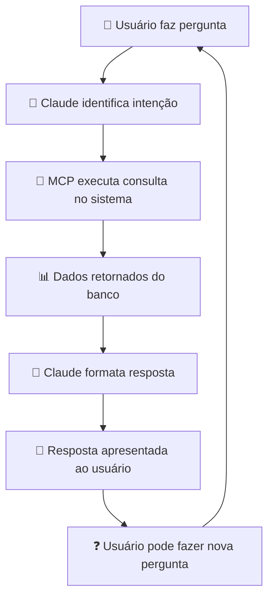

# 🚀 Como Usar o MCP no Sistema de Fretes

## 🎯 Comportamento e Layout

### 📱 **No Claude Desktop** 
Após configurar, você terá acesso direto aos dados do sistema via chat natural.

---

## 💬 Exemplos de Conversas

### 🔍 **Consultas Operacionais**

**Você:** *"Quais embarques estão ativos hoje?"*

**Claude com MCP:** 
```json
📦 Embarques: 8 encontrados
{
  "dados": [
    {
      "id": 1523,
      "numero": "EMB240001",
      "status": "ativo",
      "data_embarque": "2025-06-20T08:30:00",
      "transportadora": "TRANSPORTES ABC LTDA",
      "total_fretes": 3
    },
    {
      "id": 1524,
      "numero": "EMB240002",
      "status": "ativo",
      "data_embarque": null,
      "transportadora": "LOG EXPRESS",
      "total_fretes": 1
    }
  ]
}
```

---

### 📊 **Análises Gerenciais**

**Você:** *"Mostre estatísticas dos últimos 7 dias"*

**Claude com MCP:**
```json
📊 Período Analisado: Últimos 7 dias
{
  "📦 Embarques": {
    "Total": 45,
    "Ativos": 8,
    "Cancelados": 37
  },
  "🚛 Fretes": {
    "Total": 127,
    "Pendentes Aprovação": 15,
    "Aprovados": 102,
    "% Aprovação": 80.3
  },
  "📋 Entregas": {
    "Total Monitoradas": 234,
    "Entregues": 189,
    "Pendências Financeiras": 12,
    "% Entrega": 80.8
  }
}
```

---

### 🔍 **Consultas Específicas**

**Você:** *"Status da NF 123456"*

**Claude com MCP:**
```json
📋 Entregas Monitoradas: 1 encontrada
{
  "dados": [
    {
      "numero_nf": "123456",
      "status": "Em Transito",
      "cliente": "EMPRESA TESTE LTDA",
      "cidade_destino": "São Paulo - SP",
      "pendencia_financeira": false,
      "valor_nf": 2850.75
    }
  ]
}
```

---

## ⚙️ **Funcionalidades Disponíveis**

### 🔧 **Ferramentas MCP**

| Comando | Descrição | Exemplo de Uso |
|---------|-----------|----------------|
| `consultar_embarques` | Lista embarques | *"Embarques ativos"* |
| `consultar_fretes` | Busca fretes | *"Fretes pendentes"* |
| `consultar_monitoramento` | Status entregas | *"NF 123456"* |
| `estatisticas_sistema` | Métricas gerais | *"Estatísticas do mês"* |
| `consultar_portaria` | Veículos na portaria | *"Quem está na portaria?"* |

### 🎯 **Casos de Uso por Perfil**

#### 👨‍💼 **Para Gestores**
```
"Quantos embarques saíram esta semana?"
"Qual o percentual de aprovação de fretes?"
"Há entregas com pendências financeiras?"
"Relatório de performance dos últimos 30 dias"
"Gerar relatório Excel executivo do Assai"
"Exportar análise financeira completa por cliente"
```

#### 🚛 **Para Operação**
```
"Quais veículos estão aguardando na portaria?"
"Embarques que ainda não têm CTe"
"Status dos embarques de hoje"
"Fretes pendentes de aprovação"
"Excel com agendamentos da semana"
```

#### 💰 **Para Financeiro**
```
"Quantas entregas têm pendência financeira?"
"Fretes aprovados mas não pagos"
"Relatório de pendências por cliente"
"Estatísticas de aprovação de fretes"
"Relatório Excel financeiro detalhado"
"Exportar saldos em carteira para Excel"
```

#### 📋 **Para Monitoramento**
```
"Entregas em atraso"
"NFs com pendência"
"Agendamentos confirmados hoje"
"Status de entrega por cliente"
"Excel completo de entregas por cliente"
```

---

## 🎨 **Interface Visual**

### 📺 **No Claude Desktop**

```
┌─────────────────────────────────────────┐
│ 💬 Claude Desktop                       │
├─────────────────────────────────────────┤
│ Você: Quais embarques estão ativos?     │
│                                         │
│ 🤖 Claude: Vou consultar os embarques  │
│ ativos no sistema para você...          │
│                                         │
│ [Usando ferramenta: consultar_embarques]│
│                                         │
│ 📦 Encontrei 8 embarques ativos:       │
│                                         │
│ • EMB240001 - TRANSPORTES ABC          │
│   Saída: 20/06 08:30 | 3 fretes        │
│                                         │
│ • EMB240002 - LOG EXPRESS              │
│   Aguardando saída | 1 frete           │
│                                         │
│ Precisa de mais detalhes sobre algum?   │
└─────────────────────────────────────────┘
```

### 🔄 **Fluxo de Uso**



---

## 🛠️ **Configuração Final**

### 1. **Arquivo de Configuração**
Copie este conteúdo para:
`C:\Users\rafael.nascimento\AppData\Roaming\Claude\claude_desktop_config.json`

```json
{
  "mcpServers": {
    "frete-sistema": {
      "command": "python",
      "args": ["mcp/mcp_server_estavel.py"],
      "cwd": "C:\\Users\\rafael.nascimento\\Desktop\\Sistema Online\\frete_sistema",
      "env": {
        "FLASK_ENV": "development"
      }
    }
  }
}
```

### 2. **Reiniciar Claude Desktop**
- Feche completamente o Claude Desktop
- Abra novamente
- Em uma nova conversa, teste: *"Mostre estatísticas do sistema"*

### 3. **Indicadores de Funcionamento**
✅ **Funcionando:** Claude responde com dados reais do sistema  
❌ **Erro:** Claude diz que não tem acesso aos dados

---

## 🎯 **Benefícios**

### 🚀 **Para o Dia-a-Dia**
- **Consultas instantâneas** sem abrir o sistema web
- **Dados sempre atualizados** direto do banco
- **Interface natural** em português
- **Múltiplas perspectivas** (operação, gestão, financeiro)

### 📈 **Para Gestão**
- **Relatórios rápidos** via chat
- **KPIs em tempo real**
- **Análises comparativas**
- **Tomada de decisão ágil**

### ⚡ **Para Produtividade**
- **Sem login** no sistema web
- **Consultas por voz** (se habilitado)
- **Histórico de consultas**
- **Integração com outras ferramentas**

---

## 🔮 **Futuras Expansões**

### 📋 **Próximas Funcionalidades**
- Criação de embarques via chat
- Aprovação de fretes por comando
- Relatórios em Excel gerados automaticamente
- Alertas proativos sobre problemas

### 🤖 **Automações Possíveis**
- Notificações de embarques atrasados
- Relatórios diários automáticos
- Alertas de pendências críticas
- Dashboards dinâmicos

---

**🎉 Agora você tem IA integrada ao seu Sistema de Fretes!** 

## 📋 O que é o MCP?

O **Model Context Protocol (MCP)** permite que você faça perguntas em linguagem natural diretamente no Claude Desktop e receba respostas com dados reais do sistema de fretes.

## 🎯 Funcionalidades Disponíveis

### 🔍 1. Consultas Básicas
- **Embarques:** "Quais embarques estão ativos?"
- **Fretes:** "Mostre fretes pendentes de aprovação"
- **Monitoramento:** "Status da NF 123456"
- **Portaria:** "Quem está na portaria agora?"

### 🏢 2. Consultas por Cliente (NOVA FUNCIONALIDADE!)

**🎯 Consulta Mais Poderosa do Sistema!**

Faça perguntas como:
- **"Como estão as entregas do Assai de SP?"**
- **"Últimos pedidos do Carrefour no RJ"**
- **"Status financeiro dos pedidos da Renner"**
- **"Saldo em carteira do cliente Walmart"**

**Exemplo prático:**
```
Pergunta: "Como estão as entregas do Assai de SP do último pedido?"

Resposta do Sistema:
🔍 CONSULTA DETALHADA: ASSAI
📍 Estado: SP
📋 1 pedido(s) mais recente(s):

═══ PEDIDO 1 ═══
📦 Pedido: VCD2519284
🏢 Cliente: Assai LJ 264
📅 Data Pedido: 10/06/2024
🏙️ Destino: São Paulo/SP
💰 Valor: R$ 1.250,00
📊 Status: FATURADO
📄 NF: 133526
💳 Faturado em: 15/06/2024
💵 Valor NF: R$ 465,61
⚠️ Faturamento parcial - Saldo na carteira: R$ 784,39
🚚 Status Entrega: Em andamento
🚛 Data Embarque: 20/06/2024
🚐 Transportadora: Transportes ABC
📅 Previsão Entrega: 27/06/2024
📋 Agendamentos:
  ✅ 27/06/2024 - Confirmado pelo cliente

📊 RESUMO GERAL:
• Total de pedidos: 1
• Valor total: R$ 1.250,00
• Faturados: 1/1
• Embarcados: 1/1
```

### 📊 3. Estatísticas e Relatórios
- **"Estatísticas dos últimos 30 dias"**
- **"Quantos embarques saíram esta semana?"**
- **"Relatório de entregas do mês"**

### 📋 4. Relatórios Excel (NOVA FUNCIONALIDADE!)

**🎯 Gere relatórios Excel completos por cliente!**

Comandos disponíveis:
- **"Gerar relatório Excel do Assai"**
- **"Exportar dados do cliente Carrefour para Excel"**
- **"Relatório financeiro detalhado da Renner"**
- **"Excel com os últimos 5 pedidos do Walmart"**

**Exemplo prático:**
```
Pergunta: "Gerar relatório Excel do Assai de SP"

Resposta do Sistema:
📊 RELATÓRIO EXCEL GERADO COM SUCESSO!

📁 Arquivo: relatorio_cliente.xlsx
📏 Tamanho: 15,847 bytes
🏢 Cliente: ASSAI
📍 Estado: SP

📋 Conteúdo do Relatório:
• Aba 1 - Pedidos: 3 registros
• Aba 2 - Faturamento: 2 registros  
• Aba 3 - Monitoramento: 2 registros
• Aba 4 - Agendamentos: 4 registros
• Aba 5 - Estatísticas: Resumo executivo

💰 Resumo Financeiro:
• Total Pedidos: R$ 3.750,00
• Total Faturado: R$ 2.965,61
• Saldo Carteira: R$ 784,39

✅ O arquivo está pronto para download!
```

**Abas do Excel geradas:**
1. **Pedidos:** Dados completos de todos os pedidos
2. **Faturamento:** Informações financeiras e NFs
3. **Monitoramento:** Status de entregas e agendamentos  
4. **Agendamentos:** Histórico completo de agendamentos
5. **Estatísticas:** Resumo executivo com KPIs

## 💡 Casos de Uso por Perfil

### 👔 Para Gestores
```
- "Resumo financeiro do cliente X"
- "Pedidos com faturamento parcial este mês"
- "Performance de entregas por estado"
- "Clientes com maior volume de pedidos"
- "Gerar relatório Excel executivo do Assai"
- "Exportar análise financeira completa por cliente"
```

### 🚛 Para Operação
```
- "Entregas agendadas para hoje"
- "Embarques sem CTe"
- "Pedidos prontos para embarque"
- "Status das entregas em SP"
- "Excel com agendamentos da semana"
```

### 💰 Para Financeiro
```
- "Clientes com saldo em carteira"
- "Pendências financeiras em aberto"
- "Faturamento parcial por cliente"
- "Valores a receber por transportadora"
- "Relatório Excel financeiro detalhado"
- "Exportar saldos em carteira para Excel"
```

### 📋 Para Monitoramento
```
- "Entregas em atraso"
- "NFs com pendência"
- "Agendamentos confirmados hoje"
- "Status de entrega por cliente"
- "Excel completo de entregas por cliente"
```

## 🎯 Dicas de Uso

### ✅ Perguntas que Funcionam Bem
- **Específicas:** "Status da NF 123456"
- **Por cliente:** "Pedidos do Assai em SP"
- **Por período:** "Entregas da última semana"
- **Por estado:** "Embarques para o Rio de Janeiro"

### ❌ Evite Perguntas Muito Genéricas
- ~~"Me fale sobre tudo"~~
- ~~"Qual é a situação?"~~
- ~~"O que está acontecendo?"~~

### 🔍 Para Melhores Resultados
1. **Seja específico** com nomes de clientes
2. **Inclua UF** quando relevante (ex: "SP", "RJ")
3. **Use números** exatos de NF quando souber
4. **Peça resumos** para visão geral

### 📊 Dicas para Relatórios Excel
1. **Especifique o cliente** claramente (ex: "Assai", "Carrefour")
2. **Defina a UF** quando necessário ("Gerar Excel do Assai de SP")
3. **Indique quantidade** se quiser ("Últimos 5 pedidos para Excel")
4. **Nomeie o arquivo** se desejar ("Excel_Assai_Janeiro.xlsx")

**Exemplos de comandos Excel otimizados:**
- ✅ "Gerar relatório Excel do Assai de SP com os últimos 3 pedidos"
- ✅ "Exportar dados financeiros da Renner para Excel_Renner_Dez.xlsx"
- ✅ "Excel completo do Carrefour no RJ"
- ❌ "Me dá um Excel" (muito genérico)

## 📞 Exemplos Práticos Reais

```bash
# Consultas Rápidas
"Status da NF 133526"
"Embarques ativos agora"
"Veículos na portaria"

# Consultas por Cliente
"Entregas do Carrefour no RJ"
"Últimos 3 pedidos da Renner"
"Saldo em carteira do Walmart"

# Análises Gerenciais
"Estatísticas dos últimos 7 dias"
"Performance de entregas este mês"
"Fretes pendentes de aprovação"

# Relatórios Excel (NOVO!)
"Gerar relatório Excel do Assai"
"Exportar dados da Renner para Excel"
"Excel financeiro dos últimos 10 pedidos do Carrefour"
"Relatório completo do cliente X em SP"
```

## 🆘 Solução de Problemas

### Problema: "Nenhum dado encontrado"
- ✅ Verifique a grafia do nome do cliente
- ✅ Tente buscar apenas parte do nome (ex: "Assai" ao invés de "Assai Atacadista")
- ✅ Remova acentos e caracteres especiais

### Problema: "Erro de conexão"
- ✅ Verifique se o sistema está rodando
- ✅ Reinicie o Claude Desktop
- ✅ Verifique o arquivo de configuração

## 🚀 Próximos Passos

Após dominar essas consultas básicas, você pode:
1. **Criar relatórios personalizados** combinando múltiplas consultas
2. **Automatizar verificações** diárias de status
3. **Integrar** com outros sistemas da empresa

---

**💡 Lembre-se:** O MCP usa os dados reais do sistema em tempo real. Suas consultas refletem a situação atual dos pedidos, entregas e embarques! 