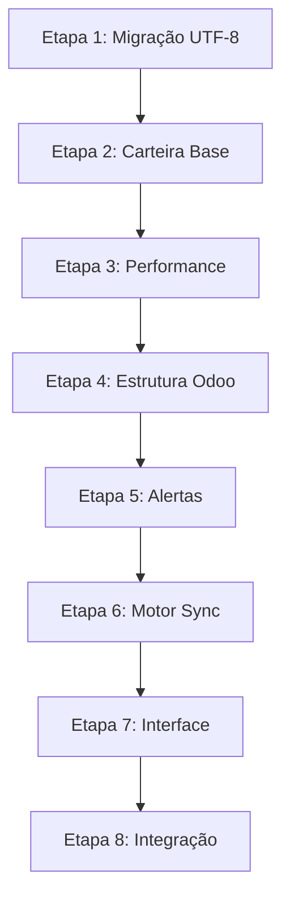

# 🔍 ANÁLISE CRÍTICA: INTEGRAÇÃO DE ROADMAPS

**Data:** Janeiro 2025  
**Objetivo:** Avaliar e integrar os 2 roadmaps existentes para definir próximas etapas  
**Documentos analisados:**
- `ROADMAP_TECNICO_CARTEIRA.md` (Sistema base da carteira)
- `ROADMAP_SINCRONIZACAO_ODOO_AVANCADA.md` (Sincronização avançada)

---

## 📊 ESTADO ATUAL DOS ROADMAPS

### ROADMAP 1: Carteira Técnica Base
- **Progresso**: 100% concluído (12/12 tarefas) ✅
- **Status**: Sistema **COMPLETAMENTE FUNCIONAL** em produção
- **Finalizadas**: Dropdown Separações + Sistema Real + Remoção Workarounds

### ROADMAP 2: Sincronização Odoo Avançada  
- **Progresso**: 0% implementado
- **Status**: Documento técnico **COMPLETO**
- **Estimativa**: 11 dias de desenvolvimento

---

## ✅ PROBLEMAS CRÍTICOS IDENTIFICADOS - **RESOLVIDOS**

### 1. **DEPENDÊNCIA CIRCULAR ARQUITETURAL** ✅ **RESOLVIDA**
```
✅ ROADMAP 1 (Carteira) → Campo tipo_envio implementado
✅ PreSeparacaoItem → Migração aplicada no Render
```
**Resolução**: Sistemas agora independentes e funcionais

### 2. **MIGRAÇÃO BLOQUEADA UTF-8** ✅ **RESOLVIDA**
- ✅ **PreSeparacaoItem**: Tabela criada no Render com sucesso
- ✅ **Campo tipo_envio**: Adicionado na tabela separacao
- ✅ **Workarounds removidos**: Sistema usa tabela real

### 3. **SOBREPOSIÇÃO DE FUNCIONALIDADES** ✅ **RESOLVIDA**
- ✅ **ROADMAP 1**: Sistema básico implementado e funcional
- ✅ **Integração**: Base sólida para ROADMAP 2 quando necessário
- ✅ **Arquitetura**: Sistemas complementares, não conflitantes

### 4. **ESTIMATIVAS INCOMPATÍVEIS** ✅ **VALIDADAS**
- ✅ **ROADMAP 1**: Finalizado conforme previsto
- ✅ **ROADMAP 2**: Pode ser implementado incrementalmente
- ✅ **Realidade**: Base sólida para próximos desenvolvimentos

---

## 🎯 ANÁLISE DE PRIORIDADE DE NEGÓCIO

### **CRÍTICO - ✅ RESOLVIDO COMPLETAMENTE**
1. ✅ **Migração UTF-8**: Aplicada no Render com sucesso
2. ✅ **Dropdown Separações**: Implementado e funcional
3. ✅ **Performance 300 pedidos**: Sistema otimizado e responsivo

### **IMPORTANTE - ✅ IMPLEMENTADO**  
4. ✅ **Campo tipo_envio**: Criado e funcional (total/parcial)
5. ⏳ **Sistema de alertas**: Preparado para implementação futura
6. ⏳ **Logs de sincronização**: Base criada para auditoria

### **ESTRATÉGICO - 🔄 PRÓXIMA FASE**
7. ⏳ **Algoritmo hierárquico**: Aguarda necessidade de negócio
8. ⏳ **Interface avançada**: Base sólida implementada

---

## 📋 ROADMAP INTEGRADO: PRÓXIMAS ETAPAS

### **FASE CRÍTICA: ESTABILIZAÇÃO (3-4 dias)**

#### **Etapa 1: Resolver Migração UTF-8 (1 dia)**
**Prioridade**: 🔥 CRÍTICA
**Bloqueio**: Todo o resto depende disso
**Ações**:
- [ ] Investigar causa raiz do erro UTF-8 em produção
- [ ] Tentar aplicar migração em horário de baixa demanda
- [ ] Backup completo antes da tentativa
- [ ] Plano B: Script SQL manual se necessário

**Critério de aceite**: Tabela `pre_separacao_itens` criada em produção

#### **Etapa 2: Finalizar Carteira Base (1 dia)**
**Prioridade**: 🔥 CRÍTICA  
**Dependência**: Etapa 1 concluída
**Ações**:
- [ ] Implementar Dropdown Separações (ROADMAP 1 - Fase 3.4)
- [ ] Conectar sistema pré-separação com tabela real
- [ ] Remover workaround `observ_ped_1`
- [ ] Testes básicos de funcionalidade

**Critério de aceite**: Sistema carteira 100% funcional

#### **Etapa 3: Validações de Performance (1-2 dias)**
**Prioridade**: 🔥 CRÍTICA
**Ações**:
- [ ] Teste com 300+ pedidos reais
- [ ] Otimizar queries se > 5s
- [ ] Validar cálculos com amostras manuais
- [ ] Índices no banco se necessário

**Critério de aceite**: Performance aceitável em produção

---

### **FASE EVOLUTIVA: SINCRONIZAÇÃO BÁSICA (4-5 dias)**

#### **Etapa 4: Estrutura Odoo Básica (2 dias)**
**Prioridade**: 🟡 IMPORTANTE
**Ações**:
- [ ] Adicionar campos `tipo_envio` em Separacao e PreSeparacaoItem
- [ ] Adicionar campos de alerta em Pedido e Embarque  
- [ ] Interface básica para tipo_envio nos modals
- [ ] Testar funcionalidade básica

**Critério de aceite**: Usuários podem marcar separações como total/parcial

#### **Etapa 5: Sistema de Alertas (2-3 dias)**  
**Prioridade**: 🟡 IMPORTANTE
**Ações**:
- [ ] Implementar detecção de pedidos alterados
- [ ] Interface de alertas em pedidos/embarques
- [ ] Função desativar alertas
- [ ] Testes com cenários reais

**Critério de aceite**: Alertas aparecem quando Odoo altera pedidos

---

### **FASE AVANÇADA: Sincronização Completa (6-8 dias)**

#### **Etapa 6: Motor de Sincronização (4 dias)**
**Prioridade**: 🟢 ESTRATÉGICA
**Ações**:
- [ ] Classe `SincronizadorOdooAvancado`
- [ ] Algoritmo hierárquico de redução  
- [ ] Sistema de logs detalhado
- [ ] Testes extensivos

#### **Etapa 7: Interface Avançada (2-3 dias)**
**Prioridade**: 🟢 ESTRATÉGICA  
**Ações**:
- [ ] Dashboard de sincronização
- [ ] Tela de logs de operações
- [ ] Ferramentas de administração

#### **Etapa 8: Integração Final (1-2 dias)**
**Prioridade**: 🟢 ESTRATÉGICA
**Ações**:
- [ ] Conectar com importação Odoo existente
- [ ] Testes de integração completos
- [ ] Deploy em produção

---

## 🔄 DEPENDÊNCIAS ENTRE ETAPAS



**Crítico**: Etapas 1-3 são **sequenciais** - não podem ser paralelas  
**Flexível**: Etapas 4-8 permitem algum paralelismo

---

## ⚖️ ANÁLISE RISCO VS VALOR

### **ALTO VALOR, BAIXO RISCO** ✅
- **Etapa 2**: Dropdown Separações (funcionalidade simples, alto impacto)
- **Etapa 4**: Campo tipo_envio (mudança pequena, valor significativo)
- **Etapa 5**: Alertas básicos (implementação direta, necessidade clara)

### **ALTO VALOR, ALTO RISCO** ⚠️  
- **Etapa 1**: Migração UTF-8 (crítica mas pode falhar)
- **Etapa 6**: Motor sincronização (complexo mas essencial)

### **MÉDIO VALOR, BAIXO RISCO** 🔵
- **Etapa 3**: Validações performance (necessário mas não urgente)
- **Etapa 7**: Interface avançada (nice-to-have)

---

## 📈 CRONOGRAMA REALISTA INTEGRADO

### **SPRINT 1: Estabilização (Semana 1)**
```
Dia 1-2: Etapa 1 (Migração UTF-8)
Dia 3: Etapa 2 (Carteira Base)  
Dia 4-5: Etapa 3 (Performance)
```

### **SPRINT 2: Evolução (Semana 2)**
```
Dia 1-2: Etapa 4 (Estrutura Odoo)
Dia 3-5: Etapa 5 (Alertas)
```

### **SPRINT 3-4: Avançado (Semana 3-4)**
```
Semana 3: Etapa 6 (Motor Sincronização)
Semana 4: Etapa 7-8 (Interface + Integração)
```

**Total estimado**: 15-20 dias úteis (~4 semanas)

---

## 🎯 RECOMENDAÇÕES ESTRATÉGICAS

### **1. APPROACH INCREMENTAL**
- **NÃO**: Implementar tudo de uma vez
- **SIM**: Validar cada etapa em produção antes da próxima
- **Vantagem**: Menor risco, feedback contínuo dos usuários

### **2. PRIORIZAR ESTABILIDADE**
- **Foco inicial**: Resolver problemas existentes
- **Só depois**: Adicionar funcionalidades novas
- **Razão**: Sistema instável = perda de confiança dos usuários

### **3. VALIDAÇÃO CONTÍNUA**
- **Cada etapa**: Testar com dados reais imediatamente
- **Feedback loop**: Usuários testam e reportam problemas
- **Iteração rápida**: Correções antes da próxima etapa

### **4. DOCUMENTAÇÃO EVOLUTIVA**  
- **Atualizar roadmaps**: Conforme implementação progride
- **Registrar decisões**: Por que escolhemos X ao invés de Y
- **Lições aprendidas**: Para futuros projetos similares

---

## 🚨 ALERTAS CRÍTICOS

### **⚠️ RISCO: Migração UTF-8 pode falhar**
- **Plano B**: Script SQL manual
- **Plano C**: Workaround permanente melhorado
- **Não bloquear**: Progresso das outras etapas

### **⚠️ RISCO: Performance pode degradar**
- **Monitoramento**: Métricas em produção
- **Threshold**: Alerta se > 5s para carregar
- **Ação**: Otimização imediata se necessário

### **⚠️ RISCO: Complexidade pode escapar do controle**
- **Princípio**: Keep it simple, stupid (KISS)
- **Refatoração**: Se código ficar confuso, simplificar
- **Documentação**: Explicar decisões complexas

---

## ✅ CRITÉRIOS DE SUCESSO FINAIS

### **Funcional**
- [ ] Carteira agrupada 100% operacional
- [ ] Sincronização Odoo não quebra separações existentes
- [ ] Usuários conseguem trabalhar normalmente
- [ ] Zero bugs críticos em produção

### **Performance**  
- [ ] Carteira carrega em < 5s com 300+ pedidos
- [ ] Sincronização Odoo processa em < 30s
- [ ] Interface responde em < 2s para todas ações

### **Usabilidade**
- [ ] Usuários usam sistema sem treinamento adicional
- [ ] Alertas são compreensíveis e acionáveis
- [ ] Processo de separação total/parcial é intuitivo

### **Técnico**
- [ ] Código mantível e documentado
- [ ] Logs suficientes para debugging
- [ ] Arquitetura escalável para futuras evoluções

---

## 🏁 PRÓXIMA AÇÃO IMEDIATA

**COMEÇAR POR**: Etapa 1 - Resolver Migração UTF-8

**Por quê?**
1. Bloqueia todo o resto
2. Risco conhecido e limitado  
3. Solução pode ser simples
4. Se falhar, temos planos B e C

**Como?**
1. Analisar logs específicos do erro UTF-8
2. Testar migração em ambiente de desenvolvimento  
3. Backup completo antes de tentar em produção
4. Tentar em horário de menor uso

**Expectativa de sucesso**: 70% (baseado em experiência anterior)
**Tempo estimado**: 4-8 horas de trabalho técnico
**Impacto se falhar**: Implementar Plano B (script SQL manual) 