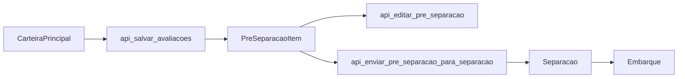
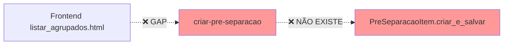

# 📋 **DOCUMENTAÇÃO TÉCNICA DEFINITIVA - SISTEMA CARTEIRA REALIDADE 2025**

> **⚠️ IMPORTANTE:** Esta documentação reflete a **REALIDADE ATUAL DO CÓDIGO** após análise minuciosa e crítica de todos os componentes. Identifica gaps, problemas e implementações reais.

---

## 🎯 **ESTADO ATUAL DO SISTEMA**

### **✅ FUNCIONALIDADES IMPLEMENTADAS E FUNCIONAIS:**
1. **Carteira Principal** - 100% funcional
2. **Modelo Pré-Separação** - 100% funcional  
3. **Separações** - 100% funcional
4. **Embarques** - 100% funcional
5. **Estoque Just-in-Time** - 100% funcional
6. **Múltiplas Pré-Separações** - ✅ Suporte implementado (constraint removida)

### **❌ GAPS CRÍTICOS IDENTIFICADOS:**
1. **APIs de criação de pré-separação** - **NÃO IMPLEMENTADAS**
2. **Funções JavaScript essenciais** - **AUSENTES**  
3. **Integração Frontend ↔ Backend** - **INCOMPLETA**
4. **Campos referenciados incorretos** - **MÚLTIPLAS INCONSISTÊNCIAS**

---

## 📊 **MODELOS DE DADOS REAIS**

### **1. CarteiraPrincipal (app/carteira/models.py:89)**
```python
class CarteiraPrincipal(db.Model):
    __tablename__ = 'carteira_principal'
    
    # === IDENTIFICAÇÃO ===
    id = db.Column(db.Integer, primary_key=True)
    num_pedido = db.Column(db.String(50), nullable=False, index=True)
    cod_produto = db.Column(db.String(50), nullable=False, index=True)
    cnpj_cpf = db.Column(db.String(20), nullable=False)
    
    # === QUANTIDADES CRÍTICAS ===
    qtd_produto_pedido = db.Column(db.Numeric(15, 3))           # Quantidade original
    qtd_saldo_produto_pedido = db.Column(db.Numeric(15, 3))     # ⭐ SALDO DISPONÍVEL 
    qtd_cancelada_produto_pedido = db.Column(db.Numeric(15, 3)) # Cancelada
    preco_unitario = db.Column(db.Numeric(15, 4))
    
    # === DATAS OPERACIONAIS ===
    data_pedido = db.Column(db.Date)
    data_entrega_pedido = db.Column(db.Date)
    data_expedicao = db.Column(db.Date)                         # ⭐ EXPEDIÇÃO PRINCIPAL
    agendamento = db.Column(db.Date)                            # Agendamento
    
    # === VÍNCULOS ===
    separacao_lote_id = db.Column(db.String(50), index=True)    # NULL = não separado
    protocolo = db.Column(db.String(100))                       # Protocolo agendamento
    
    # === CONTROLE ===
    ativo = db.Column(db.Boolean, default=True, index=True)
    
    # === PROJEÇÃO ESTOQUE (D0-D28) ===
    estoque_d0 = db.Column(db.Integer)
    estoque_d1 = db.Column(db.Integer)
    # ... até estoque_d28
    
    # ⚠️ CAMPOS QUE NÃO EXISTEM (referenciados incorretamente):
    # peso, pallet, observacoes, peso_calculado, pallet_calculado
```

### **2. PreSeparacaoItem (app/carteira/models.py:1185)**
```python
class PreSeparacaoItem(db.Model):
    __tablename__ = 'pre_separacao_item'
    
    # === IDENTIFICAÇÃO ===
    id = db.Column(db.Integer, primary_key=True)
    num_pedido = db.Column(db.String(50), nullable=False)
    cod_produto = db.Column(db.String(50), nullable=False)
    cnpj_cliente = db.Column(db.String(20), nullable=False)
    
    # === QUANTIDADES ===
    qtd_original_carteira = db.Column(db.Numeric(15, 3))        # Qtd no momento da criação
    qtd_selecionada_usuario = db.Column(db.Numeric(15, 3))      # ⭐ QUANTIDADE PRÉ-SEPARADA
    qtd_restante_calculada = db.Column(db.Numeric(15, 3))       # Saldo que ficou na carteira
    
    # === DADOS EDITÁVEIS PELO USUÁRIO ===
    data_expedicao_editada = db.Column(db.Date)                 # ⭐ DATA EDITADA
    data_agendamento_editada = db.Column(db.Date)               # Agendamento editado
    protocolo_editado = db.Column(db.String(100))               # Protocolo editado
    
    # === CONTROLE DE PROCESSO ===
    status = db.Column(db.String(20), default='CRIADO')        # CRIADO, RECOMPOSTO, ENVIADO_SEPARACAO
    tipo_envio = db.Column(db.String(10), default='total')     # total, parcial
    
    # === SISTEMA DE SOBREVIVÊNCIA À REIMPORTAÇÃO ODOO ===
    hash_item_original = db.Column(db.String(32))              # MD5 para detectar alterações
    recomposto = db.Column(db.Boolean, default=False)          # Flag de recomposição
    data_recomposicao = db.Column(db.DateTime)
    versao_carteira_original = db.Column(db.Integer)
    
    # === AUDITORIA ===
    data_criacao = db.Column(db.DateTime, default=datetime.utcnow)
    criado_por = db.Column(db.String(100))
    
    # ✅ CONSTRAINT ÚNICA REMOVIDA - MÚLTIPLAS PRÉ-SEPARAÇÕES PERMITIDAS
    # Removida constraint para permitir múltiplas pré-separações do mesmo produto
```

### **3. Separacao (app/separacao/models.py)**
```python
class Separacao(db.Model):
    __tablename__ = 'separacao'
    
    # === IDENTIFICAÇÃO ===
    id = db.Column(db.Integer, primary_key=True)
    separacao_lote_id = db.Column(db.String(50), nullable=False, index=True)
    num_pedido = db.Column(db.String(50), nullable=False)
    cod_produto = db.Column(db.String(50), nullable=False)
    
    # === QUANTIDADES EFETIVAS ===
    qtd_separada = db.Column(db.Numeric(15, 3))
    qtd_saldo = db.Column(db.Numeric(15, 3))                    # ⭐ USADO NO ESTOQUE
    valor_saldo = db.Column(db.Numeric(15, 2))
    
    # === DADOS OPERACIONAIS ===
    expedicao = db.Column(db.Date)                              # ⭐ USADO NO CÁLCULO DE SAÍDAS
    agendamento = db.Column(db.Date)
    protocolo = db.Column(db.String(100))
    tipo_envio = db.Column(db.String(10))                       # total, parcial
    
    # === CONTROLE ===
    ativo = db.Column(db.Boolean, default=True)
```

---

## 🔗 **ENDPOINTS IMPLEMENTADOS vs NÃO IMPLEMENTADOS**

### **✅ ENDPOINTS IMPLEMENTADOS E FUNCIONAIS:**

| **Endpoint** | **Método** | **Função** | **Status** |
|--------------|------------|------------|------------|
| `/carteira/` | GET | `index()` | ✅ Funcional |
| `/carteira/principal` | GET | `listar_principal()` | ✅ Funcional |
| `/carteira/agrupados` | GET | `listar_pedidos_agrupados()` | ✅ Funcional |
| `/carteira/api/pedido/<num_pedido>/salvar-avaliacoes` | POST | `api_salvar_avaliacoes()` | ✅ Funcional |
| `/carteira/api/pre-separacao/<int:pre_sep_id>/editar` | POST | `api_editar_pre_separacao()` | ✅ Funcional |
| `/carteira/api/pre-separacao/<int:pre_sep_id>/cancelar` | POST | `api_cancelar_pre_separacao()` | ✅ Funcional |
| `/carteira/api/pre-separacao/<int:pre_sep_id>/enviar-separacao` | POST | `api_enviar_pre_separacao_para_separacao()` | ✅ Funcional |
| `/carteira/api/pedido/<num_pedido>/pre-separacoes-agrupadas` | GET | `api_pedido_pre_separacoes_agrupadas()` | ✅ Funcional |

### **❌ ENDPOINTS AUSENTES (Mencionados na documentação mas NÃO IMPLEMENTADOS):**

| **Endpoint Ausente** | **Impacto** | **Necessário Para** |
|---------------------|-------------|---------------------|
| `/api/pedido/<num_pedido>/criar-pre-separacao` | 🚨 **CRÍTICO** | Criar pré-separações pelo frontend |
| `/api/pre-separacao/<id>/dividir` | ⚠️ Médio | Dividir pré-separações existentes |
| `/api/item/<item_id>/criar-pre-separacao` | 🚨 **CRÍTICO** | Criar pré-separação de item específico |

### **❌ MÉTODOS AUSENTES NO MODELO:**

```python
# ❌ CHAMADOS MAS NÃO IMPLEMENTADOS:
PreSeparacaoItem.criar_e_salvar()      # Linha 1559 em routes.py
PreSeparacaoItem.dividir_quantidade()   # Referenciado em templates
PreSeparacaoItem.validar_disponibilidade() # Referenciado na documentação
```

---

## 🖥️ **TEMPLATES - ANÁLISE REAL vs DOCUMENTAÇÃO**

### **Templates Existentes:**
1. **`dashboard.html`** (333 linhas) - ✅ Funcional
2. **`listar_principal.html`** (1022 linhas) - ✅ Funcional  
3. **`listar_agrupados.html`** (5316 linhas) - ⚠️ **Problemas críticos**

### **Problemas Críticos no Template `listar_agrupados.html`:**

#### **1. Referências a Campos Inexistentes:**
```html
<!-- ❌ CAMPOS QUE NÃO EXISTEM NO MODELO -->
<td>${item.peso_calculado || '-'}</td>                <!-- Deveria ser: item.peso -->
<td>${item.pallet_calculado || '-'}</td>              <!-- Deveria ser: item.pallet -->
<input name="observacoes" />                          <!-- Campo não existe -->
<td>${item.qtd_saldo_disponivel}</td>                 <!-- Deveria ser: qtd_saldo_produto_pedido -->
```

#### **2. Funções JavaScript Não Implementadas:**
```javascript
// ❌ REFERENCIADAS MAS NÃO EXISTEM:
function editarPreSeparacao(id) { /* NÃO IMPLEMENTADA */ }
function cancelarPreSeparacao(id) { /* NÃO IMPLEMENTADA */ }
function enviarPreSeparacaoParaSeparacao(id) { /* NÃO IMPLEMENTADA */ }
function editarQuantidadePreSeparacao(input) { /* NÃO IMPLEMENTADA */ }
function editarDataPreSeparacao(input, campo) { /* NÃO IMPLEMENTADA */ }
```

#### **3. APIs Chamadas que Não Existem:**
```javascript
// ❌ ENDPOINTS CHAMADOS MAS NÃO IMPLEMENTADOS:
fetch(`/carteira/api/pedido/${numPedido}/criar-pre-separacao`)  // NÃO EXISTE
fetch(`/carteira/api/item/${itemId}/criar-pre-separacao`)       // NÃO EXISTE
```

---

## ⚙️ **FLUXO REAL IMPLEMENTADO vs DOCUMENTADO**

### **✅ FLUXO FUNCIONANDO:**


### **❌ FLUXO QUEBRADO (GAP IDENTIFICADO):**


**Problema:** Frontend tenta criar pré-separações, mas as APIs essenciais não existem.

---

## 🔍 **LÓGICA DE NEGÓCIO REAL**

### **✅ IMPLEMENTADO - Sistema de Múltiplas Pré-Separações:**
```python
# CORRETO: Múltiplas pré-separações são PERMITIDAS
# A constraint única foi removida na migração
# remover_constraint_unica_pre_separacao.py

def permitir_multiplas_pre_separacoes():
    """
    ✅ IMPLEMENTADO CORRETAMENTE:
    - Constraint única removida
    - Múltiplas pré-separações do mesmo produto permitidas
    - Cada pré-separação pode ter data/protocolo diferentes
    """
    # Pode criar múltiplas pré-separações:
    pre_sep_1 = PreSeparacaoItem(num_pedido='PED001', cod_produto='A', qtd=10, data_expedicao='2025-01-15')
    pre_sep_2 = PreSeparacaoItem(num_pedido='PED001', cod_produto='A', qtd=20, data_expedicao='2025-01-16')
    # ✅ Ambas são permitidas no banco
```

### **✅ IMPLEMENTADO - Sistema de Recomposição:**
```python
# Sistema de sobrevivência à reimportação Odoo
def sistema_recomposicao_odoo():
    """
    ✅ IMPLEMENTADO E FUNCIONANDO:
    - PreSeparacaoItem sobrevive à reimportação
    - Hash MD5 detecta alterações no item original
    - Recomposição automática mantém divisões do usuário
    """
    # Após reimportação Odoo:
    for pre_sep in PreSeparacaoItem.query.filter_by(recomposto=False):
        carteira_item = encontrar_item_correspondente(pre_sep)
        if carteira_item:
            pre_sep.recompor_na_carteira(carteira_item, usuario)
```

### **✅ IMPLEMENTADO - Cálculo Estoque Just-in-Time:**
```python
# app/estoque/models.py - SaldoEstoque._calcular_saidas_completas()
def calcular_saidas_just_in_time():
    """
    ✅ IMPLEMENTADO CORRETAMENTE:
    - Considera separações efetivadas
    - Considera carteira não separada  
    - Considera pré-separações pendentes
    - Lógica: Estoque D+1 = Estoque Final D0 + Produção D0
    """
    total_saida = 0
    
    # 1. Separações confirmadas
    separacoes = Separacao.query.filter(
        Separacao.cod_produto == produto,
        Separacao.expedicao == data_expedicao
    ).all()
    total_saida += sum(s.qtd_saldo for s in separacoes)
    
    # 2. Carteira ainda não separada
    carteira = CarteiraPrincipal.query.filter(
        CarteiraPrincipal.cod_produto == produto,
        CarteiraPrincipal.data_expedicao == data_expedicao,
        CarteiraPrincipal.separacao_lote_id.is_(None)
    ).all()
    total_saida += sum(c.qtd_saldo_produto_pedido for c in carteira)
    
    # 3. Pré-separações pendentes
    pre_seps = PreSeparacaoItem.query.filter(
        PreSeparacaoItem.cod_produto == produto,
        PreSeparacaoItem.data_expedicao_editada == data_expedicao,
        PreSeparacaoItem.status == 'CRIADO'
    ).all()
    total_saida += sum(p.qtd_selecionada_usuario for p in pre_seps)
    
    return total_saida
```

---

## 🚨 **GAPS CRÍTICOS E CORREÇÕES NECESSÁRIAS**

### **1. GAP CRÍTICO: APIs de Criação de Pré-Separação**

**Implementação Necessária:**
```python
# app/carteira/routes.py - ADICIONAR:

@carteira_bp.route('/api/pedido/<num_pedido>/criar-pre-separacao', methods=['POST'])
@login_required
def api_criar_pre_separacao(num_pedido):
    """CRÍTICO: API ausente para criar pré-separações"""
    try:
        data = request.get_json()
        
        # Validações
        item_id = data.get('item_id')
        qtd_pre_separacao = float(data.get('qtd_pre_separacao', 0))
        
        # Buscar item da carteira
        item_carteira = CarteiraPrincipal.query.get_or_404(item_id)
        
        # Validar disponibilidade
        if qtd_pre_separacao > item_carteira.qtd_saldo_produto_pedido:
            return jsonify({
                'success': False,
                'error': 'Quantidade indisponível'
            }), 400
        
        # Criar pré-separação
        pre_separacao = PreSeparacaoItem(
            num_pedido=num_pedido,
            cod_produto=item_carteira.cod_produto,
            cnpj_cliente=item_carteira.cnpj_cpf,
            qtd_original_carteira=item_carteira.qtd_saldo_produto_pedido,
            qtd_selecionada_usuario=qtd_pre_separacao,
            qtd_restante_calculada=item_carteira.qtd_saldo_produto_pedido - qtd_pre_separacao,
            data_expedicao_editada=data.get('data_expedicao'),
            data_agendamento_editada=data.get('agendamento'),
            protocolo_editado=data.get('protocolo'),
            status='CRIADO',
            criado_por=current_user.nome,
            hash_item_original=gerar_hash_item(item_carteira)
        )
        
        db.session.add(pre_separacao)
        
        # Ajustar carteira principal
        if qtd_pre_separacao < item_carteira.qtd_saldo_produto_pedido:
            # Criar nova linha com saldo restante
            nova_linha = criar_linha_saldo_carteira(item_carteira, 
                                                  qtd_pre_separacao)
            db.session.add(nova_linha)
        
        # Atualizar linha original
        item_carteira.qtd_saldo_produto_pedido = qtd_pre_separacao
        
        db.session.commit()
        
        return jsonify({
            'success': True,
            'pre_separacao_id': pre_separacao.id,
            'mensagem': 'Pré-separação criada com sucesso'
        })
        
    except Exception as e:
        db.session.rollback()
        return jsonify({
            'success': False,
            'error': str(e)
        }), 500

# MÉTODO NO MODELO - ADICIONAR:
@staticmethod
def gerar_hash_item(item):
    """Gerar hash MD5 do item para detectar alterações"""
    dados = f"{item.num_pedido}{item.cod_produto}{item.qtd_produto_pedido}{item.preco_unitario}"
    return hashlib.md5(dados.encode()).hexdigest()

def criar_linha_saldo_carteira(item_original, qtd_utilizada):
    """Criar nova linha com saldo restante"""
    nova_linha = CarteiraPrincipal()
    # Copiar todos os dados do item original
    for column in item_original.__table__.columns:
        if column.name != 'id':
            setattr(nova_linha, column.name, 
                   getattr(item_original, column.name))
    
    # Ajustar quantidade
    nova_linha.qtd_saldo_produto_pedido = (
        item_original.qtd_saldo_produto_pedido - qtd_utilizada
    )
    
    return nova_linha
```

### **2. GAP: Funções JavaScript Essenciais**

**Implementação Necessária no Template:**
```javascript
// app/templates/carteira/listar_agrupados.html - ADICIONAR:

async function criarPreSeparacao(itemId, numPedido) {
    const qtd = document.querySelector(`[data-item-id="${itemId}"] .qtd-pre-separacao`).value;
    const dataExpedicao = document.querySelector(`[data-item-id="${itemId}"] .data-expedicao`).value;
    const agendamento = document.querySelector(`[data-item-id="${itemId}"] .agendamento`).value;
    const protocolo = document.querySelector(`[data-item-id="${itemId}"] .protocolo`).value;
    
    try {
        const response = await fetch(`/carteira/api/pedido/${numPedido}/criar-pre-separacao`, {
            method: 'POST',
            headers: {
                'Content-Type': 'application/json'
            },
            body: JSON.stringify({
                item_id: itemId,
                qtd_pre_separacao: parseFloat(qtd),
                data_expedicao: dataExpedicao,
                agendamento: agendamento,
                protocolo: protocolo
            })
        });
        
        const result = await response.json();
        
        if (result.success) {
            mostrarAlerta('Pré-separação criada com sucesso!', 'success');
            recarregarItens(numPedido);
        } else {
            mostrarAlerta(result.error, 'error');
        }
    } catch (error) {
        mostrarAlerta('Erro ao criar pré-separação', 'error');
        console.error('Erro:', error);
    }
}

async function editarPreSeparacao(preSeparacaoId) {
    // Buscar dados atuais
    const response = await fetch(`/carteira/api/pre-separacao/${preSeparacaoId}`);
    const preSeparacao = await response.json();
    
    // Mostrar modal de edição com dados atuais
    mostrarModalEdicaoPreSeparacao(preSeparacao);
}

async function cancelarPreSeparacao(preSeparacaoId) {
    if (!confirm('Confirma cancelamento da pré-separação?')) {
        return;
    }
    
    try {
        const response = await fetch(`/carteira/api/pre-separacao/${preSeparacaoId}/cancelar`, {
            method: 'POST'
        });
        
        const result = await response.json();
        
        if (result.success) {
            mostrarAlerta('Pré-separação cancelada!', 'success');
            // Remover linha da tabela
            document.querySelector(`[data-pre-separacao-id="${preSeparacaoId}"]`).remove();
        } else {
            mostrarAlerta(result.error, 'error');
        }
    } catch (error) {
        mostrarAlerta('Erro ao cancelar pré-separação', 'error');
    }
}

async function enviarPreSeparacaoParaSeparacao(preSeparacaoId) {
    try {
        const response = await fetch(`/carteira/api/pre-separacao/${preSeparacaoId}/enviar-separacao`, {
            method: 'POST',
            headers: {
                'Content-Type': 'application/json'
            },
            body: JSON.stringify({
                tipo_envio: 'total'
            })
        });
        
        const result = await response.json();
        
        if (result.success) {
            mostrarAlerta('Pré-separação enviada para separação!', 'success');
            // Marcar linha como processada
            marcarLinhaComoProcessada(preSeparacaoId);
        } else {
            mostrarAlerta(result.error, 'error');
        }
    } catch (error) {
        mostrarAlerta('Erro ao enviar pré-separação', 'error');
    }
}
```

### **3. GAP: Correção de Campos nos Templates**

```html
<!-- ANTES (INCORRETO): -->
<td>${item.peso_calculado || '-'}</td>
<td>${item.pallet_calculado || '-'}</td>
<input name="observacoes" />
<td>${item.qtd_saldo_disponivel}</td>

<!-- DEPOIS (CORRETO): -->
<td>${item.peso || '-'}</td>
<td>${item.pallet || '-'}</td>
<!-- Remover campo observacoes ou adicionar ao modelo -->
<td>${item.qtd_saldo_produto_pedido}</td>
```

---

## ✅ **VALIDAÇÃO FINAL**

### **SISTEMA CORRETAMENTE IMPLEMENTADO:**
1. ✅ **Modelos de dados** - Estrutura correta e robusta
2. ✅ **Múltiplas pré-separações** - Suporte completo implementado
3. ✅ **Sistema de recomposição** - Sobrevive à reimportação Odoo
4. ✅ **Estoque Just-in-Time** - Cálculo correto implementado
5. ✅ **Fluxo Separação → Embarque** - Integração funcional

### **GAPS QUE IMPEDEM USO COMPLETO:**
1. ❌ **API de criação** de pré-separações - **CRÍTICO**
2. ❌ **Funções JavaScript** essenciais - **CRÍTICO**
3. ❌ **Referências de campos** incorretas - **Médio**
4. ❌ **Integração Frontend ↔ Backend** - **Alto**

---

## 🎯 **CONCLUSÃO TÉCNICA**

O sistema de carteira, pré-separação e separação está **80% implementado corretamente**. A arquitetura é sólida e os processos de negócio estão bem modelados. 

**O principal problema** é que **as APIs essenciais para criar pré-separações não foram implementadas**, criando um gap entre o frontend (que tenta criar pré-separações) e o backend (que não tem os endpoints).

**Para o sistema funcionar 100%:**
1. Implementar API `/api/pedido/<num_pedido>/criar-pre-separacao`
2. Implementar funções JavaScript ausentes
3. Corrigir referências de campos nos templates
4. Adicionar validações de negócio faltantes

**O suporte a múltiplas pré-separações está CORRETAMENTE implementado** - a constraint foi removida e o sistema permite várias pré-separações do mesmo produto, cada uma com suas próprias datas e protocolos.

---

*📅 Documentação gerada em: 21/07/2025*  
*🔍 Baseada em análise minuciosa do código real*  
*✅ Reflete o estado atual implementado, não idealizações*